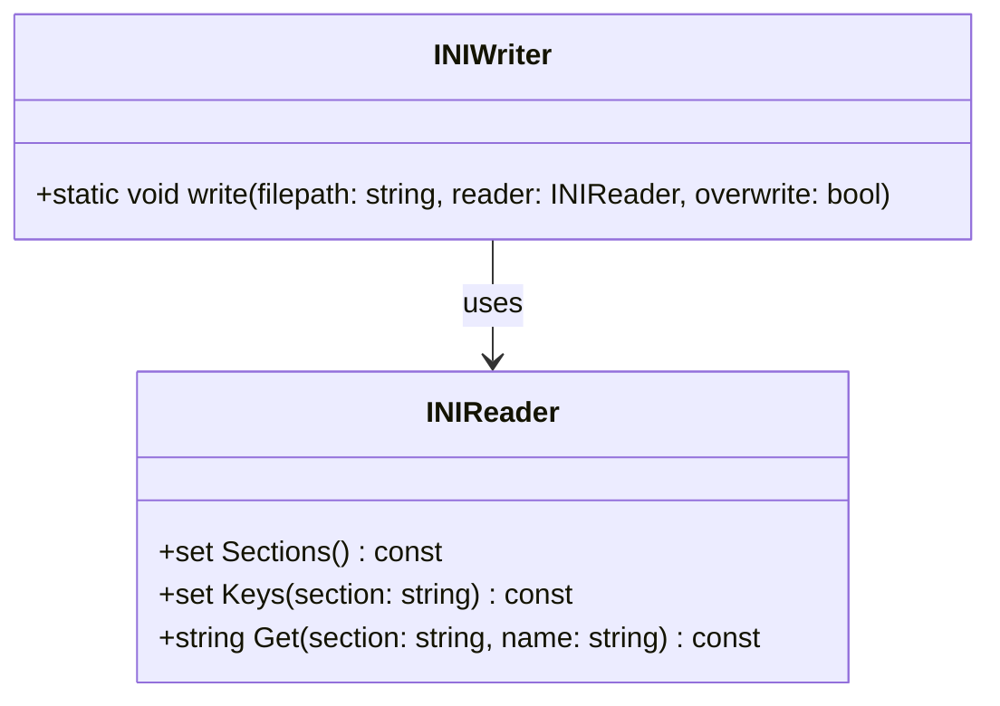
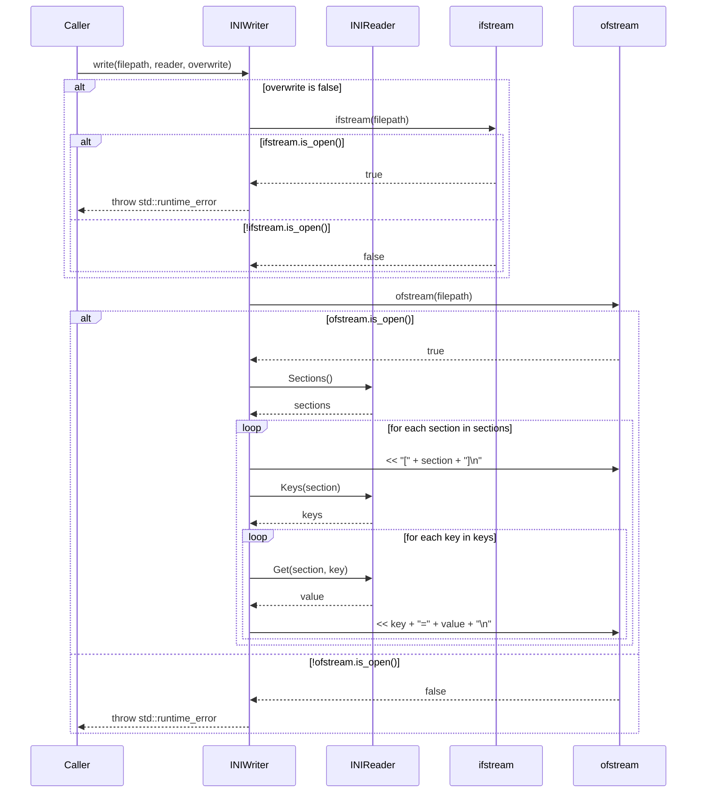

# 設計文書: `INIWriter::write`

## 基本設計項目

### 責務
`INIWriter::write` 関数は、与えられた `INIReader` オブジェクトの内容を指定されたファイルパスに INI 形式で書き出す責任を持っています。

### 公開インターフェース
- **関数名**: `write`
- **修飾子**: `inline static`
- **引数**:
  - `const std::string& filepath`: 出力ファイルのパス。
  - `const INIReader& reader`: 書き出す内容を保持している `INIReader` オブジェクト。
  - `const bool overwrite = false`: 既存ファイルを上書きするかどうかを指定するフラグ。
- **戻り値**: `void`
- **例外**:
  - `std::runtime_error`: 出力ファイルが既に存在する場合、または出力ファイルを開くことができない場合。

### 入力
- `filepath`: 書き出すファイルのパスを表す文字列。
- `reader`: INI ファイルの内容を保持している `INIReader` オブジェクト。
- `overwrite`: 既存ファイルを上書きするかどうかを指定する論理値。

### 出力
- 指定されたファイルパスに `INIReader` の内容が INI 形式で書き出される。

### 状態
- `filepath`: 書き出すファイルのパス。
- `reader`: 書き出す内容を保持している `INIReader` オブジェクト。
- `overwrite`: 既存ファイルを上書きするかどうかを指定する論理値。

### 処理手順
1. `overwrite` フラグが `false` の場合、指定されたファイルパスにファイルが存在するか確認する。存在する場合は例外を投げる。
2. 指定されたファイルパスに新しいファイルを開く。開けない場合は例外を投げる。
3. `INIReader` オブジェクトからセクション名のリストを取得し、各セクションに対して以下の処理を行う:
   - セクション名をファイルに出力する。
   - セクション内のキー名のリストを取得し、各キーに対して以下の処理を行う:
     - キーと値を `key=value` 形式でファイルに出力する。

### 例外・失敗条件
- 指定されたファイルパスにファイルが既存であり、`overwrite` フラグが `false` の場合。
- 出力ファイルを開くことができない場合。

### 依存関係
- `INIReader`: INI ファイルの内容を保持しているオブジェクト。
- `std::ifstream`: ファイルの存在確認に使用される。
- `std::ofstream`: ファイルへの書き出しに使用される。

### 重要な不変条件
- 出力ファイルが既存であり、`overwrite` フラグが `false` の場合、例外を投げること。
- 出力ファイルを開くことができない場合は例外を投げること。
- `INIReader` オブジェクトから取得したセクションとキーのリストは正しいものであること。

## RAGによる追加詳細設計

### クラス図


### クラス・メソッド・インターフェース詳細

| クラス名 | メソッド名 | 修飾子 | 引数 | 戻り値型 |
|----------|------------|--------|------|-----------|
| INIWriter | write      | inline static | const std::string& filepath, const INIReader& reader, const bool overwrite = false | void |

### シーケンス図


### メソッド仕様書

#### 目的
`INIReader` オブジェクトの内容を指定されたファイルパスに INI 形式で書き出す。

#### 引数
- `filepath`: 書き出すファイルのパス。
- `reader`: INI ファイルの内容を保持している `INIReader` オブジェクト。
- `overwrite`: 既存ファイルを上書きするかどうかを指定する論理値。

#### 戻り値
なし

#### 動作
1. `overwrite` フラグが `false` の場合、指定されたファイルパスにファイルが存在するか確認する。存在する場合は例外を投げる。
2. 指定されたファイルパスに新しいファイルを開く。開けない場合は例外を投げる。
3. `INIReader` オブジェクトからセクション名のリストを取得し、各セクションに対して以下の処理を行う:
   - セクション名をファイルに出力する。
   - セクション内のキー名のリストを取得し、各キーに対して以下の処理を行う:
     - キーと値を `key=value` 形式でファイルに出力する。

#### 副作用
- 指定されたファイルパスに新しいファイルが作成される。
- 既存ファイルが上書きされる場合がある。

#### エラー処理
- 指定されたファイルパスにファイルが既存であり、`overwrite` フラグが `false` の場合、例外を投げる。
- 出力ファイルを開くことができない場合は例外を投げる。

### 処理フロー図
```mermaid
graph TD
    A[開始] --> B{overwrite?}
    B -- false --> C{ifstream(filepath).is_open()?}
    C -- true --> D[throw std::runtime_error]
    C -- false --> E[ofstream(filepath)]
    E --> F{ofstream.is_open()?}
    F -- false --> G[throw std::runtime_error]
    F -- true --> H[sections = reader.Sections()]
    H --> I[foreach section in sections]
    I --> J[ofstream << "[" + section + "]\n"]
    J --> K[keys = reader.Keys(section)]
    K --> L[foreach key in keys]
    L --> M[value = reader.Get(section, key)]
    M --> N[ofstream << key + "=" + value + "\n"]
    N --> O[end foreach key]
    O --> P[end foreach section]
    P --> Q[終了]
```

### 状態遷移・副作用

| 更新前状態 | 遷移条件 | 変更対象 | 更新後状態 | 副作用 |
|------------|----------|----------|------------|--------|
| ファイルが存在しない | overwrite が false | - | - | 処理継続 |
| ファイルが存在する | overwrite が false | - | - | std::runtime_error 投げ |
| ファイルが開けない | ofstream.is_open() が false | - | - | std::runtime_error 投げ |
| ファイルが開ける | ofstream.is_open() が true | ofstream | 出力ファイルに書き込み | 出力ファイル作成 |

### データ変換・制約

| 入力データ | 変換規則 | 出力データ |
|------------|----------|------------|
| filepath   | -        | 出力ファイルパス |
| reader     | Sections(), Keys(section), Get(section, key) | セクション名、キー名、値 |
| overwrite  | -        | ファイル上書きフラグ |

- `filepath`: 文字列としてそのまま使用される。
- `reader`: `Sections()`, `Keys(section)`, `Get(section, key)` を通じてセクション名、キー名、値が取得され、ファイルに出力される。
- `overwrite`: ファイルの上書きを制御する論理値。