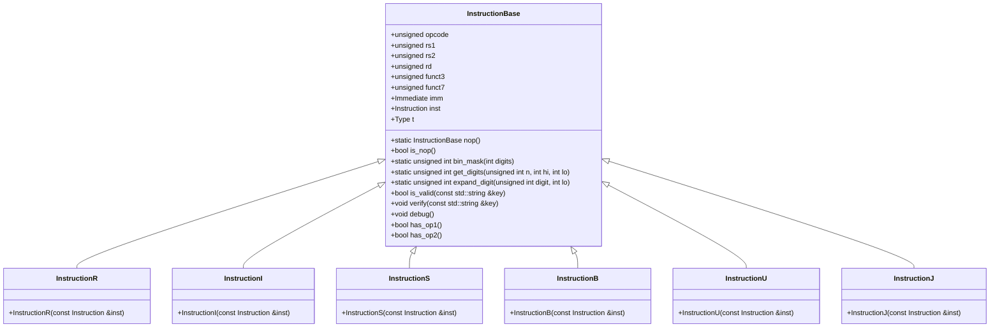

# デザイン文書: Instruction.hpp

## 責務
`Instruction.hpp`は、RISC-Vアーキテクチャの命令を表すための構造体とクラスを提供します。主な責務は以下の通りです：
- 命令の種類（R型、I型、S型、B型、U型、J型）に対応した構造体を定義する。
- 各命令からフィールド値を抽出し、適切に格納する。
- 命令のデバッグ情報を出力する機能を提供する。

## 公開インターフェース
### クラス・構造体
1. `InstructionBase`
2. `InstructionR`
3. `InstructionI`
4. `InstructionS`
5. `InstructionB`
6. `InstructionU`
7. `InstructionJ`

### メソッド
- `InstructionBase::InstructionBase()`
- `InstructionBase::InstructionBase(unsigned)`
- `InstructionBase::nop()`
- `InstructionBase::is_nop()`
- `InstructionBase::bin_mask(int digits)`
- `InstructionBase::get_digits(unsigned int n, int hi, int lo)`
- `InstructionBase::expand_digit(unsigned int digit, int lo)`
- `InstructionBase::is_valid(const std::string &key)`
- `InstructionBase::verify(const std::string &key)`
- `InstructionBase::debug()`
- `InstructionBase::has_op1()`
- `InstructionBase::has_op2()`

## 入力
- 命令コード（`unsigned int`型）
- フィールド名（`std::string`型）

## 出力
- 各命令のフィールド値（`unsigned int`, `Immediate`型）
- デバッグ情報（標準出力）

## 状態
- 命令コード (`inst`)
- レジスタ番号 (`rs1`, `rs2`, `rd`)
- 関数コード (`funct3`, `funct7`)
- イミディエイト値 (`imm`)
- 命令の種類 (`t`)

## 処理手順
1. 各命令型（R, I, S, B, U, J）に対応した構造体が生成される。
2. 構造体は、与えられた命令コードから必要なフィールド値を抽出し格納する。
3. `debug()`メソッドが呼び出されると、命令の種類と詳細情報を標準出力に出力する。

## 例外・失敗条件
- `verify(const std::string &key)`メソッドで指定されたキーが無効な場合、`InvalidAccess`例外をスローする。

## 依存関係
- `Common.h`
- `<utility>`
- `<string>`
- `<iostream>`

## 重要な不変条件
- 各命令型の構造体は、生成時に与えられた命令コードからフィールド値を適切に抽出し格納する。
- `is_valid(const std::string &key)`メソッドが`true`を返すキーのみが有効である。

## 追加詳細設計情報

### クラス図

### クラス・メソッド・インターフェース詳細

| クラス名         | メソッド名             | 完全な名前                           | 引数名と型                         | 戻り値型   | 可視性 | const | 参照/ポインタ | 副作用 |
|------------------|------------------------|--------------------------------------|------------------------------------|------------|--------|-------|---------------|--------|
| InstructionBase  | InstructionBase        | InstructionBase::InstructionBase()   |                                    | void       | public |       |               | あり   |
|                  | InstructionBase        | InstructionBase::InstructionBase(unsigned) | unsigned                         | void       | public |       |               | あり   |
|                  | nop                    | InstructionBase::nop()                 |                                    | InstructionBase | static |       |               | なし   |
|                  | is_nop                 | InstructionBase::is_nop()              |                                    | bool       | public |       |               | なし   |
|                  | bin_mask               | InstructionBase::bin_mask(int digits)  | int digits                       | unsigned int | static | const |               | なし   |
|                  | get_digits             | InstructionBase::get_digits(unsigned int n, int hi, int lo) | unsigned int n, int hi, int lo | unsigned int | static | const |               | なし   |
|                  | expand_digit           | InstructionBase::expand_digit(unsigned int digit, int lo) | unsigned int digit, int lo     | unsigned int | static | const |               | なし   |
|                  | is_valid               | InstructionBase::is_valid(const std::string &key) | const std::string &key         | bool       | public |       |               | なし   |
|                  | verify                 | InstructionBase::verify(const std::string &key) | const std::string &key         | void       | public |       |               | あり   |
|                  | debug                  | InstructionBase::debug()               |                                    | void       | public |       |               | あり   |
|                  | has_op1                | InstructionBase::has_op1()             |                                    | bool       | public | const |               | なし   |
|                  | has_op2                | InstructionBase::has_op2()             |                                    | bool       | public | const |               | なし   |
| InstructionR     | InstructionR           | InstructionR::InstructionR(const Instruction &inst) | const Instruction &inst        | void       | public |       |               | あり   |
| InstructionI     | InstructionI           | InstructionI::InstructionI(const Instruction &inst) | const Instruction &inst        | void       | public |       |               | あり   |
| InstructionS     | InstructionS           | InstructionS::InstructionS(const Instruction &inst) | const Instruction &inst        | void       | public |       |               | あり   |
| InstructionB     | InstructionB           | InstructionB::InstructionB(const Instruction &inst) | const Instruction &inst        | void       | public |       |               | あり   |
| InstructionU     | InstructionU           | InstructionU::InstructionU(const Instruction &inst) | const Instruction &inst        | void       | public |       |               | あり   |
| InstructionJ     | InstructionJ           | InstructionJ::InstructionJ(const Instruction &inst) | const Instruction &inst        | void       | public |       |               | あり   |

### シーケンス図
該当なし

### メソッド仕様書

#### `InstructionBase::nop()`
- **目的**: NOP命令を表す`InstructionBase`オブジェクトを作成する。
- **引数**: 無し
- **戻り値**: `InstructionBase`オブジェクト
- **動作**: `InstructionBase(0)`を呼び出し、NOP命令を表すオブジェクトを作成して返す。
- **副作用**: なし

#### `InstructionBase::is_nop()`
- **目的**: オブジェクトがNOP命令であるか判定する。
- **引数**: 無し
- **戻り値**: `bool`型（NOP命令の場合は`true`、それ以外は`false`）
- **動作**: `inst`フィールドが`-1`かどうかをチェックし、結果を返す。
- **副作用**: なし

#### `InstructionBase::bin_mask(int digits)`
- **目的**: 指定されたビット数のマスク値を作成する。
- **引数**: `int digits`
- **戻り値**: `unsigned int`型
- **動作**: `(1 << digits) - 1`を計算して返す。
- **副作用**: なし

#### `InstructionBase::get_digits(unsigned int n, int hi, int lo)`
- **目的**: 指定された範囲のビット値を取り出す。
- **引数**: `unsigned int n`, `int hi`, `int lo`
- **戻り値**: `unsigned int`型
- **動作**: `(n >> lo) & bin_mask(hi - lo + 1)`を計算して返す。
- **副作用**: なし

#### `InstructionBase::expand_digit(unsigned int digit, int lo)`
- **目的**: 指定されたビット値を拡張する。
- **引数**: `unsigned int digit`, `int lo`
- **戻り値**: `unsigned int`型
- **動作**: `digit ? (0xffffffff << lo) : 0`を計算して返す。
- **副作用**: なし

#### `InstructionBase::is_valid(const std::string &key)`
- **目的**: 指定されたキーが有効なフィールドであるか判定する。
- **引数**: `const std::string &key`
- **戻り値**: `bool`型（有効な場合は`true`、それ以外は`false`）
- **動作**: 命令の種類とキーを比較し、結果を返す。
- **副作用**: なし

#### `InstructionBase::verify(const std::string &key)`
- **目的**: 指定されたキーが有効なフィールドであることを確認する。無効な場合は例外をスローする。
- **引数**: `const std::string &key`
- **戻り値**: 無し
- **動作**: `is_valid(key)`を呼び出し、結果が`false`の場合は`InvalidAccess`例外をスローする。
- **副作用**: あり（例外スロー）

#### `InstructionBase::debug()`
- **目的**: 命令のデバッグ情報を標準出力に出力する。
- **引数**: 無し
- **戻り値**: 無し
- **動作**: 命令コードと種類を解析し、適切な形式で標準出力に出力する。
- **副作用**: あり（標準出力）

#### `InstructionBase::has_op1()`
- **目的**: 命令がオペランド1を持つか判定する。
- **引数**: 無し
- **戻り値**: `bool`型（オペランド1を持つ場合は`true`、それ以外は`false`）
- **動作**: 命令の種類をチェックし、結果を返す。
- **副作用**: なし

#### `InstructionBase::has_op2()`
- **目的**: 命令がオペランド2を持つか判定する。
- **引数**: 無し
- **戻り値**: `bool`型（オペランド2を持つ場合は`true`、それ以外は`false`）
- **動作**: 命令の種類をチェックし、結果を返す。
- **副作用**: なし

### 処理フロー図
該当なし

### 状態遷移・副作用
| 更新前状態 | 遷移条件                     | 変更対象     | 更新後状態 | 更新順序 | 副作用 |
|------------|------------------------------|--------------|------------|----------|--------|
| 任意       | `InstructionBase()`          | 各フィールド   | 初期値     | 順不同   | なし   |
| 任意       | `InstructionBase(unsigned)`  | 各フィールド   | 指定値     | 順不同   | なし   |
| 任意       | `verify(const std::string &key)` | 無し         | 無し       | 順不同   | あり（例外スロー）|
| 任意       | `debug()`                    | 標準出力     | 変化なし   | 順不同   | あり（標準出力）|

### データ変換・制約
| 入力データ         | 出力データ               | 型変換/加工規則                                                                 | 値域/境界値       |
|--------------------|--------------------------|-----------------------------------------------------------------------------------|---------------------|
| `unsigned int`     | 各フィールド             | ビットシフトとマスクを使用して抽出                                               | 0-31                |
| `const std::string &key` | `bool`               | 文字列比較                                                                      | 確認不能            |
| `Instruction`      | 各フィールド             | ビットシフトとマスクを使用して抽出                                               | 0-2^32-1            |

この設計文書は、元コードから確認できる事実に基づいて作成され、再実装に必要な詳細な情報を提供します。