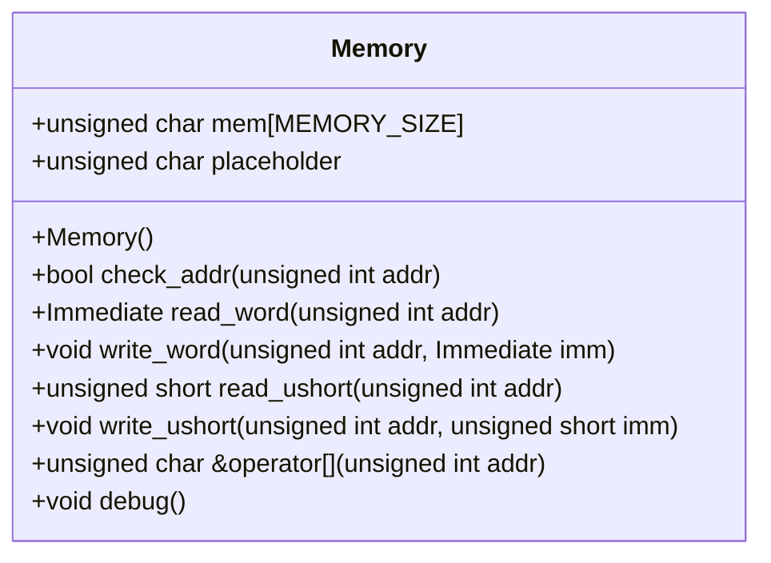
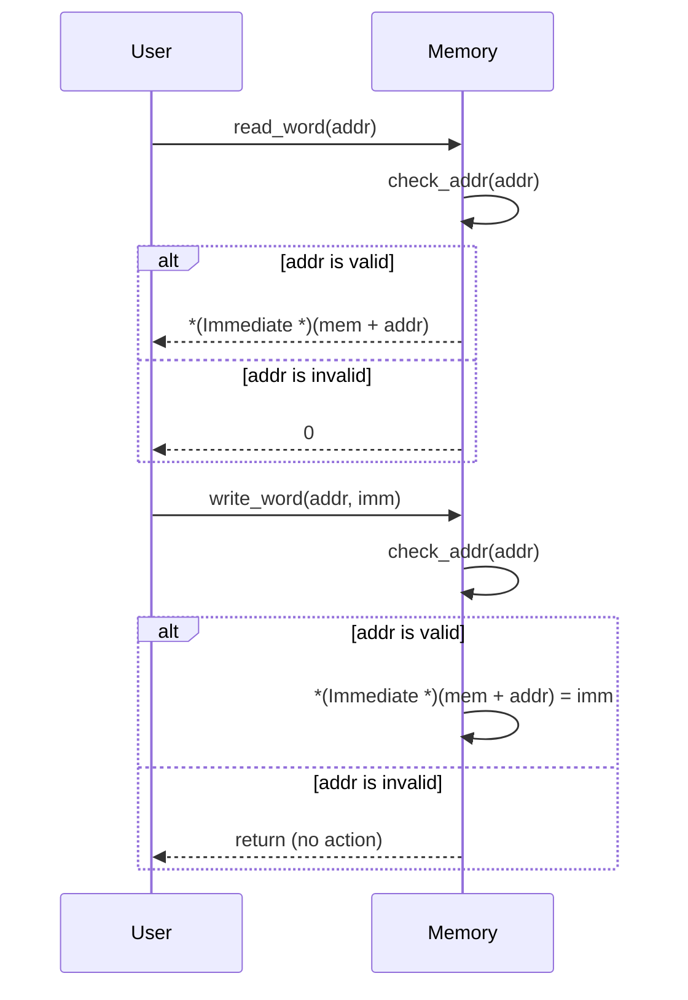

# 設計文書: Memoryクラス

## 責務
- メモリの読み書き操作を提供する。
- アドレス範囲チェックを行い、範囲外アクセスを防ぐ。

## 公開インターフェース
- `Memory()`: コンストラクタ。メモリを初期化する。
- `bool check_addr(unsigned int addr)`: 指定されたアドレスが有効かどうかをチェックする。
- `Immediate read_word(unsigned int addr)`: 指定されたアドレスからワード(4バイト)を読み込む。
- `void write_word(unsigned int addr, Immediate imm)`: 指定されたアドレスにワード(4バイト)を書き込む。
- `unsigned short read_ushort(unsigned int addr)`: 指定されたアドレスからハーフワード(2バイト)を読み込む。
- `void write_ushort(unsigned int addr, unsigned short imm)`: 指定されたアドレスにハーフワード(2バイト)を書き込む。
- `unsigned char &operator[](unsigned int addr)`: 指定されたアドレスのバイトへの参照を返す。
- `void debug()`: メモリの一部をデバッグ出力する。

## 入力
- `addr`: アドレス値 (unsigned int)
- `imm`: 書き込むワードまたはハーフワードの値 (Immediate または unsigned short)

## 出力
- `check_addr`: ブール値 (アドレスが有効かどうか)
- `read_word`: Immediate 値 (読み込んだワード)
- `read_ushort`: unsigned short 値 (読み込んだハーフワード)
- `operator[]`: unsigned char の参照 (指定されたアドレスのバイトへの参照)

## 状態
- `mem`: メモリ配列 (unsigned char[MEMORY_SIZE])
- `placeholder`: アドレス範囲外アクセス時のダミー値 (unsigned char)

## 処理手順
1. コンストラクタでメモリを初期化する。
2. アドレスチェックを行い、範囲外アクセスを防ぐ。
3. ワードやハーフワードの読み書きを行う。
4. オペレータ[]を使用してバイトへの参照を提供する。
5. debug() を使用してメモリの一部をデバッグ出力する。

## 例外・失敗条件
- `check_addr` が false を返す場合、アドレス範囲外アクセスが行われる。
- アドレス範囲外アクセスの場合、読み書き操作は無視される。

## 依存関係
- `Common.h`: インクルードファイル (Immediate 型の定義を含む可能性がある)
- `<cstring>`: memset 関数を使用する
- `<iostream>`: debug() メソッドで出力を行う
- `<cassert>`: アサートを使用する

## 重要な不変条件
- `mem` のサイズは常に MEMORY_SIZE (0x400000) である。
- `placeholder` はアドレス範囲外アクセス時のダミー値として使用される。

# 追加詳細設計情報

## クラス図


## クラス・メソッド・インターフェース詳細
| 名前 | 型 | 引数名と型 | 戻り値型 | 可視性 | const |  static | virtual | noexcept |
|------|----|------------|----------|--------|-------|---------|---------|----------|
| Memory | コンストラクタ | - | void | public | - | - | - | - |
| check_addr | メソッド | addr: unsigned int | bool | public | - | - | - | - |
| read_word | メソッド | addr: unsigned int | Immediate | public | - | - | - | - |
| write_word | メソッド | addr: unsigned int, imm: Immediate | void | public | - | - | - | - |
| read_ushort | メソッド | addr: unsigned int | unsigned short | public | - | - | - | - |
| write_ushort | メソッド | addr: unsigned int, imm: unsigned short | void | public | - | - | - | - |
| operator[] | オペレータ | addr: unsigned int | unsigned char & | public | - | - | - | - |
| debug | メソッド | - | void | public | - | - | - | - |

## シーケンス図


## メソッド仕様書

### read_word
- **目的**: 指定されたアドレスからワード(4バイト)を読み込む。
- **引数**: `addr`: unsigned int 型のアドレス値
- **戻り値**: Immediate 値 (読み込んだワード)
- **動作**: 
  - アドレスチェックを行い、範囲外アクセスを防ぐ。
  - アドレスが有効な場合、指定されたアドレスからワード(4バイト)を読み込む。
  - アドレスが無効な場合、0 を返す。
- **副作用**: 無し
- **エラー処理**: アドレス範囲外アクセスの場合、0 を返す。

### write_word
- **目的**: 指定されたアドレスにワード(4バイト)を書き込む。
- **引数**: `addr`: unsigned int 型のアドレス値, `imm`: Immediate 値 (書き込むワード)
- **戻り値**: 無し
- **動作**: 
  - アドレスチェックを行い、範囲外アクセスを防ぐ。
  - アドレスが有効な場合、指定されたアドレスにワード(4バイト)を書き込む。
  - アドレスが無効な場合、何もしない。
- **副作用**: メモリの更新
- **エラー処理**: アドレス範囲外アクセスの場合、何もしない。

### read_ushort
- **目的**: 指定されたアドレスからハーフワード(2バイト)を読み込む。
- **引数**: `addr`: unsigned int 型のアドレス値
- **戻り値**: unsigned short 値 (読み込んだハーフワード)
- **動作**: 
  - アドレスチェックを行い、範囲外アクセスを防ぐ。
  - アドレスが有効な場合、指定されたアドレスからハーフワード(2バイト)を読み込む。
  - アドレスが無効な場合、0 を返す。
- **副作用**: 無し
- **エラー処理**: アドレス範囲外アクセスの場合、0 を返す。

### write_ushort
- **目的**: 指定されたアドレスにハーフワード(2バイト)を書き込む。
- **引数**: `addr`: unsigned int 型のアドレス値, `imm`: unsigned short 値 (書き込むハーフワード)
- **戻り値**: 無し
- **動作**: 
  - アドレスチェックを行い、範囲外アクセスを防ぐ。
  - アドレスが有効な場合、指定されたアドレスにハーフワード(2バイト)を書き込む。
  - アドレスが無効な場合、何もしない。
- **副作用**: メモリの更新
- **エラー処理**: アドレス範囲外アクセスの場合、何もしない。

### operator[]
- **目的**: 指定されたアドレスのバイトへの参照を返す。
- **引数**: `addr`: unsigned int 型のアドレス値
- **戻り値**: unsigned char の参照 (指定されたアドレスのバイトへの参照)
- **動作**: 
  - アドレスチェックを行い、範囲外アクセスを防ぐ。
  - アドレスが有効な場合、指定されたアドレスのバイトへの参照を返す。
  - アドレスが無効な場合、placeholder の参照を返す。
- **副作用**: 無し
- **エラー処理**: アドレス範囲外アクセスの場合、placeholder の参照を返す。

### debug
- **目的**: メモリの一部をデバッグ出力する。
- **引数**: 無し
- **戻り値**: 無し
- **動作**: 
  - 指定された範囲 (0x20000 - 0x10 から 0x20000) のメモリを16進数で出力する。
- **副作用**: コンソールへの出力
- **エラー処理**: 無し

## 処理フロー図
```mermaid
graph TD
    A[開始] --> B[check_addr(addr)]
    B -- true --> C[読み書き操作]
    B -- false --> D[0 or return (no action)]
    C --> E[終了]
    D --> E
```

## 状態遷移・副作用
| 更新前状態 | 遷移条件 | 変更対象 | 更新後状態 | 更新順序 | 外部資源への副作用 |
|------------|----------|----------|------------|----------|----------------------|
| メモリ初期化済み | アドレス有効 | mem[addr] | 書き込み値 | - | 無し |
| メモリ初期化済み | アドレス無効 | placeholder | 0 | - | 無し |

## データ変換・制約
| 入力データ | 変換規則 | 出力データ | 値域 | 境界値 |
|------------|----------|------------|------|--------|
| addr | アドレス範囲チェック | bool | true/false | 0 <= addr < MEMORY_SIZE |
| imm (read_word) | メモリ読み込み | Immediate | - | - |
| imm (write_word) | メモリ書き込み | 無し | - | - |
| imm (read_ushort) | メモリ読み込み | unsigned short | - | - |
| imm (write_ushort) | メモリ書き込み | 無し | - | - |

この設計文書は、元コードから確認できる事実に基づいて作成され、再実装に必要な詳細情報を提供します。