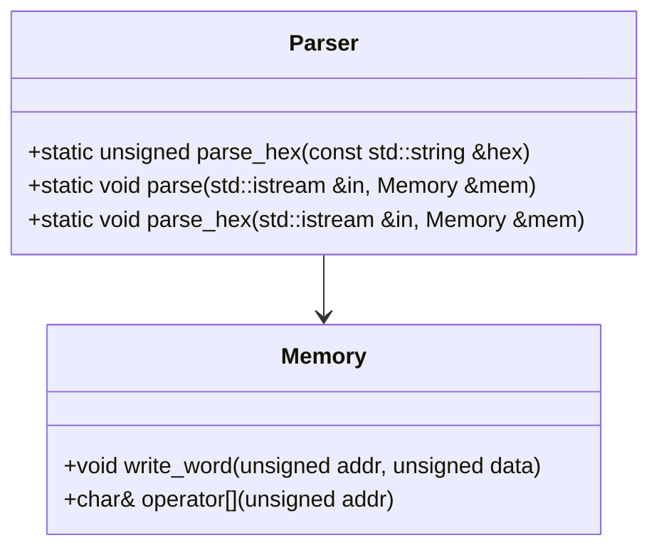
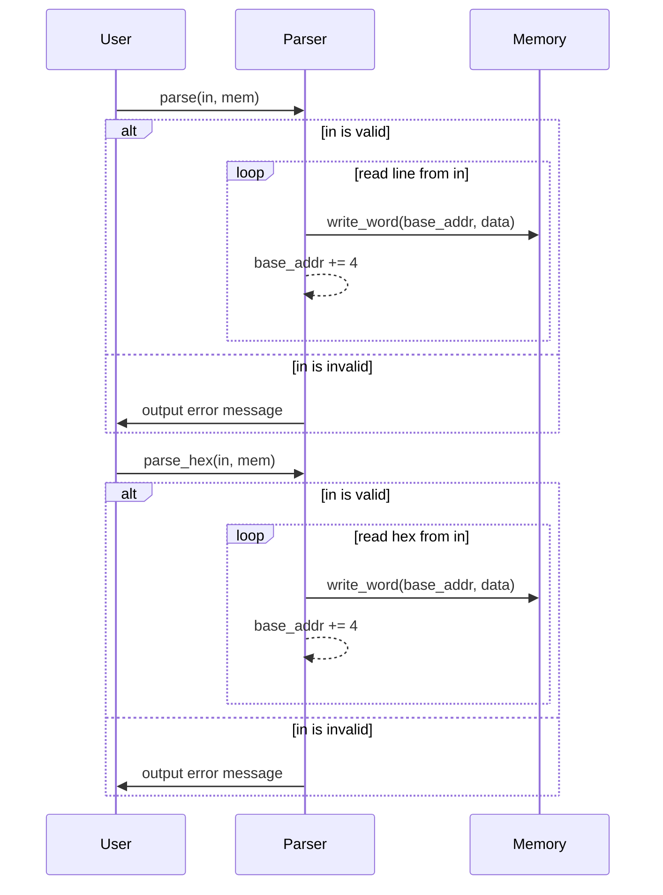

# デザイン文書: Parser クラス

## 責務
`Parser`クラスは、入力ストリームからデータを読み取り、それを指定されたメモリオブジェクトに書き込む責任を持っています。具体的には、16進数形式のデータをパースし、メモリに格納します。

## 公開インターフェース
- `static unsigned parse_hex(const std::string &hex)`
- `static void parse(std::istream &in, Memory &mem)`
- `static void parse_hex(std::istream &in, Memory &mem)`

## 入力
- `parse_hex`: 16進数形式の文字列 (`const std::string &hex`)
- `parse`: 入力ストリームとメモリオブジェクト (`std::istream &in`, `Memory &mem`)
- `parse_hex`: 入力ストリームとメモリオブジェクト (`std::istream &in`, `Memory &mem`)

## 出力
- `parse_hex`: 16進数文字列をパースした結果の符号なし整数 (`unsigned`)
- `parse`: メモリオブジェクトへの書き込み (副作用)
- `parse_hex`: メモリオブジェクトへの書き込み (副作用)

## 状態
- `base_addr`: パースされたデータをメモリに書き込む際のベースアドレス (`unsigned`)

## 処理手順
1. **parse_hex**:
   - 与えられた16進数文字列を`strtol`関数を使用して整数値に変換する。
2. **parse**:
   - 入力ストリームが有効であることを確認し、無効な場合はエラーメッセージを出力する。
   - ベースアドレスを初期化する。
   - ストリームから一行ずつ読み取り、`@`で始まる行はベースアドレスとして設定し、それ以外の行は16進数データとして処理する。
   - 各16進数データをパースしてメモリに書き込む。
3. **parse_hex**:
   - 入力ストリームが有効であることを確認し、無効な場合はエラーメッセージを出力する。
   - ベースアドレスを初期化する。
   - ストリームから16進数データを読み取り、パースしてメモリに書き込む。

## 例外・失敗条件
- 入力ストリームが無効な場合、エラーメッセージを出力し処理を終了する。
- パースできない16進数文字列がある場合、`strtol`関数の動作により未定義動作となる可能性がある。

## 依存関係
- `Memory`: データを書き込むためのメモリオブジェクト

## 重要な不変条件
- ベースアドレスは非負整数である。
- 入力ストリームが有効である場合のみ処理を行う。

# 追加詳細設計情報

## クラス図


## クラス・メソッド・インターフェース詳細

| 完全な名前 | 属性     | 引数名と型             | 戻り値型  | 可視性 | const | 参照/ポインタ | static | virtual | noexcept |
|------------|----------|------------------------|-----------|--------|-------|---------------|--------|---------|----------|
| Parser::parse_hex | メソッド | hex: const std::string & | unsigned  | public | false | 値        | true   | false   | false    |
| Parser::parse     | メソッド | in: std::istream &, mem: Memory & | void      | public | false | 参照/ポインタ | true   | false   | false    |
| Parser::parse_hex | メソッド | in: std::istream &, mem: Memory & | void      | public | false | 参照/ポインタ | true   | false   | false    |

## シーケンス図


## メソッド仕様書

### parse_hex
- **目的**: 16進数形式の文字列を整数値に変換する。
- **引数**: hex (const std::string &): 16進数形式の文字列
- **戻り値**: unsigned: 変換された整数値
- **動作**: `strtol`関数を使用して16進数文字列を整数値に変換する。
- **副作用**: 無し
- **エラー処理**: なし

### parse
- **目的**: 入力ストリームからデータを読み取り、メモリオブジェクトに書き込む。
- **引数**: in (std::istream &): 入力ストリーム, mem (Memory &): メモリオブジェクト
- **戻り値**: void: 無し
- **動作**:
  - 入力ストリームが有効であることを確認する。
  - ストリームから一行ずつ読み取り、`@`で始まる行はベースアドレスとして設定する。
  - それ以外の行は16進数データとして処理し、メモリに書き込む。
- **副作用**: メモリオブジェクトへの書き込み
- **エラー処理**: 入力ストリームが無効な場合はエラーメッセージを出力する。

### parse_hex
- **目的**: 入力ストリームから16進数データを読み取り、メモリオブジェクトに書き込む。
- **引数**: in (std::istream &): 入力ストリーム, mem (Memory &): メモリオブジェクト
- **戻り値**: void: 無し
- **動作**:
  - 入力ストリームが有効であることを確認する。
  - ストリームから16進数データを読み取り、メモリに書き込む。
- **副作用**: メモリオブジェクトへの書き込み
- **エラー処理**: 入力ストリームが無効な場合はエラーメッセージを出力する。

## 処理フロー図
```mermaid
graph TD
    A[開始] --> B{in is valid?}
    B -- はい --> C[ベースアドレス初期化]
    B -- いいえ --> D[エラーメッセージ出力]
    C --> E[行読み取り]
    E --> F{line[0] == '@'?}
    F -- はい --> G[ベースアドレス更新]
    F -- いいえ --> H[16進数データ処理]
    G --> I[次の行へ]
    H --> J[16進数パース]
    J --> K[メモリ書き込み]
    K --> L[ベースアドレスインクリメント]
    L --> E
    I --> M{ストリーム終了?}
    M -- いいえ --> E
    M -- はい --> N[終了]
    D --> N
```

## 状態遷移・副作用

| 更新前状態 | 遷移条件         | 変更対象     | 更新後状態   | 更新順序 | 副作用                     |
|------------|------------------|--------------|--------------|----------|----------------------------|
| 任意       | in is valid      | base_addr    | 初期値       | 1        | 無し                       |
| 任意       | line[0] == '@'   | base_addr    | パース結果   | 2        | 無し                       |
| 任意       | line[0] != '@'   | mem          | パース結果   | 3        | メモリ書き込み             |
| 任意       | in is invalid    | 無し         | 無し         | 1        | エラーメッセージ出力       |

## データ変換・制約

| 入力データ   | 変換規則                     | 出力データ   |
|--------------|------------------------------|--------------|
| hex (文字列) | strtol(hex.c_str(), NULL, 16) | unsigned     |
| line (文字列)| 行単位読み取り               | パース結果   |
| base_addr    | 基本アドレス更新             | unsigned     |

- `hex`は16進数形式の文字列であり、`strtol`関数を使用して整数値に変換される。
- `line`は入力ストリームから一行ずつ読み取りられ、`@`で始まる行はベースアドレスとして設定され、それ以外の行は16進数データとして処理される。
- `base_addr`はパースされたデータをメモリに書き込む際のベースアドレスであり、必要に応じて更新される。