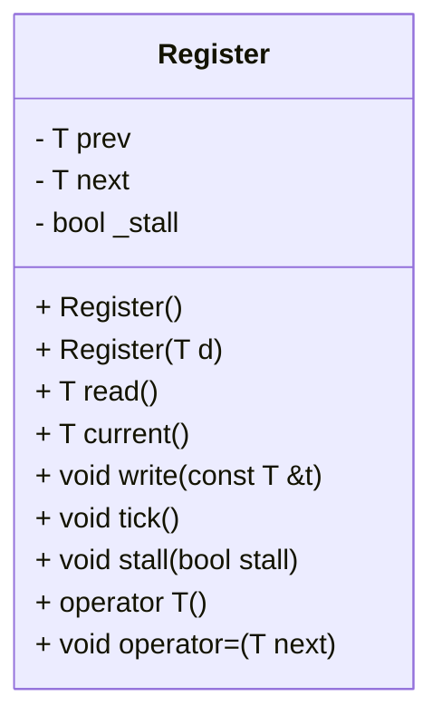
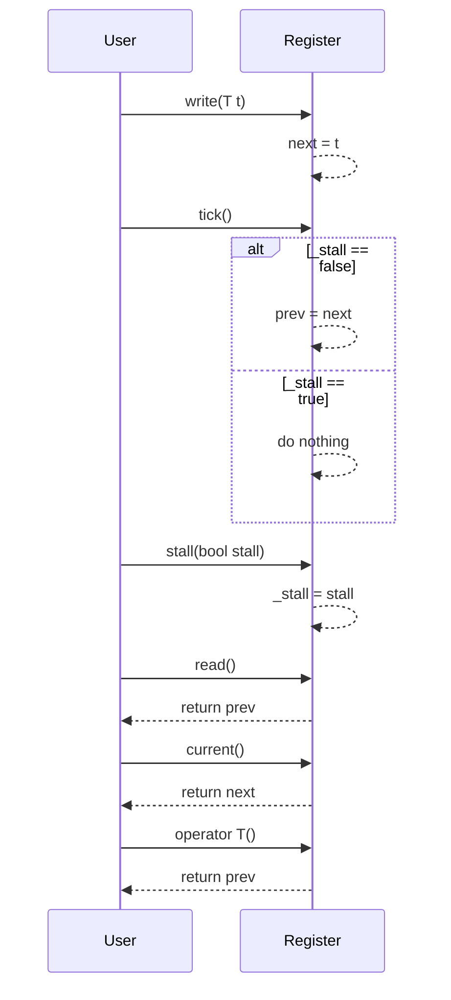

# Register クラスの設計文書

## 責務
`Register`クラスは、ジェネリックな型 `T` の値を保持し、現在の状態と次の状態を管理します。また、ステージングされた値をコミットする機能（tick）や、一時的に更新を停止させる機能（stall）も提供します。

## 公開インターフェース
- `T read()`: 前回の値（prev）を返す。
- `T current()`: 次の値（next）を返す。
- `void write(const T &t)`: 次の値（next）に`t`を設定する。
- `void tick()`: `_stall`がfalseの場合、次の値（next）を前の値（prev）にコミットする。
- `void stall(bool stall)`: 更新の一時停止フラグ（_stall）を設定する。
- `operator T()`: 前回の値（prev）を返すように型変換演算子を定義する。
- `void operator=(T next)`: 次の値（next）に`t`を設定するように代入演算子をオーバーロードする。

## 入力
- `write(const T &t)`メソッド: 型 `T` の値 `t`
- `stall(bool stall)`: 更新の一時停止フラグ `_stall` を制御するためのブール値

## 出力
- `read()`, `current()`, `operator T()`: 型 `T` の値を返す。

## 状態
- `prev`: 前回の値（型 `T`）
- `next`: 次の値（型 `T`）
- `_stall`: 更新の一時停止フラグ（bool）

## 処理手順
1. コンストラクタで初期化: `prev`と`next`をゼロに設定し、`_stall`をfalseに設定する。
2. `write(const T &t)`メソッドが呼ばれた場合: `next`に`t`の値を設定する。
3. `tick()`メソッドが呼ばれた場合:
   - `_stall`がfalseの場合のみ、`prev`に`next`の値を設定する。
4. `stall(bool stall)`メソッドが呼ばれた場合: `_stall`フラグを更新する。

## 例外・失敗条件
- 確認不能

## 依存関係
- 型 `T`: テンプレートパラメータとして使用される型。具体的な型は外部から指定される。
- 標準ライブラリ: コンストラクタや演算子の定義に必要な基本的な機能。

## 重要な不変条件
- `_stall`がtrueの場合、`tick()`呼び出しによる`prev`の更新は行われない。

# 追加詳細設計情報

## クラス図


## クラス・メソッド・インターフェース詳細
| 名前 | 完全な名前 | 属性 | 引数名と型 | 戻り値型 | 可視性 | const | 参照/ポインタ | static | virtual | noexcept |
|------|------------|------|------------|----------|--------|-------|---------------|--------|---------|----------|
| Register | Register<T>::Register() | コンストラクタ | - | void | public | false | - | false | false | false |
| Register | Register<T>::Register(T d) | コンストラクタ | d: T | void | public | false | - | false | false | false |
| read | T Register<T>::read() | メソッド | - | T | public | true | - | false | false | false |
| current | T Register<T>::current() | メソッド | - | T | public | true | - | false | false | false |
| write | void Register<T>::write(const T &t) | メソッド | t: const T& | void | public | false | 参照 | false | false | false |
| tick | void Register<T>::tick() | メソッド | - | void | public | false | - | false | false | false |
| stall | void Register<T>::stall(bool stall) | メソッド | stall: bool | void | public | false | - | false | false | false |
| operator T | Register<T>::operator T() | オペレータ | - | T | public | true | - | false | false | false |
| operator= | void Register<T>::operator=(T next) | オペレータ | next: T | void | public | false | - | false | false | false |

## シーケンス図


## メソッド仕様書

### `write(const T &t)`
- **目的**: 次の値（next）に`t`を設定する。
- **引数**: t (const T&)
- **戻り値**: void
- **動作**: 引数`t`の値をメンバ変数`next`に代入する。
- **副作用**: `next`が更新される。

### `tick()`
- **目的**: `_stall`がfalseの場合、次の値（next）を前の値（prev）にコミットする。
- **引数**: 無し
- **戻り値**: void
- **動作**: `_stall`がfalseの場合のみ、`prev`に`next`の値を設定する。
- **副作用**: `_stall`がfalseの場合、`prev`が更新される。

### `stall(bool stall)`
- **目的**: 更新の一時停止フラグ（_stall）を設定する。
- **引数**: stall (bool)
- **戻り値**: void
- **動作**: 引数`stall`の値をメンバ変数`_stall`に代入する。
- **副作用**: `_stall`が更新される。

### `read()`
- **目的**: 前回の値（prev）を返す。
- **引数**: 無し
- **戻り値**: T
- **動作**: メンバ変数`prev`の値を返す。
- **副作用**: 無し

### `current()`
- **目的**: 次の値（next）を返す。
- **引数**: 無し
- **戻り値**: T
- **動作**: メンバ変数`next`の値を返す。
- **副作用**: 無し

### `operator T()`
- **目的**: 前回の値（prev）を返すように型変換演算子を定義する。
- **引数**: 無し
- **戻り値**: T
- **動作**: メンバ変数`prev`の値を返す。
- **副作用**: 無し

### `operator=(T next)`
- **目的**: 次の値（next）に`t`を設定するように代入演算子をオーバーロードする。
- **引数**: next (T)
- **戻り値**: void
- **動作**: 引数`next`の値をメンバ変数`next`に代入する。
- **副作用**: `next`が更新される。

## 処理フロー図
```mermaid
graph TD
    A[コンストラクタ] --> B{write(const T &t)?}
    B -- はい --> C[next = t]
    B -- いいえ --> D[tick()?]
    D --> E{_stall == false?}
    E -- はい --> F[prev = next]
    E -- いいえ --> G[do nothing]
    F --> H{stall(bool stall)?}
    G --> H
    H --> I[_stall = stall]
    I --> J{read()?}
    J --> K[return prev]
    K --> L{current()?}
    L --> M[return next]
    M --> N{operator T()?}
    N --> O[return prev]
    O --> P{operator=(T next)?}
    P --> Q[next = t]
```

## 状態遷移・副作用
| 更新前状態 | 遷移条件 | 変更対象 | 更新後状態 | 更新順序 | 外部資源への副作用 |
|------------|----------|----------|------------|----------|----------------------|
| 任意       | write    | next     | t          | -        | 無し                 |
| 任意       | tick     | prev     | next (if _stall == false) | - | 無し               |
| 任意       | stall    | _stall   | stall      | -        | 無し                 |

## データ変換・制約
- `write(const T &t)`メソッド: 型 `T` の値`t`を次の値（next）に設定する。
- `tick()`メソッド: `_stall`がfalseの場合のみ、前の値（prev）に次の値（next）を設定する。
- `read()`, `current()`, `operator T()`: 型 `T` の値を返す。