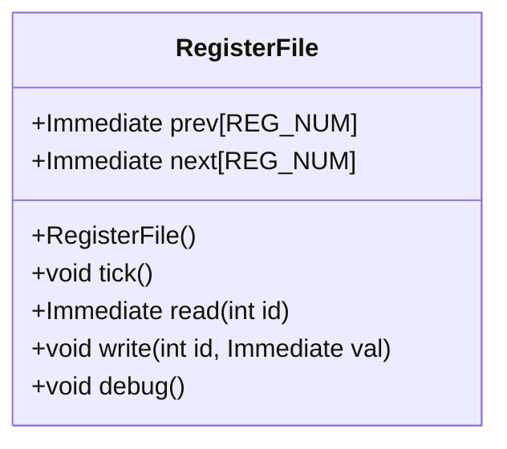
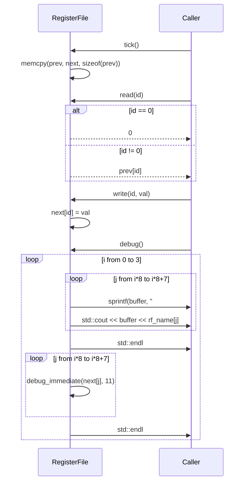

# RegisterFile クラスの設計文書

## 責務
RegisterFileクラスは、RISC-Vシミュレータにおいて32個のレジスタを管理します。各レジスタには現在の値と次のサイクルでの値が保持され、tickメソッドによって現在の値が次のサイクルの値に更新されます。また、特定のレジスタから値を読み書きする機能とデバッグ用の出力機能も提供します。

## 公開インターフェース
- `RegisterFile()`: コンストラクタでprevとnext配列を初期化します。
- `void tick()`: 現在のレジスタ値を次のサイクルの値に更新します。
- `Immediate read(int id)`: 指定されたIDのレジスタから現在の値を読み取ります。ただし、IDが0の場合は常に0を返します。
- `void write(int id, Immediate val)`: 次のサイクルでの指定されたIDのレジスタに値を書き込みます。
- `void debug()`: レジスタの現在の状態をデバッグ用に出力します。

## 入力
- `read(int id)`メソッド: レジスタID (int型)
- `write(int id, Immediate val)`メソッド: レジスタID (int型) と書き込む値 (Immediate型)

## 出力
- `read(int id)`メソッド: 指定されたレジスタの現在の値 (Immediate型)
- `debug()`メソッド: レジスタの状態を標準出力に出力します。

## 状態
- `prev[REG_NUM]`: 各レジスタの現在の値を保持する配列。
- `next[REG_NUM]`: 各レジスタの次のサイクルでの値を保持する配列。

## 処理手順
1. コンストラクタでprevとnext配列を0で初期化します。
2. tickメソッドが呼ばれたときに、prev配列にnext配列の内容をコピーします。
3. readメソッドは指定されたIDのレジスタから現在の値を返します。ただし、IDが0の場合は常に0を返します。
4. writeメソッドは指定されたIDのレジスタに次のサイクルでの値を設定します。
5. debugメソッドはレジスタの状態をデバッグ用に出力します。

## 例外・失敗条件
- `read(int id)`と`write(int id, Immediate val)`メソッド: IDが範囲外（0から31以外）の場合、未定義動作となるため、呼び出し元で適切な範囲チェックが必要です。
- `debug()`メソッド: メモリ確保に失敗した場合や出力ストリームへの書き込みに失敗した場合は標準ライブラリの例外が発生する可能性があります。

## 依存関係
- `Immediate`: RegisterFileクラスで使用される型。具体的な定義は確認不能。
- `debug_immediate(Immediate val, int width)`: debugメソッド内で呼び出される関数。具体的な定義は確認不能。

## 重要な不変条件
- `prev`と`next`配列のサイズは常に32です。
- `read(int id)`メソッドでIDが0の場合、常に0を返します。

# 追加詳細設計情報

## クラス図


## クラス・メソッド・インターフェース詳細
| 完全な名前 | 属性 | 引数名と型 | 戻り値型 | 可視性 | const | 参照/ポインタ | static | virtual | noexcept |
|------------|------|------------|----------|--------|-------|---------------|--------|---------|----------|
| RegisterFile::RegisterFile() | コンストラクタ | - | void | public | - | - | - | - | - |
| RegisterFile::tick() | メソッド | - | void | public | - | - | - | - | - |
| RegisterFile::read(int id) | メソッド | id: int | Immediate | public | - | - | - | - | - |
| RegisterFile::write(int id, Immediate val) | メソッド | id: int, val: Immediate | void | public | - | - | - | - | - |
| RegisterFile::debug() | メソッド | - | void | public | - | - | - | - | - |

## シーケンス図


## メソッド仕様書

### tick()
- **目的**: 現在のレジスタ値を次のサイクルの値に更新します。
- **引数**: なし
- **戻り値**: void
- **動作**: prev配列にnext配列の内容をコピーします。
- **副作用**: prev配列が更新されます。

### read(int id)
- **目的**: 指定されたIDのレジスタから現在の値を読み取ります。
- **引数**: id (int型): レジスタID
- **戻り値**: Immediate: 指定されたレジスタの現在の値。ただし、IDが0の場合は常に0を返します。
- **動作**: IDが0の場合、0を返します。それ以外の場合、prev配列から指定されたIDの値を返します。

### write(int id, Immediate val)
- **目的**: 指定されたIDのレジスタに次のサイクルでの値を書き込みます。
- **引数**: id (int型): レジスタID, val (Immediate型): 書き込む値
- **戻り値**: void
- **動作**: next配列に指定されたIDの値を設定します。

### debug()
- **目的**: レジスタの現在の状態をデバッグ用に出力します。
- **引数**: なし
- **戻り値**: void
- **動作**: レジスタの名前と値を標準出力に出力します。具体的な出力形式は以下の通りです:
    - 各レジスタのIDと名前を4列ずつ表示します。
    - 次に各レジスタの現在の値（next配列）を表示します。

## 処理フロー図
```mermaid
graph TD
    A[コンストラクタ] --> B{tick()}
    B --> C[memcpy(prev, next, sizeof(prev))]
    C --> D{read(id)}
    D --> E{id == 0?}
    E --はい--> F[return 0]
    E --いいえ--> G[return prev[id]]
    G --> H{write(id, val)}
    H --> I[next[id] = val]
    I --> J{debug()}
    J --> K[ループ i from 0 to 3]
    K --> L[ループ j from i*8 to i*8+7]
    L --> M[sprintf(buffer, "#%d", j)]
    M --> N[std::cout << buffer << rf_name[j]]
    N --> O{debug_immediate(next[j], 11)}
    O --> P[std::endl]
    P --> Q[ループ終了]
    Q --> R[ループ終了]
```

## 状態遷移・副作用
| 更新前状態 | 遷移条件 | 変更対象 | 更新後状態 | 更新順序 | 外部資源への副作用 |
|------------|----------|----------|------------|----------|----------------------|
| prev, next | tick()   | prev     | prev = next| 1        | -                    |

## データ変換・制約
- `read(int id)`: IDが0の場合は常に0を返します。
- `write(int id, Immediate val)`: 指定されたIDのレジスタに値を設定します。IDは0から31までの範囲でなければなりません。
- `debug()`: レジスタの名前と現在の値（next配列）を標準出力に出力します。具体的な出力形式は以下の通りです:
    - 各レジスタのIDと名前を4列ずつ表示します。
    - 次に各レジスタの現在の値（next配列）を表示します。