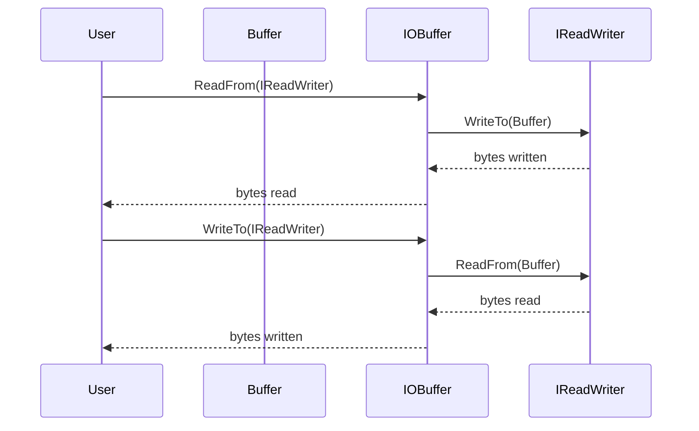
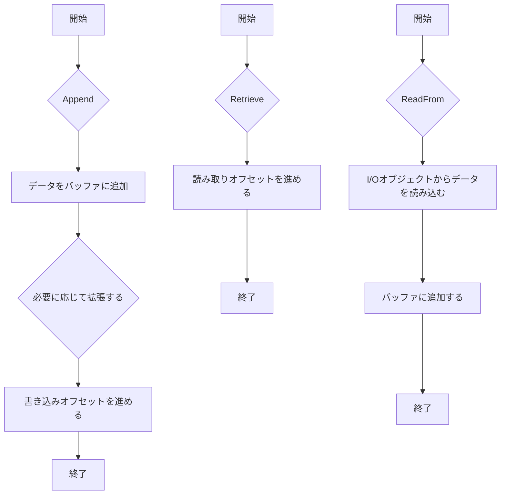

# デザイン文書

## 責務
- `Buffer`クラス: 自動拡張可能なバッファを提供し、バイトや文字列の読み書きを行う。
- `IOBuffer`クラス: `Buffer`クラスを拡張して、I/Oオブジェクトとのデータ交換をサポートする。

## 公開インターフェース
### Buffer クラス
| メソッド名 | 引数 | 戻り値型 | 説明 |
| --- | --- | --- | --- |
| `Buffer` (コンストラクタ) | `std::size_t size = 1000` | - | 初期サイズでバッファを作成する。 |
| `Buffer` (コンストラクタ) | `std::span<const std::byte> bytes` | - | バイト列からバッファを作成する。 |
| `Buffer` (コンストラクタ) | `std::initializer_list<std::byte> bytes` | - | 初期化リストからバッファを作成する。 |
| `Buffer` (コンストラクタ) | `std::string_view str` | - | 文字列からバッファを作成する。 |
| `WritableSize` | - | `std::size_t` | 書き込み可能なサイズを返す。 |
| `ReadableSize` | - | `std::size_t` | 読み取り可能なサイズを返す。 |
| `Peek` | - | `std::optional<std::byte>` | 最初のバイトを読み取るが、オフセットは進めない。 |
| `ReadableBytes` | - | `std::span<const std::byte>` | 読み取り可能なバイト列を返す。 |
| `ReadableString` | - | `std::string` | 読み取り可能な文字列を返す。 |
| `WritableBytes` | - | `std::span<std::byte>` | 書き込み可能なスペースを返す。 |
| `Append` | `std::span<const std::byte> bytes` | - | バッファにバイト列を追加する。 |
| `Append` | `std::initializer_list<std::byte> bytes` | - | バッファに初期化リストからバイト列を追加する。 |
| `Append` | `std::string_view str, std::optional<NewLine> new_line = std::nullopt` | - | 文字列とオプションの改行文字を追加する。 |
| `Append` | `const void* data, std::size_t size` | - | バッファにデータを追加する。 |
| `Append` | `const Buffer& buf` | - | 他のバッファからデータを追加する。 |
| `EnsureWriteableSize` | `std::size_t size` | - | 書き込み可能なスペースが十分になるまでバッファを拡張する。 |
| `HasWritten` | `std::size_t size` | - | 書き込みオフセットを進める。 |
| `Retrieve` | `std::size_t size` | - | 読み取りオフセットを進める。 |
| `RetrieveUntil` | `const void* addr` | `std::size_t` | 指定したアドレスまで読み取りオフセットを進める。 |
| `RetrieveAll` | - | `std::size_t` | 読み取りオフセットを最後まで進めて、読み取ったサイズを返す。 |
| `RetrieveAllToString` | - | `std::string` | 全てのデータを文字列として取得し、バッファをクリアする。 |
| `Clear` | - | - | バッファをクリアする。 |
| `Empty` | - | `bool` | バッファが空かどうかを返す。 |

### IOBuffer クラス
| メソッド名 | 引数 | 戻り値型 | 説明 |
| --- | --- | --- | --- |
| `ReadFrom` | `io::IReadWriter& io` | `std::size_t` | I/Oオブジェクトからデータを読み込む。 |
| `WriteTo` | `io::IReadWriter& io` | `std::size_t` | データをI/Oオブジェクトに書き込む。 |

### グローバル演算子
| 演算子 | 引数 | 戻り値型 | 説明 |
| --- | --- | --- | --- |
| `operator<<` | `Buffer& buf, std::string_view str` | `Buffer&` | 文字列をバッファに追加する。 |
| `operator<<` | `Buffer& to, const Buffer& from` | `Buffer&` | 他のバッファからデータを追加する。 |
| `operator<<` | `Buffer& buf, std::span<const std::byte> bytes` | `Buffer&` | バイト列をバッファに追加する。 |
| `operator<<` | `Buffer& buf, std::initializer_list<std::byte> bytes` | `Buffer&` | 初期化リストからバイト列をバッファに追加する。 |

## 入力
- バイト列 (`std::span<const std::byte>` または `std::initializer_list<std::byte>`)
- 文字列 (`std::string_view`)
- I/Oオブジェクト (`io::IReadWriter`)

## 出力
- バッファの読み取り可能なバイト列 (`std::span<const std::byte>`)
- バッファの読み取り可能な文字列 (`std::string`)
- 書き込みまたは読み取りしたサイズ (`std::size_t`)

## 状態
- `buf_`: 実際のバッファデータを保持する `std::vector<std::byte>`
- `read_pos_`: 読み取りオフセットを示す `std::atomic<std::size_t>`
- `write_pos_`: 書き込みオフセットを示す `std::atomic<std::size_t>`

## 処理手順
1. **バッファの初期化**: コンストラクタで指定されたサイズまたはデータでバッファを初期化する。
2. **読み取り操作**:
   - `ReadableSize` で読み取り可能なサイズを取得する。
   - `Peek`, `ReadableBytes`, `ReadableString` を使用してデータを読み取るが、オフセットは進めない。
   - `Retrieve`, `RetrieveUntil`, `RetrieveAll`, `RetrieveAllToString` を使用してデータを読み取りつつオフセットを進める。
3. **書き込み操作**:
   - `WritableSize` で書き込み可能なサイズを取得する。
   - `Append` を使用してデータを追加する。必要に応じて `EnsureWriteableSize` でバッファを拡張する。
   - `HasWritten` を使用して書き込みオフセットを進める。
4. **I/O操作**:
   - `IOBuffer::ReadFrom`, `IOBuffer::WriteTo` を使用して I/O オブジェクトとのデータ交換を行う。

## 例外・失敗条件
- バッファのサイズが不十分な場合、自動的に拡張される。
- `Append` で渡されたデータポインタが `nullptr` の場合はアサートが発生する。
- `HasWritten`, `Retrieve` で指定したサイズがバッファの範囲外の場合、アサートが発生する。

## 依存関係
- `std::vector`
- `std::atomic`
- `std::optional`
- `std::span`
- `std::string`
- `std::string_view`
- `io::IReadWriter` (include/io.h)

## 重要な不変条件
- `read_pos_ <= write_pos_` が常に成り立つ。
- `buf_.size() >= write_pos_` が常に成り立つ。

# 追加詳細設計情報

## クラス図
```mermaid
classDiagram
    class Buffer {
        +Buffer(std::size_t size = 1000) noexcept
        +Buffer(std::span<const std::byte> bytes) noexcept
        +Buffer(std::initializer_list<std::byte> bytes) noexcept
        +Buffer(std::string_view str) noexcept
        +Buffer(const Buffer&) noexcept
        +Buffer(Buffer&&) noexcept
        +Buffer& operator=(const Buffer&) noexcept
        +Buffer& operator=(Buffer&&) noexcept
        +std::size_t WritableSize() const noexcept
        +std::size_t ReadableSize() const noexcept
        +std::optional<std::byte> Peek() const noexcept
        +std::span<const std::byte> ReadableBytes() const noexcept
        +std::string ReadableString() const noexcept
        +std::span<std::byte> WritableBytes() const noexcept
        +void Append(std::span<const std::byte> bytes) noexcept
        +void Append(std::initializer_list<std::byte> bytes) noexcept
        +void Append(std::string_view str, std::optional<NewLine> new_line = std::nullopt) noexcept
        +void Append(const void* data, std::size_t size) noexcept
        +void Append(const Buffer& buf) noexcept
        +void EnsureWriteableSize(std::size_t size) noexcept
        +void HasWritten(std::size_t size) noexcept
        +void Retrieve(std::size_t size) noexcept
        +std::size_t RetrieveUntil(const void* addr) noexcept
        +std::size_t RetrieveAll() noexcept
        +std::string RetrieveAllToString() noexcept
        +void Clear() noexcept
        +bool Empty() const noexcept
        -std::size_t PrependableSize() const noexcept
        -void MakeSpace(std::size_t size) noexcept
        -std::vector<std::byte>::iterator ReadIter() const noexcept
        -std::vector<std::byte>::iterator WriteIter() const noexcept
        -std::vector<std::byte> buf_
        -std::atomic<std::size_t> read_pos_ {0}
        -std::atomic<std::size_t> write_pos_ {0}
    }
    
    class IOBuffer {
        +IOBuffer()
        +std::size_t ReadFrom(io::IReadWriter& io)
        +std::size_t WriteTo(io::IReadWriter& io)
    }

    Buffer <|-- IOBuffer
```

## クラス・メソッド・インターフェース詳細

### Buffer クラス
| メソッド名 | 引数 | 戻り値型 | 可視性 | const | noexcept |
| --- | --- | --- | --- | --- | --- |
| `Buffer` (コンストラクタ) | `std::size_t size = 1000` | - | public | - | ✅ |
| `Buffer` (コンストラクタ) | `std::span<const std::byte> bytes` | - | public | - | ✅ |
| `Buffer` (コンストラクタ) | `std::initializer_list<std::byte> bytes` | - | public | - | ✅ |
| `Buffer` (コンストラクタ) | `std::string_view str` | - | public | - | ✅ |
| `Buffer` (コンストラクタ) | `const Buffer& o` | - | public | - | ✅ |
| `Buffer` (コンストラクタ) | `Buffer&& o` | - | public | - | ✅ |
| `operator=` | `const Buffer& o` | `Buffer&` | public | - | ✅ |
| `operator=` | `Buffer&& o` | `Buffer&` | public | - | ✅ |
| `WritableSize` | - | `std::size_t` | public | ✅ | ✅ |
| `ReadableSize` | - | `std::size_t` | public | ✅ | ✅ |
| `Peek` | - | `std::optional<std::byte>` | public | ✅ | ✅ |
| `ReadableBytes` | - | `std::span<const std::byte>` | public | ✅ | ✅ |
| `ReadableString` | - | `std::string` | public | ✅ | ✅ |
| `WritableBytes` | - | `std::span<std::byte>` | public | ✅ | ✅ |
| `Append` | `std::span<const std::byte> bytes` | - | public | - | ✅ |
| `Append` | `std::initializer_list<std::byte> bytes` | - | public | - | ✅ |
| `Append` | `std::string_view str, std::optional<NewLine> new_line = std::nullopt` | - | public | - | ✅ |
| `Append` | `const void* data, std::size_t size` | - | public | - | ✅ |
| `Append` | `const Buffer& buf` | - | public | - | ✅ |
| `EnsureWriteableSize` | `std::size_t size` | - | public | - | ✅ |
| `HasWritten` | `std::size_t size` | - | public | - | ✅ |
| `Retrieve` | `std::size_t size` | - | public | - | ✅ |
| `RetrieveUntil` | `const void* addr` | `std::size_t` | public | - | ✅ |
| `RetrieveAll` | - | `std::size_t` | public | - | ✅ |
| `RetrieveAllToString` | - | `std::string` | public | - | ✅ |
| `Clear` | - | - | public | - | ✅ |
| `Empty` | - | `bool` | public | ✅ | ✅ |
| `PrependableSize` | - | `std::size_t` | protected | ✅ | ✅ |
| `MakeSpace` | `std::size_t size` | - | protected | - | ✅ |
| `ReadIter` | - | `std::vector<std::byte>::iterator` | protected | ✅ | ✅ |
| `WriteIter` | - | `std::vector<std::byte>::iterator` | protected | ✅ | ✅ |

### IOBuffer クラス
| メソッド名 | 引数 | 戻り値型 | 可視性 | const | noexcept |
| --- | --- | --- | --- | --- | --- |
| `ReadFrom` | `io::IReadWriter& io` | `std::size_t` | public | - | ✅ |
| `WriteTo` | `io::IReadWriter& io` | `std::size_t` | public | - | ✅ |

## シーケンス図


## メソッド仕様書

### `Buffer::Append`
- **目的**: バッファにデータを追加する。
- **引数**:
  - `std::span<const std::byte> bytes`: 追加するバイト列。
  - `std::initializer_list<std::byte> bytes`: 追加する初期化リストからなるバイト列。
  - `std::string_view str, std::optional<NewLine> new_line = std::nullopt`: 追加する文字列とオプションの改行文字。
  - `const void* data, std::size_t size`: 追加するデータとサイズ。
  - `const Buffer& buf`: 追加する他のバッファ。
- **戻り値型**: -
- **動作**:
  - バッファに指定されたデータを追加する。
  - 必要に応じてバッファのサイズを拡張する。
  - 書き込みオフセットを進める。
- **副作用**: バッファの内容と書き込みオフセットが変更される。

### `Buffer::Retrieve`
- **目的**: 読み取りオフセットを指定したサイズだけ進める。
- **引数**:
  - `std::size_t size`: 進めるサイズ。
- **戻り値型**: -
- **動作**:
  - 指定されたサイズだけ読み取りオフセットを進める。
- **副作用**: 読み取りオフセットが変更される。

### `IOBuffer::ReadFrom`
- **目的**: I/Oオブジェクトからデータを読み込む。
- **引数**:
  - `io::IReadWriter& io`: データを提供するI/Oオブジェクト。
- **戻り値型**: `std::size_t` (読み込んだバイト数)
- **動作**:
  - I/Oオブジェクトからデータを読み込み、バッファに追加する。
- **副作用**: バッファの内容と書き込みオフセットが変更される。

## 処理フロー図


## 状態遷移・副作用
| 更新前状態 | 遷移条件 | 変更対象 | 更新後状態 | 更新順序 |
| --- | --- | --- | --- | --- |
| バッファにデータなし | `Append` 呼び出し | `buf_`, `write_pos_` | データ追加, 書き込みオフセット進める | 1. データ追加 2. 書き込みオフセット進める |
| 読み取り可能データあり | `Retrieve` 呼び出し | `read_pos_` | 読み取りオフセット進める | - |

## データ変換・制約
| 入力 | 出力 | 変換規則 | 値域 | 境界値 |
| --- | --- | --- | --- | --- |
| `std::span<const std::byte>` | バッファに追加 | 直接コピー | - | - |
| `std::string_view` | バッファに追加 | 文字列をバイト列に変換 | - | - |
| `io::IReadWriter&` | バッファに追加 | I/Oオブジェクトから読み込み | - | - |

この設計文書は、元コードの内容に基づいて再実装に必要な詳細情報を提供します。各ファイルの責務や公開インターフェース、入出力、状態、処理手順などを明確に記述しています。