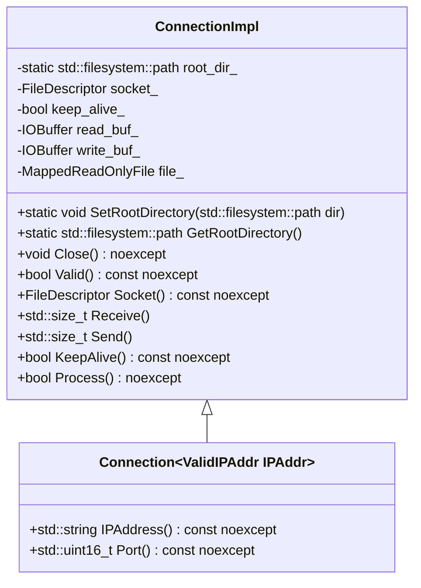
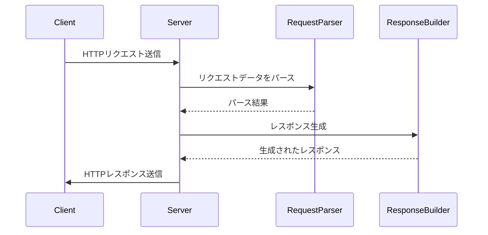

# HTTPモジュール設計文書

## 責務
HTTP通信の受信、解析、応答生成、送信を行う。具体的には、HTTPリクエストをパースし、適切なHTTPレスポンスを作成してクライアントに返す。

## 公開インターフェース
- `ConnectionImpl` クラス: HTTP接続のコア実装。
  - `SetRootDirectory`: ルートディレクトリを設定する。
  - `GetRootDirectory`: ルートディレクトリを取得する。
  - `Close`: 接続を閉じる。
  - `Valid`: 接続が有効かどうか確認する。
  - `Socket`: ソケットを取得する。
  - `Receive`: HTTPリクエストを受け取る。
  - `Send`: HTTPレスポンスを送信する。
  - `KeepAlive`: 接続がキープアライブであるか確認する。
  - `Process`: リクエストを処理し、適切なレスポンスを作成する。

- `Connection` クラス: IPアドレス情報を含むHTTP接続。
  - `IPAddress`: IPアドレスを取得する。
  - `Port`: ポート番号を取得する。

## 入力
- HTTPリクエストデータ（バッファ形式）。
- ルートディレクトリパス。
- ソケットファイルディスクリプタ。

## 出力
- HTTPレスポンスデータ（バッファ形式）。
- エラーメッセージやステータスコード。

## 状態
- `root_dir_`: ルートディレクトリのパス。
- `socket_`: ソケットファイルディスクリプタ。
- `keep_alive_`: 接続がキープアライブであるかどうかを示すフラグ。
- `read_buf_`: 受信バッファ。
- `write_buf_`: 送信バッファ。
- `file_`: マップされた読み取り専用ファイル。

## 処理手順
1. **初期化**: コンストラクタでソケットを設定し、内部状態を初期化する。
2. **リクエスト受信**: `Receive`メソッドでHTTPリクエストデータを受け取る。
3. **リクエスト解析**: `Process`メソッド内で`Request`クラスを使用してリクエストデータをパースする。
4. **レスポンス生成**: パースしたリクエストに基づいて`Response`クラスを使用して適切なHTTPレスポンスを作成する。
5. **レスポンス送信**: `Send`メソッドで作成したHTTPレスポンスデータを送信する。

## 例外・失敗条件
- バッファが空である場合、リクエストのパースに失敗する。
- ソケットが無効な場合、接続処理に失敗する。
- ファイルマップに失敗した場合、適切なエラーレスポンスを生成する。

## 依存関係
- `Buffer`, `IOBuffer` (include/containers/buffer.h)
- `IPAddr`, `IPv4Addr`, `IPv6Addr` (include/ip.h)
- `IReader`, `IWriter`, `IReadWriter`, `FileDescriptor` (include/io.h)
- `MappedReadOnlyFile` (include/util.h)

## 重要な不変条件
- ソケットファイルディスクリプタは常に有効であるか、無効値（-1）である。
- ルートディレクトリパスは設定された場合、存在する有効なディレクトリパスである。

# 追加詳細設計情報

## クラス図


## クラス・メソッド・インターフェース詳細

| クラス名 | メソッド名 | 完全な名前 | 引数名と型 | 戻り値型 | 可視性 | const | noexcept | static |
|----------|------------|------------|------------|----------|--------|-------|----------|--------|
| ConnectionImpl | SetRootDirectory | ws::http::ConnectionImpl::SetRootDirectory | dir: std::filesystem::path | void | public | - | yes | yes |
| ConnectionImpl | GetRootDirectory | ws::http::ConnectionImpl::GetRootDirectory | - | std::filesystem::path | public | - | yes | yes |
| ConnectionImpl | Close | ws::http::ConnectionImpl::Close | - | void | public | - | yes | no |
| ConnectionImpl | Valid | ws::http::ConnectionImpl::Valid | - | bool | public | const | yes | no |
| ConnectionImpl | Socket | ws::http::ConnectionImpl::Socket | - | FileDescriptor | public | const | yes | no |
| ConnectionImpl | Receive | ws::http::ConnectionImpl::Receive | - | std::size_t | public | - | no | no |
| ConnectionImpl | Send | ws::http::ConnectionImpl::Send | - | std::size_t | public | - | no | no |
| ConnectionImpl | KeepAlive | ws::http::ConnectionImpl::KeepAlive | - | bool | public | const | yes | no |
| ConnectionImpl | Process | ws::http::ConnectionImpl::Process | - | bool | public | const | yes | no |

## シーケンス図


## メソッド仕様書

### `ConnectionImpl::Receive`
- **目的**: ソケットからHTTPリクエストデータを受け取る。
- **引数**: 無し
- **戻り値**: 受け取ったバイト数 (std::size_t)
- **動作**: ソケットからデータを読み取り、`read_buf_`に格納する。非ブロッキングモードで読み込みを行い、リソースが利用できない場合は例外をスローしない。
- **副作用**: `read_buf_`の内容が更新される。

### `ConnectionImpl::Send`
- **目的**: HTTPレスポンスデータをソケットに送信する。
- **引数**: 無し
- **戻り値**: 送信したバイト数 (std::size_t)
- **動作**: `write_buf_`とマップされたファイルの内容をソケットに書き込む。エラーが発生した場合は例外をスローする。
- **副作用**: ソケットへのデータ書き込み。

### `ConnectionImpl::Process`
- **目的**: 受信したHTTPリクエストを処理し、適切なレスポンスを作成する。
- **引数**: 無し
- **戻り値**: リクエストが正常に処理されたかどうか (bool)
- **動作**: `read_buf_`からHTTPリクエストをパースし、`Response`クラスを使用して適切なレスポンスを作成する。エラーが発生した場合はエラーレスポンスを作成する。
- **副作用**: `write_buf_`の内容が更新される。

## 処理フロー図
```mermaid
graph TD
    A[Receive] --> B{read_buf_.ReadableSize() == 0?}
    B -- Yes --> C[return false]
    B -- No --> D[Request.Parse(read_buf_)]
    D --> E[Response.Build(write_buf_, request.Path(), status_code_)]
    E --> F[Send()]
    F --> G[return true]
```

## 状態遷移・副作用

| 更新前状態 | 遷移条件 | 変更対象 | 更新後状態 | 更新順序 | 副作用 |
|------------|----------|----------|------------|----------|--------|
| 任意       | Receive()呼び出し | read_buf_ | リクエストデータ格納 | 1 | - |
| 任意       | Process()呼び出し | status_code_, write_buf_ | レスポンス生成 | 2 | - |
| 任意       | Send()呼び出し | ソケット | レスポンス送信 | 3 | - |

## データ変換・制約

| 入力データ | 変換規則 | 出力データ | 値域 | 境界値 |
|------------|----------|------------|------|--------|
| HTTPリクエストデータ | パース処理 | Requestオブジェクト | 有効なHTTPリクエスト | - |
| ファイルパス | マッピング処理 | MappedReadOnlyFileオブジェクト | 存在するファイル | - |
| HTTPステータスコード | 文字列変換 | ステータスマッセージ | 有効なHTTPステータスコード | - |

これらの設計情報は、元コードから確認できる事実に基づいており、再実装に必要な詳細を提供します。