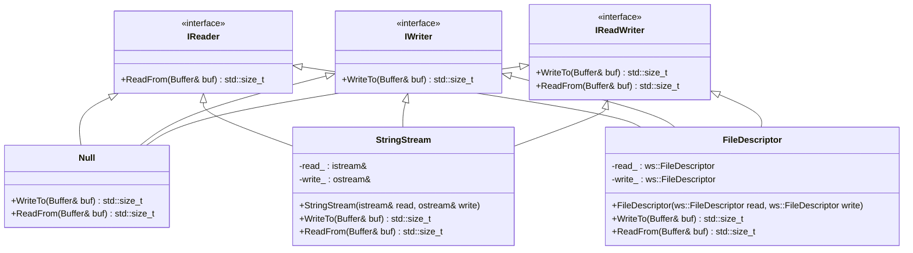
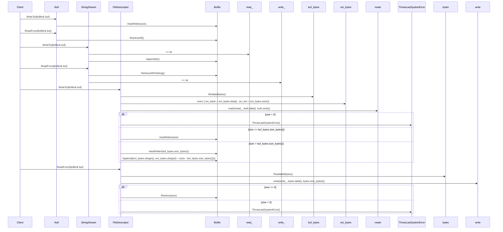

# デザイン文書

## 責務
`include/io.h`と`src/io/io.cpp`は、バッファを介してデータの読み書きを行うためのI/Oオブジェクトを提供します。具体的には、`Null`, `StringStream`, `FileDescriptor`クラスが定義されており、それぞれ異なるソース（無効な出力、文字列ストリーム、ファイルディスクリプタ）からのデータの読み書きを行います。

## 公開インターフェース
- **IReader**
  - `virtual std::size_t ReadFrom(Buffer& buf) = 0;`
- **IWriter**
  - `virtual std::size_t WriteTo(Buffer& buf) = 0;`
- **IReadWriter** (多重継承)
  - `std::size_t WriteTo(Buffer& buf)`
  - `std::size_t ReadFrom(Buffer& buf)`
- **Null**
  - `std::size_t WriteTo(Buffer& buf) noexcept override;`
  - `std::size_t ReadFrom(Buffer& buf) noexcept override;`
- **StringStream**
  - `explicit StringStream(std::istream& read, std::ostream& write) noexcept;`
  - `std::size_t WriteTo(Buffer& buf) noexcept override;`
  - `std::size_t ReadFrom(Buffer& buf) noexcept override;`
- **FileDescriptor**
  - `explicit FileDescriptor(ws::FileDescriptor read, ws::FileDescriptor write) noexcept;`
  - `std::size_t WriteTo(Buffer& buf) override;`
  - `std::size_t ReadFrom(Buffer& buf) override;`

## 入力
- **Null**: バッファの読み書き可能なサイズ。
- **StringStream**: 文字列ストリームからのデータ、バッファへのデータ。
- **FileDescriptor**: ファイルディスクリプタからのデータ、バッファへのデータ。

## 出力
- **Null**: 書き込んだサイズ（常にバッファの書き込み可能なサイズ）、読み取ったサイズ（常にバッファの読み取り可能なサイズ）。
- **StringStream**: 文字列ストリームに書き込んだ文字数、バッファから読み取った文字数。
- **FileDescriptor**: ファイルディスクリプタに書き込んだバイト数、ファイルディスクリプタから読み取ったバイト数。

## 状態
- **Null**: なし（状態を持たない）。
- **StringStream**: 参照する文字列ストリームの状態。
- **FileDescriptor**: ファイルディスクリプタの状態。

## 処理手順
- **Null**:
  - `WriteTo`: バッファの書き込み可能なサイズを取得し、そのサイズ分読み取りオフセットを進める。
  - `ReadFrom`: バッファから全てのデータを読み取り、読み取りオフセットを最後まで進める。
- **StringStream**:
  - `WriteTo`: 文字列ストリームから文字列を読み取り、バッファに追加する。
  - `ReadFrom`: バッファから全てのデータを読み取り、それを文字列ストリームに書き込む。
- **FileDescriptor**:
  - `WriteTo`: ファイルディスクリプタからデータを読み取り、バッファに追加する。必要に応じて追加のバッファを使用してデータを読み取る。
  - `ReadFrom`: バッファからデータを読み取り、ファイルディスクリプタに書き込む。

## 例外・失敗条件
- **Null**: なし（例外を投げない）。
- **StringStream**: 文字列ストリームの操作でエラーが発生した場合、そのエラーが伝播する可能性がある。
- **FileDescriptor**:
  - `readv`または`write`システムコールが失敗した場合、`ThrowLastSystemError()`を呼び出して例外を投げる。

## 依存関係
- **Null**: `Buffer`
- **StringStream**: `Buffer`, `std::istream`, `std::ostream`
- **FileDescriptor**: `Buffer`, `ws::FileDescriptor`, `sys/uio.h`, `unistd.h`

## 重要な不変条件
- **Null**: バッファの読み取りオフセットと書き込みオフセットは常に有効な範囲内である。
- **StringStream**: 参照する文字列ストリームが有効である。
- **FileDescriptor**: ファイルディスクリプタが有効である。

## 追加詳細設計情報

### クラス図


### クラス・メソッド・インターフェース詳細

| クラス名       | メソッド名         | 完全な名前                           | 引数名と型                         | 戻り値型   | 可視性 | const | static | `virtual` | `noexcept` |
|----------------|--------------------|--------------------------------------|------------------------------------|------------|--------|-------|--------|-----------|------------|
| IReader        | ReadFrom           | ws::io::IReader::ReadFrom            | Buffer& buf                        | std::size_t  | public |       |        | ✓         |            |
| IWriter        | WriteTo            | ws::io::IWriter::WriteTo             | Buffer& buf                        | std::size_t  | public |       |        | ✓         |            |
| IReadWriter    | WriteTo            | ws::io::IReadWriter::WriteTo         | Buffer& buf                        | std::size_t  | public |       |        | ✓         |            |
| IReadWriter    | ReadFrom           | ws::io::IReadWriter::ReadFrom        | Buffer& buf                        | std::size_t  | public |       |        | ✓         |            |
| Null           | WriteTo            | ws::io::Null::WriteTo                | Buffer& buf                        | std::size_t  | public |       |        |           | ✓          |
| Null           | ReadFrom           | ws::io::Null::ReadFrom               | Buffer& buf                        | std::size_t  | public |       |        |           | ✓          |
| StringStream   | StringStream       | ws::io::StringStream::StringStream   | std::istream& read, std::ostream& write |              | public |       |        |           | ✓          |
| StringStream   | WriteTo            | ws::io::StringStream::WriteTo        | Buffer& buf                        | std::size_t  | public |       |        |           | ✓          |
| StringStream   | ReadFrom           | ws::io::StringStream::ReadFrom       | Buffer& buf                        | std::size_t  | public |       |        |           | ✓          |
| FileDescriptor | FileDescriptor     | ws::io::FileDescriptor::FileDescriptor | ws::FileDescriptor read, ws::FileDescriptor write |              | public |       |        |           | ✓          |
| FileDescriptor | WriteTo            | ws::io::FileDescriptor::WriteTo      | Buffer& buf                        | std::size_t  | public |       |        |           |            |
| FileDescriptor | ReadFrom           | ws::io::FileDescriptor::ReadFrom     | Buffer& buf                        | std::size_t  | public |       |        |           |            |

### シーケンス図


### メソッド仕様書

#### Null::WriteTo
- **目的**: バッファの書き込み可能なサイズを消費する。
- **引数**:
  - `Buffer& buf`: 書き込むバッファ。
- **戻り値**: 消費したバイト数（常にバッファの書き込み可能なサイズ）。
- **動作**: バッファの書き込み可能なサイズを取得し、そのサイズ分読み取りオフセットを進める。
- **副作用**: バッファの読み取りオフセットが更新される。
- **エラー処理**: なし（例外を投げない）。

#### Null::ReadFrom
- **目的**: バッファから全てのデータを読み取る。
- **引数**:
  - `Buffer& buf`: 読み取るバッファ。
- **戻り値**: 読み取ったバイト数（常にバッファの読み取り可能なサイズ）。
- **動作**: バッファから全てのデータを読み取り、読み取りオフセットを最後まで進める。
- **副作用**: バッファの読み取りオフセットが更新される。
- **エラー処理**: なし（例外を投げない）。

#### StringStream::StringStream
- **目的**: 文字列ストリームからのデータとバッファへのデータとの間でI/Oを行うためのオブジェクトを作成する。
- **引数**:
  - `std::istream& read`: 読み取り用文字列ストリーム。
  - `std::ostream& write`: 書き込み用文字列ストリーム。
- **戻り値**: なし。
- **動作**: 文字列ストリームへの参照を保持する。
- **副作用**: なし。
- **エラー処理**: なし（例外を投げない）。

#### StringStream::WriteTo
- **目的**: 文字列ストリームからバッファにデータを書き込む。
- **引数**:
  - `Buffer& buf`: 書き込み先のバッファ。
- **戻り値**: 書き込んだ文字数。
- **動作**: 文字列ストリームから文字列を読み取り、それをバッファに追加する。
- **副作用**: バッファが更新される。
- **エラー処理**: 文字列ストリームの操作でエラーが発生した場合、そのエラーが伝播する可能性がある。

#### StringStream::ReadFrom
- **目的**: バッファからデータを読み取り、文字列ストリームに書き込む。
- **引数**:
  - `Buffer& buf`: 読み取るバッファ。
- **戻り値**: 読み取った文字数。
- **動作**: バッファから全てのデータを読み取り、それを文字列ストリームに書き込む。
- **副作用**: 文字列ストリームとバッファが更新される。
- **エラー処理**: なし（例外を投げない）。

#### FileDescriptor::FileDescriptor
- **目的**: ファイルディスクリプタからのデータとバッファへのデータとの間でI/Oを行うためのオブジェクトを作成する。
- **引数**:
  - `ws::FileDescriptor read`: 読み取り用ファイルディスクリプタ。
  - `ws::FileDescriptor write`: 書き込み用ファイルディスクリプタ。
- **戻り値**: なし。
- **動作**: ファイルディスクリプタへの参照を保持する。
- **副作用**: なし。
- **エラー処理**: なし（例外を投げない）。

#### FileDescriptor::WriteTo
- **目的**: ファイルディスクリプタからバッファにデータを書き込む。
- **引数**:
  - `Buffer& buf`: 書き込み先のバッファ。
- **戻り値**: 書き込んだバイト数。
- **動作**: ファイルディスクリプタからデータを読み取り、バッファに追加する。必要に応じて追加のバッファを使用してデータを読み取る。
- **副作用**: バッファが更新される。
- **エラー処理**: `readv`システムコールが失敗した場合、`ThrowLastSystemError()`を呼び出して例外を投げる。

#### FileDescriptor::ReadFrom
- **目的**: バッファからデータを読み取り、ファイルディスクリプタに書き込む。
- **引数**:
  - `Buffer& buf`: 読み取るバッファ。
- **戻り値**: 書き込んだバイト数。
- **動作**: バッファからデータを読み取り、それをファイルディスクリプタに書き込む。
- **副作用**: ファイルディスクリプタとバッファが更新される。
- **エラー処理**: `write`システムコールが失敗した場合、`ThrowLastSystemError()`を呼び出して例外を投げる。

### 処理フロー図
```mermaid
graph TD
    A[開始] --> B{Null::WriteTo}
    B --> C[バッファの書き込み可能なサイズ取得]
    C --> D[読み取りオフセット進める]
    D --> E[終了]

    F[開始] --> G{Null::ReadFrom}
    G --> H[バッファから全てのデータ読み取り]
    H --> I[読み取りオフセット最後まで進める]
    I --> J[終了]

    K[開始] --> L[StringStream::StringStream]
    L --> M[文字列ストリーム参照保持]
    M --> N[終了]

    O[開始] --> P{StringStream::WriteTo}
    P --> Q[文字列ストリームから文字列読み取り]
    Q --> R[バッファに追加する]
    R --> S[終了]

    T[開始] --> U{StringStream::ReadFrom}
    U --> V[バッファから全てのデータ読み取り]
    V --> W[文字列ストリームに書き込む]
    W --> X[終了]

    Y[開始] --> Z[FileDescriptor::FileDescriptor]
    Z --> AA[ファイルディスクリプタ参照保持]
    AA --> AB[終了]

    AC[開始] --> AD{FileDescriptor::WriteTo}
    AD --> AE[バッファの書き込み可能なサイズ取得]
    AF[追加バッファ準備]
    AG[readvシステムコール呼び出し]
    AH{size < 0?}
    AI[size <= buf_bytes.size_bytes()?]
    AJ[読み取りオフセット進める]
    AK[終了]
    AL[読み取りオフセット進める]
    AM[追加バッファからバッファに追加する]
    AN[終了]

    AO[開始] --> AP{FileDescriptor::ReadFrom}
    AQ[バッファの読み取り可能なデータ取得]
    AR[writeシステムコール呼び出し]
    AS{size >= 0?}
    AT[読み取りオフセット進める]
    AU[終了]
    AV[ThrowLastSystemError呼び出し]
    AW[終了]
```

### 状態遷移・副作用

| 更新前状態 | 遷移条件                         | 変更対象         | 更新後状態       | 更新順序 | 外部資源への副作用 |
|------------|----------------------------------|--------------------|------------------|----------|----------------------|
| 任意       | Null::WriteTo呼び出し            | バッファの読み取りオフセット | 読み取りオフセットが進んだ状態 | 1        | なし                 |
| 任意       | Null::ReadFrom呼び出し           | バッファの読み取りオフセット | 読み取りオフセットが最後まで進んだ状態 | 1        | なし                 |
| 任意       | StringStream::WriteTo呼び出し    | バッファ             | バッファにデータ追加された状態 | 1        | 文字列ストリームから読み取り |
| 任意       | StringStream::ReadFrom呼び出し   | バッファ, 文字列ストリーム | バッファが空になり、文字列ストリームに書き込みされた状態 | 1,2      | 文字列ストリームへの書き込み |
| 任意       | FileDescriptor::WriteTo呼び出し  | バッファ             | バッファにデータ追加された状態 | 1,2      | ファイルディスクリプタから読み取り |
| 任意       | FileDescriptor::ReadFrom呼び出し | バッファ, ファイルディスクリプタ | バッファが空になり、ファイルディスクリプタに書き込みされた状態 | 1,2      | ファイルディスクリプタへの書き込み |

### データ変換・制約

| 入力データ         | 出力データ       | 変換規則                                                                 | 値域          | 境界値        | 単位  | 精度 | encoding | 検証条件 | 特殊値・欠損値の扱い |
|--------------------|------------------|--------------------------------------------------------------------------|---------------|-----------------|-------|------|----------|------------|------------------------|
| バッファの書き込み可能なサイズ | 書き込んだバイト数 | バッファの書き込み可能なサイズを返す                                               | 0以上の整数   | 0, バッファの最大サイズ | バイト  | -    | -        | 無し         | 無し                   |
| 文字列ストリームから読み取った文字列 | 書き込んだ文字数 | 文字列ストリームから読み取った文字列をバッファに追加する                             | 0以上の整数   | 0, 文字列の最大長     | 文字  | -    | UTF-8    | 無し         | 無し                   |
| バッファから読み取ったデータ | 書き込んだバイト数 | バッファから読み取ったデータをファイルディスクリプタに書き込む                         | 0以上の整数   | 0, ファイルの最大サイズ | バイト  | -    | -        | 無し         | 無し                   |
| ファイルディスクリプタから読み取ったデータ | 書き込んだバイト数 | ファイルディスクリプタから読み取ったデータをバッファに追加する                     | 0以上の整数   | 0, バッファの最大サイズ | バイト  | -    | -        | 無し         | 無し                   |

この設計文書は、`include/io.h`と`src/io/io.cpp`の再実装に必要な詳細な情報を提供します。各クラスやメソッドの役割、処理フロー、例外処理などを明確に記述しています。