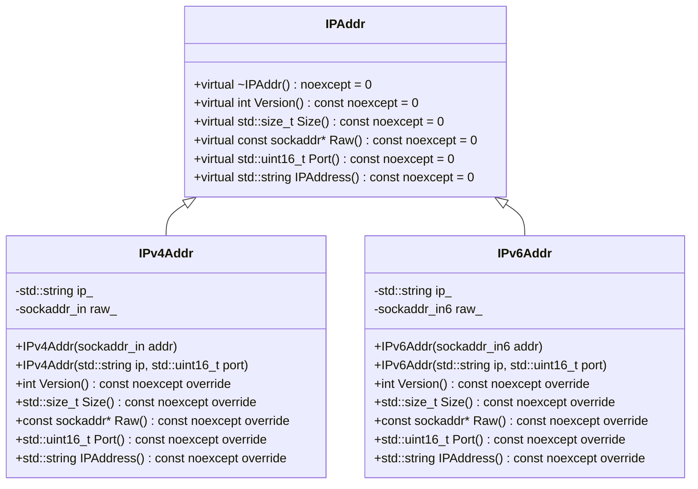
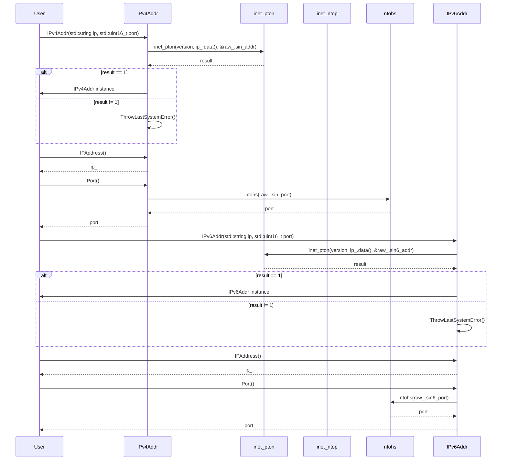

# 設計文書

## ファイル構造と責務

### include/ip.h
- **ファイルの役割**: IPアドレスを扱うためのインターフェースと具体的なIPv4、IPv6アドレスクラスを定義する。
- **公開インターフェース**:
  - `IPAddr` クラス: IPアドレスの抽象基底クラス
  - `IPv4Addr` クラス: IPv4アドレスを扱う具象クラス
  - `IPv6Addr` クラス: IPv6アドレスを扱う具象クラス

### src/ip/ip.cpp
- **ファイルの役割**: `include/ip.h`で定義されたクラスの実装を行う。
- **公開インターフェース**:
  - `IPv4Addr` クラスのコンストラクタとメンバ関数の実装
  - `IPv6Addr` クラスのコンストラクタとメンバ関数の実装

## 基本設計項目

### 責務
- **include/ip.h**:
  - IPアドレスを抽象化したインターフェース (`IPAddr`) を提供する。
  - IPv4アドレスとIPv6アドレスを扱う具象クラス (`IPv4Addr`, `IPv6Addr`) を提供する。

- **src/ip/ip.cpp**:
  - `IPv4Addr` クラスのコンストラクタとメンバ関数の実装を行う。
  - `IPv6Addr` クラスのコンストラクタとメンバ関数の実装を行う。

### 公開インターフェース
- **IPAddr**:
  - `virtual ~IPAddr() noexcept = default;`
  - `virtual int Version() const noexcept = 0;`
  - `virtual std::size_t Size() const noexcept = 0;`
  - `virtual const sockaddr* Raw() const noexcept = 0;`
  - `virtual std::uint16_t Port() const noexcept = 0;`
  - `virtual std::string IPAddress() const noexcept = 0;`

- **IPv4Addr**:
  - `static constexpr int version {AF_INET};`
  - `static constexpr std::string_view loop_back {"127.0.0.1"};`
  - `static constexpr std::string_view any {"0.0.0.0"};`
  - `static constexpr std::size_t max_length {15};`
  - `using RawType = sockaddr_in;`
  - `explicit IPv4Addr(sockaddr_in addr);`
  - `explicit IPv4Addr(std::string ip, std::uint16_t port);`
  - `int Version() const noexcept override;`
  - `std::size_t Size() const noexcept override;`
  - `const sockaddr* Raw() const noexcept override;`
  - `std::uint16_t Port() const noexcept override;`
  - `std::string IPAddress() const noexcept override;`

- **IPv6Addr**:
  - `static constexpr int version {AF_INET6};`
  - `static constexpr std::string_view loop_back {"::1"};`
  - `static constexpr std::string_view any {"::"};`
  - `static constexpr std::size_t max_length {45};`
  - `using RawType = sockaddr_in6;`
  - `explicit IPv6Addr(sockaddr_in6 addr);`
  - `explicit IPv6Addr(std::string ip, std::uint16_t port);`
  - `int Version() const noexcept override;`
  - `std::size_t Size() const noexcept override;`
  - `const sockaddr* Raw() const noexcept override;`
  - `std::uint16_t Port() const noexcept override;`
  - `std::string IPAddress() const noexcept override;`

### 入力
- **IPv4Addr**:
  - コンストラクタ: `sockaddr_in addr`, `std::string ip, std::uint16_t port`
  
- **IPv6Addr**:
  - コンストラクタ: `sockaddr_in6 addr`, `std::string ip, std::uint16_t port`

### 出力
- **IPAddr**:
  - `Version()`: IPバージョンを返す。
  - `Size()`: ソケットアドレスのサイズを返す。
  - `Raw()`: ソケットアドレスへのポインタを返す。
  - `Port()`: ポート番号を返す。
  - `IPAddress()`: IPアドレス文字列を返す。

### 状態
- **IPv4Addr**:
  - `ip_`: IPアドレスの文字列表現
  - `raw_`: IPv4アドレス構造体 (`sockaddr_in`)

- **IPv6Addr**:
  - `ip_`: IPアドレスの文字列表現
  - `raw_`: IPv6アドレス構造体 (`sockaddr_in6`)

### 処理手順
- **IPv4Addr**:
  - コンストラクタ: 
    - `sockaddr_in addr` を受け取る場合、`inet_ntop` を使用してIPアドレス文字列を生成する。
    - `std::string ip, std::uint16_t port` を受け取る場合、`inet_pton` を使用してソケットアドレス構造体を初期化する。
  - メンバ関数:
    - 各メンバ変数や構造体から必要な情報を取得・返す。

- **IPv6Addr**:
  - コンストラクタ: 
    - `sockaddr_in6 addr` を受け取る場合、`inet_ntop` を使用してIPアドレス文字列を生成する。
    - `std::string ip, std::uint16_t port` を受け取る場合、`inet_pton` を使用してソケットアドレス構造体を初期化する。
  - メンバ関数:
    - 各メンバ変数や構造体から必要な情報を取得・返す。

### 例外・失敗条件
- **IPv4Addr**:
  - `inet_ntop` や `inet_pton` の呼び出しが失敗した場合、`ThrowLastSystemError()` を呼び出して例外を投げる。
  
- **IPv6Addr**:
  - `inet_ntop` や `inet_pton` の呼び出しが失敗した場合、`ThrowLastSystemError()` を呼び出して例外を投げる。

### 依存関係
- **include/ip.h**:
  - `<concepts>`
  - `<cstdint>`
  - `<string>`
  - `<string_view>`
  - `<netinet/in.h>`

- **src/ip/ip.cpp**:
  - `"ip.h"`
  - `"util.h"`
  - `<arpa/inet.h>`
  - `<array>`

### 重要な不変条件
- `IPv4Addr` と `IPv6Addr` のインスタンスは、それぞれのIPアドレス文字列とソケットアドレス構造体が一貫性を持つこと。

## 追加詳細設計情報

### クラス図


### クラス・メソッド・インターフェース詳細

| クラス名 | メンバ名 | 型 | 可視性 | const | noexcept | static |
|----------|----------|----|--------|-------|----------|--------|
| IPAddr   | ~IPAddr  | void | public | -     | true     | false  |
| IPAddr   | Version  | int  | public | true  | true     | false  |
| IPAddr   | Size     | std::size_t | public | true  | true     | false  |
| IPAddr   | Raw      | const sockaddr* | public | true  | true     | false  |
| IPAddr   | Port     | std::uint16_t | public | true  | true     | false  |
| IPAddr   | IPAddress| std::string | public | true  | true     | false  |

| クラス名 | メンバ名 | 型 | 可視性 | const | noexcept | static |
|----------|----------|----|--------|-------|----------|--------|
| IPv4Addr | IPv4Addr | -  | public | -     | false    | false  |
| IPv4Addr | IPv4Addr | -  | public | -     | false    | false  |
| IPv4Addr | Version  | int  | public | true  | true     | false  |
| IPv4Addr | Size     | std::size_t | public | true  | true     | false  |
| IPv4Addr | Raw      | const sockaddr* | public | true  | true     | false  |
| IPv4Addr | Port     | std::uint16_t | public | true  | true     | false  |
| IPv4Addr | IPAddress| std::string | public | true  | true     | false  |

| クラス名 | メンバ名 | 型 | 可視性 | const | noexcept | static |
|----------|----------|----|--------|-------|----------|--------|
| IPv6Addr | IPv6Addr | -  | public | -     | false    | false  |
| IPv6Addr | IPv6Addr | -  | public | -     | false    | false  |
| IPv6Addr | Version  | int  | public | true  | true     | false  |
| IPv6Addr | Size     | std::size_t | public | true  | true     | false  |
| IPv6Addr | Raw      | const sockaddr* | public | true  | true     | false  |
| IPv6Addr | Port     | std::uint16_t | public | true  | true     | false  |
| IPv6Addr | IPAddress| std::string | public | true  | true     | false  |

### シーケンス図


### メソッド仕様書

#### IPv4Addr::IPv4Addr(std::string ip, std::uint16_t port)
- **目的**: IPv4アドレスとポート番号から `IPv4Addr` オブジェクトを生成する。
- **引数**:
  - `ip`: IPアドレス文字列
  - `port`: ポート番号
- **戻り値**: なし
- **動作**:
  - `raw_.sin_family` を `version` に設定する。
  - `raw_.sin_port` を `htons(port)` に設定する。
  - `inet_pton` を使用してIPアドレス文字列をソケットアドレス構造体に変換する。
- **副作用**:
  - 変換に失敗した場合、`ThrowLastSystemError()` を呼び出して例外を投げる。

#### IPv4Addr::IPAddress()
- **目的**: IPアドレスの文字列表現を取得する。
- **引数**: なし
- **戻り値**: IPアドレスの文字列 (`std::string`)
- **動作**:
  - `ip_` を返す。

#### IPv4Addr::Port()
- **目的**: ポート番号を取得する。
- **引数**: なし
- **戻り値**: ポート番号 (`std::uint16_t`)
- **動作**:
  - `ntohs(raw_.sin_port)` を呼び出してポート番号を返す。

#### IPv6Addr::IPv6Addr(std::string ip, std::uint16_t port)
- **目的**: IPv6アドレスとポート番号から `IPv6Addr` オブジェクトを生成する。
- **引数**:
  - `ip`: IPアドレス文字列
  - `port`: ポート番号
- **戻り値**: なし
- **動作**:
  - `raw_.sin6_family` を `version` に設定する。
  - `raw_.sin6_port` を `htons(port)` に設定する。
  - `inet_pton` を使用してIPアドレス文字列をソケットアドレス構造体に変換する。
- **副作用**:
  - 変換に失敗した場合、`ThrowLastSystemError()` を呼び出して例外を投げる。

#### IPv6Addr::IPAddress()
- **目的**: IPアドレスの文字列表現を取得する。
- **引数**: なし
- **戻り値**: IPアドレスの文字列 (`std::string`)
- **動作**:
  - `ip_` を返す。

#### IPv6Addr::Port()
- **目的**: ポート番号を取得する。
- **引数**: なし
- **戻り値**: ポート番号 (`std::uint16_t`)
- **動作**:
  - `ntohs(raw_.sin6_port)` を呼び出してポート番号を返す。

### 処理フロー図

#### IPv4Addr::IPv4Addr(std::string ip, std::uint16_t port)
```mermaid
graph TD
    A[開始] --> B[raw_.sin_family = version]
    B --> C[raw_.sin_port = htons(port)]
    C --> D[inet_pton(version, ip_.data(), &raw_.sin_addr)]
    D --> E{result == 1?}
    E -- true --> F[IPv4Addr instance]
    E -- false --> G[ThrowLastSystemError()]
```

#### IPv6Addr::IPv6Addr(std::string ip, std::uint16_t port)
```mermaid
graph TD
    A[開始] --> B[raw_.sin6_family = version]
    B --> C[raw_.sin6_port = htons(port)]
    C --> D[inet_pton(version, ip_.data(), &raw_.sin6_addr)]
    D --> E{result == 1?}
    E -- true --> F[IPv6Addr instance]
    E -- false --> G[ThrowLastSystemError()]
```

### 状態遷移・副作用

| 更新前状態 | 遷移条件 | 変更対象 | 更新後状態 | 更新順序 | 副作用 |
|------------|----------|----------|------------|----------|--------|
| 未初期化   | コンストラクタ呼び出し | `raw_`, `ip_` | 初期化済み | raw_ -> ip_ | inet_pton 失敗時例外投げ |

### データ変換・制約

| 入力データ | 出力データ | 型変換 | 加工規則 | 値域 | 境界値 | 単位 | 精度 | encoding |
|------------|------------|--------|----------|------|--------|------|------|----------|
| ip (IPv4)  | raw_       | std::string -> sockaddr_in | inet_pton | -    | -      | -    | -    | ASCII    |
| port       | raw_.sin_port | std::uint16_t -> uint16_t | htons | 0-65535 | 0, 65535 | -    | -    | -        |
| ip (IPv6)  | raw_       | std::string -> sockaddr_in6 | inet_pton | -    | -      | -    | -    | ASCII    |

この設計文書は、`include/ip.h`と`src/ip/ip.cpp`の内容を基に再実装に必要な詳細情報を提供します。各クラスやメソッドの役割、処理フロー、例外処理などを明確に記述しています。