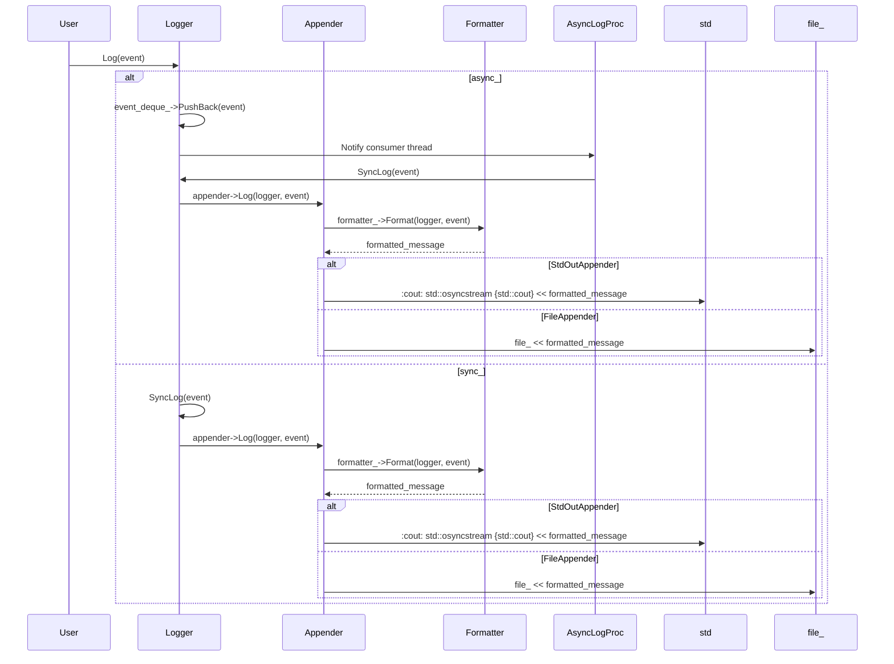

# デザイン文書

## 責務
ログイベントの生成、フォーマット、および出力（標準出力やファイル）を管理する。また、複数のロガーとアペンダーを管理し、設定に基づいて初期化を行う。

## 公開インターフェース
- `Logger::Ptr RootLogger() noexcept`
- `Logger::Ptr FindLogger(std::string_view name) noexcept`
- `void Log(Logger::Ptr logger, Event::Ptr event) noexcept`
- `Logger::Ptr operator<<(Logger::Ptr logger, Event::Ptr event) noexcept`
- `Event::Ptr Event::Create(log::Level level, std::experimental::source_location location = std::experimental::source_location::current(), std::uint32_t thread_id = CurrentThreadId(), Clock::time_point time = Clock::now()) noexcept`
- `std::string_view LevelToString(Level level) noexcept`
- `Level StringToLevel(std::string str)`
- `std::string_view AppenderTypeToString(AppenderType type) noexcept`
- `AppenderType StringToAppenderType(std::string str)`

## 入力
- ログレベル（`log::Level`）
- イベント情報（`Event`）
- フォーマットパターン（`std::string_view`）
- アペンダー設定（`AppenderConfig`）
- ロガー設定（`LoggerConfig`）

## 出力
- フォーマットされたログメッセージ（`std::string`）
- YAML形式のロガー設定文字列（`std::string`）

## 状態
- ログレベル
- イベントキューの容量と状態
- アペンダーの一覧
- フォーマッタ

## 処理手順
1. `Logger`インスタンスを作成し、必要な設定（ログレベル、イベントキューの容量）を初期化する。
2. イベントが生成されると、そのイベントは適切なフォーマットに変換される。
3. フォーマットされたメッセージは指定されたアペンダーによって出力される。
4. 設定ファイルからロガーとアペンダーの設定を読み込み、初期化を行う。

## 例外・失敗条件
- 不正なログレベルやアペンダータイプが指定された場合、`std::invalid_argument`がスローされる。
- ファイルへの書き込みに失敗した場合、`std::system_error`がスローされる。
- YAMLのパースに失敗した場合、`std::invalid_argument`がスローされる。

## 依存関係
- `config.h`: 設定管理用クラスとユーティリティ関数
- `containers/block_deque.h`: イベントキューとして使用するブロッキングデック
- `util.h`: 文字列操作やユーティリティ関数

## 重要な不変条件
- ロガーのログレベルは設定された値を保持し、イベントのフィルタリングに使用される。
- イベントキューが非同期モードの場合、容量を超えるとイベントの追加はブロックされる。
- アペンダーは設定されたフォーマッタを使用してメッセージを出力する。

## 追加詳細設計情報

### クラス図
```mermaid
classDiagram
    class Logger {
        +std::string_view Name() const noexcept
        +void Log(Event::Ptr event) noexcept
        +void AddAppender(Appender::Ptr appender) noexcept
        +void RemoveAppender(Appender::Ptr appender) noexcept
        +void ClearAppenders() noexcept
        +log::Level GetLevel() const noexcept
        +void SetLevel(log::Level level) noexcept
        +Formatter::Ptr GetDefaultFormatter() const noexcept
        +void SetDefaultFormatter(Formatter::Ptr formatter) noexcept
        +std::string ToYamlString() const noexcept
    }
    
    class Event {
        +log::Level Level() const noexcept
        +std::string_view FileName() const noexcept
        +std::size_t LineNum() const noexcept
        +std::uint32_t ThreadId() const noexcept
        +Event::Clock::time_point Time() const noexcept
        +std::string Message() const noexcept
        +std::ostringstream& MessageStream() noexcept
    }
    
    class Formatter {
        +std::string Format(const Logger& logger, const Event& event) const noexcept
        +std::string_view Pattern() const noexcept
    }
    
    class Appender {
        +void Log(const Logger& logger, const Event& event) noexcept
        +std::string ToYamlString() const noexcept
    }
    
    class StdOutAppender~: Appender~
        +void Log(const Logger& logger, const Event& event) noexcept override
        +std::string ToYamlString() const noexcept override
    
    class FileAppender~: Appender~
        +FileAppender(std::string_view file_name, Formatter::Ptr formatter = Formatter::Default())
        +void Log(const Logger& logger, const Event& event) noexcept override
        +std::string ToYamlString() const noexcept override
    
    class Manager {
        +Logger::Ptr FindLogger(std::string_view name, log::Level level = Level::Info, std::optional<std::size_t> capacity = std::nullopt) noexcept
        +void RemoveLogger(std::string_view name) noexcept
        +std::string ToYamlString() const noexcept
    }
    
    Logger "1" -- "0..*" Appender : contains
    Logger "1" -- "1" Formatter : uses
    Manager "1" -- "0..*" Logger : manages
```

### クラス・メソッド・インターフェース詳細

| クラス名 | メソッド名 | 完全な名前 | 引数名と型 | 戻り値型 | 可視性 | const | noexcept |
|----------|------------|--------------|-------------|-----------|--------|-------|----------|
| Logger   | Log        | ws::log::Logger::Log | Event::Ptr event | void    | public | false | true     |
| Logger   | AddAppender| ws::log::Logger::AddAppender | Appender::Ptr appender | void    | public | false | true     |
| Logger   | RemoveAppender | ws::log::Logger::RemoveAppender | Appender::Ptr appender | void    | public | false | true     |
| Logger   | ClearAppenders | ws::log::Logger::ClearAppenders |  | void    | public | false | true     |
| Logger   | GetLevel     | ws::log::Logger::GetLevel |  | log::Level | public | true  | true     |
| Logger   | SetLevel     | ws::log::Logger::SetLevel | log::Level level | void    | public | false | true     |
| Logger   | GetDefaultFormatter | ws::log::Logger::GetDefaultFormatter |  | Formatter::Ptr | public | true  | true     |
| Logger   | SetDefaultFormatter | ws::log::Logger::SetDefaultFormatter | Formatter::Ptr formatter | void    | public | false | true     |
| Event    | Create     | ws::log::Event::Create | log::Level level, std::experimental::source_location location, std::uint32_t thread_id, Clock::time_point time | Event::Ptr | static | false | true     |
| Formatter| Format     | ws::log::Formatter::Format | const Logger& logger, const Event& event | std::string | public | true  | true     |
| Appender | Log        | ws::log::Appender::Log | const Logger& logger, const Event& event | void    | virtual | false | true     |
| StdOutAppender | Log | ws::log::StdOutAppender::Log | const Logger& logger, const Event& event | void    | override | false | true     |
| FileAppender   | Log        | ws::log::FileAppender::Log | const Logger& logger, const Event& event | void    | override | false | true     |

### シーケンス図


### メソッド仕様書

#### `Logger::Log`
- **目的**: イベントをログに記録する。
- **引数**:
  - `event`: ログイベント（`Event::Ptr`）
- **戻り値**: 無し
- **動作**: イベントのレベルがロガーの設定レベル以上であれば、イベントを適切なフォーマットに変換してアペンダーに出力する。
- **副作用**: イベントキューへの追加や同期ログ処理による出力。
- **エラー処理**: なし

#### `Event::Create`
- **目的**: 新しいイベントを作成する。
- **引数**:
  - `level`: ログレベル（`log::Level`）
  - `location`: イベントのソースロケーション（`std::experimental::source_location`）
  - `thread_id`: スレッドID（`std::uint32_t`）
  - `time`: イベント発生日時（`Event::Clock::time_point`）
- **戻り値**: 新しいイベントオブジェクトへのスマートポインタ（`Event::Ptr`）
- **動作**: 引数から新しいイベントを作成し、そのスマートポインタを返す。
- **副作用**: なし
- **エラー処理**: なし

### 処理フロー図
```mermaid
graph TD
    A[Logger::Log] --> B{async_?}
    B -- true --> C[event_deque_->PushBack(event)]
    B -- false --> D[SyncLog(event)]
    C --> E[Notify consumer thread]
    E --> F[AsyncLogProc]
    F --> G[SyncLog(event)]
    G --> H[appender->Log(logger, event)]
    H --> I[formatter_->Format(logger, event)]
    I --> J[formatted_message]
    J --> K{StdOutAppender?}
    K -- true --> L[std::osyncstream {std::cout} << formatted_message]
    K -- false --> M[file_ << formatted_message]
    D --> H
```

### 状態遷移・副作用

| 状態 | 遷移条件 | 変更対象 | 更新後状態 | 更新順序 | 副作用 |
|------|----------|-----------|------------|----------|--------|
| 同期モード | イベント追加 | appenders_ | フォーマットされたメッセージが出力される | 1. SyncLog呼び出し<br>2. appender->Log呼び出し | メッセージ出力 |
| 非同期モード | イベント追加 | event_deque_ | イベントキューにイベントが追加され、消費者スレッドに通知される | 1. PushBack呼び出し<br>2. Notify呼び出し | イベントキューへの追加と消費者スレッドの通知 |
| 消費者スレッド | イベントポップ | event_deque_ | フォーマットされたメッセージが出力される | 1. Pop呼び出し<br>2. SyncLog呼び出し | メッセージ出力 |

### データ変換・制約

| 入力データ | 変換規則 | 出力データ |
|------------|----------|------------|
| log::Level | LevelToString | std::string_view |
| AppenderType | AppenderTypeToString | std::string_view |
| YAML文字列 | LoadYamlString | YAML::Node |
| LoggerConfig | VarConverter<std::string, LoggerConfig> | LoggerConfig |
| AppenderConfig | VarConverter<std::string, AppenderConfig> | AppenderConfig |

これらの設計情報は、再実装に必要な詳細な情報を提供します。各クラスの役割と相互作用を理解し、適切な処理フローとエラーハンドリングを実装することが可能です。