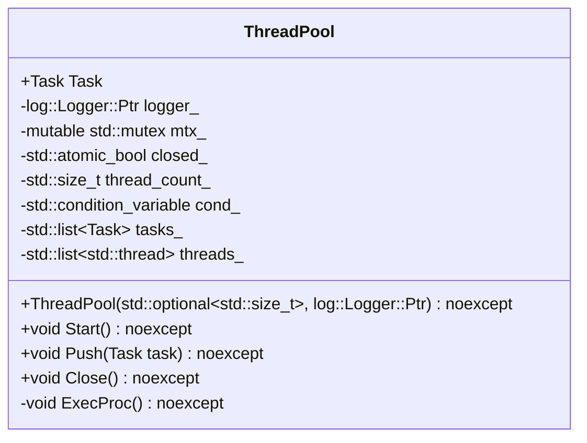
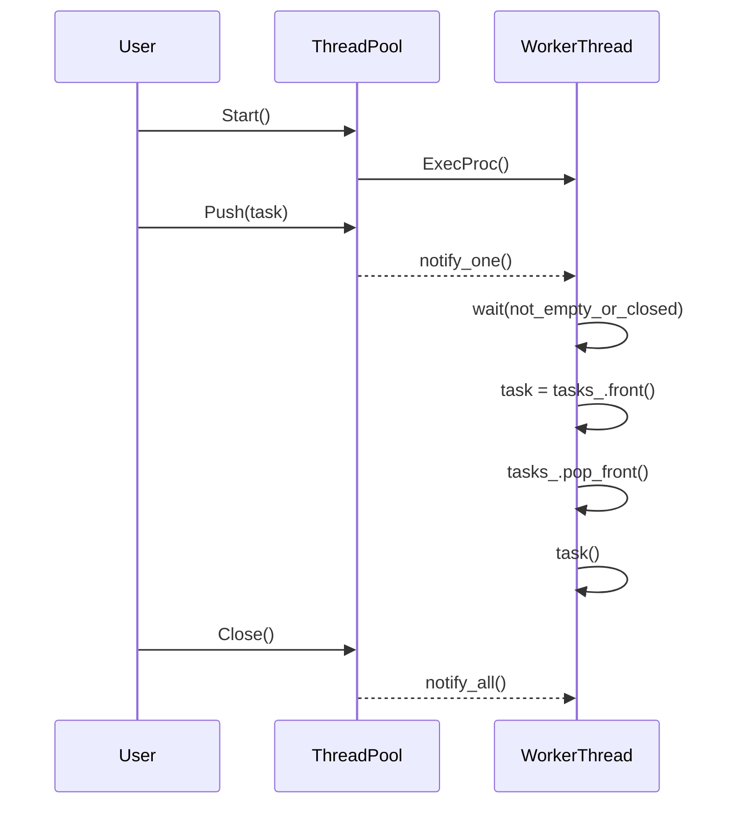

# スレッドプールの設計文書

## 責務
スレッドプールは、与えられたタスクを並列に実行するためのリソース管理を行います。タスクのキューイング、ワーカースレッドの生成と管理、タスクの分配、例外処理などを担当します。

## 公開インターフェース
- `ThreadPool(std::optional<std::size_t> thread_count = std::nullopt, log::Logger::Ptr logger = log::RootLogger()) noexcept`
- `void Start() noexcept`
- `void Push(Task task) noexcept`
- `void Close() noexcept`

## 入力
- スレッド数 (`std::optional<std::size_t>`)
- ロガー (`log::Logger::Ptr`)

## 出力
- なし

## 状態
- `logger_`: タスク実行時のログ出力に使用するロガー。
- `mtx_`: タスクキューへのアクセスを同期するために使用するミューテックス。
- `closed_`: スレッドプールが閉じているかどうかを示すフラグ。
- `thread_count_`: ワーカースレッドの数。
- `cond_`: タスクの追加やスレッドプールのクローズ通知に使用する条件変数。
- `tasks_`: 実行待ちのタスクキュー。
- `threads_`: ワーカースレッドのリスト。

## 処理手順
1. **コンストラクタ**: スレッド数とロガーを初期化します。スレッド数が指定されていない場合は、ハードウェアがサポートする並列スレッド数を使用します。
2. **デストラクタ**: スレッドプールをクローズし、すべてのワーカースレッドを終了させます。
3. **Start()**: ワーカースレッドを生成し、それぞれに `ExecProc` を実行させるように設定します。
4. **Push(Task task)**: タスクキューにタスクを追加し、待機中のワーカースレッドに通知します。
5. **Close()**: スレッドプールをクローズし、すべてのワーカースレッドが終了するまで待ちます。
6. **ExecProc()**: タスクキューからタスクを取り出し実行します。例外が発生した場合はログに出力します。

## 例外・失敗条件
- `Push(Task task)`: スレッドプールがクローズされている場合、アサートで終了します。
- `ExecProc()`: タスクの実行中に例外が発生すると、そのメッセージはロガーに記録されます。

## 依存関係
- `log::Logger`: ログ出力に使用します。
- `std::thread`, `std::mutex`, `std::condition_variable`: スレッド管理と同期に使用します。
- `fmt::format`: エラーメッセージのフォーマットに使用します。

## 重要な不変条件
- `closed_` が `true` のとき、タスクキューは空であるべきです。
- `threads_` 内のすべてのスレッドは終了するまで待つべきです。

## 追加詳細設計情報

### クラス図


### クラス・メソッド・インターフェース詳細
| 名前 | 完全な名前 | 属性 | 引数名と型 | 戻り値型 | 可視性 | const | 参照/ポインタ | static | virtual | noexcept | 型別名 | 列挙型 | 定数 | 直接依存 |
|------|------------|------|------------|-----------|--------|-------|---------------|--------|---------|----------|--------|--------|------|----------|
| ThreadPool | ws::ThreadPool::ThreadPool(std::optional~std::size_t~, log::Logger::Ptr) | コンストラクタ | thread_count, logger | なし | public | いいえ | いいえ | いいえ | いいえ | はい | Task / std::function<void()> | なし | なし | log::Logger::Ptr |
| Start | ws::ThreadPool::Start() | メソッド | なし | なし | public | いいえ | いいえ | いいえ | いいえ | はい | なし | なし | なし | なし |
| Push | ws::ThreadPool::Push(Task task) | メソッド | task | なし | public | いいえ | いいえ | いいえ | いいえ | はい | Task / std::function<void()> | なし | なし | なし |
| Close | ws::ThreadPool::Close() | メソッド | なし | なし | public | いいえ | いいえ | いいえ | いいえ | はい | なし | なし | なし | なし |
| ExecProc | ws::ThreadPool::ExecProc() | メソッド | なし | なし | private | いいえ | いいえ | いいえ | いいえ | はい | Task / std::function<void()> | なし | なし | なし |

### シーケンス図


### メソッド仕様書
#### Start()
- **目的**: スレッドプールを開始し、ワーカースレッドを生成します。
- **引数**: なし
- **戻り値**: なし
- **動作**: `closed_` を `false` に設定し、指定された数のワーカースレッドを生成して `ExecProc` を実行させます。
- **副作用**: ワーカースレッドが生成され、タスクキューからのタスク処理が始まります。

#### Push(Task task)
- **目的**: タスクキューに新しいタスクを追加します。
- **引数**: `task` - 実行すべきタスク
- **戻り値**: なし
- **動作**: タスクキューにタスクを追加し、待機中のワーカースレッドに通知します。
- **例外処理**: スレッドプールがクローズされている場合、アサートで終了します。

#### Close()
- **目的**: スレッドプールを閉じ、すべてのワーカースレッドが終了するまで待ちます。
- **引数**: なし
- **戻り値**: なし
- **動作**: `closed_` を `true` に設定し、待機中のワーカースレッドに通知します。その後、すべてのワーカースレッドが終了するまで待ちます。

#### ExecProc()
- **目的**: タスクキューからタスクを取り出し実行します。
- **引数**: なし
- **戻り値**: なし
- **動作**: タスクキューからタスクを取り出し実行し、例外が発生した場合はログに出力します。
- **副作用**: タスクの実行により外部リソースに影響を与える可能性があります。

### 処理フロー図
```mermaid
graph TD
    A[Start()] --> B{closed_?}
    B -- true --> C[終了]
    B -- false --> D[ワーカースレッド生成]
    D --> E[ExecProc()]
    F[Push(task)] --> G[タスクキューに追加]
    G --> H[notify_one()]
    I[Close()] --> J[closed_ = true]
    J --> K[notify_all()]
    L[ExecProc()] --> M{not_empty_or_closed?}
    M -- false --> N[終了]
    M -- true --> O{closed_?}
    O -- true --> P[終了]
    O -- false --> Q[タスク取り出し]
    Q --> R[task()]
    R --> S{例外発生?}
    S -- いいえ --> T[次のループへ]
    S -- いいえ --> U[ログ出力]
```

### 状態遷移・副作用
| 更新前状態 | 遷移条件 | 変更対象 | 更新後状態 | 更新順序 | 外部資源への副作用 |
|------------|----------|----------|------------|----------|----------------------|
| closed_ = true | Start() 呼び出し | closed_, threads_ | closed_ = false, ワーカースレッド生成 | 1. closed_ = false<br>2. ワーカースレッド生成 | ワーカースレッドの生成 |
| closed_ = false | Push(task) 呼び出し | tasks_, cond_ | タスク追加, 待機ワーカースレッド通知 | 1. タスク追加<br>2. notify_one() | 待機中のワーカースレッドの通知 |
| closed_ = false | Close() 呼び出し | closed_, cond_ | closed_ = true, 待機ワーカースレッド通知 | 1. closed_ = true<br>2. notify_all() | 待機中のワーカースレッドの通知 |
| タスクキューにタスクあり | ExecProc() 呼び出し | tasks_, logger_ | タスク実行, ログ出力 (例外発生時) | 1. タスク取り出し<br>2. task()<br>3. ログ出力 (例外発生時) | タスクの実行結果, ログ出力 |

### データ変換・制約
| 入力データ | 変換規則 | 出力データ | 値域 | 境界値 | 単位 | 精度 | encoding |
|------------|----------|------------|------|--------|------|------|----------|
| thread_count | 指定なし: ハードウェア並列スレッド数使用, 0: ハードウェア並列スレッド数使用 | thread_count_ | 正の整数 | 1以上の正の整数 | 個数 | 整数 | 無し |
| logger | 指定なし: RootLogger() 使用 | logger_ | log::Logger::Ptr | 有効なロガーインスタンス | ロガーインスタンス | 無し | 無し |
| task | タスク関数 | tasks_ | std::function<void()> | 有効なタスク関数 | 関数オブジェクト | 無し | 無し |

この設計文書は、元コードから確認できる事実に基づいて再実装に必要な情報を提供します。