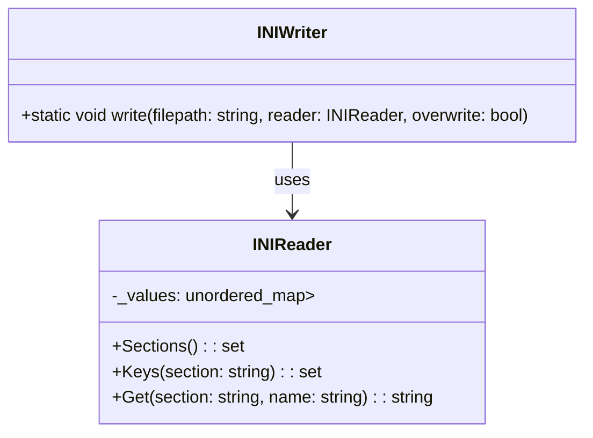

# 設計文書: `INIWriter::write` 関数

## 基本設計項目

### 責務
- `INIReader` オブジェクトの内容を指定されたファイルパスにINI形式で書き出す。
- 既存ファイルの上書きオプションを提供する。

### 公開インターフェース
- `static void write(const std::string& filepath, const INIReader& reader, const bool overwrite = false)`

### 入力
- `filepath`: 出力ファイルのパス (std::string)
- `reader`: 書き出すINIデータを含む `INIReader` オブジェクト (const INIReader&)
- `overwrite`: 既存ファイルを上書きするかどうか (bool, デフォルトはfalse)

### 出力
- 成功時には何も返さない（void）
- 失敗時には `std::runtime_error` をスローする

### 状態
- `_values`: `INIReader` 内部で保持されるセクションとキーのマップ (const std::unordered_map<std::string, std::unordered_map<std::string, std::string>>&)

### 処理手順
1. `overwrite` がfalseの場合、指定されたファイルパスに既存ファイルがないことを確認する。
2. 指定されたファイルパスで出力ファイルを開く。
3. 各セクションとキーのペアをINI形式でファイルに出力する。

### 例外・失敗条件
- `overwrite` がfalseかつ指定されたファイルパスに既存ファイルがある場合、`std::runtime_error` をスローする。
- 出力ファイルを開くことができない場合、`std::runtime_error` をスローする。

### 依存関係
- `INIReader`: INIデータを保持し提供するクラス。
- `std::ifstream`: ファイルの存在確認に使用される。
- `std::ofstream`: 出力ファイルへの書き込みに使用される。

### 重要な不変条件
- 出力ファイルは指定されたパスで開かれるべきである。
- 出力形式はINI形式であるべきである。
- セクションとキーのペアは順序を保って出力されるべきである。

## RAGによる追加詳細設計

### クラス図


### クラス・メソッド・インターフェース詳細

| クラス名 | メソッド名 | 完全な名前 | 引数名と型 | 戻り値型 | 可視性 | const | static |
|----------|------------|------------|------------|----------|--------|-------|--------|
| INIWriter | write      | inih::INIWriter::write | filepath: std::string, reader: const INIReader&, overwrite: bool | void     | public |       | x      |

### シーケンス図
```mermaid
sequenceDiagram
    participant Caller
    participant INIWriter
    participant INIReader
    participant ifstream
    participant ofstream

    Caller->>INIWriter: write(filepath, reader, overwrite)
    alt overwrite is false
        INIWriter->>ifstream: ifstream(filepath)
        alt ifstream.is_open()
            ifstream-->>INIWriter: true
            INIWriter-->>Caller: throw std::runtime_error
        else !ifstream.is_open()
            ifstream-->>INIWriter: false
        end
    end
    INIWriter->>ofstream: ofstream(filepath)
    alt ofstream.is_open()
        ofstream-->>INIWriter: true
        loop for each section in reader.Sections()
            INIWriter->>ofstream: out << "[" + section + "]\n"
            loop for each key in reader.Keys(section)
                INIWriter->>reader: Get(section, key)
                reader-->>INIWriter: value
                INIWriter->>ofstream: out << key << "=" << value << "\n"
            end
        else !ofstream.is_open()
            ofstream-->>INIWriter: false
            INIWriter-->>Caller: throw std::runtime_error
        end
```

### メソッド仕様書

#### 目的
- `INIReader` オブジェクトの内容を指定されたファイルパスにINI形式で書き出す。

#### 引数
- `filepath`: 出力ファイルのパス (std::string)
- `reader`: 書き出すINIデータを含む `INIReader` オブジェクト (const INIReader&)
- `overwrite`: 既存ファイルを上書きするかどうか (bool, デフォルトはfalse)

#### 戻り値
- 成功時には何も返さない（void）

#### 動作
1. `overwrite` がfalseの場合、指定されたファイルパスに既存ファイルがないことを確認する。
2. 指定されたファイルパスで出力ファイルを開く。
3. 各セクションとキーのペアをINI形式でファイルに出力する。

#### エラー処理
- `overwrite` がfalseかつ指定されたファイルパスに既存ファイルがある場合、`std::runtime_error` をスローする。
- 出力ファイルを開くことができない場合、`std::runtime_error` をスローする。

### 処理フロー図
```mermaid
graph TD
    A[開始] --> B{overwrite?}
    B -- false --> C{ifstream(filepath).is_open()?}
    C -- true --> D[throw std::runtime_error]
    C -- false --> E[ofstream(filepath)]
    E --> F{ofstream.is_open()?}
    F -- false --> G[throw std::runtime_error]
    F -- true --> H[for each section in reader.Sections()]
    H --> I[out << "[" + section + "]\n"]
    I --> J[for each key in reader.Keys(section)]
    J --> K[reader.Get(section, key)]
    K --> L[out << key << "=" << value << "\n"]
    L --> M[end for]
    M --> N[end for]
    N --> O[終了]
```

### 状態遷移・副作用

| 更新前状態 | 遷移条件 | 変更対象 | 更新後状態 | 更新順序 | 副作用 |
|------------|----------|----------|------------|----------|--------|
| ファイルが存在しない | overwrite=false | ofstream | ファイルに書き込み | 1. ifstream(filepath).is_open() -> false, 2. ofstream(filepath) | 出力ファイルの作成とデータ書き込み |
| ファイルが存在する   | overwrite=false | -        | -          | -        | std::runtime_errorスロー |
| ファイルが開けない     | -          | ofstream | -          | ofstream(filepath).is_open() -> false | std::runtime_errorスロー |

### データ変換・制約

| 入力データ | 変換規則 | 出力データ | 値域 | 境界値 |
|------------|----------|------------|------|--------|
| filepath   | -        | ofstream(filepath) | 有効なファイルパス | ファイルが存在しない or 上書き可 |
| reader     | INI形式に変換 | 出力ファイル | -      | -      |

この設計文書は、`INIWriter::write` 関数の再実装に必要な詳細情報を提供します。