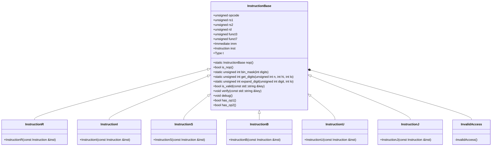

# デザイン文書: Instruction.hpp

## 責務
`Instruction.hpp`は、RISC-Vアーキテクチャの命令を表す構造体とその関連機能を提供します。具体的には、命令の種類（R型、I型、S型、B型、U型、J型）に対応したクラスが定義されており、各命令からフィールド値を抽出し、デバッグ情報を出力する機能も含まれています。

## 公開インターフェース
- `InstructionBase`構造体とその派生クラス（`InstructionR`, `InstructionI`, `InstructionS`, `InstructionB`, `InstructionU`, `InstructionJ`）
- 各命令型のコンストラクタ
- メンバ変数: `opcode`, `rs1`, `rs2`, `rd`, `funct3`, `funct7`, `imm`, `inst`, `t`
- メソッド: `bin_mask`, `get_digits`, `expand_digit`, `is_valid`, `verify`, `debug`, `has_op1`, `has_op2`

## 入力
- 命令コード（`Instruction`型）
- フィールド名（`std::string`型）

## 出力
- 各命令フィールドの値（`unsigned int`や`Immediate`型）
- デバッグ情報（標準出力）

## 状態
- 命令コード (`inst`)
- 命令種類 (`t`)
- 各フィールド値 (`opcode`, `rs1`, `rs2`, `rd`, `funct3`, `funct7`, `imm`)

## 処理手順
1. コンストラクタが呼び出されると、命令コードから各フィールドを抽出しメンバ変数に格納する。
2. フィールドの有効性を確認するために`is_valid`メソッドを使用する。
3. `verify`メソッドでフィールドの有効性を検証し、無効な場合は例外を投げる。
4. `debug`メソッドで命令コードとその種類を標準出力に出力する。

## 例外・失敗条件
- `verify`メソッドが呼び出され、指定されたフィールドが該当の命令型で無効な場合、`InvalidAccess`例外が投げられる。

## 依存関係
- `Common.h`: `Immediate`, `SImmediate`の定義

## 重要な不変条件
- 各命令型のコンストラクタ呼び出し後、該当するフィールド値が正しく設定されていること。
- `verify`メソッドを通じてフィールドの有効性が保証されていること。

## 追加詳細設計情報

### クラス図

### クラス・メソッド・インターフェース詳細
| クラス名         | メンバ名       | 型 / 種別 / 実体                                                                                           |
|------------------|----------------|------------------------------------------------------------------------------------------------------------|
| InstructionBase  | opcode         | unsigned int                                                                                             |
|                  | rs1            | unsigned int                                                                                             |
|                  | rs2            | unsigned int                                                                                             |
|                  | rd             | unsigned int                                                                                             |
|                  | funct3         | unsigned int                                                                                             |
|                  | funct7         | unsigned int                                                                                             |
|                  | imm            | Immediate                                                                                                |
|                  | inst           | Instruction                                                                                              |
|                  | t              | Type (enum)                                                                                              |
|                  | nop()          | static InstructionBase                                                                                   |
|                  | is_nop()       | bool                                                                                                     |
|                  | bin_mask(int digits) | static unsigned int                                                                                  |
|                  | get_digits(unsigned int n, int hi, int lo) | static unsigned int                                                          |
|                  | expand_digit(unsigned int digit, int lo) | static unsigned int                                                            |
|                  | is_valid(const std::string &key) | bool                                                                                   |
|                  | verify(const std::string &key) | void                                                                                     |
|                  | debug()        | void                                                                                                     |
|                  | has_op1()      | bool                                                                                                     |
|                  | has_op2()      | bool                                                                                                     |
| InstructionR     | InstructionR(const Instruction &inst) | コンストラクタ                                                                   |
| InstructionI     | InstructionI(const Instruction &inst) | コンストラクタ                                                                   |
| InstructionS     | InstructionS(const Instruction &inst) | コンストラクタ                                                                   |
| InstructionB     | InstructionB(const Instruction &inst) | コンストラクタ                                                                   |
| InstructionU     | InstructionU(const Instruction &inst) | コンストラクタ                                                                   |
| InstructionJ     | InstructionJ(const Instruction &inst) | コンストラクタ                                                                   |

### シーケンス図
該当なし

### メソッド仕様書
#### `InstructionBase::nop()`
- 目的: NOP命令を表す`InstructionBase`オブジェクトを作成する。
- 引数: なし
- 戻り値: InstructionBase
- 動作: opcode=0b0010011, t=I, inst=-1の`InstructionBase`オブジェクトを返す。

#### `InstructionBase::is_nop()`
- 目的: オブジェクトがNOP命令であるか判定する。
- 引数: なし
- 戻り値: bool
- 動作: inst==-1の場合はtrue、それ以外はfalseを返す。

#### `InstructionBase::bin_mask(int digits)`
- 目的: 指定されたビット幅を持つマスクを作成する。
- 引数: int digits (ビット幅)
- 戻り値: unsigned int
- 動作: (1 << digits) - 1を返す。

#### `InstructionBase::get_digits(unsigned int n, int hi, int lo)`
- 目的: 指定された範囲のビットを取り出す。
- 引数: unsigned int n (抽出元), int hi (上位ビット位置), int lo (下位ビット位置)
- 戻り値: unsigned int
- 動作: (n >> lo) & bin_mask(hi - lo + 1)を返す。

#### `InstructionBase::expand_digit(unsigned int digit, int lo)`
- 目的: 指定されたビット位置から符号拡張する。
- 引数: unsigned int digit (抽出元), int lo (ビット位置)
- 戻り値: unsigned int
- 動作: digit ? (0xffffffff << lo) : 0を返す。

#### `InstructionBase::is_valid(const std::string &key)`
- 目的: 指定されたフィールドが該当の命令型で有効か判定する。
- 引数: const std::string &key (フィールド名)
- 戻り値: bool
- 動作: フィールド名と命令型に応じて有効性を判定し、結果を返す。

#### `InstructionBase::verify(const std::string &key)`
- 目的: 指定されたフィールドが該当の命令型で有効か検証する。
- 引数: const std::string &key (フィールド名)
- 戻り値: void
- 動作: is_valid(key)がfalseの場合、InvalidAccess例外を投げる。

#### `InstructionBase::debug()`
- 目的: オブジェクトの命令コードと種類を標準出力に出力する。
- 引数: なし
- 戻り値: void
- 動作: instの値とopcodeに応じて命令名を出力する。

#### `InstructionBase::has_op1()`
- 目的: 命令がオペランド1を持つか判定する。
- 引数: なし
- 戻り値: bool
- 動作: tがUまたはJでない場合trueを返す。

#### `InstructionBase::has_op2()`
- 目的: 命令がオペランド2を持つか判定する。
- 引数: なし
- 戻り値: bool
- 動作: tがR、S、Bのいずれかの場合trueを返す。

### 処理フロー図
該当なし

### 状態遷移・副作用
| 更新前状態 | 遷移条件         | 変更対象  | 更新後状態 | 更新順序 | 副作用 |
|------------|------------------|-----------|------------|----------|--------|
| 未初期化   | コンストラクタ呼び出し | opcode, rs1, rs2, rd, funct3, funct7, imm, inst, t | 初期値設定済み | -        | なし   |
| 任意       | verify()         | なし      | 例外発生   | -        | InvalidAccess例外 |

### データ変換・制約
| 入力データ     | 変換規則                                                                 | 出力データ    |
|----------------|--------------------------------------------------------------------------|---------------|
| inst           | get_digits, expand_digitを使用して各フィールド値を抽出                     | opcode, rs1, rs2, rd, funct3, funct7, imm |
| key            | is_validでフィールドの有効性を判定                                       | bool          |

この設計文書は、`Instruction.hpp`ファイル内のクラスとメソッドについて再実装に必要な詳細情報を提供します。