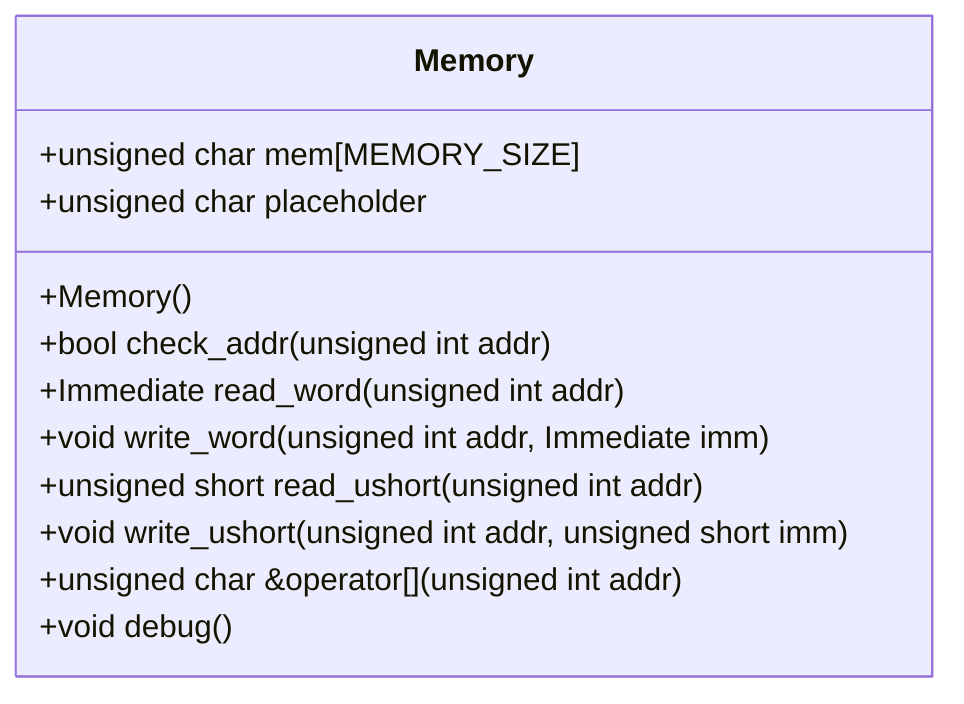
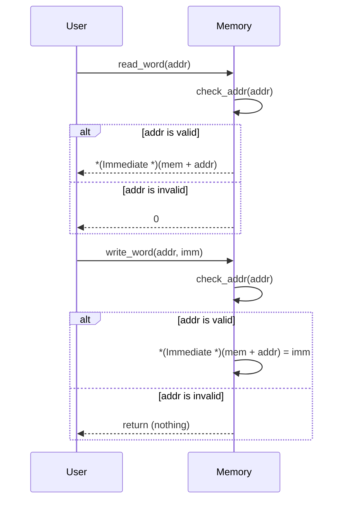

# 設計文書: Memoryクラス

## 責務
- メモリ領域の確保と初期化。
- 指定されたアドレスからデータを読み書きする機能提供。
- アドレス範囲チェック。

## 公開インターフェース
- `Memory()`: コンストラクタ。メモリ領域を0で初期化する。
- `bool check_addr(unsigned int addr)`: 指定されたアドレスが有効かどうかをチェックする。
- `Immediate read_word(unsigned int addr)`: 指定されたアドレスから32ビットのデータを読み込む。
- `void write_word(unsigned int addr, Immediate imm)`: 指定されたアドレスに32ビットのデータを書き込む。
- `unsigned short read_ushort(unsigned int addr)`: 指定されたアドレスから16ビットのデータを読み込む。
- `void write_ushort(unsigned int addr, unsigned short imm)`: 指定されたアドレスに16ビットのデータを書き込む。
- `unsigned char &operator[](unsigned int addr)`: 指定されたアドレスのバイトへの参照を返す。
- `void debug()`: メモリの一部をデバッグ出力する。

## 入力
- `addr`: アドレス値（`unsigned int`型）。
- `imm`: 書き込むデータ（`Immediate`型または`unsigned short`型）。

## 出力
- `bool`: アドレスチェック結果（`check_addr`メソッド）。
- `Immediate`: 読み込んだ32ビットデータ（`read_word`メソッド）。
- `unsigned short`: 読み込んだ16ビットデータ（`read_ushort`メソッド）。

## 状態
- `mem`: メモリ領域（`unsigned char[MEMORY_SIZE]`型）。
- `placeholder`: アドレスチェックに失敗した場合のダミーデータ（`unsigned char`型）。

## 処理手順
1. コンストラクタでメモリ領域を0で初期化する。
2. `check_addr`メソッドでアドレスが有効範囲内かチェックする。
3. `read_word`メソッドで指定されたアドレスから32ビットデータを読み込む。
4. `write_word`メソッドで指定されたアドレスに32ビットデータを書き込む。
5. `read_ushort`メソッドで指定されたアドレスから16ビットデータを読み込む。
6. `write_ushort`メソッドで指定されたアドレスに16ビットデータを書き込む。
7. オペレータ[]を使用して指定されたアドレスのバイトへの参照を返す。
8. `debug`メソッドでメモリの一部をデバッグ出力する。

## 例外・失敗条件
- アドレスが範囲外の場合、読み書き操作は無視され0またはダミーデータが返される。

## 依存関係
- `Common.h`: `Immediate`型の定義。
- `<cstring>`: `memset`関数。
- `<iostream>`: デバッグ出力用。
- `<cassert>`: アサート文（コメントアウトされている）。

## 重要な不変条件
- メモリ領域は常に0で初期化される。
- アドレスチェックが行われ、範囲外のアクセスは無視される。

# 追加詳細設計情報

## クラス図


## クラス・メソッド・インターフェース詳細
| 名前 | 型 | 可視性 | const | 引数 | 戻り値 |
|------|----|--------|-------|------|--------|
| Memory | コンストラクタ | public | - | - | void |
| check_addr | メソッド | public | - | unsigned int addr | bool |
| read_word | メソッド | public | - | unsigned int addr | Immediate |
| write_word | メソッド | public | - | unsigned int addr, Immediate imm | void |
| read_ushort | メソッド | public | - | unsigned int addr | unsigned short |
| write_ushort | メソッド | public | - | unsigned int addr, unsigned short imm | void |
| operator[] | オペレータ | public | - | unsigned int addr | unsigned char & |
| debug | メソッド | public | - | - | void |

## シーケンス図


## メソッド仕様書

### read_word
- **目的**: 指定されたアドレスから32ビットのデータを読み込む。
- **引数**: `unsigned int addr` - 読み込み先のアドレス。
- **戻り値**: `Immediate` - 読み込んだ32ビットデータ。範囲外の場合は0。
- **動作**: アドレスチェックを行い、有効な場合のみメモリからデータを読み込む。
- **副作用**: 無し。

### write_word
- **目的**: 指定されたアドレスに32ビットのデータを書き込む。
- **引数**: `unsigned int addr` - 書き込み先のアドレス。<br>`Immediate imm` - 書き込むデータ。
- **戻り値**: 無し。
- **動作**: アドレスチェックを行い、有効な場合のみメモリにデータを書き込む。
- **副作用**: メモリの更新。

### check_addr
- **目的**: 指定されたアドレスが有効範囲内かチェックする。
- **引数**: `unsigned int addr` - チェック対象のアドレス。
- **戻り値**: `bool` - アドレスが有効な場合はtrue、それ以外はfalse。
- **動作**: アドレスが0からMEMORY_SIZE未満であるかチェックする。
- **副作用**: 無し。

## 処理フロー図
```mermaid
graph TD
    A[開始] --> B{check_addr(addr)?}
    B -- true --> C[データ読み込み/書き込み]
    B -- false --> D[0または無視]
    C --> E[終了]
    D --> E
```

## 状態遷移・副作用
| 更新前状態 | 遷移条件 | 変更対象 | 更新後状態 | 更新順序 | 副作用 |
|------------|----------|----------|------------|----------|--------|
| メモリ初期化済み | アドレス有効 | mem[addr] | 書き込みデータ | 1 | メモリの更新 |
| メモリ初期化済み | アドレス無効 | - | - | - | 無し |

## データ変換・制約
| 入力 | 変換規則 | 出力 | 値域 | 境界値 |
|------|----------|------|------|--------|
| addr | アドレス範囲チェック | bool | 0 <= addr < MEMORY_SIZE | 0, MEMORY_SIZE-1 |
| imm | メモリへの書き込み | mem[addr] | - | - |

この設計文書は、元コードから確認できる事実に基づいて作成され、再実装に必要な詳細情報を提供します。