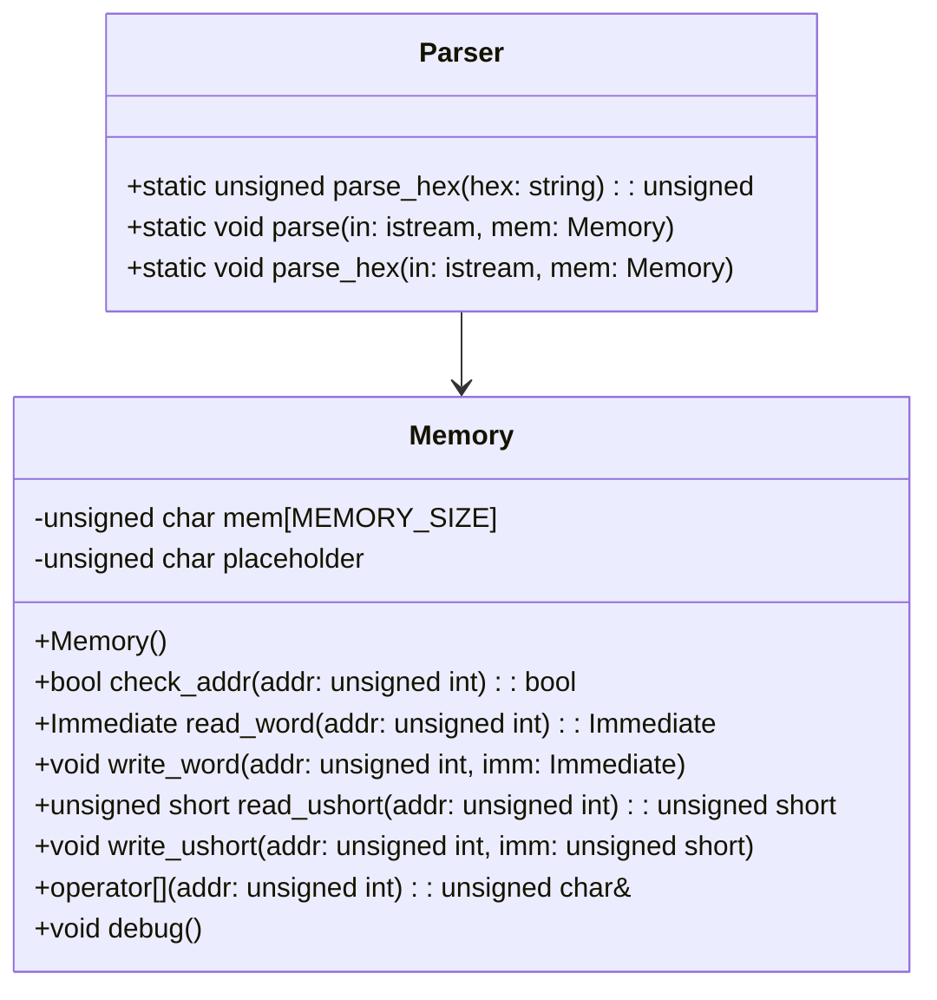
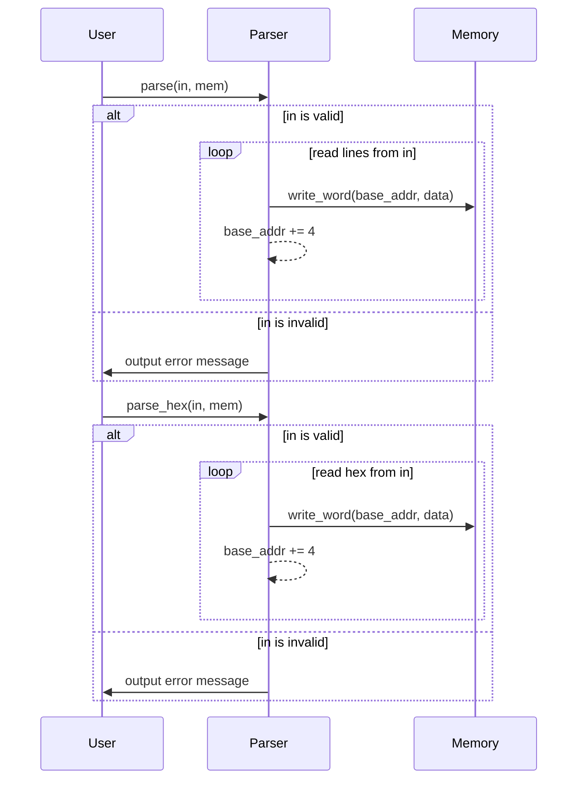

# デザイン文書: Parser クラス

## 責務
`Parser`クラスは、入力ストリームからデータを読み取り、それを指定されたメモリオブジェクトに書き込む責任を持っています。具体的には、16進数形式のデータをパースし、メモリの適切なアドレスに格納します。

## 公開インターフェース
- `static unsigned parse_hex(const std::string &hex)`
- `static void parse(std::istream &in, Memory &mem)`
- `static void parse_hex(std::istream &in, Memory &mem)`

## 入力
- `parse_hex`: 16進数形式の文字列 (`const std::string &hex`)
- `parse`: 入力ストリームとメモリオブジェクト (`std::istream &in`, `Memory &mem`)
- `parse_hex`: 入力ストリームとメモリオブジェクト (`std::istream &in`, `Memory &mem`)

## 出力
- `parse_hex`: 16進数文字列をパースした結果の符号なし整数 (`unsigned`)
- `parse`: メモリオブジェクトへの書き込み (副作用)
- `parse_hex`: メモリオブジェクトへの書き込み (副作用)

## 状態
- `Parser`クラスは静的メソッドのみを使用しており、内部状態を保持しません。

## 処理手順
1. **parse_hex**:
   - 与えられた16進数文字列をパースし、符号なし整数に変換します。
2. **parse**:
   - 入力ストリームから一行ずつ読み取ります。
   - 行の先頭が`@`の場合、その行はベースアドレスとして解釈され、その後のデータ書き込みの開始位置となります。
   - それ以外の行では、16進数文字列をパースし、メモリの現在のベースアドレスに1バイトずつ書き込みます。各データ書き込み後、ベースアドレスはインクリメントされます。
3. **parse_hex**:
   - 入力ストリームから16進数文字列を読み取ります。
   - 各16進数文字列をパースし、メモリの現在のベースアドレスに4バイトずつ書き込みます。各データ書き込み後、ベースアドレスは4インクリメントされます。

## 例外・失敗条件
- 入力ストリームが無効な場合 (`!in`), エラーメッセージを出力します。
- パース対象の16進数文字列が空の場合、処理はスキップされます。

## 依存関係
- `Memory`: データ書き込み先として使用されます。
- `std::istream`: 入力ストリームとして使用されます。
- `std::string`, `std::stringstream`: 文字列操作に使用されます。
- `strtol`: 16進数文字列を整数に変換するために使用されます。

## 重要な不変条件
- メモリへの書き込みは、`Memory`クラスの範囲内に行われます。アドレスチェックが行われます。
- 入力ストリームが無効な場合でも、メモリオブジェクトにデータを書き込むことはありません。

## 追加詳細設計情報

### クラス図


### クラス・メソッド・インターフェース詳細

| クラス名 | メソッド名       | 完全な名前                    | 属性   | 引数名と型                | 戻り値型  | 可視性 | const | 参照/ポインタ | static |
|----------|------------------|-------------------------------|--------|---------------------------|-----------|--------|-------|---------------|--------|
| Parser   | parse_hex        | Parser::parse_hex             | 静的   | hex: const std::string &  | unsigned  | 公開   | あり  | 参照          | あり   |
| Parser   | parse            | Parser::parse                 | 静的   | in: std::istream &, mem: Memory & | void      | 公開   | なし  | リファレンス    | あり   |
| Parser   | parse_hex        | Parser::parse_hex             | 静的   | in: std::istream &, mem: Memory & | void      | 公開   | なし  | リファレンス    | あり   |

### シーケンス図


### メソッド仕様書

#### parse_hex
- **目的**: 16進数形式の文字列をパースし、符号なし整数に変換します。
- **引数**:
  - `hex`: 16進数形式の文字列 (`const std::string &`)
- **戻り値**: パースした結果の符号なし整数 (`unsigned`)
- **動作**: `strtol`を使用して16進数文字列をパースし、その結果を返します。
- **副作用**: なし
- **エラー処理**: 無効な入力に対しては未定義動作

#### parse
- **目的**: 入力ストリームからデータを読み取り、それを指定されたメモリオブジェクトに書き込みます。
- **引数**:
  - `in`: 入力ストリーム (`std::istream &`)
  - `mem`: メモリオブジェクト (`Memory &`)
- **戻り値**: なし
- **動作**:
  - 入力ストリームから一行ずつ読み取ります。
  - 行の先頭が`@`の場合、その行はベースアドレスとして解釈され、その後のデータ書き込みの開始位置となります。
  - それ以外の行では、16進数文字列をパースし、メモリの現在のベースアドレスに1バイトずつ書き込みます。各データ書き込み後、ベースアドレスはインクリメントされます。
- **副作用**: メモリオブジェクトへの書き込み
- **エラー処理**: 入力ストリームが無効な場合、エラーメッセージを出力します。

#### parse_hex
- **目的**: 入力ストリームから16進数形式のデータを読み取り、それを指定されたメモリオブジェクトに書き込みます。
- **引数**:
  - `in`: 入力ストリーム (`std::istream &`)
  - `mem`: メモリオブジェクト (`Memory &`)
- **戻り値**: なし
- **動作**:
  - 入力ストリームから16進数文字列を読み取ります。
  - 各16進数文字列をパースし、メモリの現在のベースアドレスに4バイトずつ書き込みます。各データ書き込み後、ベースアドレスは4インクリメントされます。
- **副作用**: メモリオブジェクトへの書き込み
- **エラー処理**: 入力ストリームが無効な場合、エラーメッセージを出力します。

### 処理フロー図
```mermaid
graph TD
    A[開始] --> B{in is valid?}
    B -- はい --> C[base_addr = 0]
    B -- いいえ --> D[output error message]
    C --> E[read line from in]
    E --> F{line starts with '@'?}
    F -- はい --> G[set base_addr to parsed value]
    F -- いいえ --> H[create stringstream ss(line)]
    G --> I[read hex from ss]
    H --> I
    I --> J{hex is empty?}
    J -- いいえ --> K[parse_hex(hex) -> data]
    J -- はい --> L[end of line]
    K --> M[mem[base_addr++] = data]
    M --> E
    L --> N{more lines in in?}
    N -- はい --> E
    N -- いいえ --> O[終了]
    D --> O
```

### 状態遷移・副作用

| 更新前状態 | 遷移条件         | 変更対象     | 更新後状態 | 更新順序 | 副作用                     |
|------------|------------------|--------------|------------|----------|----------------------------|
| 任意       | in is valid      | base_addr    | パース結果 | 1        | なし                       |
|            |                  | mem          | 書き込み   | 2        | メモリへの書き込み         |
| 任意       | in is invalid    | なし         | なし       | -        | エラーメッセージの出力     |

### データ変換・制約

| 入力データ | 変換規則                     | 出力データ | 値域          |
|------------|------------------------------|------------|---------------|
| hex string | strtol(hex.c_str(), NULL, 16) | unsigned   | 0 ~ UINT_MAX  |
| line       | getline(in, line)            | std::string| 文字列        |
| base_addr  | 基本アドレスの更新           | unsigned   | 0 ~ MEMORY_SIZE |

この設計文書は、`Parser`クラスの再実装に必要な詳細な情報を提供します。各メソッドの動作や依存関係、エラー処理などを明確に記述しています。