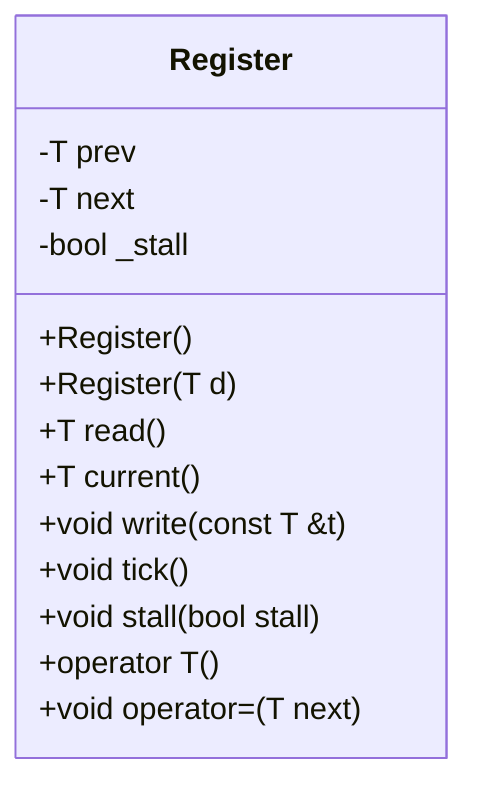
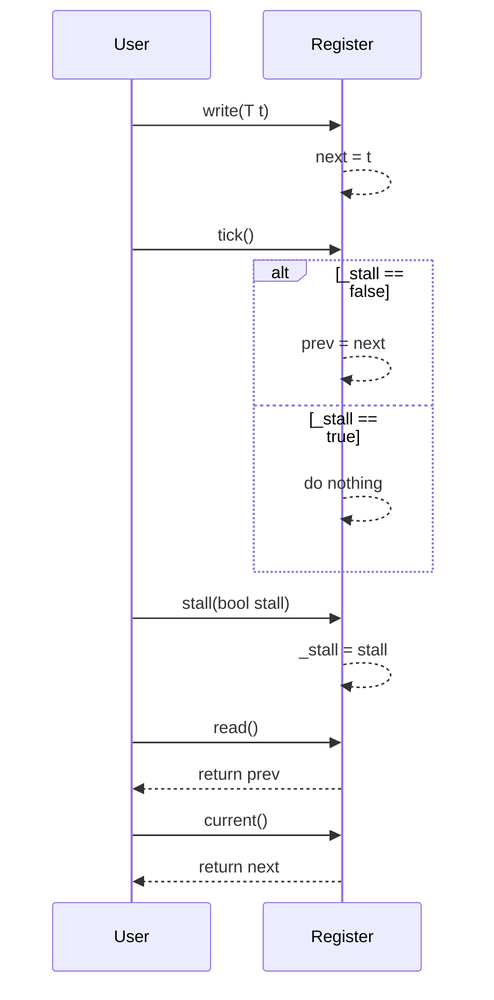

# Register クラスの設計文書

## 責務
`Register`クラスは、ジェネリックな型 `T` の値を保持し、現在の状態と次の状態を管理します。また、ステージングされた値をコミットする機能（tick）や、一時的に更新を停止させる機能（stall）も提供します。

## 公開インターフェース
- `T read()`: 前回の値（prev）を返す。
- `T current()`: 次の値（next）を返す。
- `void write(const T &t)`: 次の値（next）に`t`を設定する。
- `void tick()`: `_stall`がfalseの場合、次の値（next）を前の値（prev）にコミットする。
- `void stall(bool stall)`: 更新の一時停止フラグ（_stall）を設定する。
- `operator T()`: 前回の値（prev）を返すように型変換演算子を定義する。
- `void operator=(T next)`: 次の値（next）に`t`を設定するように代入演算子をオーバーロードする。

## 入力
- `write(const T &t)`メソッド: 型 `T` の値 `t`
- `stall(bool stall)`: 更新の一時停止フラグ `_stall` を制御するためのブール値

## 出力
- `read()`, `current()`, `operator T()`: 型 `T` の値を返す。

## 状態
- `prev`: 前回の値（型 `T`）
- `next`: 次の値（型 `T`）
- `_stall`: 更新の一時停止フラグ（bool）

## 処理手順
1. コンストラクタで初期化: `prev`と`next`をゼロに設定し、`_stall`をfalseに設定する。
2. `write(const T &t)`メソッドが呼ばれた場合: `next`に`t`の値を設定する。
3. `tick()`メソッドが呼ばれた場合:
   - `_stall`がfalseの場合のみ、`prev`に`next`の値を設定する。
4. `stall(bool stall)`メソッドが呼ばれた場合: `_stall`フラグを更新する。

## 例外・失敗条件
- 確認不能

## 依存関係
- 型 `T`: テンプレートパラメータとして使用される型。具体的な型は外部から指定される。
- 標準ライブラリ: 基本的なC++機能を使用しているが、特定の標準ライブラリの依存性は確認不能。

## 重要な不変条件
- `_stall`がtrueの場合、`tick()`メソッドによって`prev`は更新されない。
- `write(const T &t)`メソッドによって設定された値`t`は、次回の`tick()`呼び出し時に`prev`に反映される。

# 追加詳細設計情報

## クラス図


## クラス・メソッド・インターフェース詳細
| メンバ名 | 型 | 可視性 | const | 引数 | 戻り値型 | 说明 |
|----------|----|--------|-------|------|-----------|------|
| prev     | T  | private|       |      |           | 前回の値を保持するメンバ変数 |
| next     | T  | private|       |      |           | 次の値を保持するメンバ変数 |
| _stall   | bool | private|       |      |           | 更新の一時停止フラグ |
| Register() |    | public |       |      | void      | デフォルトコンストラクタ |
| Register(T d) |  | public |       | T d  | void      | 初期値を設定するコンストラクタ |
| read     |    | public | const |      | T         | 前回の値（prev）を返す |
| current  |   | public | const |      | T         | 次の値（next）を返す |
| write    |    | public |       | const T &t | void  | 次の値（next）に`t`を設定する |
| tick     |    | public |       |      | void      | `_stall`がfalseの場合、次の値（next）を前の値（prev）にコミットする |
| stall    |    | public |       | bool stall | void  | 更新の一時停止フラグ（_stall）を設定する |
| operator T() |   | public | const |      | T         | 前回の値（prev）を返すように型変換演算子を定義する |
| operator=  |    | public |       | T next | void     | 次の値（next）に`t`を設定するように代入演算子をオーバーロードする |

## シーケンス図


## メソッド仕様書

### `T read()`
- **目的**: 前回の値（prev）を返す。
- **引数**: 無し
- **戻り値型**: T
- **動作**: `prev`メンバ変数の値を返す。
- **副作用**: 無し

### `T current()`
- **目的**: 次の値（next）を返す。
- **引数**: 無し
- **戻り値型**: T
- **動作**: `next`メンバ変数の値を返す。
- **副作用**: 無し

### `void write(const T &t)`
- **目的**: 次の値（next）に`t`を設定する。
- **引数**: const T &t
- **戻り値型**: void
- **動作**: 引数`t`の値を`next`メンバ変数に設定する。
- **副作用**: `next`が更新される。

### `void tick()`
- **目的**: `_stall`がfalseの場合、次の値（next）を前の値（prev）にコミットする。
- **引数**: 無し
- **戻り値型**: void
- **動作**: `_stall`がfalseの場合のみ、`next`の値を`prev`メンバ変数に設定する。
- **副作用**: `_stall`がfalseの場合、`prev`が更新される。

### `void stall(bool stall)`
- **目的**: 更新の一時停止フラグ（_stall）を設定する。
- **引数**: bool stall
- **戻り値型**: void
- **動作**: 引数`stall`の値を`_stall`メンバ変数に設定する。
- **副作用**: `_stall`が更新される。

### `operator T()`
- **目的**: 前回の値（prev）を返すように型変換演算子を定義する。
- **引数**: 無し
- **戻り値型**: T
- **動作**: `read()`メソッドと同様に`prev`メンバ変数の値を返す。
- **副作用**: 無し

### `void operator=(T next)`
- **目的**: 次の値（next）に`t`を設定するように代入演算子をオーバーロードする。
- **引数**: T next
- **戻り値型**: void
- **動作**: 引数`next`の値を`write()`メソッドを使って`next`メンバ変数に設定する。
- **副作用**: `next`が更新される。

## 処理フロー図
```mermaid
graph TD
    A[コンストラクタ] --> B{stall?}
    B -- true --> C[prev = 0, next = 0, _stall = false]
    B -- false --> C

    D[write(T t)] --> E[next = t]

    F[tick()] --> G{stall?}
    G -- true --> H[do nothing]
    G -- false --> I[prev = next]

    J[stall(bool stall)] --> K[_stall = stall]

    L[read()] --> M[return prev]

    N[current()] --> O[return next]
```

## 状態遷移・副作用
| 更新前状態 | 遷移条件       | 変更対象 | 更新後状態         | 更新順序 | 副作用 |
|------------|----------------|----------|--------------------|----------|--------|
| 任意       | write(T t)     | next     | next = t           | 1        | 無し   |
| 任意       | tick(), stall=false | prev, next | prev = next    | 2        | 無し   |
| 任意       | tick(), stall=true  | なし     | なし               | 3        | 無し   |
| 任意       | stall(bool stall) | _stall   | _stall = stall     | 4        | 無し   |

## データ変換・制約
- `write(T t)`メソッド: 型 `T` の値`t`が`next`に設定される。
- `tick()`メソッド: `_stall`がfalseの場合のみ、`next`の値が`prev`にコピーされる。
- `read()`, `current()`, `operator T()`: `prev`または`next`の値がそのまま返される。