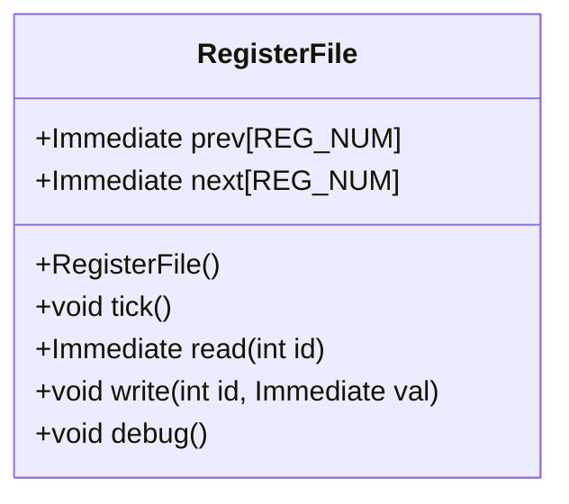
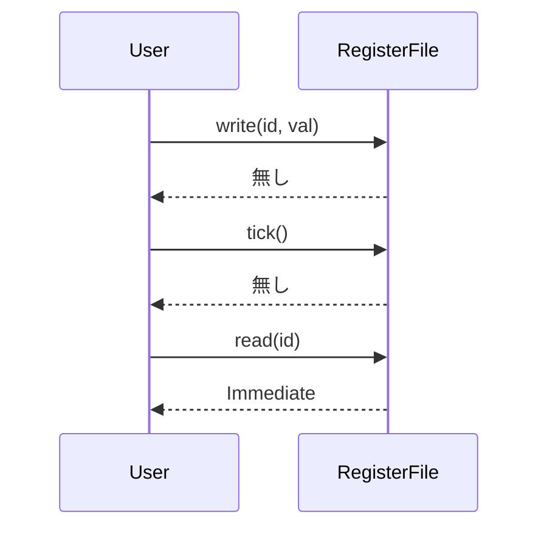

# RegisterFile 設計文書

## 責務
`RegisterFile`クラスは、32個のレジスタを管理し、各レジスタへの読み書き操作を提供します。また、シミュレーションの各サイクルでのレジスタ値の更新（tick）とデバッグ出力機能も提供します。

## 公開インターフェース
- `RegisterFile()`: コンストラクタで全てのレジスタを初期化します。
- `void tick()`: シミュレーションサイクルごとに呼び出し、現在の値を前の値に更新します。
- `Immediate read(int id)`: 指定されたIDのレジスタの前の値を読み出します。ただし、IDが0の場合は常に0を返します。
- `void write(int id, Immediate val)`: 指定されたIDのレジスタに新しい値を書き込みます。
- `void debug()`: レジスタファイルの内容をデバッグ用に出力します。

## 入力
- `int id`: 読み書き対象のレジスタのID（0から31まで）。
- `Immediate val`: 書き込む値。

## 出力
- `Immediate read(int id)`: 指定されたIDのレジスタの前の値を返します。

## 状態
- `prev[REG_NUM]`: 各レジスタの前の値を保持する配列。
- `next[REG_NUM]`: 各レジスタの現在の値を保持する配列。

## 処理手順
1. コンストラクタで`prev`と`next`配列を0で初期化します。
2. `tick()`メソッドが呼び出されると、`next`配列の内容を`prev`配列にコピーします。
3. `read(int id)`メソッドは指定されたIDのレジスタの前の値を返します。ただし、IDが0の場合は常に0を返します。
4. `write(int id, Immediate val)`メソッドは指定されたIDのレジスタに新しい値を書き込みます。
5. `debug()`メソッドはレジスタファイルの内容をフォーマットして標準出力に出力します。

## 例外・失敗条件
- `read(int id)`, `write(int id, Immediate val)`メソッドで`id`が範囲外（0から31以外）の場合、未定義動作となります。ただし、実装上は範囲チェックが行われていません。

## 依存関係
- `Common.h`: `Immediate`型の定義を含む。
- `Register.hpp`: レジスタクラスの定義を含む（ただし、直接使用されていません）。
- `utils.h`: `debug_immediate()`関数の宣言を含む。

## 重要な不変条件
- `prev`と`next`配列は常に32要素を持つ。
- `read(0)`は常に0を返す。

# 追加詳細設計情報

## クラス図


## クラス・メソッド・インターフェース詳細
| 名前 | 型 | 可視性 | const | 引数名と型 | 戻り値型 | 依存関係 |
|------|----|--------|-------|------------|----------|----------|
| RegisterFile | コンストラクタ | public | - | - | void | Common.h, utils.h |
| tick | メソッド | public | - | - | void | - |
| read | メソッド | public | - | int id | Immediate | - |
| write | メソッド | public | - | int id, Immediate val | void | - |
| debug | メソッド | public | - | - | void | utils.h |

## シーケンス図


## メソッド仕様書
### write(int id, Immediate val)
- **目的**: 指定されたIDのレジスタに新しい値を書き込む。
- **引数**:
  - `id`: 書き込み対象のレジスタID（0から31まで）。
  - `val`: 書き込む値。
- **戻り値**: 無し
- **動作**: 指定されたIDの`next`配列に値を書き込む。
- **副作用**: `next[id]`が更新される。

### read(int id)
- **目的**: 指定されたIDのレジスタの前の値を読み出す。
- **引数**:
  - `id`: 読み出し対象のレジスタID（0から31まで）。
- **戻り値**: レジスタの前の値（Immediate型）
- **動作**: 指定されたIDの`prev`配列の値を返す。ただし、IDが0の場合は常に0を返す。
- **副作用**: 無し

### tick()
- **目的**: シミュレーションサイクルごとに呼び出し、現在の値を前の値に更新する。
- **引数**: 無し
- **戻り値**: 無し
- **動作**: `next`配列の内容を`prev`配列にコピーする。
- **副作用**: `prev`配列が更新される。

### debug()
- **目的**: レジスタファイルの内容をデバッグ用に出力する。
- **引数**: 無し
- **戻り値**: 無し
- **動作**: レジスタファイルの内容をフォーマットして標準出力に出力する。
- **副作用**: 標準出力に文字列が出力される。

## 処理フロー図
```mermaid
graph TD
    A[コンストラクタ] --> B{tick()}
    B --> C[memcpy(prev, next, sizeof(prev))]
    C --> D{read(id)}
    D --> E[id == 0?]
    E --はい--> F[return 0]
    E --いいえ--> G[return prev[id]]
    G --> H{write(int id, Immediate val)}
    H --> I[next[id] = val]
    I --> J{debug()}
    J --> K[デバッグ出力処理]
```

## 状態遷移・副作用
| 更新前状態 | 遷移条件 | 変更対象 | 更新後状態 | 更新順序 | 副作用 |
|------------|----------|----------|------------|----------|--------|
| prev, next | tick()   | prev     | nextの値に更新 | 1        | 無し   |
| next       | write(id, val) | next[id] | val      | 1        | 無し   |

## データ変換・制約
| 入力データ | 出力データ | 変換規則 | 値域 | 境界値 |
|------------|------------|----------|------|--------|
| id, val    | prev[id]   | next[id] -> prev[id] | 0から31までの整数 | 0, 31 |
| id         | Immediate  | prev[id]の値を返す | 0から31までの整数 | 0, 31 |