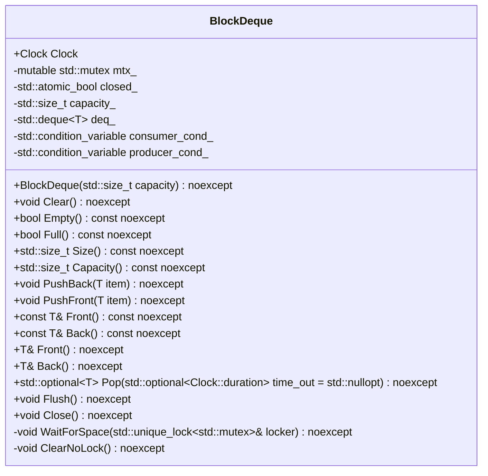
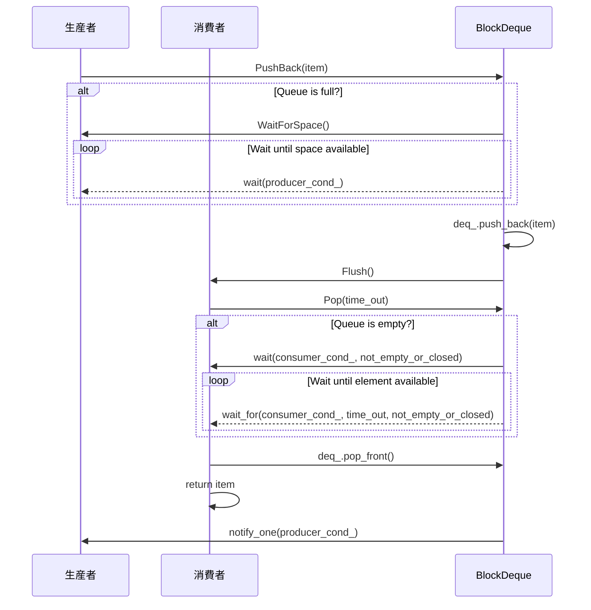

# デザイン文書: block-dequeモジュール

## 責務
`BlockDeque`クラスは、スレッドセーフなブロックデキューを提供します。最大容量を超えた場合の挿入操作は待機し、消費者が要素を取り出すまでブロックされます。

## 公開インターフェース
- `explicit BlockDeque(std::size_t capacity = 1000) noexcept;`
- `void Clear() noexcept;`
- `bool Empty() const noexcept;`
- `bool Full() const noexcept;`
- `std::size_t Size() const noexcept;`
- `std::size_t Capacity() const noexcept;`
- `void PushBack(T item) noexcept;`
- `void PushFront(T item) noexcept;`
- `const T& Front() const noexcept;`
- `const T& Back() const noexcept;`
- `T& Front() noexcept;`
- `T& Back() noexcept;`
- `std::optional<T> Pop(std::optional<Clock::duration> time_out = std::nullopt) noexcept;`
- `void Flush() noexcept;`
- `void Close() noexcept;`

## 入力
- コンストラクタ: 最大容量 (`capacity`)
- `PushBack`, `PushFront`: 追加する要素 (`item`)
- `Pop`: タイムアウト時間 (`time_out`)

## 出力
- `Empty`, `Full`: ブーリアン値
- `Size`, `Capacity`: 要素数や最大容量を表すサイズ型
- `Front`, `Back`: コンテナ内の要素への参照
- `Pop`: オプションでラップされた要素

## 状態
- `mtx_`: ミューテックスオブジェクト (`std::mutex`)
- `closed_`: キューが閉じているかどうかを表すアトミックなブーリアン値 (`std::atomic_bool`)
- `capacity_`: 最大容量 (`std::size_t`)
- `deq_`: 実際のデータ格納用デキュー (`std::deque<T>`)
- `consumer_cond_`, `producer_cond_`: コンシューマとプロデューサのための条件変数 (`std::condition_variable`)

## 処理手順
1. **コンストラクタ**: 最大容量を設定し、アサートで検証。
2. **PushBack, PushFront**: ミューテックスロックを取得し、必要に応じて待機してから要素を追加し、通知する。
3. **Pop**: タイムアウト時間を考慮して待機し、要素を取り出す。キューが閉じている場合は空のオプションを返す。
4. **Clear, ClearNoLock**: データをクリアする。
5. **Close**: キューを閉じて通知する。

## 例外・失敗条件
- `PushBack`, `PushFront`: キューが閉じている場合、挿入操作は待機し続ける。
- `Pop`: タイムアウト時間が経過した場合やキューが閉じている場合は空のオプションを返す。

## 依存関係
- `std::mutex`, `std::condition_variable`, `std::deque`, `std::optional`, `std::chrono`

## 重要な不変条件
- キューのサイズは常に最大容量以下である。
- `closed_`がtrueの場合、新たな要素を追加することはできない。

# 追加詳細設計情報

## クラス図


## クラス・メソッド・インターフェース詳細
| 名前 | 完全な名前 | 属性 | 引数名と型 | 戻り値型 | 可視性 | const | noexcept |
|------|------------|------|------------|----------|--------|-------|----------|
| コンストラクタ | `BlockDeque<T>::BlockDeque(std::size_t capacity)` | - | `capacity` | - | public | - | はい |
| Clear | `void BlockDeque<T>::Clear()` | - | - | void | public | - | はい |
| Empty | `bool BlockDeque<T>::Empty() const` | - | - | bool | public | あり | はい |
| Full | `bool BlockDeque<T>::Full() const` | - | - | bool | public | あり | はい |
| Size | `std::size_t BlockDeque<T>::Size() const` | - | - | std::size_t | public | あり | はい |
| Capacity | `std::size_t BlockDeque<T>::Capacity() const` | - | - | std::size_t | public | あり | はい |
| PushBack | `void BlockDeque<T>::PushBack(T item)` | - | `item` | void | public | - | はい |
| PushFront | `void BlockDeque<T>::PushFront(T item)` | - | `item` | void | public | - | はい |
| Front (const) | `const T& BlockDeque<T>::Front() const` | - | - | const T& | public | あり | はい |
| Back (const) | `const T& BlockDeque<T>::Back() const` | - | - | const T& | public | あり | はい |
| Front (non-const) | `T& BlockDeque<T>::Front()` | - | - | T& | public | - | はい |
| Back (non-const) | `T& BlockDeque<T>::Back()` | - | - | T& | public | - | はい |
| Pop | `std::optional<T> BlockDeque<T>::Pop(std::optional<Clock::duration> time_out)` | - | `time_out` | std::optional~T~ | public | - | はい |
| Flush | `void BlockDeque<T>::Flush()` | - | - | void | public | - | はい |
| Close | `void BlockDeque<T>::Close()` | - | - | void | public | - | はい |
| WaitForSpace | `void BlockDeque<T>::WaitForSpace(std::unique_lock<std::mutex>& locker)` | - | `locker` | void | private | - | はい |
| ClearNoLock | `void BlockDeque<T>::ClearNoLock()` | - | - | void | private | - | はい |

## シーケンス図


## メソッド仕様書

### PushBack
- **目的**: 要素をキューの末尾に追加し、消費者に通知する。
- **引数**: `item` - 追加する要素 (`T`)
- **戻り値**: なし (`void`)
- **動作**: ミューテックスロックを取得し、必要に応じて待機してから要素を追加し、通知する。
- **副作用**: キューの状態が変更される。

### Pop
- **目的**: キューの先頭から要素を取り出す。タイムアウト時間を考慮する。
- **引数**: `time_out` - 最大待ち時間 (`std::optional<Clock::duration>`)
- **戻り値**: 取り出した要素 (`std::optional<T>`)
- **動作**: タイムアウト時間を考慮して待機し、要素を取り出す。キューが閉じている場合は空のオプションを返す。
- **副作用**: キューの状態が変更される。

## 処理フロー図
```mermaid
graph TD
    A[PushBack] --> B{Queue Full?}
    B -- Yes --> C[WaitForSpace]
    C --> D[deq_.push_back(item)]
    D --> E[Flush]
    B -- No --> F[deq_.push_back(item)]
    F --> G[Flush]

    H[Pop] --> I{Queue Empty?}
    I -- Yes --> J[wait(consumer_cond_, not_empty_or_closed)]
    J --> K{closed_?}
    K -- Yes --> L[return std::nullopt]
    K -- No --> M[deq_.pop_front()]
    M --> N[notify_one(producer_cond_)]
    N --> O[return item]
    I -- No --> P[deq_.pop_front()]
    P --> Q[notify_one(producer_cond_)]
    Q --> R[return item]
```

## 状態遷移・副作用
| 更新前状態 | 遷移条件 | 変更対象 | 更新後状態 | 更新順序 | 副作用 |
|------------|----------|----------|------------|----------|--------|
| 任意       | PushBack | deq_     | 要素追加   | 1        | Flush() |
|            |          | producer_cond_ | notify_one | 2        | -      |
| 任意       | Pop      | deq_     | 要素削除   | 1        | notify_one(producer_cond_) |
|            |          | consumer_cond_ | wait_for or wait | 2        | -      |

## データ変換・制約
- `PushBack`, `PushFront`: 追加する要素 (`T`) -> 内部デキュー (`std::deque<T>`)
- `Pop`: 内部デキュー (`std::deque<T>`) -> 取り出した要素 (`std::optional<T>`)
- キューのサイズは常に最大容量以下である。
- `closed_`がtrueの場合、新たな要素を追加することはできない。

# Machine-extracted Source-local Implementation Contract

This appendix is deterministic evidence extracted from the target source.
It is not an LLM summary and it does not contain complete function bodies.

During regeneration:
- preserve the exact local declaration types, containers, initializers, and literals listed below;
- preserve the exact call targets and argument expressions listed below;
- do not substitute a different representation or accessor merely because it looks similar;
- treat these items as exact constraints, not as pseudocode suggestions.

## Exact local declarations

- `const std::lock_guard locker {mtx_};`
- `const auto size {this->Size()};`
- `std::unique_lock locker {mtx_};`
- `const auto not_empty_or_closed {[this]() noexcept { // Consumer threads may not have started to wait when closing the deque. // If a close notification has been sent before they wait, // the condition variable will permanently block the thread. // So we should check if the queue has been closed when waiting. return !deq_.empty() || closed_; }};`
- `const auto item {deq_.front()};`

## Exact top-level call expressions

- `assert(capacity > 0)`
- `Close()`
- `deq_.empty()`
- `this->Size()`
- `assert(size <= capacity_)`
- `deq_.size()`
- `ClearNoLock()`
- `producer_cond_.notify_all()`
- `consumer_cond_.notify_all()`
- `deq_.clear()`
- `consumer_cond_.notify_one()`
- `WaitForSpace(locker)`
- `deq_.push_back(std::move(item))`
- `Flush()`
- `deq_.push_front(std::move(item))`
- `assert(!deq_.empty())`
- `deq_.front()`
- `deq_.back()`
- `const_cast<T&>(std::as_const(*this).Front())`
- `const_cast<T&>(std::as_const(*this).Back())`
- `time_out.has_value()`
- `consumer_cond_.wait_for(locker, *time_out, not_empty_or_closed)`
- `consumer_cond_.wait(locker, not_empty_or_closed)`
- `deq_.pop_front()`
- `producer_cond_.notify_one()`
- `producer_cond_.wait(locker, [this]() { return deq_.size() < capacity_; })`

# Machine-extracted Dependency API Contract

This appendix is deterministic evidence derived from the selected repository context and target-source usages.
It is not an LLM summary.

During regeneration:
- preserve the exact dependency declarations and call patterns listed below;
- do not invent replacement APIs, member functions, overloads, or adapters;
- preserve return types, parameter types, defaults, qualifiers, and argument expressions as written;
- do not consume a void return value as a value.
