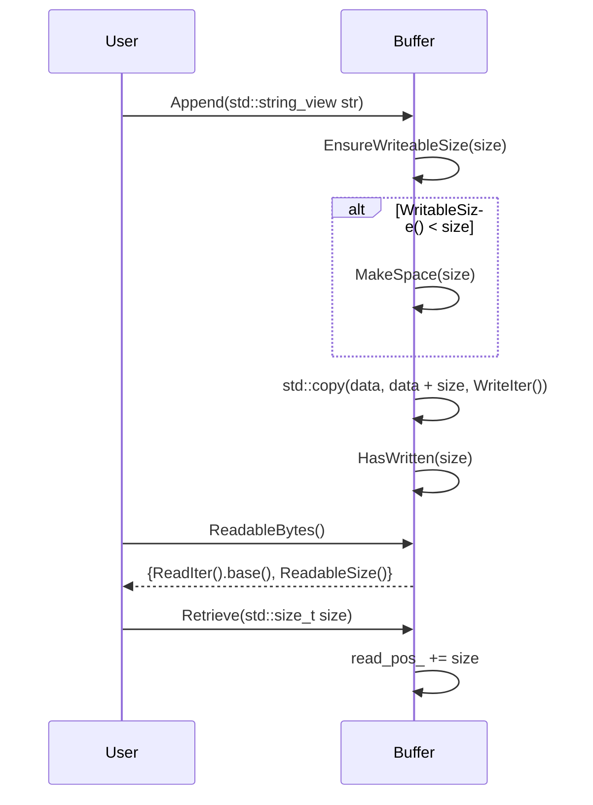

# デザイン文書

## 責務
- `Buffer`クラス: 自動拡張可能なバッファを提供し、バイトや文字列の読み書きを行う。
- `IOBuffer`クラス: `Buffer`クラスを継承して、I/Oオブジェクトとのデータ交換機能を追加する。

## 公開インターフェース
### Buffer クラス
| メソッド名 | 引数 | 戻り値型 | 説明 |
| --- | --- | --- | --- |
| `Buffer` (コンストラクタ) | `std::size_t size = 1000` | - | 初期サイズでバッファを作成する。 |
| `Buffer` (コンストラクタ) | `std::span<const std::byte> bytes` | - | バイト列からバッファを作成する。 |
| `Buffer` (コンストラクタ) | `std::initializer_list<std::byte> bytes` | - | 初期化リストからバッファを作成する。 |
| `Buffer` (コンストラクタ) | `std::string_view str` | - | 文字列からバッファを作成する。 |
| `WritableSize` | - | `std::size_t` | 書き込み可能なサイズを返す。 |
| `ReadableSize` | - | `std::size_t` | 読み取り可能なサイズを返す。 |
| `Peek` | - | `std::optional<std::byte>` | 最初のバイトを読み取るが、オフセットは進めない。 |
| `ReadableBytes` | - | `std::span<const std::byte>` | 読み取り可能なバイト列を返す。 |
| `ReadableString` | - | `std::string` | 読み取り可能な文字列を返す。 |
| `WritableBytes` | - | `std::span<std::byte>` | 書き込み可能なスペースを返す。 |
| `Append` | `std::span<const std::byte> bytes` | - | バッファにバイト列を追加する。 |
| `Append` | `std::initializer_list<std::byte> bytes` | - | バッファに初期化リストからバイト列を追加する。 |
| `Append` | `std::string_view str, std::optional<NewLine> new_line = std::nullopt` | - | 文字列とオプションの改行文字を追加する。 |
| `Append` | `const void* data, std::size_t size` | - | バッファにデータを追加する。 |
| `Append` | `const Buffer& buf` | - | 他のバッファからデータを追加する。 |
| `EnsureWriteableSize` | `std::size_t size` | - | 書き込み可能なスペースが十分になるまで拡張する。 |
| `HasWritten` | `std::size_t size` | - | 書き込みオフセットを進める。 |
| `Retrieve` | `std::size_t size` | - | 読み取りオフセットを進める。 |
| `RetrieveUntil` | `const void* addr` | `std::size_t` | 指定したアドレスまで読み取りオフセットを進める。 |
| `RetrieveAll` | - | `std::size_t` | 読み取りオフセットを最後まで進めて、読み取ったサイズを返す。 |
| `RetrieveAllToString` | - | `std::string` | 全てのデータを文字列として取得し、バッファをクリアする。 |
| `Clear` | - | - | バッファをクリアする。 |
| `Empty` | - | `bool` | バッファが空かどうかを返す。 |

### IOBuffer クラス
| メソッド名 | 引数 | 戻り値型 | 説明 |
| --- | --- | --- | --- |
| `ReadFrom` | `io::IReadWriter& io` | `std::size_t` | I/Oオブジェクトからデータを読み込む。 |
| `WriteTo` | `io::IReadWriter& io` | `std::size_t` | データをI/Oオブジェクトに書き込む。 |

### グローバル演算子
| 演算子 | 引数 | 戻り値型 | 説明 |
| --- | --- | --- | --- |
| `operator<<` | `Buffer& buf, std::string_view str` | `Buffer&` | 文字列をバッファに追加する。 |
| `operator<<` | `Buffer& to, const Buffer& from` | `Buffer&` | 他のバッファからデータを追加する。 |
| `operator<<` | `Buffer& buf, std::span<const std::byte> bytes` | `Buffer&` | バイト列をバッファに追加する。 |
| `operator<<` | `Buffer& buf, std::initializer_list<std::byte> bytes` | `Buffer&` | 初期化リストからバイト列をバッファに追加する。 |

## 入力
- バイト列 (`std::span<const std::byte>` または `std::initializer_list<std::byte>`)
- 文字列 (`std::string_view`)
- I/Oオブジェクト (`io::IReadWriter&`)

## 出力
- バッファの読み取り可能なバイト列 (`std::span<const std::byte>`)
- バッファの読み取り可能な文字列 (`std::string`)
- 書き込み可能なスペース (`std::span<std::byte>`)
- 読み取りオフセットや書き込みオフセットの進んだサイズ (`std::size_t`)

## 状態
- `buf_`: バッファを保持する `std::vector<std::byte>`
- `read_pos_`: 読み取り位置を示す `std::atomic<std::size_t>`
- `write_pos_`: 書き込み位置を示す `std::atomic<std::size_t>`

## 処理手順
1. バッファの初期化: コンストラクタでバッファサイズを設定し、読み取り/書き込みオフセットを初期化する。
2. データ追加: `Append`メソッドを使用してデータをバッファに追加する。必要に応じてバッファの拡張を行う。
3. データ読み取り: `ReadableBytes`, `ReadableString`メソッドを使用してデータを読み取る。読み取りオフセットは進める。
4. オフセット操作: `HasWritten`, `Retrieve`, `RetrieveUntil`, `RetrieveAll`メソッドを使用して読み取り/書き込みオフセットを操作する。
5. バッファクリア: `Clear`メソッドを使用してバッファをクリアする。

## 例外・失敗条件
- `Append`: 書き込み可能なスペースが不足している場合、自動的に拡張される。ただし、メモリ確保に失敗した場合は未定義動作となる。
- `Retrieve`, `RetrieveUntil`: 読み取り可能なサイズを超えてオフセットを進める場合、assertionが発生する。

## 依存関係
- `std::atomic`
- `std::optional`
- `std::span`
- `std::string`
- `std::string_view`
- `std::vector`
- `io::IReadWriter` (IOBufferクラスのみ)

## 重要な不変条件
- 読み取りオフセットは常に書き込みオフセット以下である。
- バッファのサイズは読み取り/書き込みオフセットを超えていない。

# 追加詳細設計情報

## クラス図
```mermaid
classDiagram
    class Buffer {
        +Buffer(std::size_t size = 1000) noexcept
        +Buffer(std::span<const std::byte> bytes) noexcept
        +Buffer(std::initializer_list<std::byte> bytes) noexcept
        +Buffer(std::string_view str) noexcept
        +Buffer(const Buffer&) noexcept
        +Buffer(Buffer&&) noexcept
        +Buffer& operator=(const Buffer&) noexcept
        +Buffer& operator=(Buffer&&) noexcept
        +std::size_t WritableSize() const noexcept
        +std::size_t ReadableSize() const noexcept
        +std::optional<std::byte> Peek() const noexcept
        +std::span<const std::byte> ReadableBytes() const noexcept
        +std::string ReadableString() const noexcept
        +std::span<std::byte> WritableBytes() const noexcept
        +void Append(std::span<const std::byte> bytes) noexcept
        +void Append(std::initializer_list<std::byte> bytes) noexcept
        +void Append(std::string_view str, std::optional<NewLine> new_line = std::nullopt) noexcept
        +void Append(const void* data, std::size_t size) noexcept
        +void Append(const Buffer& buf) noexcept
        +void EnsureWriteableSize(std::size_t size) noexcept
        +void HasWritten(std::size_t size) noexcept
        +void Retrieve(std::size_t size) noexcept
        +std::size_t RetrieveUntil(const void* addr) noexcept
        +std::size_t RetrieveAll() noexcept
        +std::string RetrieveAllToString() noexcept
        +void Clear() noexcept
        +bool Empty() const noexcept
        -std::size_t PrependableSize() const noexcept
        -void MakeSpace(std::size_t size) noexcept
        -std::vector<std::byte>::iterator ReadIter() const noexcept
        -std::vector<std::byte>::iterator WriteIter() const noexcept
        -std::vector<std::byte> buf_
        -std::atomic<std::size_t> read_pos_ {0}
        -std::atomic<std::size_t> write_pos_ {0}
    }
    
    class IOBuffer {
        +IOBuffer()
        +std::size_t ReadFrom(io::IReadWriter& io)
        +std::size_t WriteTo(io::IReadWriter& io)
    }

    Buffer <|-- IOBuffer
```

## クラス・メソッド・インターフェース詳細

### Buffer クラス
| メソッド名 | 引数 | 戻り値型 | 説明 |
| --- | --- | --- | --- |
| `Buffer` (コンストラクタ) | `std::size_t size = 1000` | - | 初期サイズでバッファを作成する。 |
| `Buffer` (コンストラクタ) | `std::span<const std::byte> bytes` | - | バイト列からバッファを作成する。 |
| `Buffer` (コンストラクタ) | `std::initializer_list<std::byte> bytes` | - | 初期化リストからバッファを作成する。 |
| `Buffer` (コンストラクタ) | `std::string_view str` | - | 文字列からバッファを作成する。 |
| `WritableSize` | - | `std::size_t` | 書き込み可能なサイズを返す。 |
| `ReadableSize` | - | `std::size_t` | 読み取り可能なサイズを返す。 |
| `Peek` | - | `std::optional<std::byte>` | 最初のバイトを読み取るが、オフセットは進めない。 |
| `ReadableBytes` | - | `std::span<const std::byte>` | 読み取り可能なバイト列を返す。 |
| `ReadableString` | - | `std::string` | 読み取り可能な文字列を返す。 |
| `WritableBytes` | - | `std::span<std::byte>` | 書き込み可能なスペースを返す。 |
| `Append` | `std::span<const std::byte> bytes` | - | バッファにバイト列を追加する。 |
| `Append` | `std::initializer_list<std::byte> bytes` | - | バッファに初期化リストからバイト列を追加する。 |
| `Append` | `std::string_view str, std::optional<NewLine> new_line = std::nullopt` | - | 文字列とオプションの改行文字を追加する。 |
| `Append` | `const void* data, std::size_t size` | - | バッファにデータを追加する。 |
| `Append` | `const Buffer& buf` | - | 他のバッファからデータを追加する。 |
| `EnsureWriteableSize` | `std::size_t size` | - | 書き込み可能なスペースが十分になるまで拡張する。 |
| `HasWritten` | `std::size_t size` | - | 書き込みオフセットを進める。 |
| `Retrieve` | `std::size_t size` | - | 読み取りオフセットを進める。 |
| `RetrieveUntil` | `const void* addr` | `std::size_t` | 指定したアドレスまで読み取りオフセットを進める。 |
| `RetrieveAll` | - | `std::size_t` | 読み取りオフセットを最後まで進めて、読み取ったサイズを返す。 |
| `RetrieveAllToString` | - | `std::string` | 全てのデータを文字列として取得し、バッファをクリアする。 |
| `Clear` | - | - | バッファをクリアする。 |
| `Empty` | - | `bool` | バッファが空かどうかを返す。 |

### IOBuffer クラス
| メソッド名 | 引数 | 戻り値型 | 説明 |
| --- | --- | --- | --- |
| `ReadFrom` | `io::IReadWriter& io` | `std::size_t` | I/Oオブジェクトからデータを読み込む。 |
| `WriteTo` | `io::IReadWriter& io` | `std::size_t` | データをI/Oオブジェクトに書き込む。 |

### グローバル演算子
| 演算子 | 引数 | 戻り値型 | 説明 |
| --- | --- | --- | --- |
| `operator<<` | `Buffer& buf, std::string_view str` | `Buffer&` | 文字列をバッファに追加する。 |
| `operator<<` | `Buffer& to, const Buffer& from` | `Buffer&` | 他のバッファからデータを追加する。 |
| `operator<<` | `Buffer& buf, std::span<const std::byte> bytes` | `Buffer&` | バイト列をバッファに追加する。 |
| `operator<<` | `Buffer& buf, std::initializer_list<std::byte> bytes` | `Buffer&` | 初期化リストからバイト列をバッファに追加する。 |

## シーケンス図


## メソッド仕様書

### Append (std::string_view str, std::optional<NewLine> new_line = std::nullopt)
- **目的**: 文字列とオプションの改行文字をバッファに追加する。
- **引数**:
  - `str`: 追加する文字列 (`std::string_view`)
  - `new_line`: 追加する改行文字 (`std::optional<NewLine>`)
- **戻り値**: 無し
- **動作**:
  1. 文字列をコピーして新しい文字列を作成。
  2. 改行文字が指定されている場合は、該当する改行文字を追加する。
  3. 新しい文字列のデータとサイズをバッファに追加する。
- **副作用**: バッファの内容が更新される。書き込みオフセットが進む。
- **エラー処理**: 無し

### ReadableBytes
- **目的**: 読み取り可能なバイト列を取得する。
- **引数**: 無し
- **戻り値**: `std::span<const std::byte>`
- **動作**:
  1. 読み取りオフセットと読み取り可能なサイズからスパンを作成して返す。
- **副作用**: 無し
- **エラー処理**: 無し

## 処理フロー図
```mermaid
graph TD
    A[Append] --> B{WritableSize() < size?}
    B -- Yes --> C[MakeSpace(size)]
    B -- No --> D[std::copy(data, data + size, WriteIter())]
    C --> E[HasWritten(size)]
    D --> E
    E --> F[return]
```

## 状態遷移・副作用

| 更新前状態 | 遷移条件 | 変更対象 | 更新後状態 | 更新順序 | 副作用 |
| --- | --- | --- | --- | --- | --- |
| バッファに十分なスペースがない | `WritableSize() < size` | バッファサイズ | 拡張後のバッファサイズ | 1. MakeSpace(size) 2. std::copy(data, data + size, WriteIter()) 3. HasWritten(size) | バッファのメモリ確保 |
| バッファに十分なスペースがある | `WritableSize() >= size` | 書き込み位置 | 更新後の書き込み位置 | 1. std::copy(data, data + size, WriteIter()) 2. HasWritten(size) | バッファへのデータ追加 |

## データ変換・制約

| 入力 | 出力 | 変換規則 | 値域 | 境界値 |
| --- | --- | --- | --- | --- |
| `std::string_view` | `std::vector<std::byte>` | 文字列をバイト列に変換 | 任意の文字列 | 空文字列 |
| `std::optional<NewLine>` | 追加される改行文字 | オプション値に基づいて改行文字を選択 | LF, CRLF, nullopt | nullopt |

この設計文書は、元コードから確認できる事実を基に再実装に必要な情報を提供します。