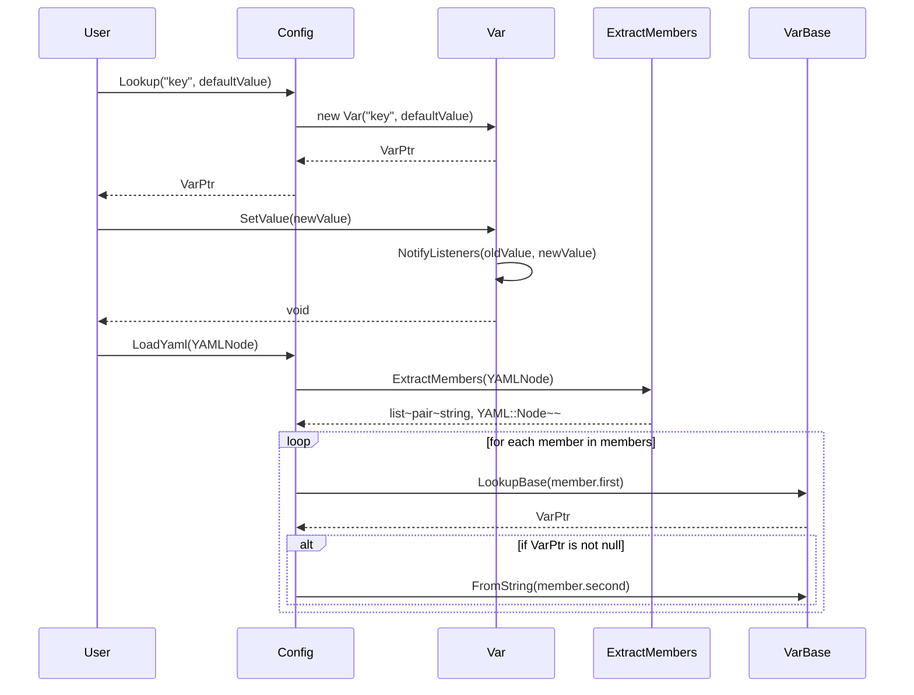

# 設計文書

## 責務
- `config.h`と`config.cpp`は、YAML形式の設定ファイルを読み取り、内部データ構造に変換し、その値を管理するためのモジュールです。
- 各種型に対する変数変換器（`VarConverter`）を提供します。
- 設定変数（`Var`）と設定全体（`Config`）のクラスを定義し、それらの操作を提供します。

## 公開インターフェース
### クラス・メソッド詳細

| クラス/構造体 | メンバ名 | 型 | 可視性 | const | 引数 | 戻り値型 | 例外 |
|---------------|----------|----|--------|-------|------|---------|------|
| VarConverter<From, To> | operator() | `To` | public | yes | `const From& val` | `To` | - |
| VarConverter<From, std::string> | operator() | `std::string` | public | yes | `const From& val` | `std::string` | - |
| VarConverter<std::string, std::string> | operator() | `std::string` | public | yes | `const std::string_view val` | `std::string` | - |
| VarConverter<std::string, To> | operator() | `To` | public | no | `const std::string_view str` | `To` | `std::invalid_argument` |
| VarConverter<std::string, std::list<T>> | operator() | `std::list<T>` | public | no | `const std::string_view str` | `std::list<T>` | `std::invalid_argument` |
| VarConverter<std::list<T>, std::string> | operator() | `std::string` | public | yes | `const std::list<T>& vals` | `std::string` | - |
| VarConverter<std::string, std::vector<T>> | operator() | `std::vector<T>` | public | no | `const std::string_view str` | `std::vector<T>` | - |
| VarConverter<std::vector<T>, std::string> | operator() | `std::string` | public | yes | `const std::vector<T>& vals` | `std::string` | - |
| VarConverter<std::string, std::set<T>> | operator() | `std::set<T>` | public | no | `const std::string_view str` | `std::set<T>` | - |
| VarConverter<std::set<T>, std::string> | operator() | `std::string` | public | yes | `const std::set<T>& vals` | `std::string` | - |
| VarConverter<std::string, std::unordered_set<T>> | operator() | `std::unordered_set<T>` | public | no | `const std::string_view str` | `std::unordered_set<T>` | - |
| VarConverter<std::unordered_set<T>, std::string> | operator() | `std::string` | public | yes | `const std::unordered_set<T>& vals` | `std::string` | - |
| VarConverter<std::string, std::map<std::string, T>> | operator() | `std::map<std::string, T>` | public | no | `const std::string_view str` | `std::map<std::string, T>` | `std::invalid_argument` |
| VarConverter<std::map<std::string, T>, std::string> | operator() | `std::string` | public | yes | `const std::map<std::string, T>& vals` | `std::string` | - |
| VarConverter<std::string, std::unordered_map<std::string, T>> | operator() | `std::unordered_map<std::string, T>` | public | no | `const std::string_view str` | `std::unordered_map<std::string, T>` | - |
| VarConverter<std::unordered_map<std::string, T>, std::string> | operator() | `std::string` | public | yes | `const std::unordered_map<std::string, T>& vals` | `std::string` | - |
| VarBase | VarBase | コンストラクタ | public | no | `std::string_view name`, `std::string_view description = ""` | - | - |
| VarBase | ~VarBase | デストラクタ | public | yes | - | - | - |
| VarBase | Name | `std::string_view` | public | yes | - | `std::string_view` | - |
| VarBase | Description | `std::string_view` | public | yes | - | `std::string_view` | - |
| VarBase | ToString | `std::string` | public | yes | - | `std::string` | - |
| VarBase | FromString | void | public | no | `std::string_view str` | - | - |
| Var<T, FromStr, ToStr> | Var | コンストラクタ | public | no | `const std::string_view name`, `const T& default_val`, `const std::string_view description = ""` | - | - |
| Var<T, FromStr, ToStr> | ToString | `std::string` | public | yes | - | `std::string` | - |
| Var<T, FromStr, ToStr> | FromString | void | public | no | `std::string_view str` | - | - |
| Var<T, FromStr, ToStr> | GetValue | `T` | public | yes | - | `T` | - |
| Var<T, FromStr, ToStr> | SetValue | void | public | no | `const T& val` | - | - |
| Var<T, FromStr, ToStr> | TypeName | `std::string_view` | public | yes | - | `std::string_view` | - |
| Var<T, FromStr, ToStr> | RemoveListener | void | public | no | `const std::uint64_t key` | - | - |
| Var<T, FromStr, ToStr> | AddListener | `std::uint64_t` | public | no | `OnChange listener` | `std::uint64_t` | - |
| Var<T, FromStr, ToStr> | ClearListeners | void | public | no | - | - | - |
| Config | Config | コンストラクタ | public | no | `std::string_view name` | - | - |
| Config | Name | `std::string_view` | public | yes | - | `std::string_view` | - |
| Config | Lookup<T> (オーバーロード1) | `typename Var<T>::Ptr` | public | no | `const std::string_view name`, `const T& default_val`, `const std::string_view description = ""` | `typename Var<T>::Ptr` | - |
| Config | Lookup<T> (オーバーロード2) | `typename Var<T>::Ptr` | public | no | `const std::string_view name` | `typename Var<T>::Ptr` | `std::invalid_argument` |
| Config | LookupBase | `VarBase::Ptr` | public | yes | `std::string_view name` | `VarBase::Ptr` | - |
| Config | LoadYaml | void | public | no | `const YAML::Node& root` | - | - |
| Config | Visit | void | public | no | `std::function<void(VarBase::Ptr)> visitor` | - | - |
| (グローバル) | RootConfig | `Config::Ptr` | public | yes | - | `Config::Ptr` | - |

## 入力
- YAML形式の設定データ（`YAML::Node`）
- 設定変数名とそのデフォルト値

## 出力
- 変換された設定値（`std::string`, `T`, `std::list<T>`, `std::vector<T>`, `std::set<T>`, `std::unordered_set<T>`, `std::map<std::string, T>`, `std::unordered_map<std::string, T>`）
- 設定変数のポインタ（`VarBase::Ptr`, `typename Var<T>::Ptr`）

## 状態
- `VarBase`: 名前、説明文
- `Var<T, FromStr, ToStr>`: 値、リスナー集合
- `Config`: 設定名、変数マップ

## 処理手順
1. **設定変数の作成と管理**:
   - `Var`オブジェクトを作成し、デフォルト値を設定する。
   - 変数名と説明文を保持する。

2. **設定変数の値変換**:
   - 文字列から型に変換する（`FromString`）。
   - 型から文字列に変換する（`ToString`）。

3. **設定変数の検索と更新**:
   - 変数名で設定変数を検索し、存在しない場合は新規作成する（`Lookup`）。
   - 既存の設定変数の値をYAMLノードから読み込む（`LoadYaml`）。

4. **リスナー管理**:
   - 値が変更されたときに呼び出されるリスナーを追加・削除する（`AddListener`, `RemoveListener`, `ClearListeners`）。

5. **設定の訪問**:
   - すべての設定変数に対して指定した関数を適用する（`Visit`）。

## 例外・失敗条件
- `VarConverter<std::string, To>`: 文字列が型に変換できない場合、`std::invalid_argument`をスロー。
- `VarConverter<std::string, std::list<T>>`: 文字列がリスト形式でない場合、`std::invalid_argument`をスロー。
- `VarConverter<std::string, std::map<std::string, T>>`: 文字列がマップ形式でない場合、`std::invalid_argument`をスロー。
- `Config::Lookup<T>`: 見つかった変数の型が要求された型と一致しない場合、`std::invalid_argument`をスロー。

## 依存関係
- YAMLパーサー（`YAML::Node`, `LoadYamlString`）
- 文字列操作（`std::string`, `std::string_view`, `std::ostringstream`, `std::istringstream`）
- コンテナ（`std::list`, `std::vector`, `std::set`, `std::unordered_set`, `std::map`, `std::unordered_map`）
- スマートポインタ（`std::shared_ptr`, `std::unique_ptr`）
- ミューテックス（`std::shared_mutex`, `std::shared_lock`, `std::unique_lock`）

## 重要な不変条件
- `VarBase`: 名前と説明文は初期化時に設定され、その後変更されない。
- `Var<T, FromStr, ToStr>`: 値の型はテンプレートパラメータで指定されたものに固定される。
- `Config`: 同じ名前の変数が複数存在しない。

## 追加詳細設計情報

### クラス図
```mermaid
classDiagram
    class VarConverter~From, To~ {
        +To operator()(const From& val) const noexcept
    }
    
    class VarBase {
        +std::string_view Name() const noexcept
        +std::string_view Description() const noexcept
        +virtual std::string ToString() const noexcept = 0
        +virtual void FromString(std::string_view str) = 0
        -std::string name_
        -std::string description_
    }
    
    class Var~T, FromStr, ToStr~ {
        +std::string ToString() const noexcept
        +void FromString(std::string_view str)
        +T GetValue() const noexcept
        +void SetValue(const T& val) noexcept
        +std::string_view TypeName() const noexcept
        +void RemoveListener(const std::uint64_t key) noexcept
        +std::uint64_t AddListener(OnChange listener) noexcept
        +void ClearListeners() noexcept
        -mutable std::shared_mutex mtx_
        -T val_
        -std::unordered_map~std::uint64_t, OnChange~ listeners_
    }
    
    class Config {
        +std::string_view Name() const noexcept
        +typename Var~T~::Ptr Lookup(const std::string_view name, const T& default_val, const std::string_view description = "")
        +typename Var~T~::Ptr Lookup(const std::string_view name) const
        +VarBase::Ptr LookupBase(std::string_view name) const noexcept
        +void LoadYaml(const YAML::Node& root)
        +void Visit(std::function<void(VarBase::Ptr)> visitor) const noexcept
        -mutable std::shared_mutex mtx_
        -std::string name_
        -VarMap vars_
    }
    
    VarConverter~From, To~ <|-- VarConverter~From, std::string~
    VarConverter~From, To~ <|-- VarConverter~std::string, std::string~
    VarConverter~From, To~ <|-- VarConverter~std::string, To~
    VarConverter~From, To~ <|-- VarConverter~std::string, std::list~T~~
    VarConverter~From, To~ <|-- VarConverter~std::list~T~, std::string~
    VarConverter~From, To~ <|-- VarConverter~std::string, std::vector~T~~
    VarConverter~From, To~ <|-- VarConverter~std::vector~T~, std::string~
    VarConverter~From, To~ <|-- VarConverter~std::string, std::set~T~~
    VarConverter~From, To~ <|-- VarConverter~std::set~T~, std::string~
    VarConverter~From, To~ <|-- VarConverter~std::string, std::unordered_set~T~~
    VarConverter~From, To~ <|-- VarConverter~std::unordered_set~T~, std::string~
    VarConverter~From, To~ <|-- VarConverter~std::string, std::map~std::string, T~~
    VarConverter~From, To~ <|-- VarConverter~std::map~std::string, T~, std::string~
    VarConverter~From, To~ <|-- VarConverter~std::string, std::unordered_map~std::string, T~~
    VarConverter~From, To~ <|-- VarConverter~std::unordered_map~std::string, T~, std::string~
    
    VarBase <|-- Var~T, FromStr, ToStr~
```

### シーケンス図


### メソッド仕様書

#### `VarConverter<From, To>::operator()`
- **目的**: 値を別の型に変換する。
- **引数**: `const From& val` - 変換元の値。
- **戻り値**: `To` - 変換後の値。
- **動作**: `static_cast<To>(val)`を使用して変換を行う。

#### `VarConverter<From, std::string>::operator()`
- **目的**: 値を文字列に変換する。
- **引数**: `const From& val` - 変換元の値。
- **戻り値**: `std::string` - 変換後の文字列。
- **動作**: `std::to_string(val)`を使用して変換を行う。

#### `VarConverter<std::string, std::string>::operator()`
- **目的**: 文字列をそのまま返す。
- **引数**: `const std::string_view val` - 変換元の文字列。
- **戻り値**: `std::string` - 元の文字列。

#### `VarConverter<std::string, To>::operator()`
- **目的**: 文字列を指定された型に変換する。
- **引数**: `const std::string_view str` - 変換元の文字列。
- **戻り値**: `To` - 変換後の値。
- **動作**: `std::istringstream`を使用して変換を行う。失敗した場合は`std::invalid_argument`をスロー。

#### `VarConverter<std::string, std::list<T>>::operator()`
- **目的**: 文字列をリストに変換する。
- **引数**: `const std::string_view str` - 変換元の文字列。
- **戻り値**: `std::list<T>` - 変換後のリスト。
- **動作**: YAMLノードからリストを作成し、各要素を変換する。失敗した場合は`std::invalid_argument`をスロー。

#### `VarConverter<std::list<T>, std::string>::operator()`
- **目的**: リストを文字列に変換する。
- **引数**: `const std::list<T>& vals` - 変換元のリスト。
- **戻り値**: `std::string` - 変換後の文字列。

#### `VarConverter<std::string, std::vector<T>>::operator()`
- **目的**: 文字列をベクタに変換する。
- **引数**: `const std::string_view str` - 変換元の文字列。
- **戻り値**: `std::vector<T>` - 変換後のベクタ。

#### `VarConverter<std::vector<T>, std::string>::operator()`
- **目的**: ベクタを文字列に変換する。
- **引数**: `const std::vector<T>& vals` - 変換元のベクタ。
- **戻り値**: `std::string` - 変換後の文字列。

#### `VarConverter<std::string, std::set<T>>::operator()`
- **目的**: 文字列をセットに変換する。
- **引数**: `const std::string_view str` - 変換元の文字列。
- **戻り値**: `std::set<T>` - 変換後のセット。

#### `VarConverter<std::set<T>, std::string>::operator()`
- **目的**: セットを文字列に変換する。
- **引数**: `const std::set<T>& vals` - 変換元のセット。
- **戻り値**: `std::string` - 変換後の文字列。

#### `VarConverter<std::string, std::unordered_set<T>>::operator()`
- **目的**: 文字列を非順序セットに変換する。
- **引数**: `const std::string_view str` - 変換元の文字列。
- **戻り値**: `std::unordered_set<T>` - 変換後の非順序セット。

#### `VarConverter<std::unordered_set<T>, std::string>::operator()`
- **目的**: 非順序セットを文字列に変換する。
- **引数**: `const std::unordered_set<T>& vals` - 変換元の非順序セット。
- **戻り値**: `std::string` - 変換後の文字列。

#### `VarConverter<std::string, std::map<std::string, T>>::operator()`
- **目的**: 文字列をマップに変換する。
- **引数**: `const std::string_view str` - 変換元の文字列。
- **戻り値**: `std::map<std::string, T>` - 変換後のマップ。
- **動作**: YAMLノードからマップを作成し、各要素を変換する。失敗した場合は`std::invalid_argument`をスロー。

#### `VarConverter<std::map<std::string, T>, std::string>::operator()`
- **目的**: マップを文字列に変換する。
- **引数**: `const std::map<std::string, T>& vals` - 変換元のマップ。
- **戻り値**: `std::string` - 変換後の文字列。

#### `VarConverter<std::string, std::unordered_map<std::string, T>>::operator()`
- **目的**: 文字列を非順序マップに変換する。
- **引数**: `const std::string_view str` - 変換元の文字列。
- **戻り値**: `std::unordered_map<std::string, T>` - 変換後の非順序マップ。

#### `VarConverter<std::unordered_map<std::string, T>, std::string>::operator()`
- **目的**: 非順序マップを文字列に変換する。
- **引数**: `const std::unordered_map<std::string, T>& vals` - 変換元の非順序マップ。
- **戻り値**: `std::string` - 変換後の文字列。

#### `VarBase::Name`
- **目的**: 変数名を取得する。
- **引数**: なし
- **戻り値**: `std::string_view` - 変数名。

#### `VarBase::Description`
- **目的**: 変数の説明文を取得する。
- **引数**: なし
- **戻り値**: `std::string_view` - 説明文。

#### `Var<T, FromStr, ToStr>::ToString`
- **目的**: 値を文字列に変換する。
- **引数**: なし
- **戻り値**: `std::string` - 変換後の文字列。

#### `Var<T, FromStr, ToStr>::FromString`
- **目的**: 文字列から値に変換し、設定する。
- **引数**: `const std::string_view str` - 変換元の文字列。

#### `Var<T, FromStr, ToStr>::GetValue`
- **目的**: 現在の値を取得する。
- **引数**: なし
- **戻り値**: `T` - 現在の値。

#### `Var<T, FromStr, ToStr>::SetValue`
- **目的**: 値を設定し、リスナーに通知する。
- **引数**: `const T& val` - 設定する値。

#### `Var<T, FromStr, ToStr>::TypeName`
- **目的**: 変数の型名を取得する。
- **引数**: なし
- **戻り値**: `std::string_view` - 型名。

#### `Var<T, FromStr, ToStr>::RemoveListener`
- **目的**: 指定されたキーを持つリスナーを削除する。
- **引数**: `const std::uint64_t key` - リスナーのキー。

#### `Var<T, FromStr, ToStr>::AddListener`
- **目的**: リスナーを追加し、ユニークなキーを返す。
- **引数**: `OnChange listener` - 追加するリスナー。
- **戻り値**: `std::uint64_t` - リスナーのキー。

#### `Var<T, FromStr, ToStr>::ClearListeners`
- **目的**: すべてのリスナーを削除する。
- **引数**: なし

#### `Config::Lookup<T> (オーバーロード1)`
- **目的**: 指定された名前の変数を探す。存在しない場合は新規作成する。
- **引数**: `const std::string_view name` - 変数名, `const T& default_val` - デフォルト値, `const std::string_view description = ""` - 説明文。
- **戻り値**: `typename Var<T>::Ptr` - 変数へのポインタ。

#### `Config::Lookup<T> (オーバーロード2)`
- **目的**: 指定された名前の変数を探す。存在しない場合はnullptrを返す。
- **引数**: `const std::string_view name` - 変数名。
- **戻り値**: `typename Var<T>::Ptr` - 変数へのポインタ。
- **例外**: `std::invalid_argument` - 型が一致しない場合。

#### `Config::LookupBase`
- **目的**: 指定された名前の基本情報を持つ変数を探す。存在しない場合はnullptrを返す。
- **引数**: `std::string_view name` - 変数名。
- **戻り値**: `VarBase::Ptr` - 変数へのポインタ。

#### `Config::LoadYaml`
- **目的**: YAMLノードから設定値を読み込み、既存の変数に設定する。
- **引数**: `const YAML::Node& root` - YAMLノード。

#### `Config::Visit`
- **目的**: すべての変数に対して指定した関数を適用する。
- **引数**: `std::function<void(VarBase::Ptr)> visitor` - 適用する関数。

### 処理フロー図
```mermaid
graph TD
    A[開始] --> B{Lookup(name, default_val)}
    B -- 存在しない --> C[新規作成 Var]
    B -- 存在する --> D[VarPtr 返却]
    C --> E[VarPtr 返却]
    F[開始] --> G{LoadYaml(YAMLNode)}
    G --> H[ExtractMembers(YAMLNode)]
    H --> I[for each member in members]
    I --> J{LookupBase(member.first)}
    J -- 存在しない --> K[スキップ]
    J -- 存在する --> L[VarPtr]
    L --> M[FromString(member.second)]
    K --> N[次のメンバーへ]
    M --> N
    N --> O{終了?}
    O -- いいえ --> I
    O -- はい --> P[終了]
```

### 状態遷移・副作用

| 状態 | 遷移条件 | 変更対象 | 更新後状態 | 更新順序 | 副作用 |
|------|----------|----------|------------|----------|--------|
| 初期状態 | Lookup(name, default_val) | vars_ | Var追加 | 1. ロック取得, 2. 追加, 3. 解錠 | - |
| 初期状態 | LoadYaml(YAMLNode) | vars_ | 値更新 | 1. メンバ抽出, 2. ロック取得, 3. 更新, 4. 解錠 | - |

### データ変換・制約

| 入力データ | 変換規則 | 出力データ |
|------------|----------|------------|
| From型の値 | static_cast<To> | To型の値 |
| From型の値 | std::to_string | 文字列 |
| 文字列 | YAMLノードに変換 | YAMLノード |
| YAMLノード | 各要素を変換 | リスト, ベクタ, セット, マップ, 非順序セット, 非順序マップ |
| リスト, ベクタ, セット, マップ, 非順序セット, 非順序マップ | YAMLノードに変換 | 文字列 |

## その他の詳細
- `VarConverter`は、型間の相互変換を提供します。特殊な型が必要な場合は、テンプレート特殊化を行う必要があります。
- `Config::Lookup`は、指定された名前の変数を探し、存在しない場合は新規作成します。既存の変数が見つかった場合、その型が要求された型と一致しない場合は例外をスローします。
- `Config::LoadYaml`は、YAMLノードから設定値を読み込み、既存の変数に設定します。存在しない変数は無視されます。
- `Var<T, FromStr, ToStr>`は、値が変更されたときにリスナーに通知します。リスナーは例外をスローしても安全です。