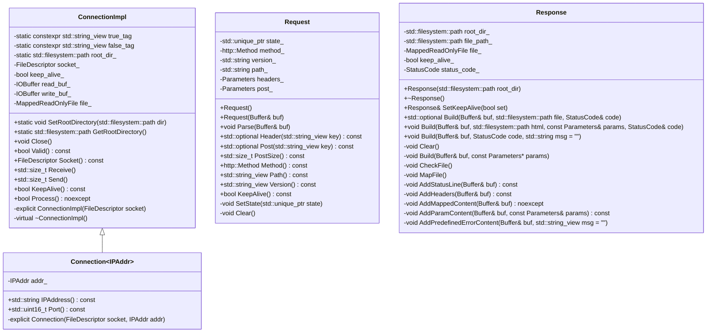
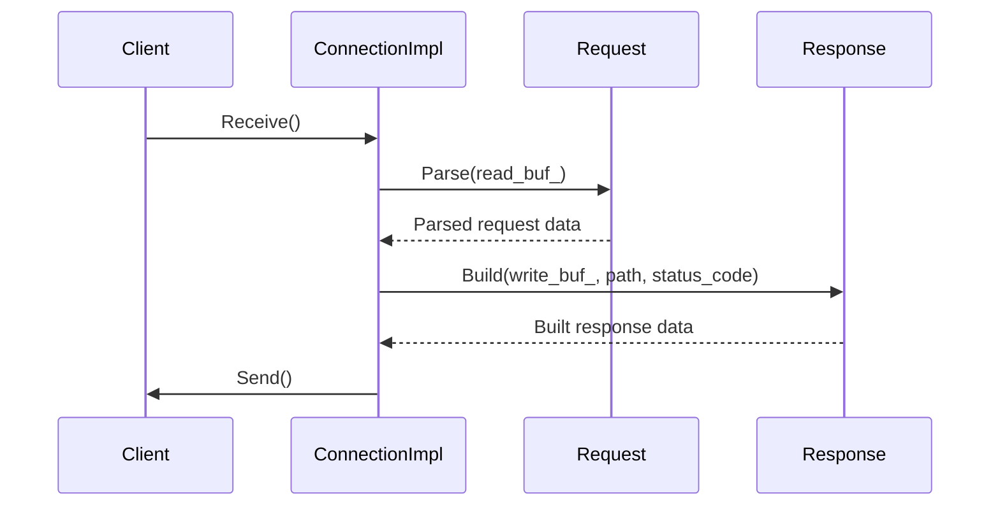
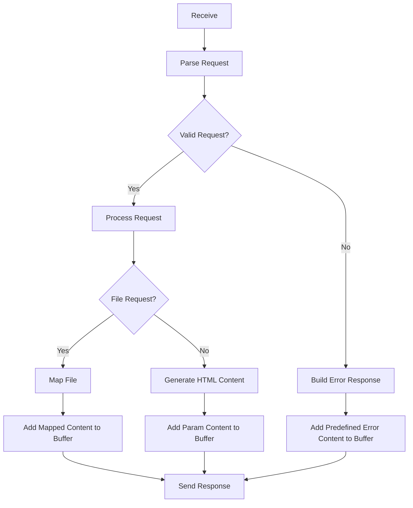

# HTTPモジュール設計文書

## 責務
HTTP通信の受信、処理、送信を行う。具体的には、HTTPリクエストを解析し、適切なレスポンスを作成して返す。

## 公開インターフェース
- `ConnectionImpl` クラス: HTTP接続の内部実装クラス。
  - `SetRootDirectory`: ルートディレクトリを設定する。
  - `GetRootDirectory`: ルートディレクトリを取得する。
  - `Close`: 接続を閉じる。
  - `Valid`: 接続が有効かどうかを確認する。
  - `Socket`: ソケットを取得する。
  - `Receive`: HTTPリクエストを受け取る。
  - `Send`: HTTPレスポンスを送信する。
  - `KeepAlive`: 接続がキープアライブであるかを確認する。
  - `Process`: リクエストを処理し、適切なレスポンスを作成する。

- `Connection` クラス: IPアドレス情報を含むHTTP接続クラス。
  - `IPAddress`: IPアドレスを取得する。
  - `Port`: ポート番号を取得する。

- `Request` クラス: HTTPリクエストのパーサー。
  - `Parse`: HTTPリクエストを解析する。
  - `Header`: 指定したキーのHTTPヘッダーを取得する。
  - `Post`: 指定したキーのPOST変数を取得する。
  - `PostSize`: POST変数の数を取得する。
  - `Method`: HTTPメソッドを取得する。
  - `Path`: リクエストパスを取得する。
  - `Version`: HTTPバージョンを取得する。
  - `KeepAlive`: 接続がキープアライブであるかを確認する。

- `Response` クラス: HTTPレスポンスビルダー。
  - `SetKeepAlive`: レスポンスにキープアライブヘッダーを設定する。
  - `Build`: ファイルリクエストやステータスコードからHTTPレスポンスを作成する。

## 入力
- `ConnectionImpl::Receive`: ソケットからのデータ。
- `Request::Parse`: HTTPリクエストのバッファ。
- `Response::Build`: レスポンスを書き込むバッファ、ファイルパスやステータスコード。

## 出力
- `ConnectionImpl::Send`: ソケットに送信するデータ。
- `Request::Header`, `Request::Post`, `Request::Method`, `Request::Path`, `Request::Version`, `Request::KeepAlive`: リクエストの解析結果。
- `Response::Build`: レスポンスヘッダーとコンテンツ。

## 状態
- `ConnectionImpl`: ソケット、キープアライブフラグ、読み書きバッファ、マップされたファイル。
- `Request`: HTTPメソッド、バージョン、パス、ヘッダーマップ、POST変数マップ。
- `Response`: ルートディレクトリ、ファイルパス、マップされたファイル、キープアライブフラグ、ステータスコード。

## 処理手順
1. **ConnectionImpl::Receive**: ソケットからデータを読み込み、読み取りバッファに格納する。
2. **Request::Parse**: 読み取りバッファの内容を解析し、HTTPメソッド、パス、ヘッダー、POST変数を抽出する。
3. **ConnectionImpl::Process**: リクエストを処理し、適切なレスポンスを作成する。必要に応じてファイルをマップし、レスポンスヘッダーやコンテンツを作成する。
4. **Response::Build**: レスポンスヘッダーとコンテンツを作成し、書き込みバッファに格納する。
5. **ConnectionImpl::Send**: 書き込みバッファの内容をソケットに送信する。

## 例外・失敗条件
- `Request::Parse`: 不正なHTTPリクエストの場合、`std::invalid_argument` をスローする。
- `DecodeURLEncodedCharacter`, `DecodeURLEncodedString`: URLエンコードされた文字列が不正な場合、`std::invalid_argument` をスローする。
- `Response::Build`: ファイルマッピングに失敗した場合、ステータスコードを `BadRequest` に設定し、エラーメッセージをレスポンスヘッダーに含める。

## 依存関係
- `ConnectionImpl`, `Request`, `Response`: `Buffer`, `MappedReadOnlyFile`, `IOBuffer` を使用する。
- `DecodeURLEncodedCharacter`, `DecodeURLEncodedString`: `std::stoi`, `std::ostringstream` を使用する。
- `ContentTypeByFileName`: `std::filesystem::path` を使用する。

## 重要な不変条件
- `ConnectionImpl::Receive`: 読み取りバッファは常に有効な状態で保持される。
- `Request::Parse`: パース後のリクエストオブジェクトは、HTTPメソッド、パス、ヘッダー、POST変数が正しく設定されていること。
- `Response::Build`: レスポンスヘッダーやコンテンツは、指定されたステータスコードやファイル内容に基づいて正確に作成されること。

## 追加詳細設計情報

### クラス図

### クラス・メソッド・インターフェース詳細
| クラス名 | メソッド名 | 完全な名前 | 引数名と型 | 戻り値型 | 可視性 | const | 参照/ポインタ | static | noexcept |
|----------|------------|------------|------------|-----------|--------|-------|---------------|--------|----------|
| ConnectionImpl | SetRootDirectory | ws::http::ConnectionImpl::SetRootDirectory | dir: std::filesystem::path | void | public | - | - | x | x |
| ConnectionImpl | GetRootDirectory | ws::http::ConnectionImpl::GetRootDirectory | - | std::filesystem::path | public | - | - | x | x |
| ConnectionImpl | Close | ws::http::ConnectionImpl::Close | - | void | public | - | - | - | x |
| ConnectionImpl | Valid | ws::http::ConnectionImpl::Valid | - | bool | public | x | - | - | x |
| ConnectionImpl | Socket | ws::http::ConnectionImpl::Socket | - | FileDescriptor | public | x | - | - | x |
| ConnectionImpl | Receive | ws::http::ConnectionImpl::Receive | - | std::size_t | public | - | - | - | - |
| ConnectionImpl | Send | ws::http::ConnectionImpl::Send | - | std::size_t | public | - | - | - | - |
| ConnectionImpl | KeepAlive | ws::http::ConnectionImpl::KeepAlive | - | bool | public | x | - | - | x |
| ConnectionImpl | Process | ws::http::ConnectionImpl::Process | - | bool | public | x | - | - | x |
| Connection~IPAddr~ | IPAddress | ws::http::Connection~IPAddr~::IPAddress | - | std::string | public | x | - | - | x |
| Connection~IPAddr~ | Port | ws::http::Connection~IPAddr~::Port | - | std::uint16_t | public | x | - | - | x |
| Request | Request (default) | ws::http::Request::Request | - | void | public | - | - | - | x |
| Request | Request (with buffer) | ws::http::Request::Request | buf: Buffer& | void | public | - | - | - | - |
| Request | Parse | ws::http::Request::Parse | buf: Buffer& | void | public | - | - | - | - |
| Request | Header | ws::http::Request::Header | key: std::string_view | std::optional<std::string_view> | public | x | - | - | x |
| Request | Post | ws::http::Request::Post | key: std::string_view | std::optional<std::string_view> | public | x | - | - | x |
| Request | PostSize | ws::http::Request::PostSize | - | std::size_t | public | x | - | - | x |
| Request | Method | ws::http::Request::Method | - | http::Method | public | x | - | - | x |
| Request | Path | ws::http::Request::Path | - | std::string_view | public | x | - | - | x |
| Request | Version | ws::http::Request::Version | - | std::string_view | public | x | - | - | x |
| Request | KeepAlive | ws::http::Request::KeepAlive | - | bool | public | x | - | - | x |
| Response | Response (constructor) | ws::http::Response::Response | root_dir: std::filesystem::path | void | public | - | - | - | x |
| Response | ~Response (destructor) | ws::http::Response::~Response | - | void | public | - | - | - | x |
| Response | SetKeepAlive | ws::http::Response::SetKeepAlive | set: bool | Response& | public | - | - | - | x |
| Response | Build (with file) | ws::http::Response::Build | buf: Buffer&, file: std::filesystem::path, code: StatusCode& | std::optional<MappedReadOnlyFile> | public | - | - | - | x |
| Response | Build (with HTML and params) | ws::http::Response::Build | buf: Buffer&, html: std::filesystem::path, params: const Parameters&, code: StatusCode& | void | public | - | - | - | x |
| Response | Build (with status code) | ws::http::Response::Build | buf: Buffer&, code: StatusCode, msg: std::string = "" | void | public | - | - | - | x |

### シーケンス図

### メソッド仕様書

#### `Request::Parse`
- **目的**: HTTPリクエストを解析し、内部状態に格納する。
- **引数**:
  - `buf`: 解析対象のバッファ (`Buffer&`)
- **戻り値**: 無し
- **動作**: バッファからHTTPメソッド、パス、ヘッダー、POST変数を抽出し、内部状態に格納する。
- **例外処理**:
  - `std::invalid_argument`: 不正なHTTPリクエストの場合スローされる。

#### `Response::Build`
- **目的**: ファイルリクエストやステータスコードからHTTPレスポンスを作成する。
- **引数**:
  - `buf`: レスポンスを書き込むバッファ (`Buffer&`)
  - `file`: ファイルパス (`std::filesystem::path`)
  - `code`: ステータスコード (`StatusCode&`)
- **戻り値**: マップされたファイル (`std::optional<MappedReadOnlyFile>`)
- **動作**: 指定されたファイルをマッピングし、レスポンスヘッダーやコンテンツを作成する。
- **例外処理**:
  - `std::invalid_argument`: ファイルマッピングに失敗した場合、ステータスコードを `BadRequest` に設定し、エラーメッセージをレスポンスヘッダーに含める。

### 処理フロー図

### 状態遷移・副作用
| 更新前状態 | 遷移条件 | 変更対象 | 更新後状態 | 更新順序 | 副作用 |
|------------|----------|-----------|------------|----------|--------|
| 未初期化   | ソケット設定 | root_dir_ | 初期化済み | - | ルートディレクトリが設定される |
| 接続中     | 受信完了 | read_buf_ | データ格納 | - | 読み取りバッファにデータが追加される |
| 解析前     | パース完了 | request   | 解析済み | - | リクエストオブジェクトの内部状態が更新される |
| 処理中     | ファイルリクエスト | file_ | マップされたファイル | - | ファイルがメモリにマッピングされる |
| 処理中     | HTMLコンテンツ生成 | write_buf_ | コンテンツ格納 | - | 書き込みバッファにHTMLコンテンツが追加される |
| 送信前     | 送信完了 | socket_   | データ送信 | - | ソケットにデータが送信される |

### データ変換・制約
| 入力 | 出力 | 変換規則 | 値域 | 境界値 | 単位 | 精度 | encoding |
|------|------|----------|------|--------|------|------|----------|
| HTTPリクエストバッファ | リクエストオブジェクト | 正規表現による解析 | - | - | 文字列 | - | UTF-8 |
| ファイルパス | マップされたファイル | パスの相対性考慮 | 存在するファイル | 空文字列 | パス | - | - |
| ステータスコード | レスポンスヘッダー | 数値とメッセージへの変換 | 200, 400, 403, 404 | - | 文字列 | - | UTF-8 |
| URLエンコード文字列 | デコードされた文字列 | `%`から始まる16進数のデコード | ASCII範囲内 | 空文字列 | 文字 | - | UTF-8 |

# Machine-extracted Source-local Implementation Contract

This appendix is deterministic evidence extracted from the target source.
It is not an LLM summary and it does not contain complete function bodies.

During regeneration:
- preserve the exact local declaration types, containers, initializers, and literals listed below;
- preserve the exact call targets and argument expressions listed below;
- do not substitute a different representation or accessor merely because it looks similar;
- treat these items as exact constraints, not as pseudocode suggestions.

## Exact local declarations

- `static constexpr std::string_view user_tag {"user"};`
- `static constexpr std::string_view msg_tag {"msg"};`
- `const auto user {request.Post(user_tag).value_or("")};`
- `const auto msg {request.Post(msg_tag).value_or("")};`
- `static const std::unordered_map<std::string_view, std::string_view> types { {".html", "text/html"}, {".xml", "text/xml"}, {".xhtml", "application/xhtml+xml"}, {".txt", "text/plain"}, {".rtf", "application/rtf"}, {".pdf", "application/pdf"}, {".word", "application/nsword"}, {".png", "image/png"}, {".gif", "image/gif"}, {".jpg", "image/jpeg"}, {".jpeg", "image/jpeg"}, {".au", "audio/basic"}, {".mpeg", "video/mpeg"}, {".mpg", "video/mpeg"}, {".avi", "video/x-msvideo"}, {".gz", "application/x-gzip"}, {".tar", "application/x-tar"}, {".css", "text/css"}, {".js", "text/javascript"}, };`
- `const auto extension { StringToLower(std::filesystem::path {name}.extension())};`
- `static const std::unordered_map<StatusCode, std::string_view> msgs { {StatusCode::OK, "OK"}, {StatusCode::BadRequest, "Bad Request"}, {StatusCode::Forbidden, "Forbidden"}, {StatusCode::NotFound, "Not Found"}};`
- `static const std::unordered_map<Method, std::string_view> methods { {Method::Get, "GET"}, {Method::Patch, "PATCH"}, {Method::Post, "POST"}, {Method::Delete, "DELETE"}, {Method::Put, "PUT"}};`
- `static const std::unordered_map<std::string_view, Method> methods { {"GET", Method::Get}, {"PATCH", Method::Patch}, {"POST", Method::Post}, {"DELETE", Method::Delete}, {"PUT", Method::Put}};`
- `const auto method {methods.find(str)};`
- `static constexpr std::size_t encoded_length {3};`
- `const auto ascii {std::stoi(str.substr(1), nullptr, 16)};`
- `std::ostringstream ss;`
- `std::size_t i {0};`
- `const auto encoded {str.substr(i, encoded_length)};`
- `io::FileDescriptor io {socket_, socket_};`
- `std::size_t size {0};`
- `std::size_t header_size {0};`
- `std::size_t file_size {0};`
- `const auto size {write(socket_, file_.Data() + file_size, file_.Size() - file_size)};`
- `static constexpr std::string_view index_page {"/index.html"};`
- `static constexpr std::string_view hide_msg_tag {"hide-msg"};`
- `Request request;`
- `Response response {root_dir_};`
- `std::optional<std::string> error_msg;`
- `std::string path {request.Path()};`
- `StatusCode status_code {StatusCode::OK};`
- `auto params {ExtractUserMessage(request).value_or(Parameters {})};`
- `auto file { response.Build(write_buf_, std::move(path), status_code)};`
- `auto content {buf.ReadableString()};`
- `const auto line_end {content.find(new_line)};`
- `const auto line {content.substr(0, line_end)};`
- `const auto conn {headers_.find("Connection")};`
- `const auto val {post_.find(key.data())};`
- `const auto val {headers_.find(key.data())};`
- `const std::regex pattern {"^([^ ]*) ([^ ]*) HTTP/([^ ]*)$"};`
- `std::smatch matches;`
- `const std::regex pattern {"^([^:]*): ?(.*)$"};`
- `const auto method {parser_.Method()};`
- `const auto content_type {parser_.Header("Content-Type").value_or("")};`
- `auto& post {parser_.post_};`
- `auto decoded_body {DecodeURLEncodedString(body)};`
- `std::string_view view {decoded_body};`
- `std::string key, val;`
- `std::size_t begin {0}, end {0};`
- `static constexpr std::string_view http_status_page {"/http-status.html"};`
- `static constexpr std::string_view status_code_tag {"status-code"};`
- `static constexpr std::string_view status_tag {"status"};`
- `const Parameters params { {status_code_tag.data(), std::to_string(StatusCodeToInteger(status_code_))}, {status_tag.data(), StatusCodeToMessage(status_code_).data()}, {msg_tag.data(), std::move(msg)} };`
- `std::string content {reinterpret_cast<const char*>(file_.Data()), file_.Size()};`
- `const auto lines {SplitStringToLines(content)};`
- `std::size_t length {new_line.length() * (lines.size() - 1)};`
- `auto i {0};`
- `const auto body {ss.str()};`

## Exact top-level call expressions

- `std::move(addr)`
- `addr_.IPAddress()`
- `addr_.Port()`
- `request.Post(user_tag).value_or("")`
- `request.Post(msg_tag).value_or("")`
- `user.empty()`
- `user_tag.data()`
- `user.data()`
- `msg_tag.data()`
- `msg.data()`
- `StringToLower(std::filesystem::path {name}.extension())`
- `types.contains(extension.c_str())`
- `types.at(extension.c_str())`
- `msgs.at(code)`
- `StatusCodeToMessage(code)`
- `static_cast<std::uint32_t>(code)`
- `methods.at(method)`
- `MethodToString(method).data()`
- `StringToUpper(str)`
- `methods.find(str)`
- `methods.cend()`
- `fmt::format("Invalid HTTP method: '{}'", str)`
- `str.length()`
- `str.front()`
- `std::stoi(str.substr(1), nullptr, 16)`
- `static_cast<char>(ascii)`
- `fmt::format("Invalid HTTP URL-encoding character: '{}'", str)`
- `str.size()`
- `str.substr(i, encoded_length)`
- `encoded.length()`
- `DecodeURLEncodedCharacter(encoded)`
- `fmt::format( "Invalid HTTP URL-encoding strings: '{}'", str)`
- `ss.str()`
- `fmt::format("<${}$>", key)`
- `ReplaceAllSubstring(html, HTMLPlaceholder(key), val)`
- `std::move(dir)`
- `assert(IsValidFileDescriptor(socket_))`
- `Close()`
- `close(socket_)`
- `read_buf_.ReadFrom(io)`
- `err.code()`
- `write_buf_.Empty()`
- `write_buf_.WriteTo(io)`
- `file_.Size()`
- `write(socket_, file_.Data() + file_size, file_.Size() - file_size)`
- `ThrowLastSystemError()`
- `file_.Unmap()`
- `read_buf_.ReadableSize()`
- `request.Parse(read_buf_)`
- `err.what()`
- `request.KeepAlive()`
- `response.SetKeepAlive(keep_alive_)`
- `error_msg.has_value()`
- `request.Path()`
- `path.empty()`
- `ExtractUserMessage(request).value_or(Parameters {})`
- `params.insert({hide_msg_tag.data(), params.empty() ? true_tag.data() : false_tag.data()})`
- `response.Build(write_buf_, index_page, params, status_code)`
- `response.Build(write_buf_, std::move(path), status_code)`
- `file.has_value()`
- `std::move(*file)`
- `response.Build(write_buf_, StatusCode::BadRequest, *error_msg)`
- `ParseStatusLine(line)`
- `Parse(buf)`
- `Clear()`
- `buf.Empty()`
- `buf.ReadableString()`
- `content.empty()`
- `content.find(new_line)`
- `content.substr(0, line_end)`
- `assert(state_)`
- `state_->Parse(line)`
- `buf.Retrieve(line.length())`
- `content.substr(line.length())`
- `content.substr(new_line.length())`
- `buf.Retrieve(new_line.length())`
- `std::move(state)`
- `SetState(std::make_unique<NotStarted>(*this))`
- `version_.clear()`
- `path_.clear()`
- `headers_.clear()`
- `post_.clear()`
- `post_.size()`
- `headers_.find("Connection")`
- `headers_.cend()`
- `post_.find(key.data())`
- `post_.cend()`
- `headers_.find(key.data())`
- `std::regex_match(line, matches, pattern)`
- `StringToMethod(matches[1])`
- `parser_.SetState(std::make_unique<Header>(parser_))`
- `fmt::format("Invalid HTTP status line: '{}'", line)`
- `parser_.headers_.emplace(matches[1], matches[2])`
- `line.empty()`
- `parser_.SetState(std::make_unique<Body>(parser_))`
- `parser_.Method()`
- `ParsePost(body)`
- `fmt::format( "Unsupported HTTP method: '{}'", to_string(method))`
- `parser_.SetState(std::make_unique<Finished>(parser_))`
- `parser_.Header("Content-Type").value_or("")`
- `ParseURLEncodedPost(body)`
- `fmt::format("Unsupported HTTP content type: '{}'", content_type)`
- `DecodeURLEncodedString(body)`
- `view.size()`
- `view.substr(begin, end - begin)`
- `key.empty()`
- `post.emplace(std::move(key), std::move(val))`
- `fmt::format("Invalid HTTP POST data: '{}'", body)`
- `assert(begin <= end)`
- `post.contains(key)`
- `val.empty()`
- `std::move(root_dir)`
- `file_path_.clear()`
- `std::move(file)`
- `Build(buf)`
- `std::move(file_)`
- `Build(buf, &params)`
- `status_code_tag.data()`
- `std::to_string(StatusCodeToInteger(status_code_))`
- `status_tag.data()`
- `StatusCodeToMessage(status_code_).data()`
- `std::move(msg)`
- `root_dir_.empty()`
- `file_.Map(root_dir_ / file_path_.relative_path())`
- `file_.Map(file_path_)`
- `AddStatusLine(buf)`
- `AddHeaders(buf)`
- `AddParamContent(buf, *params)`
- `AddMappedContent(buf)`
- `AddPredefinedErrorContent(buf, *error_msg)`
- `buf.Append( fmt::format("HTTP/{} {} {}", version, StatusCodeToInteger(status_code_), StatusCodeToMessage(status_code_)), NewLine::CRLF)`
- `buf.Append("Connection: ")`
- `buf.Append("keep-alive", NewLine::CRLF)`
- `buf.Append("keep-alive: max=6, timeout=120", NewLine::CRLF)`
- `buf.Append("close", NewLine::CRLF)`
- `assert(file_.Data())`
- `buf.Append(fmt::format("Content-type: {}", ContentTypeByFileName(file_path_.c_str())), NewLine::CRLF)`
- `buf.Append(fmt::format("Content-length: {}", file_.Size()), NewLine::CRLF)`
- `buf.Append(new_line)`
- `reinterpret_cast<const char*>(file_.Data())`
- `ReplaceAllSubstring(content, HTMLPlaceholder(key), val)`
- `SplitStringToLines(content)`
- `lines.size()`
- `std::for_each(lines.cbegin(), lines.cend(), [&length](const auto& line) { length += line.size(); })`
- `buf.Append(fmt::format("Content-length: {}", length), NewLine::CRLF)`
- `buf.Append(lines[i], NewLine::CRLF)`
- `buf.Append(lines[i])`
- `buf.Append("Content-type: text/html", NewLine::CRLF)`
- `fmt::format("
{} : {}
", StatusCodeToInteger(status_code_), StatusCodeToMessage(status_code_))`
- `msg.empty()`
- `fmt::format("
{}
", msg)`
- `buf.Append(fmt::format("Content-length: {}", body.size()), NewLine::CRLF)`
- `buf.Append(body)`
