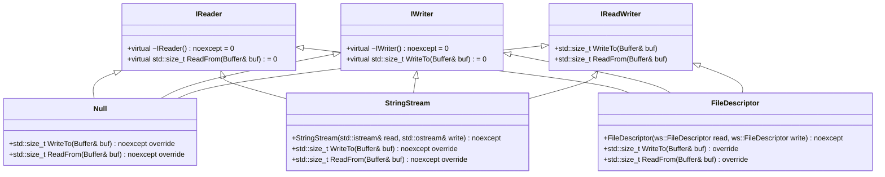
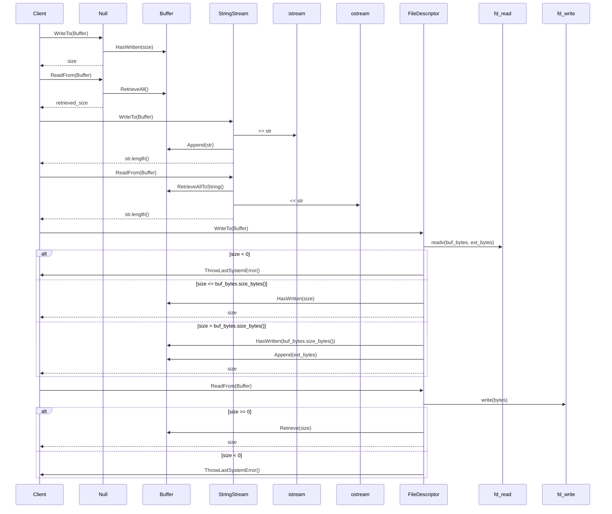

# デザイン文書

## 責務
`include/io.h`と`src/io/io.cpp`は、バッファとの読み書き操作を抽象化したインターフェースとその実装を提供します。主な責務は以下の通りです：
- `IReader`, `IWriter`, `IReadWriter`などのインターフェース定義
- バッファからのデータ読み込みやバッファへのデータ書き込みの具体的な実装（`Null`, `StringStream`, `FileDescriptor`）

## 公開インターフェース
### クラス・メソッド詳細

| クラス名 | メソッド名 | 引数 | 戻り値型 | 説明 |
|----------|------------|------|-----------|------|
| IReader  | ReadFrom   | Buffer& buf | std::size_t | バッファからデータを読み込む |
| IWriter  | WriteTo    | Buffer& buf | std::size_t | バッファにデータを書き込む |
| Null     | WriteTo    | Buffer& buf | std::size_t | バッファの書き込み可能なスペースを消費する（実際には何もしない）|
| Null     | ReadFrom   | Buffer& buf | std::size_t | バッファから読み取り可能なデータを全て消費する（実際には何もしない） |
| StringStream | WriteTo | Buffer& buf | std::size_t | 文字列ストリームからバッファにデータを書き込む |
| StringStream | ReadFrom | Buffer& buf | std::size_t | バッファから文字列ストリームにデータを読み込む |
| FileDescriptor | WriteTo | Buffer& buf | std::size_t | ファイルディスクリプタからバッファにデータを書き込む |
| FileDescriptor | ReadFrom | Buffer& buf | std::size_t | バッファからファイルディスクリプタにデータを読み込む |

## 入力
- `Buffer`オブジェクトへの参照

## 出力
- 読み込んだバイト数 (`std::size_t`)
- 書き込んだバイト数 (`std::size_t`)

## 状態
- バッファの読み書き可能な状態（内部で管理）

## 処理手順
1. `Null::WriteTo`: バッファの書き込み可能なスペースを消費し、そのサイズを返す。
2. `Null::ReadFrom`: バッファから全てのデータを読み取り可能にする（実際には何もしない）。
3. `StringStream::WriteTo`: 文字列ストリームから文字列を読み取り、バッファに追加する。追加した文字列の長さを返す。
4. `StringStream::ReadFrom`: バッファから全てのデータを文字列として取得し、それを文字列ストリームに書き込む。書き込んだ文字列の長さを返す。
5. `FileDescriptor::WriteTo`: ファイルディスクリプタからバッファにデータを読み取り、必要に応じて追加のバッファを使用して残りのデータを処理する。読み取ったバイト数を返す。
6. `FileDescriptor::ReadFrom`: バッファからファイルディスクリプタにデータを書き込む。書き込んだバイト数を返す。

## 例外・失敗条件
- `FileDescriptor::WriteTo`と`FileDescriptor::ReadFrom`でシステムエラーが発生した場合、`ThrowLastSystemError()`が呼ばれる。

## 依存関係
- `Buffer`クラス（`containers/buffer.h`）
- `std::istream`, `std::ostream`
- `ws::FileDescriptor`

## 重要な不変条件
- バッファの読み書き可能な範囲は常に適切に管理される。
- システムエラーが発生した場合、例外がスローされる。

# 追加詳細設計情報

## クラス図


## シーケンス図


## メソッド仕様書

### Null::WriteTo
- **目的**: バッファの書き込み可能なスペースを消費する（実際には何もしない）。
- **引数**: `Buffer& buf` - 書き込み対象のバッファ。
- **戻り値型**: `std::size_t` - 消費したバイト数。
- **動作**: バッファの書き込み可能なスペースを全て消費し、そのサイズを返す。

### Null::ReadFrom
- **目的**: バッファから読み取り可能なデータを全て消費する（実際には何もしない）。
- **引数**: `Buffer& buf` - 読み取り対象のバッファ。
- **戻り値型**: `std::size_t` - 消費したバイト数。
- **動作**: バッファから全てのデータを読み取り可能にする（実際には何もしない）。

### StringStream::WriteTo
- **目的**: 文字列ストリームからバッファにデータを書き込む。
- **引数**: `Buffer& buf` - 書き込み対象のバッファ。
- **戻り値型**: `std::size_t` - 書き込んだ文字列の長さ。
- **動作**: 文字列ストリームから文字列を読み取り、それをバッファに追加する。追加した文字列の長さを返す。

### StringStream::ReadFrom
- **目的**: バッファから文字列ストリームにデータを読み込む。
- **引数**: `Buffer& buf` - 読み取り対象のバッファ。
- **戻り値型**: `std::size_t` - 書き込んだ文字列の長さ。
- **動作**: バッファから全てのデータを文字列として取得し、それを文字列ストリームに書き込む。書き込んだ文字列の長さを返す。

### FileDescriptor::WriteTo
- **目的**: ファイルディスクリプタからバッファにデータを読み取り、必要に応じて追加のバッファを使用して残りのデータを処理する。
- **引数**: `Buffer& buf` - 書き込み対象のバッファ。
- **戻り値型**: `std::size_t` - 読み取ったバイト数。
- **動作**: ファイルディスクリプタからバッファにデータを読み取り、必要に応じて追加のバッファを使用して残りのデータを処理する。読み取ったバイト数を返す。

### FileDescriptor::ReadFrom
- **目的**: バッファからファイルディスクリプタにデータを書き込む。
- **引数**: `Buffer& buf` - 読み取り対象のバッファ。
- **戻り値型**: `std::size_t` - 書き込んだバイト数。
- **動作**: バッファからファイルディスクリプタにデータを書き込む。書き込んだバイト数を返す。

## 処理フロー図
```mermaid
graph TD
    A[Null::WriteTo] --> B[buf.WritableSize()]
    B --> C[buf.HasWritten(size)]
    C --> D[size]

    E[Null::ReadFrom] --> F[buf.RetrieveAll()]
    F --> G[retrieved_size]

    H[StringStream::WriteTo] --> I[read_ >> str]
    I --> J[buf.Append(str)]
    J --> K[str.length()]

    L[StringStream::ReadFrom] --> M[buf.RetrieveAllToString()]
    M --> N[write_ << str]
    N --> O[str.length()]

    P[FileDescriptor::WriteTo] --> Q[readv(read_, bufs.data(), bufs.size())]
    Q --> R{size < 0?}
    R -- Yes --> S[ThrowLastSystemError()]
    R -- No --> T{size <= buf_bytes.size_bytes()?}
    T -- Yes --> U[buf.HasWritten(size)]
    U --> V[size]
    T -- No --> W[buf.HasWritten(buf_bytes.size_bytes())]
    W --> X[buf.Append(ext_bytes)]
    X --> Y[size]

    Z[FileDescriptor::ReadFrom] --> AA[write(write_, bytes.data(), bytes.size_bytes())]
    AA --> AB{size >= 0?}
    AB -- Yes --> AC[buf.Retrieve(size)]
    AC --> AD[size]
    AB -- No --> AE[ThrowLastSystemError()]
```

## 状態遷移・副作用
| 更新前状態 | 遷移条件 | 変更対象 | 更新後状態 | 更新順序 | 副作用 |
|------------|----------|----------|------------|----------|--------|
| バッファの書き込み可能なスペースあり | WriteTo呼び出し | Buffer | 書き込み可能なスペースが消費される | 1. `buf.WritableSize()`<br>2. `buf.HasWritten(size)` | 無し |
| バッファにデータあり | ReadFrom呼び出し | Buffer | 読み取り可能なデータが消費される | 1. `buf.RetrieveAll()` | 無し |
| 文字列ストリームから文字列読み込み可能 | WriteTo呼び出し | Buffer, StringStream | バッファに文字列追加 | 1. `read_ >> str`<br>2. `buf.Append(str)` | 無し |
| バッファにデータあり | ReadFrom呼び出し | Buffer, StringStream | 文字列ストリームに書き込み | 1. `buf.RetrieveAllToString()`<br>2. `write_ << str` | 無し |
| ファイルディスクリプタから読み取り可能 | WriteTo呼び出し | Buffer, FileDescriptor | バッファにデータ追加 | 1. `readv(read_, bufs.data(), bufs.size())`<br>2. `buf.HasWritten(size)`/`buf.Append(ext_bytes)` | システムエラー発生時: `ThrowLastSystemError()` |
| バッファから書き込み可能 | ReadFrom呼び出し | Buffer, FileDescriptor | ファイルディスクリプタにデータ追加 | 1. `write(write_, bytes.data(), bytes.size_bytes())`<br>2. `buf.Retrieve(size)` | システムエラー発生時: `ThrowLastSystemError()` |

## データ変換・制約
| 変換元 | 変換先 | 値域 | 境界値 | 単位 | 精度 | encoding |
|--------|--------|------|--------|------|------|----------|
| Buffer.WritableSize() | size_t | 0以上の整数 | 0, MAX_SIZE_T | バイト | - | - |
| std::string | Buffer | 文字列長さ | 0, MAX_STRING_LENGTH | 文字数 | - | UTF-8 |
| readv/write | ssize_t | 0以上の整数 | 0, MAX_SSIZE_T | バイト | - | - |

## その他の詳細
- `StringStream`は、文字列ストリームへの参照を保持し、コピーやムーブは禁止されている。
- `FileDescriptor`は、ファイルディスクリプタへの参照を保持し、コピーやムーブは禁止されている。