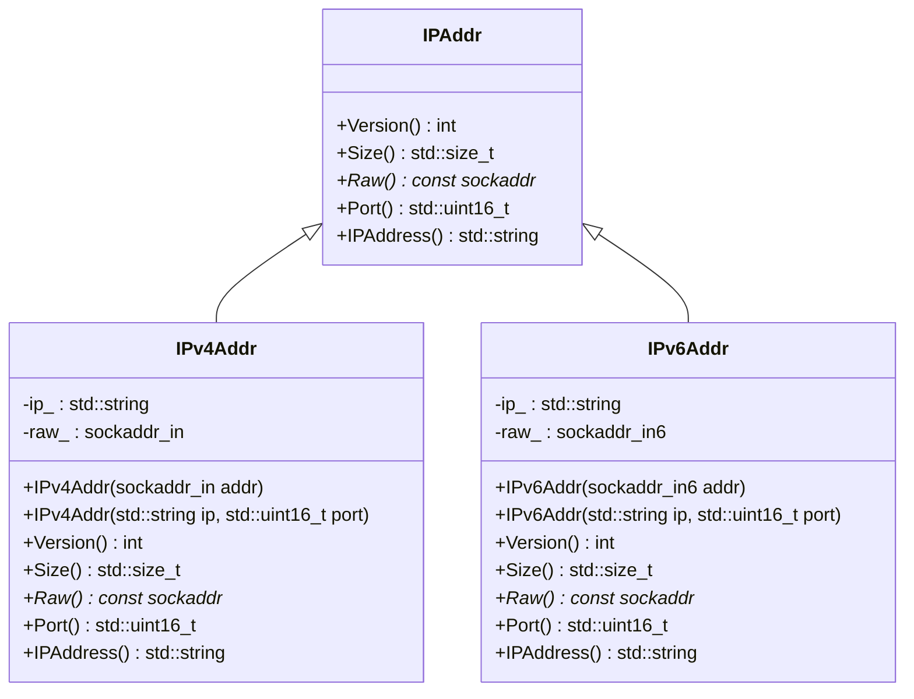
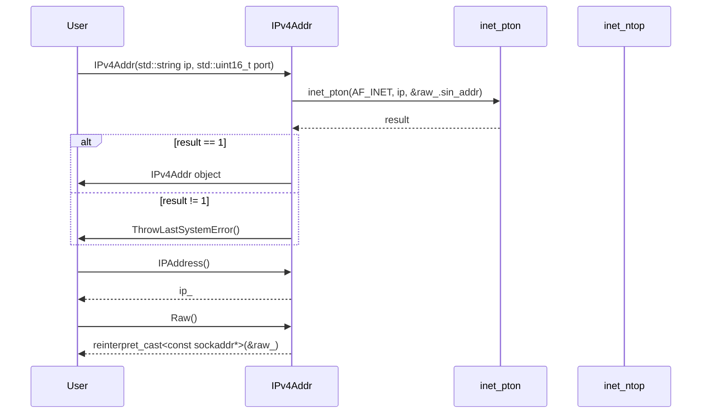

# 設計文書

## 責務
- `IPAddr` クラス: IPアドレスのインターフェースを定義する。
- `IPv4Addr` クラス: IPv4アドレスを表現し、その情報を提供する。
- `IPv6Addr` クラス: IPv6アドレスを表現し、その情報を提供する。

## 公開インターフェース
### IPAddrクラス
| メソッド名 | 戻り値型 | 説明 |
| --- | --- | --- |
| Version() | int | IPバージョンを返す。 |
| Size() | std::size_t | ソケットアドレスのサイズを返す。 |
| Raw() | const sockaddr* | ソケットアドレスへのポインタを返す。 |
| Port() | std::uint16_t | ポート番号を返す。 |
| IPAddress() | std::string | IPアドレス文字列を返す。 |

### IPv4Addrクラス
| コンストラクタ名 | 引数 | 説明 |
| --- | --- | --- |
| IPv4Addr(sockaddr_in addr) | sockaddr_in addr | `sockaddr_in` からIPv4アドレスを作成する。 |
| IPv4Addr(std::string ip, std::uint16_t port) | std::string ip, std::uint16_t port | IPアドレス文字列とポート番号からIPv4アドレスを作成する。 |

### IPv6Addrクラス
| コンストラクタ名 | 引数 | 説明 |
| --- | --- | --- |
| IPv6Addr(sockaddr_in6 addr) | sockaddr_in6 addr | `sockaddr_in6` からIPv6アドレスを作成する。 |
| IPv6Addr(std::string ip, std::uint16_t port) | std::string ip, std::uint16_t port | IPアドレス文字列とポート番号からIPv6アドレスを作成する。 |

## 入力
- `IPv4Addr` コンストラクタ: `sockaddr_in` オブジェクトまたはIPアドレス文字列とポート番号。
- `IPv6Addr` コンストラクタ: `sockaddr_in6` オブジェクトまたはIPアドレス文字列とポート番号。

## 出力
- IPバージョン (`Version()`)
- ソケットアドレスのサイズ (`Size()`)
- ソケットアドレスへのポインタ (`Raw()`)
- ポート番号 (`Port()`)
- IPアドレス文字列 (`IPAddress()`)

## 状態
- `IPv4Addr`:
  - `ip_`: IPv4アドレスを表す文字列。
  - `raw_`: IPv4アドレスを表す `sockaddr_in` 構造体。

- `IPv6Addr`:
  - `ip_`: IPv6アドレスを表す文字列。
  - `raw_`: IPv6アドレスを表す `sockaddr_in6` 構造体。

## 処理手順
1. **IPv4Addr コンストラクタ (`sockaddr_in addr`)**:
   - 引数の `sockaddr_in` をメンバ変数 `raw_` にコピーする。
   - `inet_ntop()` 関数を使用して、`raw_.sin_addr` を文字列形式に変換し、それを `ip_` に格納する。

2. **IPv4Addr コンストラクタ (`std::string ip, std::uint16_t port`)**:
   - 引数のIPアドレス文字列をメンバ変数 `ip_` にコピーする。
   - `raw_.sin_family` を `AF_INET` に設定し、`raw_.sin_port` を指定されたポート番号に設定する。
   - `inet_pton()` 関数を使用して、IPアドレス文字列を `raw_.sin_addr` に変換する。

3. **IPv6Addr コンストラクタ (`sockaddr_in6 addr`)**:
   - 引数の `sockaddr_in6` をメンバ変数 `raw_` にコピーする。
   - `inet_ntop()` 関数を使用して、`raw_.sin6_addr` を文字列形式に変換し、それを `ip_` に格納する。

4. **IPv6Addr コンストラクタ (`std::string ip, std::uint16_t port`)**:
   - 引数のIPアドレス文字列をメンバ変数 `ip_` にコピーする。
   - `raw_.sin6_family` を `AF_INET6` に設定し、`raw_.sin6_port` を指定されたポート番号に設定する。
   - `inet_pton()` 関数を使用して、IPアドレス文字列を `raw_.sin6_addr` に変換する。

## 例外・失敗条件
- `inet_ntop()` や `inet_pton()` の呼び出しが失敗した場合、`ThrowLastSystemError()` を呼び出してエラーを投げる。

## 依存関係
- `<concepts>`
- `<cstdint>`
- `<string>`
- `<string_view>`
- `<netinet/in.h>`
- `"util.h"`
- `<arpa/inet.h>`

## 重要な不変条件
- `IPv4Addr` の `ip_` は常に有効なIPv4アドレス文字列である。
- `IPv6Addr` の `ip_` は常に有効なIPv6アドレス文字列である。

# 追加詳細設計情報

## クラス図


## クラス・メソッド・インターフェース詳細

### IPAddrクラス
| メソッド名 | 戻り値型 | 引数 | 説明 |
| --- | --- | --- | --- |
| Version() | int | なし | IPバージョンを返す。 |
| Size() | std::size_t | なし | ソケットアドレスのサイズを返す。 |
| Raw() | const sockaddr* | なし | ソケットアドレスへのポインタを返す。 |
| Port() | std::uint16_t | なし | ポート番号を返す。 |
| IPAddress() | std::string | なし | IPアドレス文字列を返す。 |

### IPv4Addrクラス
| コンストラクタ名 | 引数 | 説明 |
| --- | --- | --- |
| IPv4Addr(sockaddr_in addr) | sockaddr_in addr | `sockaddr_in` からIPv4アドレスを作成する。 |
| IPv4Addr(std::string ip, std::uint16_t port) | std::string ip, std::uint16_t port | IPアドレス文字列とポート番号からIPv4アドレスを作成する。 |

| メソッド名 | 戻り値型 | 引数 | 説明 |
| --- | --- | --- | --- |
| Version() | int | なし | IPバージョンを返す。 |
| Size() | std::size_t | なし | ソケットアドレスのサイズを返す。 |
| Raw() | const sockaddr* | なし | ソケットアドレスへのポインタを返す。 |
| Port() | std::uint16_t | なし | ポート番号を返す。 |
| IPAddress() | std::string | なし | IPアドレス文字列を返す。 |

### IPv6Addrクラス
| コンストラクタ名 | 引数 | 説明 |
| --- | --- | --- |
| IPv6Addr(sockaddr_in6 addr) | sockaddr_in6 addr | `sockaddr_in6` からIPv6アドレスを作成する。 |
| IPv6Addr(std::string ip, std::uint16_t port) | std::string ip, std::uint16_t port | IPアドレス文字列とポート番号からIPv6アドレスを作成する。 |

| メソッド名 | 戻り値型 | 引数 | 説明 |
| --- | --- | --- | --- |
| Version() | int | なし | IPバージョンを返す。 |
| Size() | std::size_t | なし | ソケットアドレスのサイズを返す。 |
| Raw() | const sockaddr* | なし | ソケットアドレスへのポインタを返す。 |
| Port() | std::uint16_t | なし | ポート番号を返す。 |
| IPAddress() | std::string | なし | IPアドレス文字列を返す。 |

## シーケンス図


## メソッド仕様書
### IPv4Addr::IPv4Addr(std::string ip, std::uint16_t port)
- **目的**: IPアドレス文字列とポート番号からIPv4アドレスオブジェクトを作成する。
- **引数**:
  - `ip`: IPv4アドレスを表す文字列。
  - `port`: ポート番号。
- **戻り値**: なし
- **動作**:
  1. 引数のIPアドレス文字列をメンバ変数 `ip_` にコピーする。
  2. `raw_.sin_family` を `AF_INET` に設定し、`raw_.sin_port` を指定されたポート番号に設定する。
  3. `inet_pton()` 関数を使用して、IPアドレス文字列を `raw_.sin_addr` に変換する。
- **副作用**: エラーが発生した場合、`ThrowLastSystemError()` を呼び出してエラーを投げる。

### IPv4Addr::IPAddress()
- **目的**: IPv4アドレスの文字列表現を返す。
- **引数**: なし
- **戻り値**: IPアドレスを表す文字列 (`std::string`)
- **動作**: メンバ変数 `ip_` を返す。

### IPv4Addr::Raw()
- **目的**: ソケットアドレスへのポインタを返す。
- **引数**: なし
- **戻り値**: ソケットアドレスへのポインタ (`const sockaddr*`)
- **動作**: メンバ変数 `raw_` を `sockaddr*` にキャストして返す。

## 処理フロー図
```mermaid
graph TD
    A[IPv4Addr(std::string ip, std::uint16_t port)] --> B{inet_pton()}
    B -- 成功 --> C[raw_.sin_family = AF_INET]
    C --> D[raw_.sin_port = htons(port)]
    D --> E[ip_ = ip]
    E --> F[return IPv4Addr object]
    B -- 失敗 --> G[ThrowLastSystemError()]
```

## 状態遷移・副作用
| 更新前状態 | 遷移条件 | 変更対象 | 更新後状態 | 更新順序 | 副作用 |
| --- | --- | --- | --- | --- | --- |
| なし | コンストラクタ呼び出し | `ip_`, `raw_.sin_family`, `raw_.sin_port` | IPv4Addrオブジェクト | ip_ -> raw_.sin_family -> raw_.sin_port | エラー発生時: ThrowLastSystemError() |
| なし | コンストラクタ呼び出し | `ip_`, `raw_.sin6_family`, `raw_.sin6_port` | IPv6Addrオブジェクト | ip_ -> raw_.sin6_family -> raw_.sin6_port | エラー発生時: ThrowLastSystemError() |

## データ変換・制約
| 変換元 | 変換先 | 規則 |
| --- | --- | --- |
| std::string ip | sockaddr_in.sin_addr | `inet_pton(AF_INET, ip, &raw_.sin_addr)` |
| std::string ip | sockaddr_in6.sin6_addr | `inet_pton(AF_INET6, ip, &raw_.sin6_addr)` |
| sockaddr_in.sin_addr | std::string | `inet_ntop(AF_INET, &raw_.sin_addr, ip.data(), ip.size())` |
| sockaddr_in6.sin6_addr | std::string | `inet_ntop(AF_INET6, &raw_.sin6_addr, ip.data(), ip.size())` |

| 値域 | 制約 |
| --- | --- |
| IPアドレス文字列 | 有効なIPv4またはIPv6形式 |
| ポート番号 | 0から65535までの整数 |

# Machine-extracted Source-local Implementation Contract

This appendix is deterministic evidence extracted from the target source.
It is not an LLM summary and it does not contain complete function bodies.

During regeneration:
- preserve the exact local declaration types, containers, initializers, and literals listed below;
- preserve the exact call targets and argument expressions listed below;
- do not substitute a different representation or accessor merely because it looks similar;
- treat these items as exact constraints, not as pseudocode suggestions.

## Exact local declarations

- `std::array<char, max_length + 1> ip;`

## Exact top-level call expressions

- `std::move(addr)`
- `inet_ntop(version, &raw_.sin_addr, ip.data(), ip.size())`
- `ThrowLastSystemError()`
- `std::move(ip)`
- `htons(port)`
- `inet_pton(version, ip_.data(), &raw_.sin_addr)`
- `ntohs(raw_.sin_port)`
- `reinterpret_cast<const sockaddr*>(&raw_)`
- `inet_ntop(version, &raw_.sin6_addr, ip.data(), ip.size())`
- `inet_pton(version, ip_.data(), &raw_.sin6_addr)`
- `ntohs(raw_.sin6_port)`
