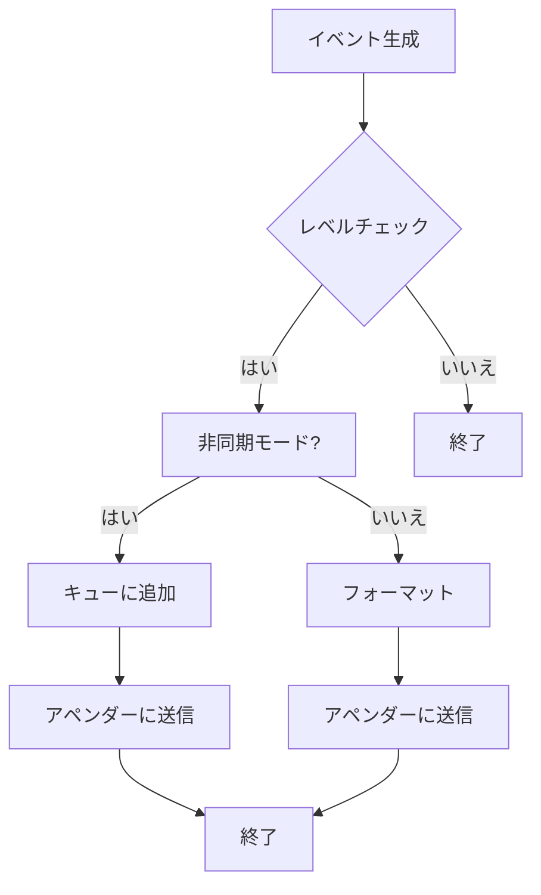

# デザイン文書

## 責務
- `include/log.h`：ログシステムの定義とインターフェースを提供する。
- `src/log/log.cpp`：ログイベントの生成、フォーマット、およびロガーの管理を行う。
- `src/log/appender.cpp`：異なる出力先へのログイベントの書き込み処理を行う。
- `src/log/field.h`：ログイベントの各フィールドをフォーマットするためのサブフォーマッタの定義とインターフェースを提供する。
- `src/log/field.cpp`：サブフォーマッタの具体的な実装を行う。
- `src/log/config_init.h`：ログシステムの設定初期化に関する構造体とユーティリティ関数の定義とインターフェースを提供する。
- `src/log/config_init.cpp`：設定ファイルからのロガー設定読み込みとマネージャーへの反映処理を行う。

## 公開インターフェース
- `include/log.h`
  - クラス: `Logger`, `Event`, `Formatter`, `Appender`, `StdOutAppender`, `FileAppender`, `Manager`, `EventWriter`
  - 関数: `LevelToString`, `StringToLevel`, `AppenderTypeToString`, `StringToAppenderType`, `Log`, `RootManager`, `RootLogger`, `FindLogger`

- `src/log/appender.cpp`
  - クラス: `StdOutAppender`, `FileAppender`
  - 関数: `AppenderTypeToString`, `StringToAppenderType`

- `src/log/field.h`
  - クラス: `Formatter::Field`, `Message`, `Level`, `ThreadId`, `DateTime`, `FileName`, `LineNum`, `NewLine`, `Tab`, `RawString`, `LoggerName`
  - 構造体: `RawField`

- `src/log/field.cpp`
  - 関数: `ParsePattern`, `RawFieldsToFormatFields`

- `src/log/config_init.h`
  - 構造体: `AppenderConfig`, `LoggerConfig`
  - クラス: `cfg::VarConverter<std::string, log::AppenderConfig>`, `cfg::VarConverter<log::AppenderConfig, std::string>`, `cfg::VarConverter<std::string, log::LoggerConfig>`, `cfg::VarConverter<log::LoggerConfig, std::string>`
  - 関数: `SetListener`

- `src/log/config_init.cpp`
  - 関数: `operator==` (AppenderConfig), `operator!=` (AppenderConfig), `operator==` (LoggerConfig), `operator!=` (LoggerConfig), `SetListener`

## 入力
- ログレベル (`Level`)
- イベントメッセージ (`std::string_view`)
- フォーマットパターン (`std::string_view`)
- アペンダータイプ (`AppenderType`)
- ファイル名 (`std::string_view`)
- YAML形式の設定データ

## 出力
- ログイベント (`Event`)
- フォーマットされたログメッセージ (`std::string`)
- YAML形式のロガー設定 (`std::string`)

## 状態
- `Logger`: ログレベル、キャパシティ、アペンダーのリスト、デフォルトフォーマッタ
- `Event`: レベル、ファイル名、行番号、スレッドID、タイムスタンプ、メッセージストリーム
- `Formatter`: パターン文字列、フィールドオブジェクトのリスト
- `Appender`: フォーマッターオブジェクト
- `StdOutAppender`: 標準出力への書き込み用アペンダー
- `FileAppender`: ファイルへの書き込み用アペンダー
- `Manager`: ロガーのマップ

## 処理手順
1. **ログイベントの生成**:
   - `Event::Create` を通じて新しいログイベントを作成する。
2. **フォーマットパターンの解析とフィールドオブジェクトの生成**:
   - `Formatter::Pattern` から `RawField` のリストを生成し、それを `Formatter::Field` オブジェクトのリストに変換する。
3. **ログメッセージのフォーマット**:
   - 各 `Formatter::Field` オブジェクトがイベント情報をフォーマットして出力ストリームに書き込む。
4. **ロガーへのイベント追加**:
   - ログレベルをチェックし、適切なアペンダーにイベントを送信する。
5. **イベントの同期/非同期処理**:
   - キューを使用してイベントを非同期に処理するか、直接同期的に処理する。
6. **設定ファイルからのロガー初期化**:
   - YAML形式の設定データから `LoggerConfig` を読み取り、マネージャーがロガーを作成しアペンダーを追加する。

## 例外・失敗条件
- `StringToLevel`, `StringToAppenderType`: 不正な文字列が与えられた場合に `std::invalid_argument` 例外を投げる。
- `FileAppender`: ファイルのオープンに失敗した場合に `std::system_error` 例外を投げる。

## 依存関係
- `include/log.h`:
  - `<chrono>`, `<experimental/source_location>`, `<fstream>`, `<iostream>`, `<list>`, `<memory>`, `<mutex>`, `<optional>`, `<sstream>`, `<string>`, `<string_view>`, `<thread>`, `<unordered_map>`
  - `config.h`, `containers/block_deque.h`, `util.h`

- `src/log/appender.cpp`:
  - `<stdexcept>`, `<syncstream>`

- `src/log/field.cpp`:
  - `<ctime>`, `<functional>`, `<stdexcept>`, `<unordered_map>`

- `src/log/config_init.cpp`:
  - `<cassert>`

## 重要な不変条件
- ログレベルは設定された値を保持する。
- フォーマットパターンは解析され、フィールドオブジェクトのリストに正しく変換される。
- イベントキューが閉じられると、非同期ログ処理スレッドは終了する。

## 追加詳細設計情報

### クラス図
```mermaid
classDiagram
    class Logger {
        +std::string_view Name() const noexcept
        +std::size_t Capacity() const noexcept
        +void Log(Event::Ptr event) noexcept
        +void AddAppender(Appender::Ptr appender) noexcept
        +void RemoveAppender(Appender::Ptr appender) noexcept
        +void ClearAppenders() noexcept
        +log::Level GetLevel() const noexcept
        +void SetLevel(log::Level level) noexcept
    }
    
    class Event {
        +std::string_view FileName() const noexcept
        +std::size_t LineNum() const noexcept
        +std::uint32_t ThreadId() const noexcept
        +Event::Clock::time_point Time() const noexcept
        +std::string Message() const noexcept
        +std::ostringstream& MessageStream() noexcept
    }
    
    class Formatter {
        +std::string Format(const Logger& logger, const Event& event) const noexcept
        +std::string_view Pattern() const noexcept
    }
    
    class Appender {
        +void Log(const Logger& logger, const Event& event) noexcept
        +std::string ToYamlString() const noexcept
    }
    
    class StdOutAppender {
        +void Log(const Logger& logger, const Event& event) noexcept
        +std::string ToYamlString() const noexcept
    }
    
    class FileAppender {
        +void Log(const Logger& logger, const Event& event) noexcept
        +std::string ToYamlString() const noexcept
    }
    
    class Manager {
        +Logger::Ptr FindLogger(std::string_view name, log::Level level, std::optional<std::size_t> capacity) noexcept
        +void RemoveLogger(std::string_view name) noexcept
    }
    
    Logger "1" -- "0..*" Appender : contains
    Formatter "1" -- "0..*" Formatter.Field : contains
    Event "1" -- "1" std::ostringstream : has
```

### クラス・メソッド・インターフェース詳細

| クラス/構造体 | メンバ名 | 型 | 可視性 | const | 引数 | 戻り値型 |
|---------------|----------|----|--------|-------|------|-----------|
| Logger        | Name     | std::string_view | public | あり | -      | std::string_view |
| Logger        | Capacity | std::size_t | public | あり | -      | std::size_t |
| Logger        | Log      | void | public | なし | Event::Ptr event | void |
| Logger        | AddAppender | void | public | なし | Appender::Ptr appender | void |
| Logger        | RemoveAppender | void | public | なし | Appender::Ptr appender | void |
| Logger        | ClearAppenders | void | public | なし | -      | void |
| Logger        | GetLevel | log::Level | public | あり | -      | log::Level |
| Logger        | SetLevel | void | public | なし | log::Level level | void |
| Event         | FileName | std::string_view | public | あり | -      | std::string_view |
| Event         | LineNum  | std::size_t | public | あり | -      | std::size_t |
| Event         | ThreadId | std::uint32_t | public | あり | -      | std::uint32_t |
| Event         | Time     | Event::Clock::time_point | public | あり | -      | Event::Clock::time_point |
| Event         | Message  | std::string | public | あり | -      | std::string |
| Event         | MessageStream | std::ostringstream& | public | なし | -      | std::ostringstream& |
| Formatter     | Format   | std::string | public | あり | const Logger& logger, const Event& event | std::string |
| Formatter     | Pattern  | std::string_view | public | あり | -      | std::string_view |
| Appender      | Log      | void | public | なし | const Logger& logger, const Event& event | void |
| Appender      | ToYamlString | std::string | public | あり | -      | std::string |
| StdOutAppender| Log      | void | public | なし | const Logger& logger, const Event& event | void |
| StdOutAppender| ToYamlString | std::string | public | あり | -      | std::string |
| FileAppender  | Log      | void | public | なし | const Logger& logger, const Event& event | void |
| FileAppender  | ToYamlString | std::string | public | あり | -      | std::string |
| Manager       | FindLogger | Logger::Ptr | public | なし | std::string_view name, log::Level level, std::optional<std::size_t> capacity | Logger::Ptr |
| Manager       | RemoveLogger | void | public | なし | std::string_view name | void |

### シーケンス図
```mermaid
sequenceDiagram
    participant User
    participant Logger
    participant Event
    participant Appender

    User->>Event: Create(level, location, thread_id, time)
    activate Event
    Event-->>Logger: Log(event)
    deactivate Event
    activate Logger
    alt async_
        Logger->>Logger: PushBack(event)
        activate Logger
        Logger->>Appender: Log(logger, event)
        deactivate Appender
    else !async_
        Logger->>Appender: Log(logger, event)
        activate Appender
        Appender-->>Logger: Format(logger, event)
        deactivate Appender
    end
    deactivate Logger
```

### メソッド仕様書

#### `Event::Create`
- **目的**: 新しいログイベントを作成する。
- **引数**:
  - `level`: ログレベル (`log::Level`)
  - `location`: イベントの発生場所 (`std::experimental::source_location`)
  - `thread_id`: スレッドID (`std::uint32_t`)
  - `time`: タイムスタンプ (`Event::Clock::time_point`)
- **戻り値**: 新しいイベントオブジェクトへの共有ポインタ (`Event::Ptr`)
- **動作**:
  - 引数から新しい `Event` オブジェクトを作成し、それを共有ポインタとして返す。
- **例外・エラー処理**: 無し

#### `Logger::Log`
- **目的**: ログイベントを処理する。
- **引数**:
  - `event`: ログイベント (`Event::Ptr`)
- **戻り値**: 無し
- **動作**:
  - イベントのレベルがロガーの最低レベル以上である場合、イベントを適切なアペンダーに送信する。
  - 非同期モードの場合、イベントキューに追加する。同期モードの場合、直接アペンダーやフォーマッタにイベントを送信する。
- **例外・エラー処理**: 無し

#### `Formatter::Format`
- **目的**: ログイベントを指定されたフォーマットパターンに基づいてフォーマットする。
- **引数**:
  - `logger`: ロガー (`const Logger&`)
  - `event`: ログイベント (`const Event&`)
- **戻り値**: フォーマットされたログメッセージ (`std::string`)
- **動作**:
  - 各フィールドオブジェクトがイベント情報をフォーマットして出力ストリームに書き込む。
- **例外・エラー処理**: 無し

### 処理フロー図


### 状態遷移・副作用

| 状態 | 遷移条件 | 変更対象 | 更新後状態 | 更新順序 | 副作用 |
|------|----------|----------|------------|----------|--------|
| 同期モード | イベント追加 | `appenders_` | フォーマットされたメッセージがアペンダーに送信される | 1. ロック取得, 2. アペンダーオブジェクトの呼び出し | メッセージ出力 |
| 非同期モード | イベント追加 | `event_deque_` | イベントキューにイベントが追加される | 1. ロック取得, 2. キューオブジェクトの呼び出し | 無し |
| 設定変更 | 新しい設定読み込み | `loggers_` | マネージャー内のロガーが更新される | 1. 古いロガー削除, 2. 新しいロガー作成, 3. アペンダー追加 | 無し |

### データ変換・制約

| 入力データ | 変換規則 | 出力データ |
|------------|----------|------------|
| ログレベル文字列 | `StringToLevel` | `log::Level` |
| フォーマットパターン | `ParsePattern`, `RawFieldsToFormatFields` | `Formatter::Field::Ptr` のリスト |
| YAML設定データ | `SetListener` | `LoggerConfig` のリスト |

- **制約**:
  - ログレベル文字列は有効な値 (`Debug`, `Info`, `Warn`, `Error`, `Fatal`) でなければならない。
  - フォーマットパターンは `%` で始まるタグとオプションのフォーマットを含む文字列でなければならない。
  - YAML設定データは正しい構造を持つべきであり、必須フィールド (`name`, `level`, `appenders`) を含まなければならない。

# Machine-extracted Source-local Implementation Contract

This appendix is deterministic evidence extracted from the target source.
It is not an LLM summary and it does not contain complete function bodies.

During regeneration:
- preserve the exact local declaration types, containers, initializers, and literals listed below;
- preserve the exact call targets and argument expressions listed below;
- do not substitute a different representation or accessor merely because it looks similar;
- treat these items as exact constraints, not as pseudocode suggestions.

## Exact local declarations

- `static const std::unordered_map<Level, std::string_view> levels { {Level::Debug, "Debug"}, {Level::Info, "Info"}, {Level::Warn, "Warn"}, {Level::Error, "Error"}, {Level::Fatal, "Fatal"}};`
- `static const std::unordered_map<std::string_view, Level> levels { {"DEBUG", Level::Debug}, {"INFO", Level::Info}, {"WARN", Level::Warn}, {"ERROR", Level::Error}, {"FATAL", Level::Fatal}};`
- `const auto level {levels.find(str)};`
- `static constexpr std::string_view pattern { "%d{%Y-%m-%d %H:%M:%S}%T%t%T[%p]%T[%c]%T<%f:%l>%T%m%n"};`
- `static const auto ins {std::make_shared<Formatter>(pattern)};`
- `std::ostringstream str;`
- `const auto event {event_deque_->Pop()};`
- `const std::lock_guard locker {mtx_};`
- `YAML::Node node;`
- `std::ostringstream ss;`
- `const auto logger {loggers_.find(name.data())};`
- `const auto new_logger {std::make_shared<Logger>(name, level, capacity)};`
- `static std::once_flag init_flag;`
- `static const auto ins {std::make_shared<Manager>("root")};`
- `static const std::unordered_map<AppenderType, std::string_view> types { {AppenderType::StdOut, "StdOut"}, {AppenderType::File, "File"}};`
- `static const std::unordered_map<std::string_view, AppenderType> types { {"STDOUT", AppenderType::StdOut}, {"FILE", AppenderType::File}};`
- `const auto type {types.find(str)};`
- `const auto time {Event::Clock::to_time_t(event.Time())};`
- `char time_str[0x60] {0};`
- `std::string raw_str;`
- `std::list<RawField> raw_fields;`
- `auto i {0};`
- `auto j {i + 1}, fmt_begin {0};`
- `std::string type, fmt;`
- `auto processing {false};`
- `static const std::unordered_map<std::string_view, Creator> supported_fields { {Message::tag, [](const std::string_view format) noexcept { return std::make_shared<Message>(format); }}, {Level::tag, [](const std::string_view format) noexcept { return std::make_shared<Level>(format); }}, {ThreadId::tag, [](const std::string_view format) noexcept { return std::make_shared<ThreadId>(format); }}, {NewLine::tag, [](const std::string_view format) noexcept { return std::make_shared<NewLine>(format); }}, {LoggerName::tag, [](const std::string_view format) noexcept { return std::make_shared<LoggerName>(format); }}, {DateTime::tag, [](const std::string_view format) noexcept { return std::make_shared<DateTime>(format); }}, {FileName::tag, [](const std::string_view format) noexcept { return std::make_shared<FileName>(format); }}, {LineNum::tag, [](const std::string_view format) noexcept { return std::make_shared<LineNum>(format); }}, {Tab::tag, [](const std::string_view format) noexcept { return std::make_shared<Tab>(format); }}};`
- `std::list<Formatter::Field::Ptr> fields;`
- `const auto field {supported_fields.find(raw_field.content)};`
- `const YAML::Node node {LoadYamlString(str, {"type"})};`
- `log::AppenderConfig appender {};`
- `const YAML::Node node { LoadYamlString(str, {"name", "level", "appenders"})};`
- `log::LoggerConfig logger {};`
- `const auto cfg {old_cfgs.find(logger_cfg)};`
- `const auto logger {manager->FindLogger( logger_cfg.name, logger_cfg.level, logger_cfg.capacity)};`
- `Appender::Ptr appender;`

## Exact top-level call expressions

- `std::experimental::source_location::current()`
- `CurrentThreadId()`
- `Clock::now()`
- `Formatter::Default()`
- `levels.at(level)`
- `LevelToString(level).data()`
- `StringToUpper(str)`
- `levels.find(str)`
- `levels.cend()`
- `fmt::format("Invalid log level: '{}'", str)`
- `std::move(location)`
- `std::move(time)`
- `std::make_shared<MakeSharedEvent>(level, std::move(location), thread_id, std::move(time))`
- `location.file_name()`
- `location.line()`
- `msg_.str()`
- `event->MessageStream()`
- `logger_.Log(event_)`
- `event_->MessageStream()`
- `std::make_shared<Formatter>(pattern)`
- `field::RawFieldsToFormatFields(field::ParsePattern(pattern))`
- `std::ranges::for_each(fields_, [&str, &logger, &event](auto& it) noexcept { it->Format(str, logger, event); })`
- `str.str()`
- `capacity.value_or(0)`
- `std::make_unique<BlockDeque<Event::Ptr>>(capacity_)`
- `std::make_unique<std::thread>(&Logger::AsyncLogProc, this)`
- `assert(event_deque_)`
- `event_deque_->Close()`
- `assert(writer_thread_ && writer_thread_->joinable())`
- `writer_thread_->join()`
- `event_deque_->Pop()`
- `SyncLog(**event)`
- `std::ranges::for_each(appenders_, [&event, this](auto& it) noexcept { it->Log(*this, event); })`
- `event->Level()`
- `event_deque_->PushBack(std::move(event))`
- `SyncLog(*event)`
- `appender->GetFormatter()`
- `appender->SetFormatter(formatter_)`
- `appenders_.push_back(appender)`
- `std::remove_if( appenders_.begin(), appenders_.end(), [&appender](const auto& it) noexcept { return it == appender; })`
- `appenders_.clear()`
- `std::ranges::for_each(appenders_, [&formatter](const auto& it) noexcept { it->SetFormatter(formatter); })`
- `SetDefaultFormatter(std::make_shared<Formatter>(pattern))`
- `LevelToString(level_).data()`
- `formatter_->Pattern().data()`
- `node["appenders"].push_back(YAML::Load(appender->ToYamlString()))`
- `ss.str()`
- `logger->Log(std::move(event))`
- `Log(logger, std::move(event))`
- `loggers_.find(name.data())`
- `loggers_.cend()`
- `std::make_shared<Logger>(name, level, capacity)`
- `loggers_.emplace(name, new_logger)`
- `loggers_.erase(name.data())`
- `node.push_back(YAML::Load(logger.second->ToYamlString()))`
- `std::call_once(init_flag, []() noexcept { SetListener( cfg::RootConfig()->Lookup( "loggers", std::unordered_set<LoggerConfig> {}, "Loggers"), RootManager()); })`
- `std::make_shared<Manager>("root")`
- `std::call_once(init_flag, []() noexcept { ins->FindLogger(root_logger_name) ->AddAppender(std::make_shared<StdOutAppender>()); })`
- `RootManager()->FindLogger(root_logger_name)`
- `RootManager()->FindLogger(name)`
- `AppenderTypeToString(type)`
- `types.at(type)`
- `AppenderTypeToString(type).data()`
- `types.find(str)`
- `types.cend()`
- `fmt::format("Invalid log appender type: '{}'", str)`
- `SetFormatter(pattern)`
- `SetFormatter(std::make_shared<log::Formatter>(pattern))`
- `formatter_->Format(logger, event)`
- `AppenderTypeToString(AppenderType::StdOut).data()`
- `file_.open(file_name_, std::ofstream::app)`
- `file_.good()`
- `ThrowLastSystemError()`
- `event.Message()`
- `LevelToString(event.Level())`
- `event.ThreadId()`
- `format_.empty()`
- `Event::Clock::to_time_t(event.Time())`
- `std::strftime(time_str, sizeof(time_str), format_.c_str(), std::localtime(&time))`
- `event.FileName()`
- `event.LineNum()`
- `logger.Name()`
- `pattern.size()`
- `raw_str.append(1, pattern[i])`
- `raw_str.empty()`
- `raw_fields.push_back({true, raw_str, ""})`
- `raw_str.clear()`
- `std::isalpha(pattern[j])`
- `pattern.substr(i + 1, j - i - 1)`
- `pattern.substr(fmt_begin + 1, j - fmt_begin - 1)`
- `type.empty()`
- `pattern.substr(i + 1)`
- `raw_fields.push_back({false, type, fmt})`
- `fmt::format( "Invalid log format pattern: '{}'", pattern.substr(i))`
- `std::make_shared<Message>(format)`
- `std::make_shared<Level>(format)`
- `std::make_shared<ThreadId>(format)`
- `std::make_shared<NewLine>(format)`
- `std::make_shared<LoggerName>(format)`
- `std::make_shared<DateTime>(format)`
- `std::make_shared<FileName>(format)`
- `std::make_shared<LineNum>(format)`
- `std::make_shared<Tab>(format)`
- `fields.push_back( std::make_shared<field::RawString>(raw_field.content))`
- `supported_fields.find(raw_field.content)`
- `supported_fields.cend()`
- `fields.push_back(field->second(raw_field.format))`
- `fmt::format( "Invalid log format field: '{}'", raw_field.content)`
- `std::hash<std::string> {}(logger.name)`
- `LoadYamlString(str, {"type"})`
- `ThrowIfYamlFieldIsNotScalar(node, "type")`
- `log::StringToAppenderType(node["type"].as<std::string>())`
- `ThrowIfYamlFieldIsNotScalar(node, "file")`
- `node["file"].as<std::string>()`
- `ThrowIfYamlFieldIsNotScalar(node, "formatters")`
- `node["formatters"].as<std::string>()`
- `log::AppenderTypeToString(appender.type).data()`
- `appender.file.empty()`
- `appender.formatter.empty()`
- `LoadYamlString(str, {"name", "level", "appenders"})`
- `ThrowIfYamlFieldIsNotScalar(node, "name")`
- `node["name"].as<std::string>()`
- `ThrowIfYamlFieldIsNotScalar(node, "level")`
- `log::StringToLevel(node["level"].as<std::string>())`
- `ThrowIfYamlFieldIsNotScalar(node, "capacity")`
- `node["capacity"].as<std::size_t>()`
- `ThrowIfYamlFieldIsNotScalar(node, "formatter")`
- `node["formatter"].as<std::string>()`
- `VarConverter<std::string, std::list<log::AppenderConfig>> {}( ss.str())`
- `log::LevelToString(logger.level).data()`
- `VarConverter<std::list<log::AppenderConfig>, std::string> {}( logger.appenders)`
- `loggers->AddListener( [manager](const std::unordered_set<LoggerConfig>& old_cfgs, const std::unordered_set<LoggerConfig>& new_cfgs) noexcept { for (const auto& logger_cfg : new_cfgs) { if (const auto cfg {old_cfgs.find(logger_cfg)}; cfg != old_cfgs.cend() && *cfg == logger_cfg) { continue; } // Remove the old logger. manager->RemoveLogger(logger_cfg.name); // Create a new logger. const auto logger {manager->FindLogger( logger_cfg.name, logger_cfg.level, logger_cfg.capacity)}; if (!logger_cfg.formatter.empty()) { logger->SetDefaultFormatter(logger_cfg.formatter); } // Add appenders. logger->ClearAppenders(); for (const auto& appender_cfg : logger_cfg.appenders) { Appender::Ptr appender; switch (appender_cfg.type) { case AppenderType::StdOut: { appender = std::make_shared<StdOutAppender>( logger->GetDefaultFormatter()); break; } case AppenderType::File: { appender = std::make_shared<FileAppender>( appender_cfg.file, logger->GetDefaultFormatter()); break; } default: { assert(false); } } logger->AddAppender(appender); } } })`
