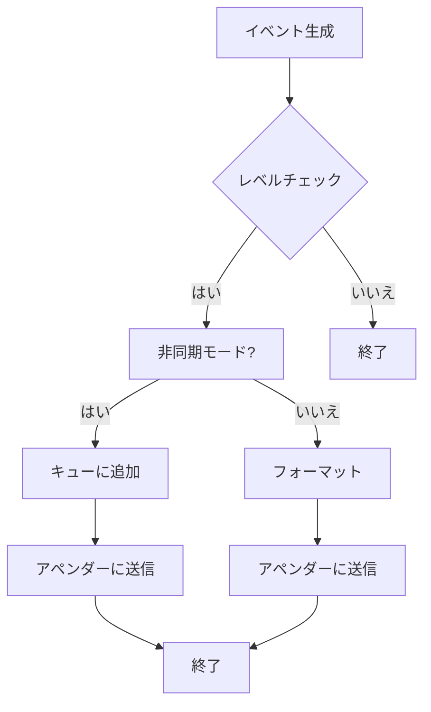

# デザイン文書

## 責務
- `include/log.h`：ログシステムの定義とインターフェースを提供する。
- `src/log/log.cpp`：ログイベントの生成、フォーマット、およびロガーの管理を行う。
- `src/log/appender.cpp`：異なる出力先へのログイベントの書き込み処理を行う。
- `src/log/field.h`：ログイベントの各フィールドをフォーマットするためのサブフォーマッタの定義とインターフェースを提供する。
- `src/log/field.cpp`：サブフォーマッタの具体的な実装を行う。
- `src/log/config_init.h`：ログシステムの設定初期化に関する構造体とユーティリティ関数の定義とインターフェースを提供する。
- `src/log/config_init.cpp`：設定ファイルからのロガー設定読み込みとマネージャーへの反映処理を行う。

## 公開インターフェース
- `include/log.h`
  - クラス: `Logger`, `Event`, `Formatter`, `Appender`, `StdOutAppender`, `FileAppender`, `Manager`, `EventWriter`
  - 関数: `LevelToString`, `StringToLevel`, `AppenderTypeToString`, `StringToAppenderType`, `Log`, `RootManager`, `RootLogger`, `FindLogger`

- `src/log/appender.cpp`
  - クラス: `StdOutAppender`, `FileAppender`
  - 関数: `AppenderTypeToString`, `StringToAppenderType`

- `src/log/field.h`
  - クラス: `Formatter::Field`, `Message`, `Level`, `ThreadId`, `DateTime`, `FileName`, `LineNum`, `NewLine`, `Tab`, `RawString`, `LoggerName`
  - 構造体: `RawField`

- `src/log/field.cpp`
  - 関数: `ParsePattern`, `RawFieldsToFormatFields`

- `src/log/config_init.h`
  - 構造体: `AppenderConfig`, `LoggerConfig`
  - クラス: `cfg::VarConverter<std::string, log::AppenderConfig>`, `cfg::VarConverter<log::AppenderConfig, std::string>`, `cfg::VarConverter<std::string, log::LoggerConfig>`, `cfg::VarConverter<log::LoggerConfig, std::string>`
  - 関数: `SetListener`

- `src/log/config_init.cpp`
  - 関数: `operator==` (AppenderConfig), `operator!=` (AppenderConfig), `operator==` (LoggerConfig), `operator!=` (LoggerConfig), `SetListener`

## 入力
- ログレベル (`Level`)
- イベントメッセージ (`std::string_view`)
- フォーマットパターン (`std::string_view`)
- アペンダータイプ (`AppenderType`)
- ファイル名 (`std::string_view`)
- YAML形式の設定データ

## 出力
- ログイベント (`Event`)
- フォーマットされたログメッセージ (`std::string`)
- YAML形式のロガー設定 (`std::string`)

## 状態
- `Logger`: ログレベル、キャパシティ、アペンダーのリスト、デフォルトフォーマッタ
- `Event`: レベル、ファイル名、行番号、スレッドID、タイムスタンプ、メッセージストリーム
- `Formatter`: パターン文字列、フィールドオブジェクトのリスト
- `Appender`: フォーマッターオブジェクト
- `StdOutAppender`: 標準出力への書き込み用アペンダー
- `FileAppender`: ファイルへの書き込み用アペンダー
- `Manager`: ロガーのマップ

## 処理手順
1. **ログイベントの生成**:
   - `Event::Create` を通じて新しいログイベントを作成する。
2. **フォーマットパターンの解析とフィールドオブジェクトの生成**:
   - `Formatter::Pattern` から `RawField` のリストを生成し、それを `Formatter::Field` オブジェクトのリストに変換する。
3. **ログメッセージのフォーマット**:
   - 各 `Formatter::Field` オブジェクトがイベント情報をフォーマットして出力ストリームに書き込む。
4. **ロガーへのイベント追加**:
   - ログレベルをチェックし、適切なアペンダーにイベントを送信する。
5. **イベントの同期/非同期処理**:
   - キューを使用してイベントを非同期に処理するか、直接同期的に処理する。
6. **設定ファイルからのロガー初期化**:
   - YAML形式の設定データから `LoggerConfig` を読み取り、マネージャーがロガーを作成しアペンダーを追加する。

## 例外・失敗条件
- `StringToLevel`, `StringToAppenderType`: 不正な文字列が与えられた場合に `std::invalid_argument` 例外を投げる。
- `FileAppender`: ファイルのオープンに失敗した場合に `std::system_error` 例外を投げる。

## 依存関係
- `include/log.h`:
  - `<chrono>`, `<experimental/source_location>`, `<fstream>`, `<iostream>`, `<list>`, `<memory>`, `<mutex>`, `<optional>`, `<sstream>`, `<string>`, `<string_view>`, `<thread>`, `<unordered_map>`
  - `config.h`, `containers/block_deque.h`, `util.h`

- `src/log/appender.cpp`:
  - `<stdexcept>`, `<syncstream>`

- `src/log/field.cpp`:
  - `<ctime>`, `<functional>`, `<stdexcept>`, `<unordered_map>`

- `src/log/config_init.cpp`:
  - `<cassert>`

## 重要な不変条件
- ログレベルは設定された値を保持する。
- フォーマットパターンは解析され、フィールドオブジェクトのリストに正しく変換される。
- イベントキューが閉じられると、非同期ログ処理スレッドは終了する。

## 追加詳細設計情報

### クラス図
```mermaid
classDiagram
    class Logger {
        +std::string_view Name() const noexcept
        +std::size_t Capacity() const noexcept
        +void Log(Event::Ptr event) noexcept
        +void AddAppender(Appender::Ptr appender) noexcept
        +void RemoveAppender(Appender::Ptr appender) noexcept
        +void ClearAppenders() noexcept
        +log::Level GetLevel() const noexcept
        +void SetLevel(log::Level level) noexcept
    }
    
    class Event {
        +std::string_view FileName() const noexcept
        +std::size_t LineNum() const noexcept
        +std::uint32_t ThreadId() const noexcept
        +Event::Clock::time_point Time() const noexcept
        +std::string Message() const noexcept
        +std::ostringstream& MessageStream() noexcept
    }
    
    class Formatter {
        +std::string Format(const Logger& logger, const Event& event) const noexcept
        +std::string_view Pattern() const noexcept
    }
    
    class Appender {
        +void Log(const Logger& logger, const Event& event) noexcept
        +std::string ToYamlString() const noexcept
    }
    
    class StdOutAppender {
        +void Log(const Logger& logger, const Event& event) noexcept
        +std::string ToYamlString() const noexcept
    }
    
    class FileAppender {
        +void Log(const Logger& logger, const Event& event) noexcept
        +std::string ToYamlString() const noexcept
    }
    
    class Manager {
        +Logger::Ptr FindLogger(std::string_view name, log::Level level, std::optional<std::size_t> capacity) noexcept
        +void RemoveLogger(std::string_view name) noexcept
    }
    
    Logger "1" -- "0..*" Appender : contains
    Formatter "1" -- "0..*" Formatter.Field : contains
    Event "1" -- "1" std::ostringstream : has
```

### クラス・メソッド・インターフェース詳細

| クラス/構造体 | メンバ名 | 型 | 可視性 | const | 引数 | 戻り値型 |
|---------------|----------|----|--------|-------|------|-----------|
| Logger        | Name     | std::string_view | public | あり | -      | std::string_view |
| Logger        | Capacity | std::size_t | public | あり | -      | std::size_t |
| Logger        | Log      | void | public | なし | Event::Ptr event | void |
| Logger        | AddAppender | void | public | なし | Appender::Ptr appender | void |
| Logger        | RemoveAppender | void | public | なし | Appender::Ptr appender | void |
| Logger        | ClearAppenders | void | public | なし | -      | void |
| Logger        | GetLevel | log::Level | public | あり | -      | log::Level |
| Logger        | SetLevel | void | public | なし | log::Level level | void |
| Event         | FileName | std::string_view | public | あり | -      | std::string_view |
| Event         | LineNum  | std::size_t | public | あり | -      | std::size_t |
| Event         | ThreadId | std::uint32_t | public | あり | -      | std::uint32_t |
| Event         | Time     | Event::Clock::time_point | public | あり | -      | Event::Clock::time_point |
| Event         | Message  | std::string | public | あり | -      | std::string |
| Event         | MessageStream | std::ostringstream& | public | なし | -      | std::ostringstream& |
| Formatter     | Format   | std::string | public | あり | const Logger& logger, const Event& event | std::string |
| Formatter     | Pattern  | std::string_view | public | あり | -      | std::string_view |
| Appender      | Log      | void | public | なし | const Logger& logger, const Event& event | void |
| Appender      | ToYamlString | std::string | public | あり | -      | std::string |
| StdOutAppender| Log      | void | public | なし | const Logger& logger, const Event& event | void |
| StdOutAppender| ToYamlString | std::string | public | あり | -      | std::string |
| FileAppender  | Log      | void | public | なし | const Logger& logger, const Event& event | void |
| FileAppender  | ToYamlString | std::string | public | あり | -      | std::string |
| Manager       | FindLogger | Logger::Ptr | public | なし | std::string_view name, log::Level level, std::optional<std::size_t> capacity | Logger::Ptr |
| Manager       | RemoveLogger | void | public | なし | std::string_view name | void |

### シーケンス図
```mermaid
sequenceDiagram
    participant User
    participant Logger
    participant Event
    participant Appender

    User->>Event: Create(level, location, thread_id, time)
    activate Event
    Event-->>Logger: Log(event)
    deactivate Event
    activate Logger
    alt async_
        Logger->>Logger: PushBack(event)
        activate Logger
        Logger->>Appender: Log(logger, event)
        deactivate Appender
    else !async_
        Logger->>Appender: Log(logger, event)
        activate Appender
        Appender-->>Logger: Format(logger, event)
        deactivate Appender
    end
    deactivate Logger
```

### メソッド仕様書

#### `Event::Create`
- **目的**: 新しいログイベントを作成する。
- **引数**:
  - `level`: ログレベル (`log::Level`)
  - `location`: イベントの発生場所 (`std::experimental::source_location`)
  - `thread_id`: スレッドID (`std::uint32_t`)
  - `time`: タイムスタンプ (`Event::Clock::time_point`)
- **戻り値**: 新しいイベントオブジェクトへの共有ポインタ (`Event::Ptr`)
- **動作**:
  - 引数から新しい `Event` オブジェクトを作成し、それを共有ポインタとして返す。
- **例外・エラー処理**: 無し

#### `Logger::Log`
- **目的**: ログイベントを処理する。
- **引数**:
  - `event`: ログイベント (`Event::Ptr`)
- **戻り値**: 無し
- **動作**:
  - イベントのレベルがロガーの最低レベル以上である場合、イベントを適切なアペンダーに送信する。
  - 非同期モードの場合、イベントキューに追加する。同期モードの場合、直接アペンダーやフォーマッタにイベントを送信する。
- **例外・エラー処理**: 無し

#### `Formatter::Format`
- **目的**: ログイベントを指定されたフォーマットパターンに基づいてフォーマットする。
- **引数**:
  - `logger`: ロガー (`const Logger&`)
  - `event`: ログイベント (`const Event&`)
- **戻り値**: フォーマットされたログメッセージ (`std::string`)
- **動作**:
  - 各フィールドオブジェクトがイベント情報をフォーマットして出力ストリームに書き込む。
- **例外・エラー処理**: 無し

### 処理フロー図


### 状態遷移・副作用

| 状態 | 遷移条件 | 変更対象 | 更新後状態 | 更新順序 | 副作用 |
|------|----------|----------|------------|----------|--------|
| 同期モード | イベント追加 | `appenders_` | フォーマットされたメッセージがアペンダーに送信される | 1. ロック取得, 2. アペンダーオブジェクトの呼び出し | メッセージ出力 |
| 非同期モード | イベント追加 | `event_deque_` | イベントキューにイベントが追加される | 1. ロック取得, 2. キューオブジェクトの呼び出し | 無し |
| 設定変更 | 新しい設定読み込み | `loggers_` | マネージャー内のロガーが更新される | 1. 古いロガー削除, 2. 新しいロガー作成, 3. アペンダー追加 | 無し |

### データ変換・制約

| 入力データ | 変換規則 | 出力データ |
|------------|----------|------------|
| ログレベル文字列 | `StringToLevel` | `log::Level` |
| フォーマットパターン | `ParsePattern`, `RawFieldsToFormatFields` | `Formatter::Field::Ptr` のリスト |
| YAML設定データ | `SetListener` | `LoggerConfig` のリスト |

- **制約**:
  - ログレベル文字列は有効な値 (`Debug`, `Info`, `Warn`, `Error`, `Fatal`) でなければならない。
  - フォーマットパターンは `%` で始まるタグとオプションのフォーマットを含む文字列でなければならない。
  - YAML設定データは正しい構造を持つべきであり、必須フィールド (`name`, `level`, `appenders`) を含まなければならない。