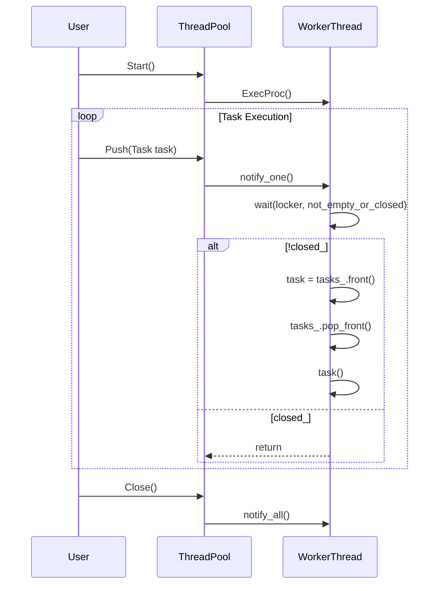

# スレッドプールの設計文書

## 責務
- `ThreadPool`クラスは、指定された数のワーカースレッドを使用してタスクを並列に実行します。
- タスクの追加とスレッドプールの開始・終了を管理します。

## 公開インターフェース
- `ThreadPool(std::optional<std::size_t> thread_count = std::nullopt, log::Logger::Ptr logger = log::RootLogger()) noexcept`: スレッドプールを作成します。
- `~ThreadPool() noexcept`: スレッドプールを破棄し、すべてのワーカースレッドを終了させます。
- `void Start() noexcept`: スレッドプールを開始します。
- `void Push(Task task) noexcept`: タスクをスレッドプールに追加します。
- `void Close() noexcept`: スレッドプールを閉じ、未処理のタスクを実行せずに終了させます。

## 入力
- `thread_count`: 作成するワーカースレッドの数。`std::nullopt`または0の場合、ハードウェアがサポートする並列スレッド数を使用します。
- `logger`: ロガーインスタンス。指定しない場合、グローバルルートロガーを使用します。
- `task`: 実行するタスク（`std::function<void()>`型）。

## 出力
- なし

## 状態
- `closed_`: スレッドプールが閉じているかどうかを示すフラグ。
- `thread_count_`: ワーカースレッドの数。
- `tasks_`: 実行待ちのタスクリスト。
- `threads_`: ワーカースレッドのリスト。

## 処理手順
1. **コンストラクタ**: 
   - ロガーを設定します。指定がない場合はグローバルルートロガーを使用します。
   - スレッド数を設定します。指定がない場合、ハードウェアがサポートする並列スレッド数を使用します。

2. **デストラクタ**:
   - `Close()`メソッドを呼び出してスレッドプールを閉じます。
   - すべてのワーカースレッドを`join`して終了させます。

3. **Start()**:
   - スレッドプールが既に開始されている場合は何もせずに終了します。
   - 指定された数のワーカースレッドを作成し、それぞれ`ExecProc()`メソッドを実行するように設定します。

4. **Push(Task task)**:
   - スレッドプールが閉じている場合は何もせずに終了します。
   - タスクキューにタスクを追加し、待機中のワーカースレッドに通知します。

5. **ExecProc()**:
   - 未処理のタスクがあるか、またはスレッドプールが閉じているかをチェックします。
   - タスクキューからタスクを取り出し実行します。例外が発生した場合はロガーに記録します。

6. **Close()**:
   - スレッドプールを閉じるフラグを立てます。
   - すべてのワーカースレッドに通知して待機中のスレッドを終了させます。

## 例外・失敗条件
- `Push(Task task)`メソッドはスレッドプールが閉じている場合、タスクを追加せずに終了します。
- `ExecProc()`メソッド内でタスクの実行中に例外が発生した場合はロガーに記録されますが、例外自体は再スローされません。

## 依存関係
- `log::Logger`: ログ出力に使用されます。
- `std::function<void()>`: タスクとして登録される関数オブジェクトの型です。
- `std::thread`, `std::mutex`, `std::condition_variable`: スレッド管理と同期に使用されます。

## 重要な不変条件
- `closed_`が`true`の場合、タスクキューへの追加は許可されません。
- `Start()`メソッドが呼び出された後、`closed_`フラグが立てられるまでワーカースレッドは動作し続けます。

## 追加詳細設計情報

### クラス図
```mermaid
classDiagram
    class ThreadPool {
        +using Task = std::function<void()>
        +ThreadPool(std::optional<std::size_t> thread_count, log::Logger::Ptr logger) noexcept
        +~ThreadPool(const ThreadPool&) 
        +~ThreadPool(ThreadPool&&) 
        +~ThreadPool& operator=(const ThreadPool&)
        +~ThreadPool& operator=(ThreadPool&&)
        +void Start() noexcept
        +void Push(Task task) noexcept
        +void Close() noexcept
        -void ExecProc() noexcept
        -log::Logger::Ptr logger_
        -mutable std::mutex mtx_
        -std::atomic_bool closed_ {true}
        -std::size_t thread_count_
        -std::condition_variable cond_
        -std::list<Task> tasks_
        -std::list<std::thread> threads_
    }
```

### クラス・メソッド・インターフェース詳細
| 名前 | 完全な名前 | 属性 | 引数名と型 | 戻り値型 | 可視性 | const | noexcept |
|------|------------|------|------------|----------|--------|-------|----------|
| コンストラクタ | `ThreadPool::ThreadPool` | - | `std::optional<std::size_t> thread_count`, `log::Logger::Ptr logger` | - | public | - | ✅ |
| デストラクタ | `ThreadPool::~ThreadPool` | - | - | - | public | - | ✅ |
| コピーコンストラクタ | `ThreadPool::ThreadPool(const ThreadPool&)` | 削除 | - | - | public | - | ✅ |
| ムーブコンストラクタ | `ThreadPool::ThreadPool(ThreadPool&&)` | 削除 | - | - | public | - | ✅ |
| コピー代入演算子 | `ThreadPool& ThreadPool::operator=(const ThreadPool&)` | 削除 | - | `ThreadPool&` | public | - | ✅ |
| ムーブ代入演算子 | `ThreadPool& ThreadPool::operator=(ThreadPool&&)` | 削除 | - | `ThreadPool&` | public | - | ✅ |
| Start | `void ThreadPool::Start()` | - | - | void | public | - | ✅ |
| Push | `void ThreadPool::Push(Task task)` | - | `Task task` | void | public | - | ✅ |
| Close | `void ThreadPool::Close()` | - | - | void | public | - | ✅ |
| ExecProc | `void ThreadPool::ExecProc()` | - | - | void | private | - | ✅ |

### シーケンス図


### メソッド仕様書
#### Start()
- **目的**: スレッドプールを開始します。
- **引数**: なし
- **戻り値**: void
- **動作**: 指定された数のワーカースレッドを作成し、それぞれ`ExecProc()`メソッドを実行するように設定します。
- **副作用**: `closed_`フラグが`false`に設定されます。
- **エラー処理**: スレッドプールが既に開始されている場合は何もせずに終了します。

#### Push(Task task)
- **目的**: タスクをスレッドプールに追加します。
- **引数**: `Task task`: 実行するタスク
- **戻り値**: void
- **動作**: タスクキューにタスクを追加し、待機中のワーカースレッドに通知します。
- **副作用**: タスクキューが更新されます。
- **エラー処理**: スレッドプールが閉じている場合は何もせずに終了します。

#### Close()
- **目的**: スレッドプールを閉じ、未処理のタスクを実行せずに終了させます。
- **引数**: なし
- **戻り値**: void
- **動作**: `closed_`フラグを立ててすべてのワーカースレッドに通知します。
- **副作用**: `closed_`フラグが`true`に設定され、タスクキューはクリアされます。

#### ExecProc()
- **目的**: 未処理のタスクがあるか、またはスレッドプールが閉じているかをチェックし、タスクキューからタスクを取り出して実行します。
- **引数**: なし
- **戻り値**: void
- **動作**: タスクキューからタスクを取り出し実行します。例外が発生した場合はロガーに記録します。
- **副作用**: タスクキューが更新されます。
- **エラー処理**: 例外が発生した場合、ロガーに例外メッセージを記録します。

### 処理フロー図
```mermaid
graph TD
    A[Start()] --> B{closed_?}
    B -- true --> C[return]
    B -- false --> D[Create Worker Threads]
    E[Push(Task task)] --> F{closed_?}
    F -- true --> G[return]
    F -- false --> H[Lock mtx_]
    I[tasks_.push_back(task)]
    J[Unlock mtx_]
    K[cond_.notify_one()]
    L[ExecProc()] --> M{not_empty_or_closed?}
    M -- false --> N[wait(locker, not_empty_or_closed)]
    O[closed_?] --> P[return]
    Q[tasks_.front() -> task]
    R[tasks_.pop_front()]
    S[task()]
    T[catch exception] --> U[log error]
```

### 状態遷移・副作用
| 更新前状態 | 遷移条件 | 変更対象 | 更新後状態 | 更新順序 | 副作用 |
|------------|----------|----------|------------|----------|--------|
| closed_ = true | Start() | closed_ | false | 1 | Worker Threads Created |
| closed_ = false | Push(Task task) | tasks_ | task added | 1 | cond_.notify_one() |
| closed_ = false | ExecProc() | tasks_ | task removed | 2 | task executed or logged error |

### データ変換・制約
- `thread_count`: 指定がない場合、ハードウェアがサポートする並列スレッド数を使用します。
- `tasks_`: タスクキューにタスクを追加し、ワーカースレッドから取り出されます。
- `closed_`: スレッドプールの開始と終了によって変更され、タスクの追加や実行が制御されます。