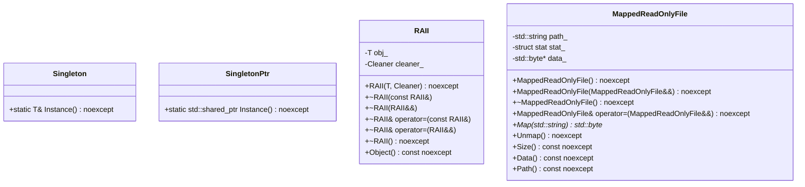
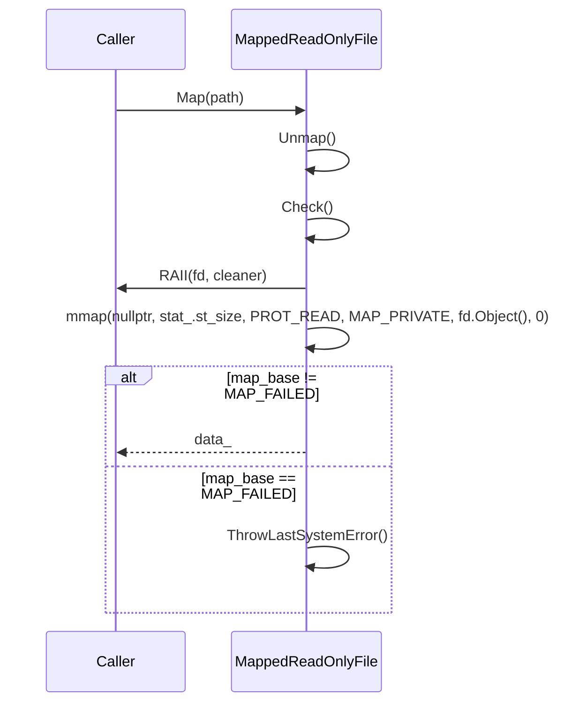
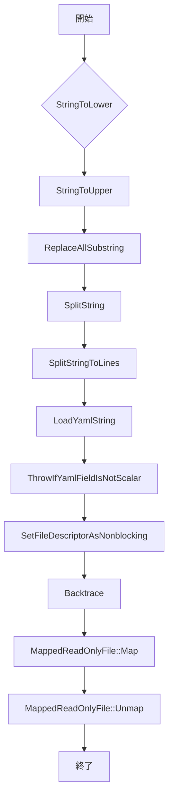

# デザイン文書

## 責務
`util.h`と`util.cpp`は、文字列操作、ファイルディスクリプタの管理、YAMLの読み込み、バックトレースの取得、シングルトンパターンの実装、RAIIの利用、およびメモリマップされたファイルの読み取りなどの汎用的なユーティリティ機能を提供します。

## 公開インターフェース
- `StringToLower`, `StringToUpper`: 文字列の大文字小文字変換。
- `ReplaceAllSubstring`: 文字列内の部分文字列の置き換え。
- `SplitString`, `SplitStringToLines`: 文字列の分割。
- `LoadYamlString`, `ThrowIfYamlFieldIsNotScalar`: YAMLデータの読み込みと検証。
- `IsValidFileDescriptor`: ファイルディスクリプタの有効性チェック。
- `SetFileDescriptorAsNonblocking`: ファイルディスクリプタをノンブロッキングモードに設定。
- `ThrowLastSystemError`: 最後のシステムエラーを例外として投げる。
- `CurrentThreadId`: 現在のスレッドIDを取得。
- `Backtrace`: 呼び出し元のバックトレース情報を取得。
- `Singleton`, `SingletonPtr`: シングルトンパターンの実装。
- `RAII`: リソース管理用のRAIIクラス。
- `MappedReadOnlyFile`: 読み取り専用ファイルをメモリにマッピングするクラス。

## 入力
- 文字列操作関数: 変換や分割対象となる文字列、置き換え元・先の部分文字列、正規表現パターン。
- YAML読み込み関数: YAML形式の文字列と必須フィールドリスト。
- ファイルディスクリプタ管理関数: ファイルディスクリプタの値。
- バックトレース取得関数: スタックサイズ、スキップするフレーム数、プレフィックス文字列。

## 出力
- 文字列操作関数: 変換や分割後の文字列。
- YAML読み込み関数: YAMLノードオブジェクト。
- ファイルディスクリプタ管理関数: なし（副作用あり）。
- バックトレース取得関数: スタックフレームのリスト、バックトレース情報の文字列。

## 状態
- `MappedReadOnlyFile`: マッピングされたファイルデータへのポインタ、ファイルサイズ、ファイルパス。

## 処理手順
1. **文字列操作**: 文字列を指定した方法で変換または分割する。
2. **YAML読み込み**: YAML形式の文字列からノードを作成し、必須フィールドが存在することを確認する。
3. **ファイルディスクリプタ管理**: ファイルディスクリプタの有効性チェックとノンブロッキングモードへの設定。
4. **バックトレース取得**: 呼び出し元のスタックフレーム情報を収集し、必要に応じて文字列形式で出力する。
5. **シングルトンパターン**: インスタンスが存在しない場合は新規作成し、既存のインスタンスを返す。
6. **RAII**: リソース管理用オブジェクトを作成し、デストラクタでリソースを解放する。
7. **メモリマップファイル読み取り**: 指定されたファイルをメモリにマッピングし、データへのアクセスを提供する。

## 例外・失敗条件
- 文字列操作関数: 無効な入力文字列の場合、未定義動作となる。
- YAML読み込み関数: 必須フィールドが存在しない場合、`std::invalid_argument`を投げる。YAMLのパースに失敗した場合も同様。
- ファイルディスクリプタ管理関数: 無効なファイルディスクリプタやノンブロッキングモードへの設定に失敗した場合、`std::system_error`を投げる。
- バックトレース取得関数: スタック情報の収集に失敗した場合、未定義動作となる。
- `MappedReadOnlyFile`: ファイルがディレクトリである場合やアクセス権限がない場合、それぞれ`std::invalid_argument`と`std::runtime_error`を投げる。マッピングに失敗した場合は`std::system_error`を投げる。

## 依存関係
- `fmt/format.h`: 文字列フォーマット用。
- `yaml-cpp/yaml.h`: YAMLデータの読み込みと操作用。
- `<sys/stat.h>`, `<fcntl.h>`, `<sys/mman.h>`, `<unistd.h>`: ファイル操作、メモリマッピング用。
- `<concepts>`, `<functional>`, `<initializer_list>`, `<memory>`, `<regex>`, `<string>`, `<string_view>`, `<utility>`, `<vector>`: 標準ライブラリ機能の利用。

## 重要な不変条件
- `MappedReadOnlyFile`: ファイルがマッピングされている場合、`data_`は有効なポインタでなければならず、`stat_`と`path_`も適切に初期化されている。
- シングルトンクラス: 一度インスタンスが作成されると、それ以降同じインスタンスが返される。

## 追加詳細設計情報

### クラス図

### クラス・メソッド・インターフェース詳細

| クラス/関数名 | 完全な名前 | 属性 | 引数名と型 | 戻り値型 | 可視性 | `const` | 参照 | ポインタ | `static` | `virtual` | `noexcept` |
|---------------|------------|------|------------|----------|--------|---------|--------|----------|----------|-----------|------------|
| Singleton     | ws::Singleton<T, Args...>::Instance<Args...> | 静的メソッド | args | T& | 公開 | あり | なし | なし | あり | なし | あり |
| SingletonPtr  | ws::SingletonPtr<T, Args...>::Instance<Args...> | 静的メソッド | args | std::shared_ptr<T> | 公開 | あり | なし | なし | あり | なし | あり |
| RAII          | ws::RAII<T, Cleaner>::RAII(T, Cleaner) | コンストラクタ | obj, cleaner | void | 公開 | なし | なし | なし | なし | なし | あり |
| RAII          | ws::RAII<T, Cleaner>::~RAII() | デストラクタ | - | void | 公開 | なし | なし | なし | なし | なし | あり |
| RAII          | ws::RAII<T, Cleaner>::Object() const | メソッド | - | const T& | 公開 | あり | なし | なし | なし | なし | あり |
| MappedReadOnlyFile | ws::MappedReadOnlyFile::MappedReadOnlyFile() | コンストラクタ | - | void | 公開 | なし | なし | なし | なし | なし | あり |
| MappedReadOnlyFile | ws::MappedReadOnlyFile::MappedReadOnlyFile(MappedReadOnlyFile&&) | ムーブコンストラクタ | o | void | 公開 | なし | なし | なし | なし | なし | あり |
| MappedReadOnlyFile | ws::MappedReadOnlyFile::~MappedReadOnlyFile() | デストラクタ | - | void | 公開 | なし | なし | なし | なし | なし | あり |
| MappedReadOnlyFile | ws::MappedReadOnlyFile::operator=(MappedReadOnlyFile&&) | ムーブ代入演算子 | o | MappedReadOnlyFile& | 公開 | なし | なし | なし | なし | なし | あり |
| MappedReadOnlyFile | ws::MappedReadOnlyFile::Map(std::string) | メソッド | path | std::byte* | 公開 | なし | なし | なし | なし | なし | なし |
| MappedReadOnlyFile | ws::MappedReadOnlyFile::Unmap() | メソッド | - | void | 公開 | なし | なし | なし | なし | なし | あり |
| MappedReadOnlyFile | ws::MappedReadOnlyFile::Size() const | メソッド | - | std::size_t | 公開 | あり | なし | なし | なし | なし | あり |
| MappedReadOnlyFile | ws::MappedReadOnlyFile::Data() const | メソッド | - | std::byte* | 公開 | あり | なし | なし | なし | なし | あり |
| MappedReadOnlyFile | ws::MappedReadOnlyFile::Path() const | メソッド | - | std::string_view | 公開 | あり | なし | なし | なし | なし | あり |

### シーケンス図

### メソッド仕様書

#### `StringToLower`
- **目的**: 文字列を全て小文字に変換する。
- **引数**: `str` (std::string) - 変換対象の文字列。
- **戻り値**: std::string - 小文字に変換された文字列。
- **動作**: 入力文字列の各文字を小文字に変換し、新しい文字列として返す。
- **副作用**: なし
- **エラー処理**: 無効な入力文字列の場合、未定義動作となる。

#### `StringToUpper`
- **目的**: 文字列を全て大文字に変換する。
- **引数**: `str` (std::string) - 変換対象の文字列。
- **戻り値**: std::string - 大文字に変換された文字列。
- **動作**: 入力文字列の各文字を大文字に変換し、新しい文字列として返す。
- **副作用**: なし
- **エラー処理**: 無効な入力文字列の場合、未定義動作となる。

#### `ReplaceAllSubstring`
- **目的**: 文字列内の指定された部分文字列を別の部分文字列に置き換える。
- **引数**: 
  - `str` (std::string_view) - 置き換え対象の文字列。
  - `from` (std::string_view) - 置き換え元の部分文字列。
  - `to` (std::string_view) - 置き換え先の部分文字列。
- **戻り値**: std::string - 置き換えた後の文字列。
- **動作**: 入力文字列内の指定された部分文字列を全て置き換えて新しい文字列として返す。
- **副作用**: なし
- **エラー処理**: 無効な入力文字列の場合、未定義動作となる。

#### `SplitString`
- **目的**: 文字列を指定された正規表現パターンで分割する。
- **引数**: 
  - `str` (const std::string&) - 分割対象の文字列。
  - `pattern` (const std::regex&) - 正規表現パターン。
- **戻り値**: std::vector<std::string> - 分割された文字列リスト。
- **動作**: 入力文字列を指定された正規表現パターンで分割し、その結果の文字列リストとして返す。
- **副作用**: なし
- **エラー処理**: 無効な入力文字列の場合、未定義動作となる。

#### `SplitStringToLines`
- **目的**: 文字列を行単位で分割する。
- **引数**: `str` (const std::string&) - 分割対象の文字列。
- **戻り値**: std::vector<std::string> - 行ごとの文字列リスト。
- **動作**: 入力文字列を改行コードで分割し、その結果の文字列リストとして返す。
- **副作用**: なし
- **エラー処理**: 無効な入力文字列の場合、未定義動作となる。

#### `LoadYamlString`
- **目的**: YAML形式の文字列からノードを作成し、必須フィールドが存在することを確認する。
- **引数**: 
  - `str` (std::string_view) - YAML形式の文字列。
  - `required_fields` (std::initializer_list<std::string_view>) - 必須フィールドリスト。
- **戻り値**: YAML::Node - YAMLノードオブジェクト。
- **動作**: 入力文字列からYAMLノードを作成し、必須フィールドが全て存在することを確認する。存在しない場合は例外を投げる。
- **副作用**: なし
- **エラー処理**: 必須フィールドが存在しない場合、`std::invalid_argument`を投げる。

#### `ThrowIfYamlFieldIsNotScalar`
- **目的**: YAMLノードの指定されたフィールドがスカラーであることを確認し、そうでない場合は例外を投げる。
- **引数**: 
  - `node` (const YAML::Node&) - YAMLノードオブジェクト。
  - `field` (std::string_view) - 確認対象のフィールド名。
- **戻り値**: void
- **動作**: 指定されたフィールドが存在し、かつスカラーであることを確認する。そうでない場合は例外を投げる。
- **副作用**: なし
- **エラー処理**: フィールドが存在しないかスカラーでない場合、`std::invalid_argument`を投げる。

#### `SetFileDescriptorAsNonblocking`
- **目的**: 指定されたファイルディスクリプタをノンブロッキングモードに設定する。
- **引数**: `fd` (FileDescriptor) - ファイルディスクリプタの値。
- **戻り値**: void
- **動作**: 入力ファイルディスクリプタをノンブロッキングモードに設定する。設定に失敗した場合は例外を投げる。
- **副作用**: ファイルディスクリプタの状態が変更される。
- **エラー処理**: 無効なファイルディスクリプタやノンブロッキングモードへの設定に失敗した場合、`std::system_error`を投げる。

#### `Backtrace`
- **目的**: 呼び出し元のスタックフレーム情報を取得する。
- **引数**: 
  - `stack` (std::vector<std::string>&) - スタックフレーム情報を受け取るベクター。
  - `size` (std::size_t) - 取得する最大スタックサイズ。
  - `skip` (std::size_t) - スキップするフレーム数（デフォルト: 0）。
- **戻り値**: void
- **動作**: 呼び出し元のスタックフレーム情報を取得し、指定されたベクターに格納する。
- **副作用**: スタック情報が変更される可能性がある。
- **エラー処理**: スタック情報の収集に失敗した場合、未定義動作となる。

#### `MappedReadOnlyFile::Map`
- **目的**: 指定されたファイルをメモリにマッピングする。
- **引数**: `path` (std::string) - マッピング対象のファイルパス。
- **戻り値**: std::byte* - マッピングされたデータへのポインタ。
- **動作**: 指定されたファイルをメモリにマッピングし、そのデータへのポインタを返す。マッピングに失敗した場合は例外を投げる。
- **副作用**: ファイルがメモリにマッピングされる。
- **エラー処理**: ファイルがディレクトリである場合やアクセス権限がない場合、それぞれ`std::invalid_argument`と`std::runtime_error`を投げる。マッピングに失敗した場合は`std::system_error`を投げる。

#### `MappedReadOnlyFile::Unmap`
- **目的**: メモリにマッピングされたファイルをアンマップする。
- **引数**: なし
- **戻り値**: void
- **動作**: メモリにマッピングされたファイルをアンマップし、内部状態を初期化する。
- **副作用**: ファイルがメモリからアンマップされる。
- **エラー処理**: なし

### 処理フロー図

### 状態遷移・副作用
| 更新前状態 | 遷移条件 | 変更対象 | 更新後状態 | 更新順序 | 外部資源への副作用 |
|------------|----------|----------|------------|----------|----------------------|
| なし       | ファイルパス指定 | path_      | 指定されたファイルパス | 1        | ファイルオープン、マッピング |
| マッピング済み | アンマップ要求 | data_, stat_, path_ | 初期状態 | 2        | メモリアンマップ |

### データ変換・制約
| 入力データ | 変換規則 | 出力データ |
|------------|----------|------------|
| 文字列     | 小文字に変換 | 小文字の文字列 |
| 文字列     | 大文字に変換 | 大文字の文字列 |
| 文字列     | 部分文字列置き換え | 置き換え後の文字列 |
| 文字列     | 正規表現による分割 | 分割された文字列リスト |
| YAML文字列 | ノード化と必須フィールド確認 | YAMLノードオブジェクト |
| ファイルパス | メモリマッピング | マッピングされたデータへのポインタ |

この設計文書は、`util.h`と`util.cpp`の再実装に必要な詳細な情報を提供します。各関数やクラスの動作、依存関係、例外処理などを明確に記述しています。