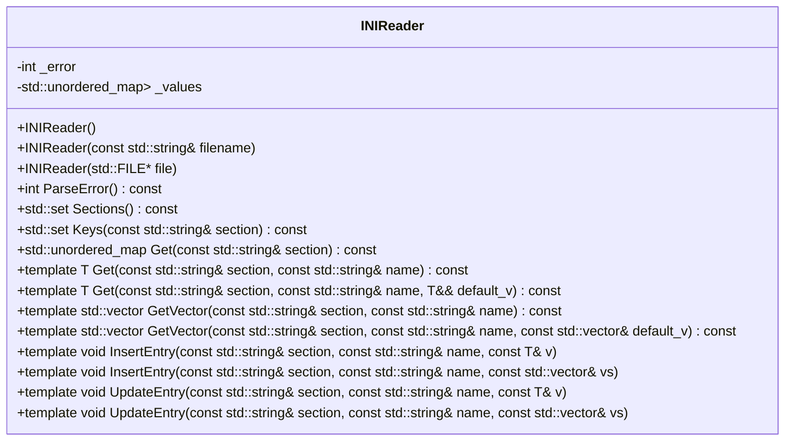
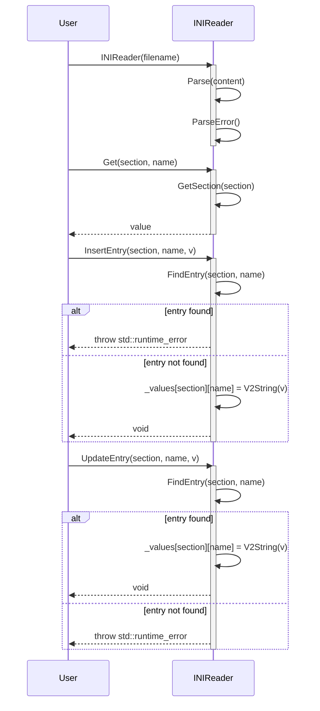

# 設計文書: INIReader クラス

## 責務
INIファイルを読み込み、セクションとキーの値を提供する。また、新しいエントリを挿入し、既存のエントリを更新できる。

## 公開インターフェース
- `INIReader()`: 空のコンストラクタ。
- `INIReader(const std::string& filename)`: ファイル名からINIファイルを読み込む。
- `INIReader(std::FILE* file)`: ファイルポインタからINIファイルを読み込む。
- `int ParseError() const`: 解析エラーの結果を返す。
- `std::set<std::string> Sections() const`: INIファイル内のセクションリストを返す。
- `std::set<std::string> Keys(const std::string& section) const`: 指定したセクション内のキーリストを返す。
- `std::unordered_map<std::string, std::string> Get(const std::string& section) const`: 指定したセクションの値マップを返す。
- `template <typename T = std::string> T Get(const std::string& section, const std::string& name) const`: 指定したセクションとキーの値を取得する。
- `template <typename T> T Get(const std::string& section, const std::string& name, T&& default_v) const`: 指定したセクションとキーの値を取得し、存在しない場合はデフォルト値を返す。
- `template <typename T = std::string> std::vector<T> GetVector(const std::string& section, const std::string& name) const`: 指定したセクションとキーの値配列を取得する。
- `template <typename T> std::vector<T> GetVector(const std::string& section, const std::string& name, const std::vector<T>& default_v) const`: 指定したセクションとキーの値配列を取得し、存在しない場合はデフォルト値を返す。
- `template <typename T = std::string> void InsertEntry(const std::string& section, const std::string& name, const T& v)`: 指定したセクションとキーにエントリを挿入する。
- `template <typename T = std::string> void InsertEntry(const std::string& section, const std::string& name, const std::vector<T>& vs)`: 指定したセクションとキーに値配列のエントリを挿入する。
- `template <typename T = std::string> void UpdateEntry(const std::string& section, const std::string& name, const T& v)`: 指定したセクションとキーのエントリを更新する。
- `template <typename T = std::string> void UpdateEntry(const std::string& section, const std::string& name, const std::vector<T>& vs)`: 指定したセクションとキーの値配列のエントリを更新する。

## 入力
- ファイル名 (`std::string`)
- ファイルポインタ (`std::FILE*`)
- セクション名 (`std::string`)
- キー名 (`std::string`)
- 値 (`T`)

## 出力
- 解析エラーの結果 (`int`)
- セクションリスト (`std::set<std::string>`)
- キーリスト (`std::set<std::string>`)
- 値マップ (`std::unordered_map<std::string, std::string>`)
- 値 (`T`)
- 値配列 (`std::vector<T>`)

## 状態
- `_error`: 解析結果を表す整数値。
- `_values`: セクションとキーの値を保持するマップ。

## 処理手順
1. コンストラクタでINIファイルを読み込み、`Parse`メソッドを使用して内容を解析する。
2. `ParseError`メソッドで解析エラーをチェックし、適切な例外をスローする。
3. `Sections`, `Keys`, `Get`, `GetVector`メソッドでセクションやキーの値にアクセスする。
4. `InsertEntry`, `UpdateEntry`メソッドで新しいエントリを挿入または既存のエントリを更新する。

## 例外・失敗条件
- ファイルが開けない場合、`std::runtime_error`をスローする。
- 解析中にエラーが発生した場合、`_error`にエラーライン番号を設定し、`ParseError`メソッドで例外をスローする。
- セクションやキーが存在しない場合、`std::runtime_error`をスローする。
- 既存のキーに重複して挿入しようとした場合、`std::runtime_error`をスローする。

## 依存関係
- `std::ifstream`, `std::ofstream`: ファイル操作。
- `std::string`, `std::string_view`: 文字列処理。
- `std::unordered_map`, `std::set`: コレクション。
- `std::istringstream`, `std::ostringstream`: ストリーム操作。
- `detail`名前空間: 一部のユーティリティ関数。

## 重要な不変条件
- `_values`は常に有効なセクションとキーのマップを保持する。
- `_error`は解析結果を正確に反映し、エラーが発生した場合は適切な値を持つ。

## 追加詳細設計情報

### クラス図


### クラス・メソッド・インターフェース詳細

| メンバ名 | 型 | 可視性 | const | 引数 | 戻り値型 |
| --- | --- | --- | --- | --- | --- |
| INIReader() | コンストラクタ | public | - | - | void |
| INIReader(const std::string& filename) | コンストラクタ | public | - | const std::string& filename | void |
| INIReader(std::FILE* file) | コンストラクタ | public | - | std::FILE* file | void |
| ParseError() | メソッド | public | const | - | int |
| Sections() | メソッド | public | const | - | std::set<std::string> |
| Keys(const std::string& section) | メソッド | public | const | const std::string& section | std::set<std::string> |
| Get(const std::string& section) | メソッド | public | const | const std::string& section | std::unordered_map<std::string, std::string> |
| Get(const std::string& section, const std::string& name) | テンプレートメソッド | public | const | const std::string& section, const std::string& name | T |
| Get(const std::string& section, const std::string& name, T&& default_v) | テンプレートメソッド | public | const | const std::string& section, const std::string& name, T&& default_v | T |
| GetVector(const std::string& section, const std::string& name) | テンプレートメソッド | public | const | const std::string& section, const std::string& name | std::vector<T> |
| GetVector(const std::string& section, const std::string& name, const std::vector<T>& default_v) | テンプレートメソッド | public | const | const std::string& section, const std::string& name, const std::vector<T>& default_v | std::vector<T> |
| InsertEntry(const std::string& section, const std::string& name, const T& v) | テンプレートメソッド | public | - | const std::string& section, const std::string& name, const T& v | void |
| InsertEntry(const std::string& section, const std::string& name, const std::vector<T>& vs) | テンプレートメソッド | public | - | const std::string& section, const std::string& name, const std::vector<T>& vs | void |
| UpdateEntry(const std::string& section, const std::string& name, const T& v) | テンプレートメソッド | public | - | const std::string& section, const std::string& name, const T& v | void |
| UpdateEntry(const std::string& section, const std::string& name, const std::vector<T>& vs) | テンプレートメソッド | public | - | const std::string& section, const std::string& name, const std::vector<T>& vs | void |

### シーケンス図


### メソッド仕様書

#### `ParseError()`
- **目的**: 解析エラーの結果を返す。
- **引数**: なし
- **戻り値型**: int
- **動作**: `_error`の値に応じて適切な例外をスローする。0の場合正常終了。
- **副作用**: なし

#### `Sections()`
- **目的**: INIファイル内のセクションリストを返す。
- **引数**: なし
- **戻り値型**: std::set<std::string>
- **動作**: `_values`のキーからセクション名のセットを作成して返す。
- **副作用**: なし

#### `Keys(const std::string& section)`
- **目的**: 指定したセクション内のキーリストを返す。
- **引数**: const std::string& section
- **戻り値型**: std::set<std::string>
- **動作**: `_values`から指定されたセクションのキー名のセットを作成して返す。
- **副作用**: なし

#### `Get(const std::string& section, const std::string& name)`
- **目的**: 指定したセクションとキーの値を取得する。
- **引数**: const std::string& section, const std::string& name
- **戻り値型**: T (テンプレートパラメータ)
- **動作**: `_values`から指定されたセクションとキーの値を取り出し、適切な型に変換して返す。
- **例外処理**: セクションやキーが存在しない場合、`std::runtime_error`をスローする。

#### `InsertEntry(const std::string& section, const std::string& name, const T& v)`
- **目的**: 指定したセクションとキーにエントリを挿入する。
- **引数**: const std::string& section, const std::string& name, const T& v
- **戻り値型**: void
- **動作**: `_values`に指定されたセクションとキーのエントリを挿入する。既存のキーが存在する場合は例外をスローする。
- **例外処理**: 重複したキーが存在する場合、`std::runtime_error`をスローする。

### 処理フロー図
```mermaid
graph TD
    A[INIReader(filename)] --> B{ファイル開けた?}
    B -- いいえ --> C[throw std::runtime_error]
    B -- はい --> D[内容読み込み]
    D --> E[Parse(content)]
    E --> F[ParseError()]
    F --> G[正常終了]

    H[Get(section, name)] --> I[GetSection(section)]
    I --> J{セクション存在?}
    J -- いいえ --> K[throw std::runtime_error]
    J -- はい --> L[キー検索]
    L --> M{キー存在?}
    M -- いいえ --> N[throw std::runtime_error]
    M -- はい --> O[値取得]
    O --> P[型変換]
    P --> Q[戻り値]

    R[InsertEntry(section, name, v)] --> S{セクション存在?}
    S -- いいえ --> T[セクション作成]
    S -- はい --> U[キー検索]
    U --> V{キー存在?}
    V -- いいえ --> W[エントリ挿入]
    V -- はい --> X[throw std::runtime_error]

    Y[UpdateEntry(section, name, v)] --> Z{セクション存在?}
    Z -- いいえ --> AA[throw std::runtime_error]
    Z -- はい --> AB[キー検索]
    AB --> AC{キー存在?}
    AC -- いいえ --> AD[throw std::runtime_error]
    AC -- はい --> AE[エントリ更新]
```

### 状態遷移・副作用

| 更新前状態 | 遷移条件 | 変更対象 | 更新後状態 | 更新順序 | 副作用 |
| --- | --- | --- | --- | --- | --- |
| `_error = 0` | ファイル開けない | `_error` | `-1` | - | `std::runtime_error`スロー |
| `_values.empty()` | セクション挿入 | `_values[section]` | `{}` | - | なし |
| `_values[section].empty()` | キー挿入 | `_values[section][name]` | `value` | - | なし |
| `_values[section][name]`存在 | キー更新 | `_values[section][name]` | `new_value` | - | なし |

### データ変換・制約

| 入力データ | 変換規則 | 出力データ |
| --- | --- | --- |
| 文字列 (`std::string`) | `Converter<T>` | 型Tの値 |
| 値配列 (`std::vector<std::string>`) | `Vec2String` | スペース区切り文字列 |
| スペース区切り文字列 | `GetVector<T>` | 型Tの値配列 |

この設計文書は、INIReaderクラスの再実装に必要な詳細な情報を提供します。各項目が元コードから確認できる事実に基づいており、推測や想定を含んでいません。

# Machine-extracted Source-local Implementation Contract

This appendix is deterministic evidence extracted from the target source.
It is not an LLM summary and it does not contain complete function bodies.

During regeneration:
- preserve the exact local declaration types, containers, initializers, and literals listed below;
- preserve the exact call targets and argument expressions listed below;
- do not substitute a different representation or accessor merely because it looks similar;
- treat these items as exact constraints, not as pseudocode suggestions.

## Exact local declarations

- `std::ifstream in{filename, std::ios::in | std::ios::binary};`
- `std::string content;`
- `const auto size = in.tellg();`
- `char buf[1 << 15];`
- `std::size_t n = 0;`
- `std::set<std::string> retval;`
- `const auto& sec = GetSection(section);`
- `const auto value = sec.find(name);`
- `const std::string value = Get(section, name);`
- `std::vector<T> vs;`
- `std::size_t i = 0;`
- `std::size_t j = i;`
- `T v{};`
- `static const std::unordered_map<std::string, bool> s2b{ {"1", true}, {"true", true}, {"yes", true}, {"on", true}, {"0", false}, {"false", false}, {"no", false}, {"off", false}, };`
- `const auto value = s2b.find(s);`
- `std::ostringstream ss;`
- `std::ostringstream oss;`
- `const auto sec = _values.find(section);`
- `const auto value = sec->second.find(name);`
- `constexpr std::string_view bom{"\xEF\xBB\xBF", 3};`
- `std::string section;`
- `std::unordered_map<std::string, std::string>* values = nullptr;`
- `int lineno = 0;`
- `const auto eol = content.find('\n');`
- `const auto line = detail::trim(content.substr(0, eol));`
- `const auto end = detail::find_char_or_comment(line.substr(1), "]");`
- `const auto sep = detail::find_char_or_comment(line, "=:");`
- `const auto name = detail::rtrim(line.substr(0, sep));`
- `auto value = line.substr(sep + 1);`
- `const auto comment = detail::find_char_or_comment(value, {});`

## Exact top-level call expressions

- `ParseError()`
- `in.seekg(0, std::ios::end)`
- `in.tellg()`
- `content.resize(static_cast<std::size_t>(size))`
- `in.seekg(0, std::ios::beg)`
- `in.read(&content[0], size)`
- `Parse(content)`
- `std::fread(buf, 1, sizeof(buf), file)`
- `content.append(buf, n)`
- `std::runtime_error("ini file not found.")`
- `std::runtime_error("memory alloc error")`
- `std::runtime_error("parse error on line no: " + std::to_string(_error))`
- `retval.insert(element.first)`
- `GetSection(section)`
- `sec.find(name)`
- `sec.end()`
- `std::runtime_error( "key '" + name + "' not found in section '" + section + "'.")`
- `BoolConverter(value->second)`
- `Converter<T>(value->second)`
- `Get<T>(section, name)`
- `std::forward<T>(default_v)`
- `Get(section, name)`
- `value.size()`
- `detail::is_space(value[i])`
- `detail::is_space(value[j])`
- `vs.emplace_back(Converter<T>(value.substr(i, j - i)))`
- `std::runtime_error("cannot parse value " + value + " to vector<T>.")`
- `GetVector<T>(section, name)`
- `_values[section].emplace(name, V2String(v))`
- `std::runtime_error("duplicate key '" + name + "' in section '" + section + "'.")`
- `_values[section].emplace(name, Vec2String(vs))`
- `FindEntry(section, name)`
- `detail::parse_value(s, v)`
- `std::runtime_error("cannot parse value '" + s + "' to type<T>.")`
- `s2b.find(s)`
- `s2b.end()`
- `std::runtime_error("'" + s + "' is not a valid boolean value.")`
- `ss.str()`
- `v.size()`
- `oss.str()`
- `_values.find(section)`
- `_values.end()`
- `std::runtime_error("section '" + section + "' not found.")`
- `sec->second.find(name)`
- `sec->second.end()`
- `std::runtime_error("key '" + name + "' not exist in section '" + section + "'.")`
- `content.substr(0, bom.size())`
- `content.remove_prefix(bom.size())`
- `content.empty()`
- `content.find('\n')`
- `detail::trim(content.substr(0, eol))`
- `content.remove_prefix(eol == std::string_view::npos ? content.size() : eol + 1)`
- `line.empty()`
- `line.front()`
- `detail::find_char_or_comment(line.substr(1), "]")`
- `section.assign(line.data() + 1, end)`
- `detail::find_char_or_comment(line, "=:")`
- `detail::rtrim(line.substr(0, sep))`
- `line.substr(sep + 1)`
- `detail::find_char_or_comment(value, {})`
- `value.substr(0, comment)`
- `detail::trim(value)`
- `values->emplace(std::string(name), std::string(value))`
- `std::runtime_error("duplicate key '" + std::string(name) + "' in section '" + section + "'.")`
