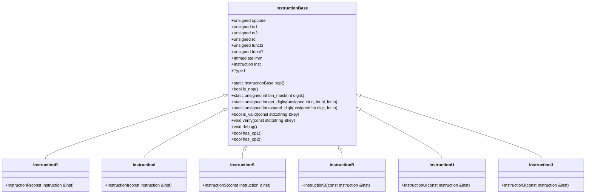

# デザイン文書: Instruction.hpp

## 責務
`Instruction.hpp`は、RISC-Vアーキテクチャの命令を表す構造体と関連するユーティリティ関数を提供します。具体的には、命令の種類（R型、I型、S型、B型、U型、J型）ごとに異なるフィールドを持つ構造体を定義し、それらのフィールドへのアクセスと検証を行う機能を提供します。

## 公開インターフェース
- `InstructionBase` クラス:
  - コンストラクタ: デフォルトコンストラクタとNOP命令用コンストラクタ。
  - メソッド: `is_nop`, `bin_mask`, `get_digits`, `expand_digit`, `is_valid`, `verify`, `debug`, `has_op1`, `has_op2`。

- `InstructionR`, `InstructionI`, `InstructionS`, `InstructionB`, `InstructionU`, `InstructionJ` 構造体:
  - コンストラクタ: 各命令型に応じたビットフィールドの抽出と設定を行う。

## 入力
- 命令コード (`unsigned int`)
- フィールド名 (`std::string`)

## 出力
- 命令オブジェクト (`InstructionBase`, `InstructionR`, `InstructionI`, `InstructionS`, `InstructionB`, `InstructionU`, `InstructionJ`)
- デバッグ情報 (`std::cout`)

## 状態
- 各命令型のフィールド値 (`opcode`, `rs1`, `rs2`, `rd`, `funct3`, `funct7`, `imm`, `inst`, `t`)

## 処理手順
1. 命令コードから各フィールドを抽出し、対応する命令型のオブジェクトを作成。
2. 各フィールドへのアクセスと検証を行う。
3. デバッグ情報として命令の種類や内容を出力。

## 例外・失敗条件
- `verify`メソッドで指定されたキーが無効な場合、`InvalidAccess`例外をスローする。

## 依存関係
- `Common.h`
- `<utility>`
- `<string>`
- `<iostream>`

## 重要な不変条件
- 各命令型のオブジェクトは、その命令型に応じたフィールドのみが有効である。
- `inst` フィールドは、命令コードを保持する。

# 追加詳細設計情報

## クラス図

## クラス・メソッド・インターフェース詳細

| クラス/構造体 | メンバ名 | 型 | 可視性 | const | static | noexcept | 説明 |
|---------------|----------|----|--------|-------|--------|----------|------|
| InstructionBase | opcode | unsigned | public | - | - | - | 命令のオペコード |
| InstructionBase | rs1 | unsigned | public | - | - | - | 第一レジスタソース |
| InstructionBase | rs2 | unsigned | public | - | - | - | 第二レジスタソース |
| InstructionBase | rd | unsigned | public | - | - | - | レジスタデスティネーション |
| InstructionBase | funct3 | unsigned | public | - | - | - | 3ビットのファンクションコード |
| InstructionBase | funct7 | unsigned | public | - | - | - | 7ビットのファンクションコード |
| InstructionBase | imm | Immediate | public | - | - | - | 即値 |
| InstructionBase | inst | Instruction | public | - | - | - | 命令コード |
| InstructionBase | t | Type | public | - | - | - | 命令の型 |
| InstructionBase | nop | InstructionBase | public | static | - | - | NOP命令を返す静的メソッド |
| InstructionBase | is_nop | bool | public | - | - | - | instがNOP命令であるか判定する |
| InstructionBase | bin_mask | unsigned int | public | static | - | - | 指定されたビット数のマスクを返す |
| InstructionBase | get_digits | unsigned int | public | static | - | - | 命令コードから指定された範囲のビットを取り出す |
| InstructionBase | expand_digit | unsigned int | public | static | - | - | 指定されたビットを拡張する |
| InstructionBase | is_valid | bool | public | - | - | - | 指定されたキーが有効なフィールドであるか判定する |
| InstructionBase | verify | void | public | - | - | - | 指定されたキーが無効な場合、InvalidAccess例外をスローする |
| InstructionBase | debug | void | public | - | - | - | 命令のデバッグ情報を出力する |
| InstructionBase | has_op1 | bool | public | - | - | - | 命令が第一オペランドを持つか判定する |
| InstructionBase | has_op2 | bool | public | - | - | - | 命令が第二オペランドを持つか判定する |
| InstructionR | InstructionR | コンストラクタ | public | - | - | - | R型命令を初期化する |
| InstructionI | InstructionI | コンストラクタ | public | - | - | - | I型命令を初期化する |
| InstructionS | InstructionS | コンストラクタ | public | - | - | - | S型命令を初期化する |
| InstructionB | InstructionB | コンストラクタ | public | - | - | - | B型命令を初期化する |
| InstructionU | InstructionU | コンストラクタ | public | - | - | - | U型命令を初期化する |
| InstructionJ | InstructionJ | コンストラクタ | public | - | - | - | J型命令を初期化する |

## シーケンス図
該当なし

## メソッド仕様書

### `InstructionBase::nop`
- 目的: NOP命令のインスタンスを作成する。
- 引数: なし
- 戻り値: InstructionBase
- 動作: opcodeを0b0010011に設定し、instを-1に設定してNOP命令のインスタンスを作成する。

### `InstructionBase::is_nop`
- 目的: インスタンスがNOP命令であるか判定する。
- 引数: なし
- 戻り値: bool
- 動作: instが-1であればtrueを返す。それ以外はfalseを返す。

### `InstructionBase::bin_mask`
- 目的: 指定されたビット数のマスクを作成する。
- 引数: digits (int)
- 戻り値: unsigned int
- 動作: 1 << digits - 1 を計算して返す。

### `InstructionBase::get_digits`
- 目的: 命令コードから指定された範囲のビットを取り出す。
- 引数: n (unsigned int), hi (int), lo (int)
- 戻り値: unsigned int
- 動作: (n >> lo) & bin_mask(hi - lo + 1) を計算して返す。

### `InstructionBase::expand_digit`
- 目的: 指定されたビットを拡張する。
- 引数: digit (unsigned int), lo (int)
- 戻り値: unsigned int
- 動作: digitが0であれば0を返す。それ以外は0xffffffff << lo を計算して返す。

### `InstructionBase::is_valid`
- 目的: 指定されたキーが有効なフィールドであるか判定する。
- 引数: key (std::string)
- 戻り値: bool
- 動作: キーに対応するフィールドが命令型に存在すればtrueを返す。それ以外はfalseを返す。

### `InstructionBase::verify`
- 目的: 指定されたキーが無効な場合、InvalidAccess例外をスローする。
- 引数: key (std::string)
- 戻り値: void
- 動作: is_valid(key)がfalseであればInvalidAccess例外をスローする。

### `InstructionBase::debug`
- 目的: 命令のデバッグ情報を出力する。
- 引数: なし
- 戻り値: void
- 動作: 命令コードと命令の種類をstd::coutに出力する。

### `InstructionBase::has_op1`
- 目的: 命令が第一オペランドを持つか判定する。
- 引数: なし
- 戻り値: bool
- 動作: 命令型がUまたはJでなければtrueを返す。それ以外はfalseを返す。

### `InstructionBase::has_op2`
- 目的: 命令が第二オペランドを持つか判定する。
- 引数: なし
- 戻り値: bool
- 動作: 命令型がR、S、またはBであればtrueを返す。それ以外はfalseを返す。

## 処理フロー図
該当なし

## 状態遷移・副作用
| 更新前状態 | 遷移条件 | 変更対象 | 更新後状態 | 更新順序 | 副作用 |
|------------|----------|----------|------------|----------|--------|
| 任意       | コンストラクタ呼び出し | opcode, rs1, rs2, rd, funct3, funct7, imm, inst, t | 指定された命令コードに応じた値 | - | - |
| 任意       | is_nop() 呼び出し | - | - | - | bool値を返す |
| 任意       | bin_mask() 呼び出し | - | - | - | マスク値を返す |
| 任意       | get_digits() 呼び出し | - | - | - | ビット値を返す |
| 任意       | expand_digit() 呼び出し | - | - | - | 拡張ビット値を返す |
| 任意       | is_valid() 呼び出し | - | - | - | bool値を返す |
| 任意       | verify() 呼び出し | - | - | - | InvalidAccess例外をスローする |
| 任意       | debug() 呼び出し | - | - | - | デバッグ情報を出力する |
| 任意       | has_op1() 呼び出し | - | - | - | bool値を返す |
| 任意       | has_op2() 呼び出し | - | - | - | bool値を返す |

## データ変換・制約
| 入力 | 出力 | 変換規則 | 値域 | 境界値 | 単位 | 精度 | encoding |
|------|------|----------|------|--------|------|------|----------|
| inst (unsigned int) | opcode, rs1, rs2, rd, funct3, funct7, imm | get_digits()を使用してビットフィールドを抽出する | 0-4294967295 | - | ビット | - | - |
| key (std::string) | bool | is_valid()を使用してキーの有効性を判定する | true/false | - | - | - | - |

## その他の詳細
- `Instruction` 型は `unsigned int` のエイリアスです。
- `Immediate` 型は `Common.h` で定義されていると仮定します。