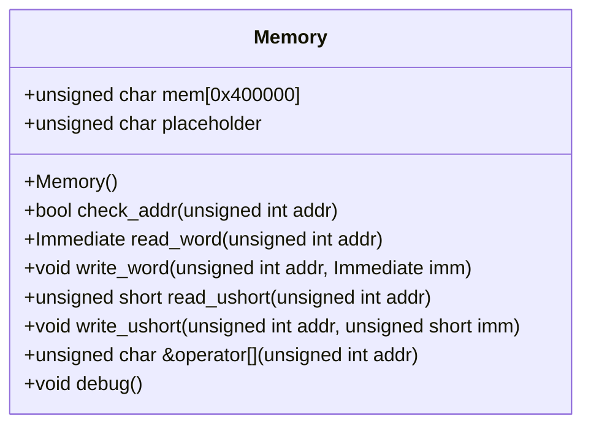
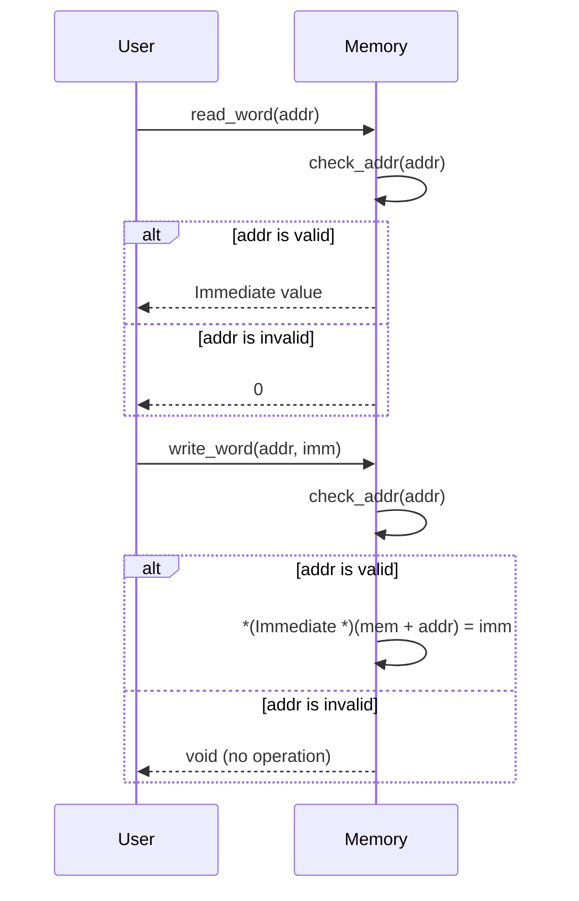

# 設計文書: Memoryクラス

## 責務
- メモリの読み書き操作を提供する。
- アドレス範囲チェックを行い、範囲外アクセスを防ぐ。

## 公開インターフェース
- `Memory()`: コンストラクタ。メモリを初期化する。
- `bool check_addr(unsigned int addr)`: 指定されたアドレスが有効かどうかを確認する。
- `Immediate read_word(unsigned int addr)`: 指定されたアドレスからワード(4バイト)を読み込む。
- `void write_word(unsigned int addr, Immediate imm)`: 指定されたアドレスにワード(4バイト)を書き込む。
- `unsigned short read_ushort(unsigned int addr)`: 指定されたアドレスからハーフワード(2バイト)を読み込む。
- `void write_ushort(unsigned int addr, unsigned short imm)`: 指定されたアドレスにハーフワード(2バイト)を書き込む。
- `unsigned char &operator[](unsigned int addr)`: 指定されたアドレスのバイトへの参照を返す。
- `void debug()`: メモリの特定範囲をデバッグ出力する。

## 入力
- `addr`: アドレス値 (unsigned int)
- `imm`: 書き込むワードまたはハーフワードの値 (Immediate または unsigned short)

## 出力
- `check_addr`: ブール値 (アドレスが有効かどうか)
- `read_word`: Immediate 値 (読み込んだワード)
- `read_ushort`: unsigned short 値 (読み込んだハーフワード)
- `operator[]`: unsigned char の参照 (指定されたアドレスのバイトへの参照)

## 状態
- `mem`: メモリ配列 (unsigned char[MEMORY_SIZE])
- `placeholder`: アドレス範囲外アクセス時のダミー値 (unsigned char)

## 処理手順
1. コンストラクタでメモリを初期化する。
2. アドレスチェックを行い、範囲外アクセスを防ぐ。
3. ワードやハーフワードの読み書きを行う。
4. オペレータ[]を使用してバイトへの参照を提供する。
5. debug() を使用してメモリの特定範囲をデバッグ出力する。

## 例外・失敗条件
- `check_addr`がfalseを返す場合、アドレスが範囲外である。
- アドレスチェックに失敗した場合は読み書き操作は行われず、適切な値(0やplaceholder)が返される。

## 依存関係
- `Common.h`: インクルードファイル。Immediate型の定義を含む可能性がある。
- `<cstring>`: memset 関数を使用する。
- `<iostream>`: debug() メソッドで出力を行う。
- `<cassert>`: assert 関数を使用していたが、現在はコメントアウトされている。

## 重要な不変条件
- `mem`のサイズは常にMEMORY_SIZEである。
- アドレスチェックはすべての読み書き操作前に実行される。

# 追加詳細設計情報

## クラス図


## クラス・メソッド・インターフェース詳細
| 名前 | 型 | 引数 | 戻り値型 | 可視性 | const |
|------|----|------|----------|--------|-------|
| Memory | コンストラクタ | なし | void | public | いいえ |
| check_addr | メソッド | unsigned int addr | bool | public | いいえ |
| read_word | メソッド | unsigned int addr | Immediate | public | いいえ |
| write_word | メソッド | unsigned int addr, Immediate imm | void | public | いいえ |
| read_ushort | メソッド | unsigned int addr | unsigned short | public | いいえ |
| write_ushort | メソッド | unsigned int addr, unsigned short imm | void | public | いいえ |
| operator[] | オペレータ | unsigned int addr | unsigned char & | public | いいえ |
| debug | メソッド | なし | void | public | いいえ |

## シーケンス図


## メソッド仕様書

### read_word
- **目的**: 指定されたアドレスからワード(4バイト)を読み込む。
- **引数**: `unsigned int addr` - 読み込み先のアドレス。
- **戻り値**: `Immediate` - 読み込んだワード。アドレスが範囲外の場合、0を返す。
- **動作**: アドレスチェックを行い、有効な場合はメモリからワードを読み込む。
- **副作用**: なし
- **エラー処理**: アドレスが範囲外の場合は0を返す。

### write_word
- **目的**: 指定されたアドレスにワード(4バイト)を書き込む。
- **引数**: `unsigned int addr` - 書き込み先のアドレス。<br>`Immediate imm` - 書き込むワード。
- **戻り値**: なし
- **動作**: アドレスチェックを行い、有効な場合はメモリにワードを書き込む。
- **副作用**: メモリの指定された位置が更新される。
- **エラー処理**: アドレスが範囲外の場合は何もしない。

### operator[]
- **目的**: 指定されたアドレスのバイトへの参照を返す。
- **引数**: `unsigned int addr` - 参照先のアドレス。
- **戻り値**: `unsigned char &` - バイトへの参照。アドレスが範囲外の場合、placeholderへの参照を返す。
- **動作**: アドレスチェックを行い、有効な場合はメモリのバイトへの参照を返す。
- **副作用**: なし
- **エラー処理**: アドレスが範囲外の場合はplaceholderへの参照を返す。

## 処理フロー図
```mermaid
graph TD
    A[開始] --> B[check_addr(addr)]
    B -- true --> C[読み込み/書き込み]
    B -- false --> D[0/void/placeholder]
    C --> E[終了]
    D --> E
```

## 状態遷移・副作用
| 更新前状態 | 遷移条件 | 変更対象 | 更新後状態 | 更新順序 | 副作用 |
|------------|----------|----------|------------|----------|--------|
| メモリ初期化済み | アドレス有効 | mem[addr] | 書き込み値 | 1 | メモリ更新 |
| メモリ初期化済み | アドレス無効 | placeholder | 変更なし | - | なし |

## データ変換・制約
| 入力データ | 出力データ | 型変換 | 加工規則 | 値域 | 境界値 |
|------------|------------|--------|----------|------|--------|
| addr       | bool       | -      | アドレス範囲チェック | 0 <= addr < MEMORY_SIZE | 0, MEMORY_SIZE-1 |
| addr       | Immediate  | unsigned char* -> Immediate | メモリから読み込み | 任意のImmediate値 | 確認不能 |
| addr, imm  | void       | Immediate -> unsigned char* | メモリに書き込み | 任意のImmediate値 | 確認不能 |
| addr       | unsigned short | unsigned char* -> unsigned short | メモリから読み込み | 0 <= 値 < 65536 | 0, 65535 |
| addr, imm  | void       | unsigned short -> unsigned char* | メモリに書き込み | 0 <= 値 < 65536 | 確認不能 |
| addr       | unsigned char & | -      | メモリへの参照 | 任意のunsigned char値 | 確認不能 |

# Machine-extracted Source-local Implementation Contract

This appendix is deterministic evidence extracted from the target source.
It is not an LLM summary and it does not contain complete function bodies.

During regeneration:
- preserve the exact local declaration types, containers, initializers, and literals listed below;
- preserve the exact call targets and argument expressions listed below;
- do not substitute a different representation or accessor merely because it looks similar;
- treat these items as exact constraints, not as pseudocode suggestions.

## Exact local declarations

- `int i = 0x20000 - 0x10;`

## Exact top-level call expressions

- `memset(mem, 0, sizeof(mem))`
- `check_addr(addr)`
