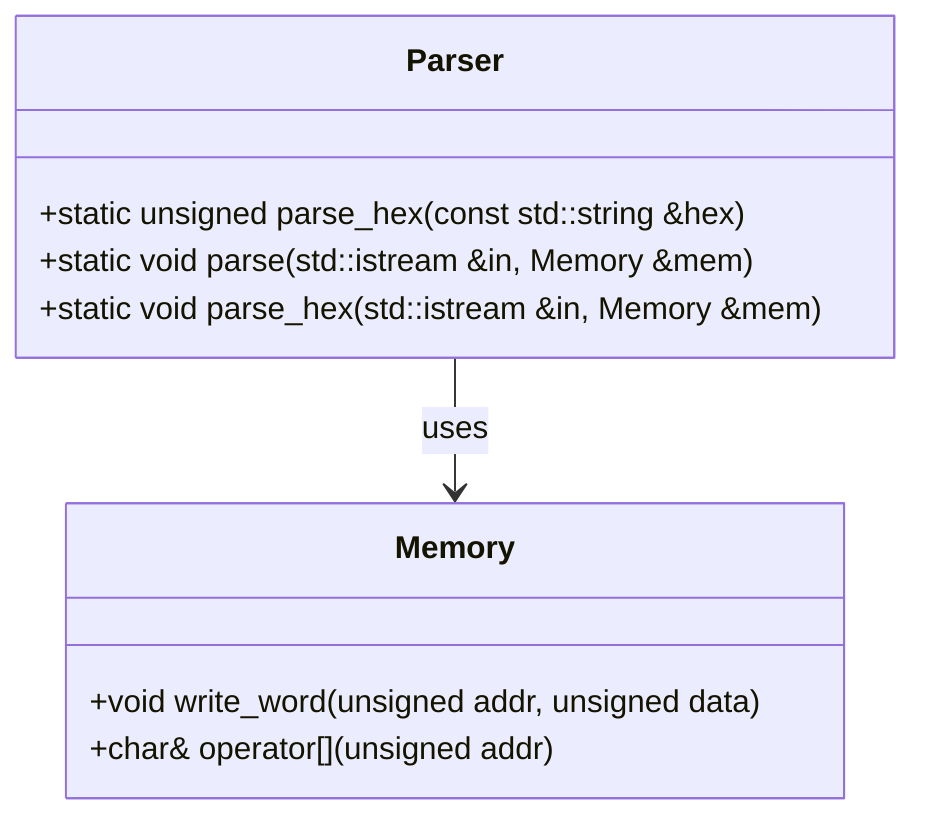
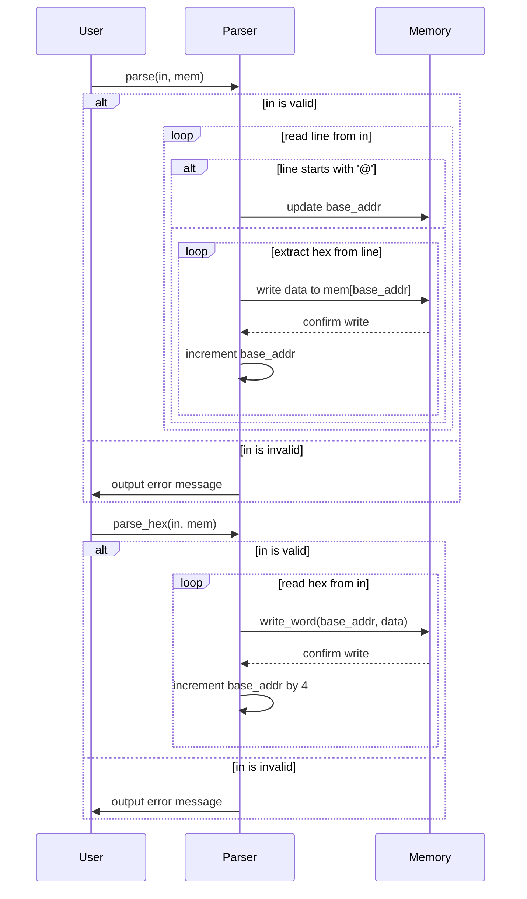
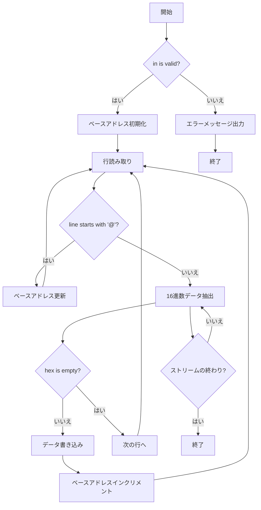

# デザイン文書: Parser クラス

## 責務
`Parser`クラスは、入力ストリームからデータを読み取り、それを指定されたメモリオブジェクトに書き込む責任を持っています。具体的には、16進数形式のデータをパースし、メモリに格納します。

## 公開インターフェース
- `static unsigned parse_hex(const std::string &hex)`
- `static void parse(std::istream &in, Memory &mem)`
- `static void parse_hex(std::istream &in, Memory &mem)`

## 入力
- `parse_hex`: 16進数形式の文字列 (`const std::string &hex`)
- `parse`: 入力ストリームとメモリオブジェクト (`std::istream &in`, `Memory &mem`)
- `parse_hex`: 入力ストリームとメモリオブジェクト (`std::istream &in`, `Memory &mem`)

## 出力
- `parse_hex`: 16進数文字列をパースした結果の符号なし整数 (`unsigned`)
- `parse`: メモリオブジェクトへの書き込み (副作用)
- `parse_hex`: メモリオブジェクトへの書き込み (副作用)

## 状態
- `base_addr`: パースされたデータをメモリに書き込む際のベースアドレス (`unsigned`)

## 処理手順
1. **parse_hex**:
   - 与えられた16進数文字列を`strtol`関数を使用して整数値に変換する。
2. **parse**:
   - 入力ストリームが有効であることを確認し、無効な場合はエラーメッセージを出力する。
   - ベースアドレスを初期化する。
   - ストリームから一行ずつ読み取り、`@`で始まる行はベースアドレスとして処理し、それ以外の行は16進数データとしてメモリに書き込む。
3. **parse_hex**:
   - 入力ストリームが有効であることを確認し、無効な場合はエラーメッセージを出力する。
   - ベースアドレスを初期化する。
   - ストリームから16進数データを読み取り、メモリに4バイト単位で書き込む。

## 例外・失敗条件
- 入力ストリームが無効な場合、エラーメッセージを出力し処理を継続しない。
- パースできないデータ（空文字列など）が含まれる場合、その行はスキップされる。

## 依存関係
- `Memory`クラス: データの書き込み先として使用される。

## 重要な不変条件
- ベースアドレスは非負整数である。
- 入力ストリームとメモリオブジェクトは有効な参照である。

# 追加詳細設計情報

## クラス図

## クラス・メソッド・インターフェース詳細

| クラス名 | メソッド名       | 完全な名前                           | 属性   | 引数名と型                    | 戻り値型  | 可視性 | const | 参照/ポインタ | static | virtual | noexcept |
|----------|------------------|--------------------------------------|--------|-------------------------------|-----------|--------|-------|---------------|--------|---------|----------|
| Parser   | parse_hex        | Parser::parse_hex                    | 静的   | hex: const std::string &      | unsigned  | 公開   |       |               | 〇     |         |          |
| Parser   | parse            | Parser::parse                        | 静的   | in: std::istream &, mem: Memory & | void      | 公開   |       | 参照          | 〇     |         |          |
| Parser   | parse_hex        | Parser::parse_hex                    | 静的   | in: std::istream &, mem: Memory & | void      | 公開   |       | 参照          | 〇     |         |          |

## シーケンス図

## メソッド仕様書

### parse_hex
- **目的**: 16進数形式の文字列を整数値に変換する。
- **引数**: hex (const std::string &): 16進数形式の文字列。
- **戻り値**: 変換された符号なし整数 (unsigned)。
- **動作**: `strtol`関数を使用して16進数文字列を整数に変換する。
- **副作用**: 無し
- **エラー処理**: 無し

### parse
- **目的**: 入力ストリームからデータを読み取り、メモリオブジェクトに書き込む。
- **引数**: in (std::istream &): 入力ストリーム, mem (Memory &): メモリオブジェクト。
- **戻り値**: 無し
- **動作**:
  - ストリームが有効であることを確認する。
  - ベースアドレスを初期化する。
  - ストリームから一行ずつ読み取り、`@`で始まる行はベースアドレスとして処理し、それ以外の行は16進数データとしてメモリに書き込む。
- **副作用**: メモリオブジェクトへの書き込み
- **エラー処理**: ストリームが無効な場合はエラーメッセージを出力する。

### parse_hex
- **目的**: 入力ストリームから16進数データを読み取り、メモリオブジェクトに4バイト単位で書き込む。
- **引数**: in (std::istream &): 入力ストリーム, mem (Memory &): メモリオブジェクト。
- **戻り値**: 無し
- **動作**:
  - ストリームが有効であることを確認する。
  - ベースアドレスを初期化する。
  - ストリームから16進数データを読み取り、メモリに4バイト単位で書き込む。
- **副作用**: メモリオブジェクトへの書き込み
- **エラー処理**: ストリームが無効な場合はエラーメッセージを出力する。

## 処理フロー図

## 状態遷移・副作用

| 更新前状態 | 遷移条件         | 変更対象     | 更新後状態   | 更新順序 | 副作用                     |
|------------|------------------|--------------|--------------|----------|----------------------------|
| 任意       | in is valid      | base_addr    | 初期値       | 1        | 無し                       |
| 任意       | line starts with '@' | base_addr   | 新しいベースアドレス | 2     | 無し                     |
| 任意       | hex is not empty | mem[base_addr] | パースされたデータ | 3      | メモリへの書き込み         |
| 任意       | ストリームの終わり | なし         | なし         | 4        | 無し                       |

## データ変換・制約

| 入力データ   | 変換規則                     | 出力データ     | 値域          |
|--------------|------------------------------|----------------|---------------|
| hex (文字列) | `strtol`を使用して16進数に変換 | unsigned       | 0 ~ UINT_MAX  |
| line (文字列)| 行の先頭が'@'の場合、ベースアドレス更新, それ以外は16進数データ抽出 | ベースアドレス/メモリデータ | 0 ~ UINT_MAX / char         |

この設計文書は元コードから確認できる事実に基づいており、再実装に必要な詳細情報を提供します。