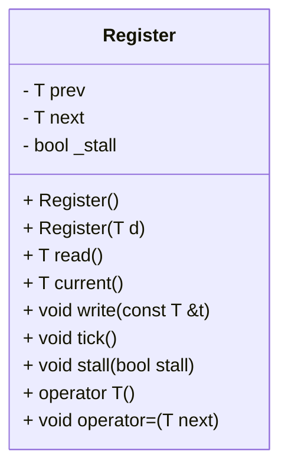
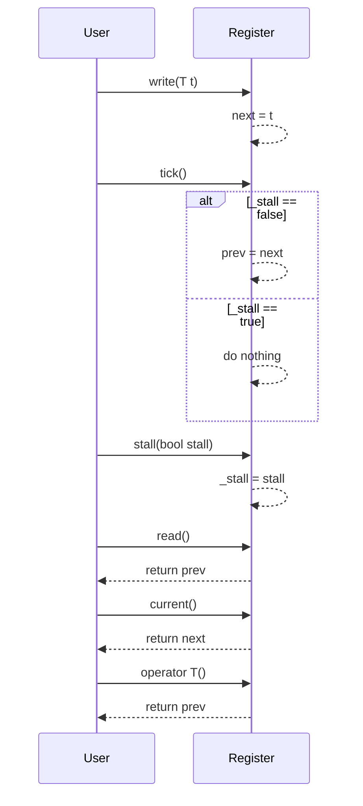

# Register クラスの設計文書

## 責務
`Register`クラスは、ジェネリックな型 `T` の値を保持し、現在の状態と次の状態を管理します。また、ステージングされた値をコミットする機能（tick）や、一時的に更新を停止させる機能（stall）も提供します。

## 公開インターフェース
- `T read()`: 前回の値（prev）を返す。
- `T current()`: 次の値（next）を返す。
- `void write(const T &t)`: 次の値（next）に`t`を設定する。
- `void tick()`: `_stall`がfalseの場合、次の値（next）を前の値（prev）にコミットする。
- `void stall(bool stall)`: 更新の一時停止フラグ（_stall）を設定する。
- `operator T()`: 前回の値（prev）を返すように型変換演算子を定義する。
- `void operator=(T next)`: 次の値（next）に`t`を設定するように代入演算子をオーバーロードする。

## 入力
- `write(const T &t)`メソッド: 型 `T` の値 `t`
- `stall(bool stall)`: 更新の一時停止フラグ `_stall` に設定するブール値

## 出力
- `read()`, `current()`, `operator T()`: 型 `T` の値を返す。

## 状態
- `prev`: 前回の値（型 `T`）
- `next`: 次の値（型 `T`）
- `_stall`: 更新の一時停止フラグ（bool）

## 処理手順
1. コンストラクタで初期化: `prev`と`next`をゼロに設定し、`_stall`をfalseに設定する。
2. `write(const T &t)`メソッドが呼ばれた場合: `next`に`t`の値を設定する。
3. `tick()`メソッドが呼ばれた場合:
   - `_stall`がfalseの場合のみ、`prev`に`next`の値を設定する。
4. `stall(bool stall)`メソッドが呼ばれた場合: `_stall`フラグを更新する。

## 例外・失敗条件
- 確認不能

## 依存関係
- 型 `T`: テンプレートパラメータとして使用される型。具体的な型は外部から指定される。
- 標準ライブラリ: コンストラクタや演算子の定義に必要な基本的な機能。

## 重要な不変条件
- `_stall`がtrueの場合、`tick()`呼び出しによる`prev`の更新は行われない。

# 追加詳細設計情報

## クラス図


## クラス・メソッド・インターフェース詳細
| メンバ名 | 型 | 可視性 | const | 引数 | 戻り値型 | 说明 |
| --- | --- | --- | --- | --- | --- | --- |
| prev | T | private | - | - | - | 前回の値を保持するメンバ変数 |
| next | T | private | - | - | - | 次の値を保持するメンバ変数 |
| _stall | bool | private | - | - | - | 更新の一時停止フラグ |
| Register() | - | public | - | - | - | デフォルトコンストラクタ。`prev`, `next`をゼロに、`_stall`をfalseに初期化する。 |
| Register(T d) | - | public | - | T d | - | 初期値`d`で`prev`, `next`を初期化し、`_stall`をfalseに設定する。 |
| read() | T | public | const | - | T | 前回の値（`prev`）を返す。 |
| current() | T | public | const | - | T | 次の値（`next`）を返す。 |
| write(const T &t) | void | public | - | const T &t | - | `next`に`t`の値を設定する。 |
| tick() | void | public | - | - | - | `_stall`がfalseの場合、`prev`に`next`の値を設定する。 |
| stall(bool stall) | void | public | - | bool stall | - | `_stall`フラグを更新する。 |
| operator T() | T | public | const | - | T | 前回の値（`prev`）を返すように型変換演算子を定義する。 |
| operator=(T next) | void | public | - | T next | - | `next`に`t`の値を設定するように代入演算子をオーバーロードする。 |

## シーケンス図


## メソッド仕様書

### `write(const T &t)`
- **目的**: 次の値（`next`）に`t`の値を設定する。
- **引数**: `const T &t`: 設定したい次の値。
- **戻り値型**: void
- **動作**: 引数`t`の値をメンバ変数`next`に代入する。
- **副作用**: なし

### `tick()`
- **目的**: `_stall`がfalseの場合、前の値（`prev`）に次の値（`next`）をコミットする。
- **引数**: 無し
- **戻り値型**: void
- **動作**: `_stall`がfalseの場合のみ、`prev`に`next`の値を設定する。
- **副作用**: なし

### `stall(bool stall)`
- **目的**: 更新の一時停止フラグ（`_stall`）を設定する。
- **引数**: `bool stall`: 設定したい一時停止フラグの値。
- **戻り値型**: void
- **動作**: 引数`stall`の値をメンバ変数`_stall`に代入する。
- **副作用**: なし

### `read()`
- **目的**: 前回の値（`prev`）を返す。
- **引数**: 無し
- **戻り値型**: T
- **動作**: メンバ変数`prev`の値を返す。
- **副作用**: なし

### `current()`
- **目的**: 次の値（`next`）を返す。
- **引数**: 無し
- **戻り値型**: T
- **動作**: メンバ変数`next`の値を返す。
- **副作用**: なし

### `operator T()`
- **目的**: 前回の値（`prev`）を返すように型変換演算子を定義する。
- **引数**: 無し
- **戻り値型**: T
- **動作**: メンバ変数`prev`の値を返す。
- **副作用**: なし

### `operator=(T next)`
- **目的**: 次の値（`next`）に`t`の値を設定するように代入演算子をオーバーロードする。
- **引数**: `T next`: 設定したい次の値。
- **戻り値型**: void
- **動作**: 引数`next`の値をメンバ変数`next`に代入する。
- **副作用**: なし

## 処理フロー図
```mermaid
graph TD
    A[開始] --> B{write(const T &t) 呼び出し?}
    B -- はい --> C[next = t]
    B -- いいえ --> D{tick() 呼び出し?}
    D -- いいえ --> E{stall(bool stall) 呼び出し?}
    E -- いいえ --> F{read() 呼び出し?}
    F -- いいえ --> G{current() 呼び出し?}
    G -- いいえ --> H{operator T() 呼び出し?}
    H -- いいえ --> I{operator=(T next) 呼び出し?}
    I -- いいえ --> J[終了]
    C --> K[tick() 呼び出し?]
    E --> K
    F --> K
    G --> K
    H --> K
    I --> K
    K --> L{stall == false?}
    L -- いいえ --> M[do nothing]
    L -- はい --> N[prev = next]
    M --> O[終了]
    N --> O
```

## 状態遷移・副作用
| 更新前状態 | 遷移条件 | 変更対象 | 更新後状態 | 更新順序 | 副作用 |
| --- | --- | --- | --- | --- | --- |
| 任意の状態 | write(const T &t)呼び出し | next | t | - | なし |
| 任意の状態 | tick()呼び出し, stall == false | prev | next | - | なし |
| 任意の状態 | stall(bool stall)呼び出し | _stall | stall | - | なし |

## データ変換・制約
- `write(const T &t)`メソッド: 引数`t`を型`T`として受け取り、メンバ変数`next`に代入する。
- `tick()`メソッド: `_stall`がfalseの場合のみ、`prev`に`next`の値を設定する。
- `stall(bool stall)`メソッド: 引数`stall`を型`bool`として受け取り、メンバ変数`_stall`に代入する。
- `read()`, `current()`, `operator T()`メソッド: メンバ変数`prev`の値を返す。

# Machine-extracted Source-local Implementation Contract

This appendix is deterministic evidence extracted from the target source.
It is not an LLM summary and it does not contain complete function bodies.

During regeneration:
- preserve the exact local declaration types, containers, initializers, and literals listed below;
- preserve the exact call targets and argument expressions listed below;
- do not substitute a different representation or accessor merely because it looks similar;
- treat these items as exact constraints, not as pseudocode suggestions.

## Exact local declarations


## Exact top-level call expressions

- `read()`
- `write(next)`
