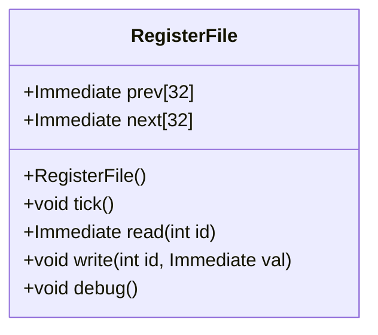
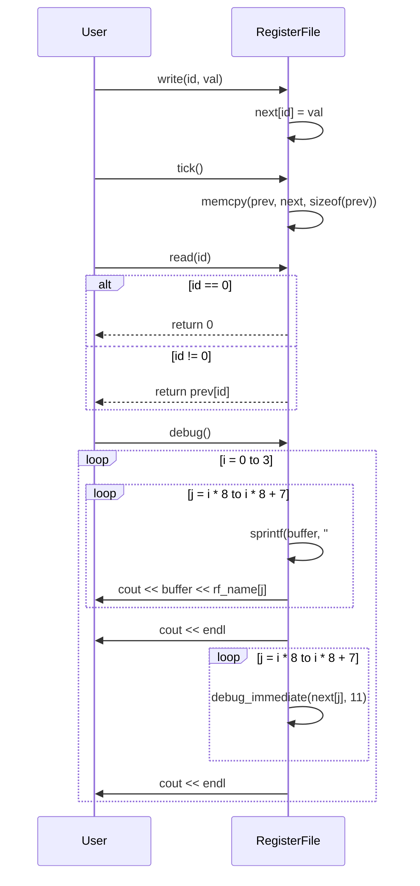

# RegisterFile クラスの設計文書

## 責務
RegisterFileクラスは、RISC-Vシミュレータにおいて32個のレジスタを管理します。各レジスタには現在の値と次のサイクルでの値が保持され、tickメソッドによって現在の値が次のサイクルの値に更新されます。また、特定のレジスタから値を読み書きする機能とデバッグ用の出力機能も提供します。

## 公開インターフェース
- `RegisterFile()`: コンストラクタでprevとnext配列を初期化します。
- `void tick()`: 現在のレジスタ値を次のサイクルの値に更新します。
- `Immediate read(int id)`: 指定されたIDのレジスタから現在の値を読み取ります。ただし、IDが0の場合は常に0を返します。
- `void write(int id, Immediate val)`: 次のサイクルでの指定されたIDのレジスタに値を書き込みます。
- `void debug()`: レジスタの現在の状態をデバッグ用に出力します。

## 入力
- `read(int id)`メソッド: レジスタID (int型)
- `write(int id, Immediate val)`メソッド: レジスタID (int型) と書き込む値 (Immediate型)

## 出力
- `read(int id)`メソッド: 指定されたレジスタの現在の値 (Immediate型)
- `debug()`メソッド: 標準出力にレジスタの状態を表示

## 状態
- `prev[REG_NUM]`: 各レジスタの現在の値を保持する配列。
- `next[REG_NUM]`: 各レジスタの次のサイクルでの値を保持する配列。

## 処理手順
1. コンストラクタでprevとnext配列を0で初期化します。
2. `tick()`メソッドが呼ばれたときに、prev配列にnext配列の内容をコピーして現在のレジスタ値を更新します。
3. `read(int id)`メソッドは指定されたIDのレジスタから現在の値を返します。ただし、IDが0の場合は常に0を返します。
4. `write(int id, Immediate val)`メソッドは指定されたIDのレジスタに次のサイクルでの値を設定します。
5. `debug()`メソッドはレジスタの現在の状態をデバッグ用に出力します。

## 例外・失敗条件
- `read(int id)`と`write(int id, Immediate val)`メソッドにおいて、idが範囲外（0から31以外）の場合の動作は未定義です。実装上は配列アクセスが行われますが、範囲チェックは行われていません。

## 依存関係
- `Immediate`: レジスタに格納される値の型。
- `debug_immediate(Immediate val, int width)`: debugメソッド内で使用される関数で、Immediate型の値を指定された幅で出力します。この関数は`utils.h`からインクルードされます。

## 重要な不変条件
- レジスタIDが0の場合は常に0を返す。
- `tick()`メソッドによってprev配列とnext配列が同期化される。

# 追加詳細設計情報

## クラス図


## クラス・メソッド・インターフェース詳細
| 名前 | 型 | 可視性 | const | static | noexcept | 引数 | 戻り値 |
|------|----|--------|-------|--------|----------|------|--------|
| RegisterFile | コンストラクタ | public | - | - | - | - | void |
| tick | メソッド | public | - | - | - | - | void |
| read | メソッド | public | - | - | - | int id | Immediate |
| write | メソッド | public | - | - | - | int id, Immediate val | void |
| debug | メソッド | public | - | - | - | - | void |

## シーケンス図


## メソッド仕様書

### tick()
- **目的**: 現在のレジスタ値を次のサイクルの値に更新します。
- **引数**: なし
- **戻り値**: void
- **動作**: prev配列にnext配列の内容をコピーします。

### read(int id)
- **目的**: 指定されたIDのレジスタから現在の値を読み取ります。
- **引数**: int id - レジスタID
- **戻り値**: Immediate - レジスタの現在の値
- **動作**: IDが0の場合は常に0を返します。それ以外の場合、prev配列から指定されたIDのレジスタの値を返します。

### write(int id, Immediate val)
- **目的**: 指定されたIDのレジスタに次のサイクルでの値を設定します。
- **引数**: int id - レジスタID, Immediate val - 設定する値
- **戻り値**: void
- **動作**: next配列に指定されたIDのレジスタの値を設定します。

### debug()
- **目的**: レジスタの現在の状態をデバッグ用に出力します。
- **引数**: なし
- **戻り値**: void
- **動作**: レジスタの名前と現在の値をフォーマットして標準出力に表示します。

## 処理フロー図
```mermaid
graph TD
    A[コンストラクタ] --> B{tick()}
    B --> C[memcpy(prev, next, sizeof(prev))]
    C --> D{read(id)}
    D --> E[id == 0?]
    E --はい--> F[return 0]
    E --いいえ--> G[return prev[id]]
    G --> H{write(id, val)}
    H --> I[next[id] = val]
    I --> J{debug()}
    J --> K[ループ i = 0 to 3]
    K --> L[ループ j = i * 8 to i * 8 + 7]
    L --> M[sprintf(buffer, "#%d", j)]
    M --> N[cout << buffer << rf_name[j]]
    N --> O{debug_immediate(next[j], 11)}
    O --> P[cout << endl]
    P --> Q[次のjへ]
    Q --> R{j < i * 8 + 7?}
    R --はい--> L
    R --いいえ--> S[次のiへ]
    S --> T{i < 3?}
    T --はい--> K
    T --いいえ--> U[終了]
```

## 状態遷移・副作用
| 更新前状態 | 遷移条件 | 変更対象 | 更新後状態 | 更新順序 | 副作用 |
|------------|----------|----------|------------|----------|--------|
| prev, next | tick()   | prev     | prev = next| 1        | なし   |

## データ変換・制約
- `read(int id)`: IDが0の場合は常に0を返します。
- `write(int id, Immediate val)`: 指定されたIDのレジスタに値を設定します。IDは0から31までの範囲でなければなりません。
- `debug()`: レジスタの名前と現在の値をフォーマットして標準出力に出力します。