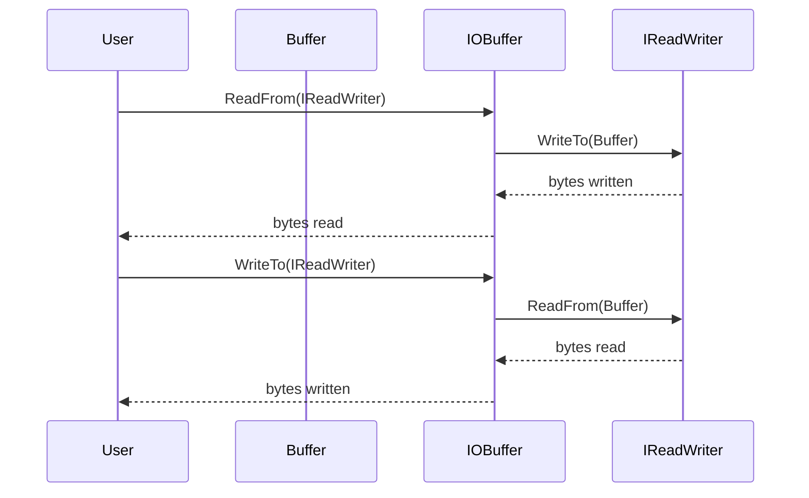

# デザイン文書

## 責務
- `Buffer`クラス: 自動拡張可能なバッファを提供し、バイトや文字列の読み書きを行う。
- `IOBuffer`クラス: `Buffer`クラスを拡張して、I/Oオブジェクトとのデータ交換をサポートする。

## 公開インターフェース
### Buffer クラス
| メソッド名 | 引数 | 戻り値型 | 説明 |
| --- | --- | --- | --- |
| `Buffer` (コンストラクタ) | `std::size_t size = 1000` | - | 初期サイズでバッファを作成する。 |
| `Buffer` (コンストラクタ) | `std::span<const std::byte> bytes` | - | バイト列からバッファを作成する。 |
| `Buffer` (コンストラクタ) | `std::initializer_list<std::byte> bytes` | - | 初期化リストからバッファを作成する。 |
| `Buffer` (コンストラクタ) | `std::string_view str` | - | 文字列からバッファを作成する。 |
| `WritableSize` | - | `std::size_t` | 書き込み可能なサイズを返す。 |
| `ReadableSize` | - | `std::size_t` | 読み取り可能なサイズを返す。 |
| `Peek` | - | `std::optional<std::byte>` | 最初のバイトを読み取るが、オフセットは進めない。 |
| `ReadableBytes` | - | `std::span<const std::byte>` | 読み取り可能なバイト列を返す。 |
| `ReadableString` | - | `std::string` | 読み取り可能な文字列を返す。 |
| `WritableBytes` | - | `std::span<std::byte>` | 書き込み可能なスペースを返す。 |
| `Append` | `std::span<const std::byte> bytes` | - | バッファにバイト列を追加する。 |
| `Append` | `std::initializer_list<std::byte> bytes` | - | バッファに初期化リストからバイト列を追加する。 |
| `Append` | `std::string_view str, std::optional<NewLine> new_line = std::nullopt` | - | 文字列とオプションの改行文字を追加する。 |
| `Append` | `const void* data, std::size_t size` | - | バッファにデータを追加する。 |
| `Append` | `const Buffer& buf` | - | 他のバッファからデータを追加する。 |
| `EnsureWriteableSize` | `std::size_t size` | - | 書き込み可能なスペースが十分になるまで拡張する。 |
| `HasWritten` | `std::size_t size` | - | 書き込みオフセットを進める。 |
| `Retrieve` | `std::size_t size` | - | 読み取りオフセットを進める。 |
| `RetrieveUntil` | `const void* addr` | `std::size_t` | 指定したアドレスまで読み取りオフセットを進める。 |
| `RetrieveAll` | - | `std::size_t` | 読み取りオフセットを最後まで進めて、読み取ったサイズを返す。 |
| `RetrieveAllToString` | - | `std::string` | 全てのデータを文字列として取得し、バッファをクリアする。 |
| `Clear` | - | - | バッファをクリアする。 |
| `Empty` | - | `bool` | バッファが空かどうかを返す。 |

### IOBuffer クラス
| メソッド名 | 引数 | 戻り値型 | 説明 |
| --- | --- | --- | --- |
| `ReadFrom` | `io::IReadWriter& io` | `std::size_t` | I/Oオブジェクトからデータを読み込む。 |
| `WriteTo` | `io::IReadWriter& io` | `std::size_t` | データをI/Oオブジェクトに書き込む。 |

### グローバル演算子
| 演算子 | 引数 | 戻り値型 | 説明 |
| --- | --- | --- | --- |
| `operator<<` | `Buffer& buf, std::string_view str` | `Buffer&` | 文字列をバッファに追加する。 |
| `operator<<` | `Buffer& to, const Buffer& from` | `Buffer&` | 他のバッファからデータを追加する。 |
| `operator<<` | `Buffer& buf, std::span<const std::byte> bytes` | `Buffer&` | バイト列をバッファに追加する。 |
| `operator<<` | `Buffer& buf, std::initializer_list<std::byte> bytes` | `Buffer&` | 初期化リストからバイト列をバッファに追加する。 |

## 入力
- バッファの初期サイズ (`std::size_t`)
- 追加するデータ (`std::span<const std::byte>`, `std::initializer_list<std::byte>`, `std::string_view`, `const void*`, `Buffer&`)
- 読み取りオフセットを進めるサイズ (`std::size_t`)
- 書き込み可能なスペースの確保サイズ (`std::size_t`)

## 出力
- バッファの状態 (読み取り可能なバイト列, 文字列, サイズ)
- 読み取りオフセットや書き込みオフセットの進んだサイズ (`std::size_t`)
- I/Oオブジェクトとのデータ交換結果 (`std::size_t`)

## 状態
- `buf_`: バッファを保持する `std::vector<std::byte>`
- `read_pos_`: 読み取り位置を示す `std::atomic<std::size_t>`
- `write_pos_`: 書き込み位置を示す `std::atomic<std::size_t>`

## 処理手順
1. バッファの初期化: コンストラクタでバッファサイズやデータを設定する。
2. データ追加: `Append`メソッドを使用してバッファにデータを追加し、必要に応じて書き込み可能なスペースを確保する。
3. 読み取りオフセットの進める: `Retrieve`, `RetrieveUntil`, `RetrieveAll`メソッドを使用して読み取り位置を調整する。
4. 書き込みオフセットの進める: `HasWritten`メソッドを使用して書き込み位置を調整する。
5. バッファのクリア: `Clear`メソッドを使用してバッファを空にする。

## 例外・失敗条件
- `Append`: 引数がnullptrの場合、assertで検査される。
- `HasWritten`, `Retrieve`: 指定されたサイズが現在の読み取り可能なサイズや書き込み可能なスペースを超える場合、assertで検査される。

## 依存関係
- `std::vector`
- `std::atomic`
- `std::optional`
- `std::span`
- `std::string`
- `std::string_view`
- `io::IReadWriter` (include/io.h)

## 重要な不変条件
- 読み取り位置は常に書き込み位置以下である。
- バッファのサイズが足りない場合は自動的に拡張される。

# 追加詳細設計情報

## クラス図
```mermaid
classDiagram
    class Buffer {
        +Buffer(std::size_t size = 1000) noexcept
        +Buffer(std::span<const std::byte> bytes) noexcept
        +Buffer(std::initializer_list<std::byte> bytes) noexcept
        +Buffer(std::string_view str) noexcept
        +Buffer(const Buffer&) noexcept
        +Buffer(Buffer&&) noexcept
        +Buffer& operator=(const Buffer&) noexcept
        +Buffer& operator=(Buffer&&) noexcept
        +std::size_t WritableSize() const noexcept
        +std::size_t ReadableSize() const noexcept
        +std::optional<std::byte> Peek() const noexcept
        +std::span<const std::byte> ReadableBytes() const noexcept
        +std::string ReadableString() const noexcept
        +std::span<std::byte> WritableBytes() const noexcept
        +void Append(std::span<const std::byte> bytes) noexcept
        +void Append(std::initializer_list<std::byte> bytes) noexcept
        +void Append(std::string_view str, std::optional<NewLine> new_line = std::nullopt) noexcept
        +void Append(const void* data, std::size_t size) noexcept
        +void Append(const Buffer& buf) noexcept
        +void EnsureWriteableSize(std::size_t size) noexcept
        +void HasWritten(std::size_t size) noexcept
        +void Retrieve(std::size_t size) noexcept
        +std::size_t RetrieveUntil(const void* addr) noexcept
        +std::size_t RetrieveAll() noexcept
        +std::string RetrieveAllToString() noexcept
        +void Clear() noexcept
        +bool Empty() const noexcept
        -std::size_t PrependableSize() const noexcept
        -void MakeSpace(std::size_t size) noexcept
        -std::vector<std::byte>::iterator ReadIter() const noexcept
        -std::vector<std::byte>::iterator WriteIter() const noexcept
        -std::vector<std::byte> buf_
        -std::atomic<std::size_t> read_pos_ {0}
        -std::atomic<std::size_t> write_pos_ {0}
    }
    
    class IOBuffer {
        +IOBuffer()
        +std::size_t ReadFrom(io::IReadWriter& io)
        +std::size_t WriteTo(io::IReadWriter& io)
    }

    Buffer <|-- IOBuffer
```

## クラス・メソッド・インターフェース詳細

### Buffer クラス
| メソッド名 | 引数 | 戻り値型 | 可視性 | const | static | virtual | noexcept |
| --- | --- | --- | --- | --- | --- | --- | --- |
| `Buffer` (コンストラクタ) | `std::size_t size = 1000` | - | public | - | - | - | ✅ |
| `Buffer` (コンストラクタ) | `std::span<const std::byte> bytes` | - | public | - | - | - | ✅ |
| `Buffer` (コンストラクタ) | `std::initializer_list<std::byte> bytes` | - | public | - | - | - | ✅ |
| `Buffer` (コンストラクタ) | `std::string_view str` | - | public | - | - | - | ✅ |
| `Buffer` (コンストラクタ) | `const Buffer& o` | - | public | - | - | - | ✅ |
| `Buffer` (コンストラクタ) | `Buffer&& o` | - | public | - | - | - | ✅ |
| `operator=` | `const Buffer& o` | `Buffer&` | public | - | - | - | ✅ |
| `operator=` | `Buffer&& o` | `Buffer&` | public | - | - | - | ✅ |
| `WritableSize` | - | `std::size_t` | public | ✅ | - | - | ✅ |
| `ReadableSize` | - | `std::size_t` | public | ✅ | - | - | ✅ |
| `Peek` | - | `std::optional<std::byte>` | public | ✅ | - | - | ✅ |
| `ReadableBytes` | - | `std::span<const std::byte>` | public | ✅ | - | - | ✅ |
| `ReadableString` | - | `std::string` | public | ✅ | - | - | ✅ |
| `WritableBytes` | - | `std::span<std::byte>` | public | ✅ | - | - | ✅ |
| `Append` | `std::span<const std::byte> bytes` | - | public | - | - | - | ✅ |
| `Append` | `std::initializer_list<std::byte> bytes` | - | public | - | - | - | ✅ |
| `Append` | `std::string_view str, std::optional<NewLine> new_line = std::nullopt` | - | public | - | - | - | ✅ |
| `Append` | `const void* data, std::size_t size` | - | public | - | - | - | ✅ |
| `Append` | `const Buffer& buf` | - | public | - | - | - | ✅ |
| `EnsureWriteableSize` | `std::size_t size` | - | public | - | - | - | ✅ |
| `HasWritten` | `std::size_t size` | - | public | - | - | - | ✅ |
| `Retrieve` | `std::size_t size` | - | public | - | - | - | ✅ |
| `RetrieveUntil` | `const void* addr` | `std::size_t` | public | - | - | - | ✅ |
| `RetrieveAll` | - | `std::size_t` | public | - | - | - | ✅ |
| `RetrieveAllToString` | - | `std::string` | public | - | - | - | ✅ |
| `Clear` | - | - | public | - | - | - | ✅ |
| `Empty` | - | `bool` | public | ✅ | - | - | ✅ |
| `PrependableSize` | - | `std::size_t` | protected | ✅ | - | - | ✅ |
| `MakeSpace` | `std::size_t size` | - | protected | - | - | - | ✅ |
| `ReadIter` | - | `std::vector<std::byte>::iterator` | protected | ✅ | - | - | ✅ |
| `WriteIter` | - | `std::vector<std::byte>::iterator` | protected | ✅ | - | - | ✅ |

### IOBuffer クラス
| メソッド名 | 引数 | 戻り値型 | 可視性 | const | static | virtual | noexcept |
| --- | --- | --- | --- | --- | --- | --- | --- |
| `ReadFrom` | `io::IReadWriter& io` | `std::size_t` | public | - | - | - | ✅ |
| `WriteTo` | `io::IReadWriter& io` | `std::size_t` | public | - | - | - | ✅ |

## シーケンス図


## メソッド仕様書

### Buffer::Append(std::string_view str, std::optional<NewLine> new_line = std::nullopt)
- **目的**: 文字列とオプションの改行文字をバッファに追加する。
- **引数**:
  - `str`: 追加する文字列 (`std::string_view`)
  - `new_line`: 追加する改行文字 (`std::optional<NewLine>`)
- **戻り値**: 無し
- **動作**:
  1. 文字列をコピーして新しい文字列を作成。
  2. オプションの改行文字が指定されている場合は、それに応じて文字列に追加する。
  3. 新しい文字列をバッファに追加する。
- **副作用**: バッファのサイズが変更される可能性がある。

### Buffer::RetrieveAllToString()
- **目的**: 全てのデータを文字列として取得し、バッファをクリアする。
- **引数**: 無し
- **戻り値**: 取得した文字列 (`std::string`)
- **動作**:
  1. 読み取り可能なバイト列から文字列を作成する。
  2. バッファをクリアする。
  3. 文字列を返す。

## 処理フロー図
```mermaid
graph TD
    A[Append] --> B{new_line.has_value()?}
    B -- Yes --> C[追加する改行文字によって分岐]
    C -- LF --> D["full_str += \"\\n\""]
    C -- CRLF --> E["full_str += \"\\r\\n\""]
    B -- No --> F[Append(full_str.data(), full_str.length())]
    D --> F
    E --> F

    G[RetrieveAllToString] --> H[ReadableString()]
    H --> I[Clear()]
    I --> J[return str]
```

## 状態遷移・副作用
| 更新前状態 | 遷移条件 | 変更対象 | 更新後状態 | 更新順序 | 副作用 |
| --- | --- | --- | --- | --- | --- |
| バッファにデータが存在する | `RetrieveAllToString`が呼ばれる | 読み取り位置, 書き込み位置 | 両方とも0になる | 先読み取り位置、次書き込み位置 | バッファのクリア |
| 書き込み可能なスペースが足りない | `Append`が呼ばれる | バッファサイズ | 指定されたサイズ以上になる | - | バッファの拡張 |

## データ変換・制約
| 変換元 | 変換先 | 値域 | 境界値 | 単位 | 精度 | encoding |
| --- | --- | --- | --- | --- | --- | --- |
| `std::string_view` | `std::string` | 文字列データ | - | 文字 | - | UTF-8 |
| `std::optional<NewLine>` | 追加文字列 | LF, CRLF | - | 文字 | - | ASCII |
| `const void*` | バッファ内バイト列 | 任意のデータ | - | バイト | - | - |

この設計文書は、元コードから確認できる事実に基づいて再実装に必要な情報を提供します。