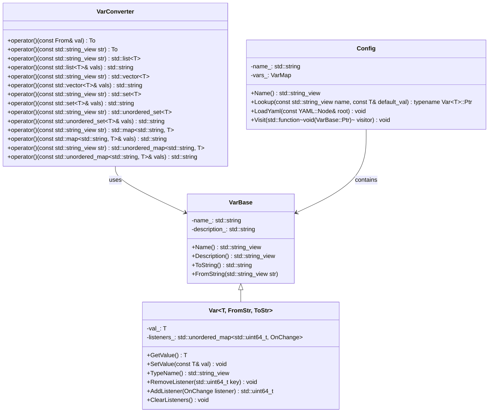
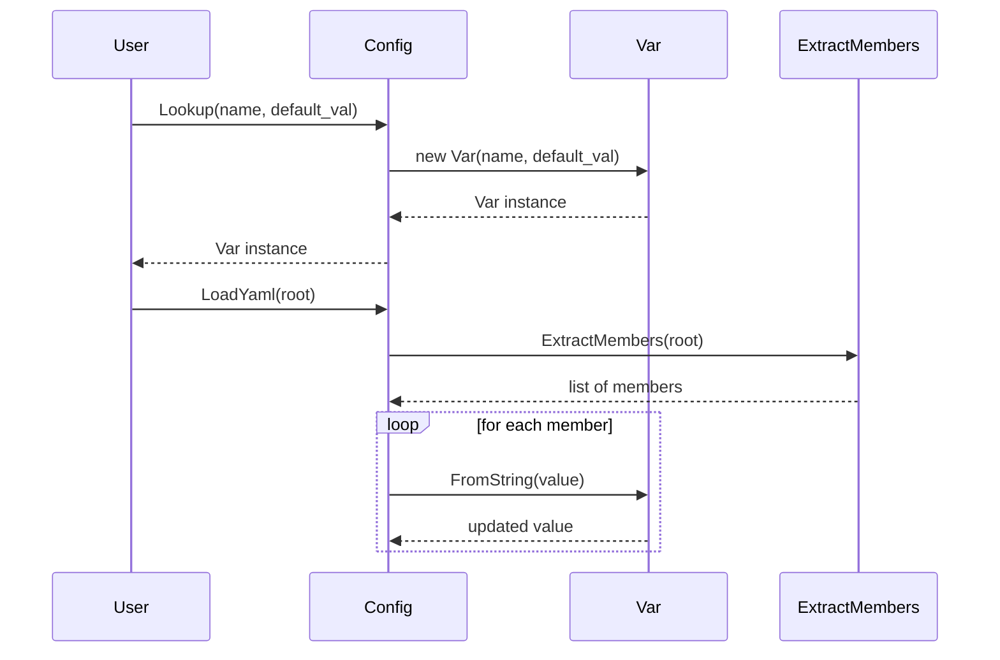

# 設計文書

## ファイル構造と責務

### include/config.h
- **ファイルの役割**: YAMLベースの設定管理機能を提供する。
- **主なクラス**:
  - `VarConverter`: 型変換を行うためのテンプレートクラス群。
  - `VarBase`: 設定変数の基本情報を保持する基底クラス。
  - `Var<T>`: 特定の型を持つ設定変数を管理する派生クラス。
  - `Config`: 複数の設定変数を管理し、YAMLから設定値を読み込む機能を提供する。

### src/config/config.cpp
- **ファイルの役割**: `include/config.h`で定義されたクラスの実装を含む。
- **主な関数**:
  - `ExtractMembers`: YAMLノードからメンバーを再帰的に抽出するヘルパー関数。

## 公開インターフェース

### VarConverter
- **テンプレートクラス**: 型変換を行うための汎用的なインタフェース。
- **主なメソッド**:
  - `operator()`: 変換処理を実行する。

### VarBase
- **基底クラス**: 設定変数の基本情報を保持する。
- **公開メソッド**:
  - `Name()`: 変数名を取得する。
  - `Description()`: 変数の説明を取得する。
  - `ToString()`: 変数値を文字列に変換する。
  - `FromString(std::string_view str)`: 文字列から変数値を設定する。

### Var<T>
- **派生クラス**: 特定の型を持つ設定変数を管理する。
- **公開メソッド**:
  - `GetValue()`: 変数値を取得する。
  - `SetValue(const T& val)`: 変数値を設定する。
  - `TypeName()`: 変数の型名を取得する。
  - `AddListener(OnChange listener)`: 値変更イベントリスナーを追加する。
  - `RemoveListener(std::uint64_t key)`: リスナーを削除する。
  - `ClearListeners()`: 全てのリスナーをクリアする。

### Config
- **設定管理クラス**: 複数の設定変数を管理し、YAMLから設定値を読み込む機能を提供する。
- **公開メソッド**:
  - `Name()`: コンフィグ名を取得する。
  - `Lookup(const std::string_view name, const T& default_val)`: 変数を検索し、存在しない場合は新規作成する。
  - `LoadYaml(const YAML::Node& root)`: YAMLノードから設定値を読み込む。
  - `Visit(std::function<void(VarBase::Ptr)> visitor)`: 全ての変数に対して訪問処理を行う。

## 入力
- **Var<T>::FromString**: 文字列形式の設定値。
- **Config::LoadYaml**: YAMLノード形式の設定データ。

## 出力
- **Var<T>::ToString**: 文字列形式の設定値。
- **Config::Visit**: 各変数に対する訪問処理結果（副作用による状態更新）。

## 状態
- **Var<T>**:
  - `val_`: 変数値。
  - `listeners_`: 値変更イベントリスナーのマップ。
- **Config**:
  - `vars_`: 設定変数のマップ。

## 処理手順
### Var<T>::FromString
1. 文字列を指定されたコンバータを使用して型に変換する。
2. 変換後の値が現在の値と異なる場合、リスナーに通知する。
3. 新しい値を設定する。

### Config::LoadYaml
1. YAMLノードからメンバーを再帰的に抽出する。
2. 抽出した各メンバーに対して、対応する変数を探し、存在すればその値を更新する。

## 例外・失敗条件
- **VarConverter**: 変換に失敗した場合、`std::invalid_argument`をスローする。
- **Config::Lookup(const std::string_view name)**: 見つかった変数の型が要求と異なる場合、`std::invalid_argument`をスローする。

## 依存関係
- `util.h`: YAMLノードの読み込みや文字列操作に使用されるユーティリティ関数。
- `yaml-cpp/yaml.h`: YAMLデータの解析に使用されるライブラリ。

## 重要な不変条件
- **Var<T>**: 変数値はスレッドセーフに管理される（`std::shared_mutex`を使用）。
- **Config**: 設定変数のマップもスレッドセーフに管理される（`std::shared_mutex`を使用）。

## 追加詳細設計情報

### クラス図


### クラス・メソッド・インターフェース詳細

| クラス/構造体 | メンバ名 | 型 | 説明 |
|---------------|----------|----|------|
| VarConverter  | operator() | To(const From&) | 変換処理 |
| VarBase       | Name      | std::string_view | 変数名を取得する |
| VarBase       | Description | std::string_view | 変数の説明を取得する |
| VarBase       | ToString  | std::string | 変数値を文字列に変換する |
| VarBase       | FromString | void(std::string_view) | 文字列から変数値を設定する |
| Var<T>        | GetValue  | T | 変数値を取得する |
| Var<T>        | SetValue  | void(const T&) | 変数値を設定する |
| Var<T>        | TypeName  | std::string_view | 変数の型名を取得する |
| Var<T>        | RemoveListener | void(std::uint64_t) | リスナーを削除する |
| Var<T>        | AddListener   | std::uint64_t(OnChange) | 値変更イベントリスナーを追加する |
| Var<T>        | ClearListeners | void() | 全てのリスナーをクリアする |
| Config        | Name      | std::string_view | コンフィグ名を取得する |
| Config        | Lookup    | typename Var~T~::Ptr(const std::string_view, const T&, std::string_view) | 変数を検索し、存在しない場合は新規作成する |
| Config        | LoadYaml  | void(const YAML::Node&) | YAMLノードから設定値を読み込む |
| Config        | Visit     | void(std::function~void(VarBase::Ptr)~) | 全ての変数に対して訪問処理を行う |

### シーケンス図


### メソッド仕様書

#### Var<T>::FromString(std::string_view str)
- **目的**: 文字列形式の設定値を型に変換し、変数値を更新する。
- **引数**:
  - `str`: 変換元の文字列。
- **戻り値**: 無し
- **動作**:
  1. 文字列を指定されたコンバータを使用して型に変換する。
  2. 変換後の値が現在の値と異なる場合、リスナーに通知する。
  3. 新しい値を設定する。
- **例外処理**:
  - `std::invalid_argument`: 変換に失敗した場合。

#### Config::LoadYaml(const YAML::Node& root)
- **目的**: YAMLノードから設定値を読み込み、対応する変数の値を更新する。
- **引数**:
  - `root`: 読み込むYAMLノード。
- **戻り値**: 無し
- **動作**:
  1. YAMLノードからメンバーを再帰的に抽出する。
  2. 抽出した各メンバーに対して、対応する変数を探し、存在すればその値を更新する。

### 処理フロー図
```mermaid
graph TD
    A[開始] --> B[Lookup(name, default_val)]
    B --> C{Varが存在するか?}
    C -- はい --> D[Varインスタンスを返す]
    C -- いいえ --> E[new Var(name, default_val)]
    E --> F[Varインスタンスを作成]
    F --> G[Varインスタンスを返す]

    H[開始] --> I[LoadYaml(root)]
    I --> J[ExtractMembers(root)]
    J --> K[メンバーのリストを受け取る]
    loop for each member
        K --> L[FromString(value)]
        L --> M[値を更新する]
    end
```

### 状態遷移・副作用

| 更新前状態 | 遷移条件 | 変更対象 | 更新後状態 | 更新順序 | 副作用 |
|------------|----------|----------|------------|----------|--------|
| 未設定     | Lookup(name, default_val) | Varインスタンス | 設定済み | 1. 新規作成<br>2. 返却 | 無し |
| 既存       | LoadYaml(root)            | 変数値        | 更新後   | 1. 抽出<br>2. 値更新 | リスナー通知 |

### データ変換・制約

| 入力データ | 出力データ | 変換規則 | 値域 | 境界値 |
|------------|------------|----------|------|--------|
| std::string_view | T          | VarConverter | 任意の型 | 無し |
| YAML::Node     | 設定変数   | LoadYaml     | 任意の設定データ | 無し |

この設計文書は、`config.h`と`config.cpp`の内容を基に再実装に必要な詳細情報を提供します。各クラスやメソッドの役割、処理フロー、例外処理などを明確に記述しています。

# Machine-extracted Source-local Implementation Contract

This appendix is deterministic evidence extracted from the target source.
It is not an LLM summary and it does not contain complete function bodies.

During regeneration:
- preserve the exact local declaration types, containers, initializers, and literals listed below;
- preserve the exact call targets and argument expressions listed below;
- do not substitute a different representation or accessor merely because it looks similar;
- treat these items as exact constraints, not as pseudocode suggestions.

## Exact local declarations

- `To val {};`
- `std::istringstream ss {str.data()};`
- `const auto node {LoadYamlString(str)};`
- `std::list<T> vals;`
- `std::ostringstream ss;`
- `YAML::Node node;`
- `std::vector<T> vals;`
- `std::set<T> vals;`
- `std::unordered_set<T> vals;`
- `std::map<std::string, T> vals;`
- `std::ostringstream key;`
- `std::ostringstream val;`
- `std::unordered_map<std::string, T> vals;`
- `const std::shared_lock locker {mtx_};`
- `const std::unique_lock locker {mtx_};`
- `static std::uint64_t key {0};`
- `const auto var {Lookup<T>(name)};`
- `const auto new_var { std::make_shared<Var<T>>(name, default_val, description)};`
- `const auto base {LookupBase(name)};`
- `const auto var {std::dynamic_pointer_cast<Var<T>>(base)};`
- `std::list<std::pair<std::string, YAML::Node>> members;`
- `auto it {node.begin()};`
- `const auto key {ss.str()};`
- `auto sub_members {ExtractMembers( it->second, prefix.empty() ? key : prefix + "." + key)};`
- `const auto var {vars_.find(name.data())};`
- `const auto key {node.first};`
- `const auto var {LookupBase(key)};`
- `static const auto ins {std::make_shared<Config>("root")};`

## Exact top-level call expressions

- `static_cast<To>(val)`
- `to_string(val)`
- `val.data()`
- `str.data()`
- `ss.fail()`
- `fmt::format("Invalid value: '{}'", str)`
- `LoadYamlString(str)`
- `node.IsSequence()`
- `fmt::format("Mismatched type: '{}'", str)`
- `std::ranges::for_each(node, [&vals](const YAML::Node& child) { std::ostringstream ss; ss << child; vals.emplace_back(VarConverter<std::string, T> {}(ss.str())); })`
- `std::ranges::for_each(vals, [&node](const T& val) { node.push_back( LoadYamlString(VarConverter<T, std::string> {}(val))); })`
- `std::ranges::move(VarConverter<std::string, std::list<T>> {}(str), std::back_inserter(vals))`
- `VarConverter<std::list<T>, std::string> {}( {vals.cbegin(), vals.cend()})`
- `std::ranges::move(VarConverter<std::string, std::list<T>> {}(str), std::inserter(vals, vals.end()))`
- `node.IsMap()`
- `std::ranges::for_each( node, [&vals](const std::pair<YAML::Node, YAML::Node>& child) { std::ostringstream key; key << child.first; std::ostringstream val; val << child.second; vals.emplace(key.str(), VarConverter<std::string, T> {}(val.str())); })`
- `std::ranges::for_each( vals, [&node](const std::pair<std::string, T>& val) { node[val.first] = LoadYamlString(VarConverter<T, std::string> {}(val.second)); })`
- `std::ranges::move( VarConverter<std::string, std::map<std::string, T>> {}(str), std::inserter(vals, vals.end()))`
- `VarConverter<std::map<std::string, T>, std::string> {}( {vals.cbegin(), vals.cend()})`
- `ToStr {}(GetValue())`
- `SetValue(FromStr {}(str))`
- `std::ranges::for_each( listeners_, [&val, this](const auto& listener) noexcept { try { listener.second(val_, val); } catch (const std::exception& err) { std::osyncstream {std::cerr} << err.what() << std::endl; } })`
- `typeid(T).name()`
- `listeners_.erase(key)`
- `std::move(listener)`
- `listeners_.clear()`
- `Lookup<T>(name)`
- `std::make_shared<Var<T>>(name, default_val, description)`
- `vars_.emplace(name, new_var)`
- `LookupBase(name)`
- `std::dynamic_pointer_cast<Var<T>>(base)`
- `fmt::format("Mismatched type: '{}'", name)`
- `members.emplace_back(prefix, node)`
- `node.begin()`
- `node.end()`
- `ExtractMembers( it->second, prefix.empty() ? key : prefix + "." + key)`
- `members.merge( sub_members, [](const std::pair<std::string, YAML::Node>& lhs, const std::pair<std::string, YAML::Node>& rhs) noexcept { return lhs.first < rhs.first; })`
- `vars_.find(name.data())`
- `vars_.cend()`
- `ExtractMembers(root)`
- `key.empty()`
- `LookupBase(key)`
- `var->FromString(ss.str())`
- `std::ranges::for_each(vars_, [&visitor](const auto& var) noexcept { try { visitor(var.second); } catch (const std::exception& err) { std::osyncstream {std::cerr} << err.what() << std::endl; } })`
- `std::make_shared<Config>("root")`

# Machine-extracted Dependency API Contract

This appendix is deterministic evidence derived from the selected repository context and target-source usages.
It is not an LLM summary.

During regeneration:
- preserve the exact dependency declarations and call patterns listed below;
- do not invent replacement APIs, member functions, overloads, or adapters;
- preserve return types, parameter types, defaults, qualifiers, and argument expressions as written;
- do not consume a void return value as a value.

## `LoadYamlString`

### Exact declarations

- `YAML::Node LoadYamlString( std::string_view str, std::initializer_list<std::string_view> required_fields = {});`

### Exact target-source usages

- `LoadYamlString(str)`
- `LoadYamlString(VarConverter<T, std::string> {}(val))`
- `LoadYamlString(VarConverter<T, std::string> {}(val.second))`
