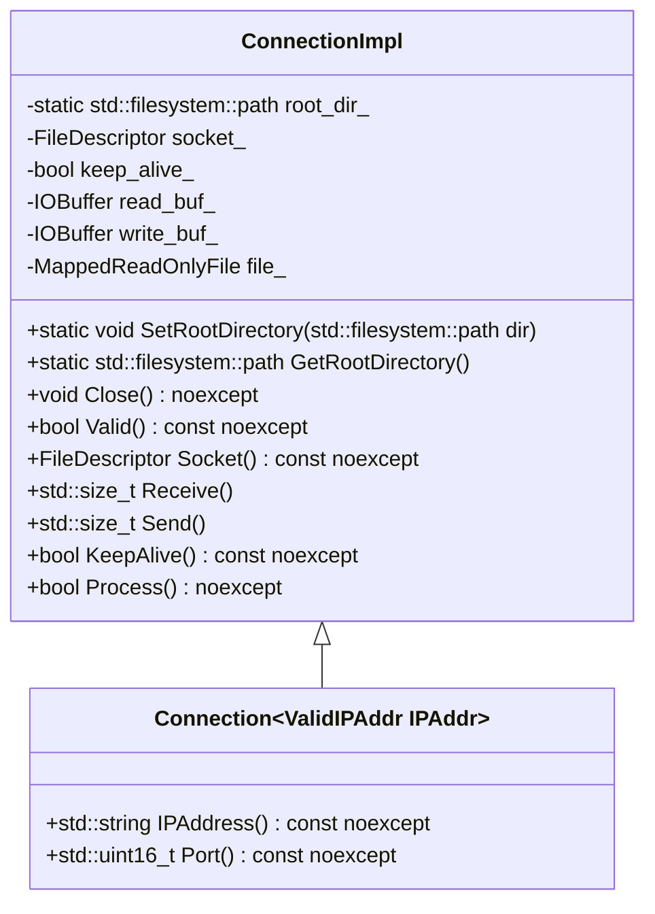
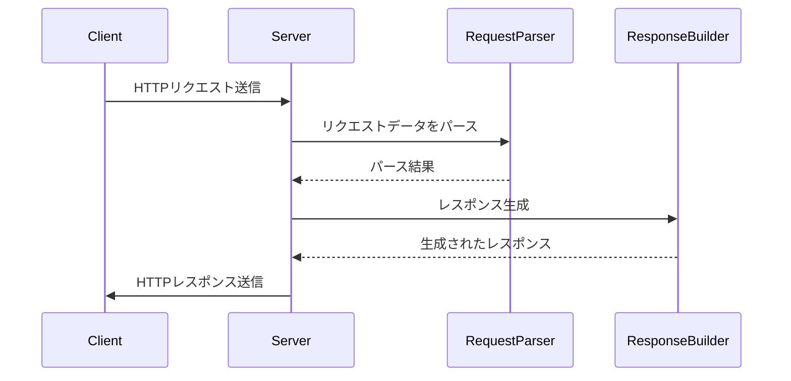

# HTTPモジュール設計文書

## 責務
HTTP通信の受信、解析、応答生成、送信を行う。具体的には、HTTPリクエストをパースし、適切なHTTPレスポンスを作成してクライアントに返す。

## 公開インターフェース
- `ConnectionImpl` クラス: HTTP接続のコア実装。
  - `SetRootDirectory`: ルートディレクトリを設定する。
  - `GetRootDirectory`: ルートディレクトリを取得する。
  - `Close`: 接続を閉じる。
  - `Valid`: 接続が有効かどうか確認する。
  - `Socket`: ソケットを取得する。
  - `Receive`: HTTPリクエストを受け取る。
  - `Send`: HTTPレスポンスを送信する。
  - `KeepAlive`: 接続がキープアライブであるか確認する。
  - `Process`: リクエストを処理し、適切なレスポンスを作成する。

- `Connection` クラス: IPアドレス情報を含むHTTP接続。
  - `IPAddress`: IPアドレスを取得する。
  - `Port`: ポート番号を取得する。

## 入力
- HTTPリクエストデータ（バッファ形式）。
- ルートディレクトリパス。
- ソケットファイルディスクリプタ。

## 出力
- HTTPレスポンスデータ（バッファ形式）。
- エラーメッセージやステータスコード。

## 状態
- `root_dir_`: ルートディレクトリのパス。
- `socket_`: ソケットファイルディスクリプタ。
- `keep_alive_`: 接続がキープアライブであるかどうかを示すフラグ。
- `read_buf_`: 受信バッファ。
- `write_buf_`: 送信バッファ。
- `file_`: マップされた読み取り専用ファイル。

## 処理手順
1. **初期化**: コンストラクタでソケットを設定し、内部状態を初期化する。
2. **リクエスト受信**: `Receive`メソッドでHTTPリクエストデータを受け取る。
3. **リクエスト解析**: `Process`メソッド内で`Request`クラスを使用してリクエストデータをパースする。
4. **レスポンス生成**: パースしたリクエストに基づいて`Response`クラスを使用して適切なHTTPレスポンスを作成する。
5. **レスポンス送信**: `Send`メソッドで作成したHTTPレスポンスデータを送信する。

## 例外・失敗条件
- バッファが空である場合、リクエストのパースに失敗する。
- ソケットが無効な場合、接続処理に失敗する。
- ファイルマップに失敗した場合、適切なエラーレスポンスを生成する。

## 依存関係
- `Buffer`, `IOBuffer` (include/containers/buffer.h)
- `IPAddr`, `IPv4Addr`, `IPv6Addr` (include/ip.h)
- `IReader`, `IWriter`, `IReadWriter`, `FileDescriptor` (include/io.h)
- `MappedReadOnlyFile` (include/util.h)

## 重要な不変条件
- ソケットファイルディスクリプタは常に有効であるか、無効値（-1）である。
- ルートディレクトリパスは設定された場合、存在する有効なディレクトリパスである。

# 追加詳細設計情報

## クラス図


## クラス・メソッド・インターフェース詳細

| クラス名 | メソッド名 | 完全な名前 | 引数名と型 | 戻り値型 | 可視性 | const | noexcept | static |
|----------|------------|------------|------------|----------|--------|-------|----------|--------|
| ConnectionImpl | SetRootDirectory | ws::http::ConnectionImpl::SetRootDirectory | dir: std::filesystem::path | void | public | - | yes | yes |
| ConnectionImpl | GetRootDirectory | ws::http::ConnectionImpl::GetRootDirectory | - | std::filesystem::path | public | - | yes | yes |
| ConnectionImpl | Close | ws::http::ConnectionImpl::Close | - | void | public | - | yes | no |
| ConnectionImpl | Valid | ws::http::ConnectionImpl::Valid | - | bool | public | const | yes | no |
| ConnectionImpl | Socket | ws::http::ConnectionImpl::Socket | - | FileDescriptor | public | const | yes | no |
| ConnectionImpl | Receive | ws::http::ConnectionImpl::Receive | - | std::size_t | public | - | no | no |
| ConnectionImpl | Send | ws::http::ConnectionImpl::Send | - | std::size_t | public | - | no | no |
| ConnectionImpl | KeepAlive | ws::http::ConnectionImpl::KeepAlive | - | bool | public | const | yes | no |
| ConnectionImpl | Process | ws::http::ConnectionImpl::Process | - | bool | public | const | yes | no |

## シーケンス図


## メソッド仕様書

### `ConnectionImpl::Receive`
- **目的**: ソケットからHTTPリクエストデータを受け取る。
- **引数**: 無し
- **戻り値**: 受け取ったバイト数 (std::size_t)
- **動作**: ソケットからデータを読み取り、`read_buf_`に格納する。非ブロッキングモードで読み込みを行い、リソースが利用できない場合は例外をスローしない。
- **副作用**: `read_buf_`の内容が更新される。

### `ConnectionImpl::Send`
- **目的**: HTTPレスポンスデータをソケットに送信する。
- **引数**: 無し
- **戻り値**: 送信したバイト数 (std::size_t)
- **動作**: `write_buf_`とマップされたファイルの内容をソケットに書き込む。エラーが発生した場合は例外をスローする。
- **副作用**: ソケットへのデータ書き込み。

### `ConnectionImpl::Process`
- **目的**: 受信したHTTPリクエストを処理し、適切なレスポンスを作成する。
- **引数**: 無し
- **戻り値**: リクエストが正常に処理されたかどうか (bool)
- **動作**: `read_buf_`からHTTPリクエストをパースし、`Response`クラスを使用して適切なレスポンスを作成する。エラーが発生した場合はエラーレスポンスを作成する。
- **副作用**: `write_buf_`の内容が更新される。

## 処理フロー図
```mermaid
graph TD
    A[Receive] --> B{read_buf_.ReadableSize() == 0?}
    B -- Yes --> C[return false]
    B -- No --> D[Request.Parse(read_buf_)]
    D --> E[Response.Build(write_buf_, request.Path(), status_code_)]
    E --> F[Send()]
    F --> G[return true]
```

## 状態遷移・副作用

| 更新前状態 | 遷移条件 | 変更対象 | 更新後状態 | 更新順序 | 副作用 |
|------------|----------|----------|------------|----------|--------|
| 任意       | Receive()呼び出し | read_buf_ | リクエストデータ格納 | 1 | - |
| 任意       | Process()呼び出し | status_code_, write_buf_ | レスポンス生成 | 2 | - |
| 任意       | Send()呼び出し | ソケット | レスポンス送信 | 3 | - |

## データ変換・制約

| 入力データ | 変換規則 | 出力データ | 値域 | 境界値 |
|------------|----------|------------|------|--------|
| HTTPリクエストデータ | パース処理 | Requestオブジェクト | 有効なHTTPリクエスト | - |
| ファイルパス | マッピング処理 | MappedReadOnlyFileオブジェクト | 存在するファイル | - |
| HTTPステータスコード | 文字列変換 | ステータスマッセージ | 有効なHTTPステータスコード | - |

これらの設計情報は、元コードから確認できる事実に基づいており、再実装に必要な詳細を提供します。

# Machine-extracted Source-local Implementation Contract

This appendix is deterministic evidence extracted from the target source.
It is not an LLM summary and it does not contain complete function bodies.

During regeneration:
- preserve the exact local declaration types, containers, initializers, and literals listed below;
- preserve the exact call targets and argument expressions listed below;
- do not substitute a different representation or accessor merely because it looks similar;
- treat these items as exact constraints, not as pseudocode suggestions.

## Exact local declarations

- `static constexpr std::string_view user_tag {"user"};`
- `static constexpr std::string_view msg_tag {"msg"};`
- `const auto user {request.Post(user_tag).value_or("")};`
- `const auto msg {request.Post(msg_tag).value_or("")};`
- `static const std::unordered_map<std::string_view, std::string_view> types { {".html", "text/html"}, {".xml", "text/xml"}, {".xhtml", "application/xhtml+xml"}, {".txt", "text/plain"}, {".rtf", "application/rtf"}, {".pdf", "application/pdf"}, {".word", "application/nsword"}, {".png", "image/png"}, {".gif", "image/gif"}, {".jpg", "image/jpeg"}, {".jpeg", "image/jpeg"}, {".au", "audio/basic"}, {".mpeg", "video/mpeg"}, {".mpg", "video/mpeg"}, {".avi", "video/x-msvideo"}, {".gz", "application/x-gzip"}, {".tar", "application/x-tar"}, {".css", "text/css"}, {".js", "text/javascript"}, };`
- `const auto extension { StringToLower(std::filesystem::path {name}.extension())};`
- `static const std::unordered_map<StatusCode, std::string_view> msgs { {StatusCode::OK, "OK"}, {StatusCode::BadRequest, "Bad Request"}, {StatusCode::Forbidden, "Forbidden"}, {StatusCode::NotFound, "Not Found"}};`
- `static const std::unordered_map<Method, std::string_view> methods { {Method::Get, "GET"}, {Method::Patch, "PATCH"}, {Method::Post, "POST"}, {Method::Delete, "DELETE"}, {Method::Put, "PUT"}};`
- `static const std::unordered_map<std::string_view, Method> methods { {"GET", Method::Get}, {"PATCH", Method::Patch}, {"POST", Method::Post}, {"DELETE", Method::Delete}, {"PUT", Method::Put}};`
- `const auto method {methods.find(str)};`
- `static constexpr std::size_t encoded_length {3};`
- `const auto ascii {std::stoi(str.substr(1), nullptr, 16)};`
- `std::ostringstream ss;`
- `std::size_t i {0};`
- `const auto encoded {str.substr(i, encoded_length)};`
- `io::FileDescriptor io {socket_, socket_};`
- `std::size_t size {0};`
- `std::size_t header_size {0};`
- `std::size_t file_size {0};`
- `const auto size {write(socket_, file_.Data() + file_size, file_.Size() - file_size)};`
- `static constexpr std::string_view index_page {"/index.html"};`
- `static constexpr std::string_view hide_msg_tag {"hide-msg"};`
- `Request request;`
- `Response response {root_dir_};`
- `std::optional<std::string> error_msg;`
- `std::string path {request.Path()};`
- `StatusCode status_code {StatusCode::OK};`
- `auto params {ExtractUserMessage(request).value_or(Parameters {})};`
- `auto file { response.Build(write_buf_, std::move(path), status_code)};`
- `auto content {buf.ReadableString()};`
- `const auto line_end {content.find(new_line)};`
- `const auto line {content.substr(0, line_end)};`
- `const auto conn {headers_.find("Connection")};`
- `const auto val {post_.find(key.data())};`
- `const auto val {headers_.find(key.data())};`
- `const std::regex pattern {"^([^ ]*) ([^ ]*) HTTP/([^ ]*)$"};`
- `std::smatch matches;`
- `const std::regex pattern {"^([^:]*): ?(.*)$"};`
- `const auto method {parser_.Method()};`
- `const auto content_type {parser_.Header("Content-Type").value_or("")};`
- `auto& post {parser_.post_};`
- `auto decoded_body {DecodeURLEncodedString(body)};`
- `std::string_view view {decoded_body};`
- `std::string key, val;`
- `std::size_t begin {0}, end {0};`
- `static constexpr std::string_view http_status_page {"/http-status.html"};`
- `static constexpr std::string_view status_code_tag {"status-code"};`
- `static constexpr std::string_view status_tag {"status"};`
- `const Parameters params { {status_code_tag.data(), std::to_string(StatusCodeToInteger(status_code_))}, {status_tag.data(), StatusCodeToMessage(status_code_).data()}, {msg_tag.data(), std::move(msg)} };`
- `std::string content {reinterpret_cast<const char*>(file_.Data()), file_.Size()};`
- `const auto lines {SplitStringToLines(content)};`
- `std::size_t length {new_line.length() * (lines.size() - 1)};`
- `auto i {0};`
- `const auto body {ss.str()};`

## Exact top-level call expressions

- `std::move(addr)`
- `addr_.IPAddress()`
- `addr_.Port()`
- `request.Post(user_tag).value_or("")`
- `request.Post(msg_tag).value_or("")`
- `user.empty()`
- `user_tag.data()`
- `user.data()`
- `msg_tag.data()`
- `msg.data()`
- `StringToLower(std::filesystem::path {name}.extension())`
- `types.contains(extension.c_str())`
- `types.at(extension.c_str())`
- `msgs.at(code)`
- `StatusCodeToMessage(code)`
- `static_cast<std::uint32_t>(code)`
- `methods.at(method)`
- `MethodToString(method).data()`
- `StringToUpper(str)`
- `methods.find(str)`
- `methods.cend()`
- `fmt::format("Invalid HTTP method: '{}'", str)`
- `str.length()`
- `str.front()`
- `std::stoi(str.substr(1), nullptr, 16)`
- `static_cast<char>(ascii)`
- `fmt::format("Invalid HTTP URL-encoding character: '{}'", str)`
- `str.size()`
- `str.substr(i, encoded_length)`
- `encoded.length()`
- `DecodeURLEncodedCharacter(encoded)`
- `fmt::format( "Invalid HTTP URL-encoding strings: '{}'", str)`
- `ss.str()`
- `fmt::format("<${}$>", key)`
- `ReplaceAllSubstring(html, HTMLPlaceholder(key), val)`
- `std::move(dir)`
- `assert(IsValidFileDescriptor(socket_))`
- `Close()`
- `close(socket_)`
- `read_buf_.ReadFrom(io)`
- `err.code()`
- `write_buf_.Empty()`
- `write_buf_.WriteTo(io)`
- `file_.Size()`
- `write(socket_, file_.Data() + file_size, file_.Size() - file_size)`
- `ThrowLastSystemError()`
- `file_.Unmap()`
- `read_buf_.ReadableSize()`
- `request.Parse(read_buf_)`
- `err.what()`
- `request.KeepAlive()`
- `response.SetKeepAlive(keep_alive_)`
- `error_msg.has_value()`
- `request.Path()`
- `path.empty()`
- `ExtractUserMessage(request).value_or(Parameters {})`
- `params.insert({hide_msg_tag.data(), params.empty() ? true_tag.data() : false_tag.data()})`
- `response.Build(write_buf_, index_page, params, status_code)`
- `response.Build(write_buf_, std::move(path), status_code)`
- `file.has_value()`
- `std::move(*file)`
- `response.Build(write_buf_, StatusCode::BadRequest, *error_msg)`
- `ParseStatusLine(line)`
- `Parse(buf)`
- `Clear()`
- `buf.Empty()`
- `buf.ReadableString()`
- `content.empty()`
- `content.find(new_line)`
- `content.substr(0, line_end)`
- `assert(state_)`
- `state_->Parse(line)`
- `buf.Retrieve(line.length())`
- `content.substr(line.length())`
- `content.substr(new_line.length())`
- `buf.Retrieve(new_line.length())`
- `std::move(state)`
- `SetState(std::make_unique<NotStarted>(*this))`
- `version_.clear()`
- `path_.clear()`
- `headers_.clear()`
- `post_.clear()`
- `post_.size()`
- `headers_.find("Connection")`
- `headers_.cend()`
- `post_.find(key.data())`
- `post_.cend()`
- `headers_.find(key.data())`
- `std::regex_match(line, matches, pattern)`
- `StringToMethod(matches[1])`
- `parser_.SetState(std::make_unique<Header>(parser_))`
- `fmt::format("Invalid HTTP status line: '{}'", line)`
- `parser_.headers_.emplace(matches[1], matches[2])`
- `line.empty()`
- `parser_.SetState(std::make_unique<Body>(parser_))`
- `parser_.Method()`
- `ParsePost(body)`
- `fmt::format( "Unsupported HTTP method: '{}'", to_string(method))`
- `parser_.SetState(std::make_unique<Finished>(parser_))`
- `parser_.Header("Content-Type").value_or("")`
- `ParseURLEncodedPost(body)`
- `fmt::format("Unsupported HTTP content type: '{}'", content_type)`
- `DecodeURLEncodedString(body)`
- `view.size()`
- `view.substr(begin, end - begin)`
- `key.empty()`
- `post.emplace(std::move(key), std::move(val))`
- `fmt::format("Invalid HTTP POST data: '{}'", body)`
- `assert(begin <= end)`
- `post.contains(key)`
- `val.empty()`
- `std::move(root_dir)`
- `file_path_.clear()`
- `std::move(file)`
- `Build(buf)`
- `std::move(file_)`
- `Build(buf, &params)`
- `status_code_tag.data()`
- `std::to_string(StatusCodeToInteger(status_code_))`
- `status_tag.data()`
- `StatusCodeToMessage(status_code_).data()`
- `std::move(msg)`
- `root_dir_.empty()`
- `file_.Map(root_dir_ / file_path_.relative_path())`
- `file_.Map(file_path_)`
- `AddStatusLine(buf)`
- `AddHeaders(buf)`
- `AddParamContent(buf, *params)`
- `AddMappedContent(buf)`
- `AddPredefinedErrorContent(buf, *error_msg)`
- `buf.Append( fmt::format("HTTP/{} {} {}", version, StatusCodeToInteger(status_code_), StatusCodeToMessage(status_code_)), NewLine::CRLF)`
- `buf.Append("Connection: ")`
- `buf.Append("keep-alive", NewLine::CRLF)`
- `buf.Append("keep-alive: max=6, timeout=120", NewLine::CRLF)`
- `buf.Append("close", NewLine::CRLF)`
- `assert(file_.Data())`
- `buf.Append(fmt::format("Content-type: {}", ContentTypeByFileName(file_path_.c_str())), NewLine::CRLF)`
- `buf.Append(fmt::format("Content-length: {}", file_.Size()), NewLine::CRLF)`
- `buf.Append(new_line)`
- `reinterpret_cast<const char*>(file_.Data())`
- `ReplaceAllSubstring(content, HTMLPlaceholder(key), val)`
- `SplitStringToLines(content)`
- `lines.size()`
- `std::for_each(lines.cbegin(), lines.cend(), [&length](const auto& line) { length += line.size(); })`
- `buf.Append(fmt::format("Content-length: {}", length), NewLine::CRLF)`
- `buf.Append(lines[i], NewLine::CRLF)`
- `buf.Append(lines[i])`
- `buf.Append("Content-type: text/html", NewLine::CRLF)`
- `fmt::format("<p>{} : {}</p>", StatusCodeToInteger(status_code_), StatusCodeToMessage(status_code_))`
- `msg.empty()`
- `fmt::format("<p>{}</p>", msg)`
- `buf.Append(fmt::format("Content-length: {}", body.size()), NewLine::CRLF)`
- `buf.Append(body)`

# Machine-extracted Dependency API Contract

This appendix is deterministic evidence derived from the selected repository context and target-source usages.
It is not an LLM summary.

During regeneration:
- preserve the exact dependency declarations and call patterns listed below;
- do not invent replacement APIs, member functions, overloads, or adapters;
- preserve return types, parameter types, defaults, qualifiers, and argument expressions as written;
- do not consume a void return value as a value.

## `Append`

### Exact declarations

- `void Append(std::string_view str, std::optional<NewLine> new_line = std::nullopt) noexcept;`
- `void Append(const void* data, std::size_t size) noexcept;`
- `void Append(std::span<const std::byte> bytes) noexcept;`
- `void Append(std::initializer_list<std::byte> bytes) noexcept;`
- `void Append(const Buffer& buf) noexcept;`

### Exact target-source usages

- `buf.Append( fmt::format("HTTP/{} {} {}", version, StatusCodeToInteger(status_code_), StatusCodeToMessage(status_code_)), NewLine::CRLF)`
- `buf.Append("Connection: ")`
- `buf.Append("keep-alive", NewLine::CRLF)`
- `buf.Append("keep-alive: max=6, timeout=120", NewLine::CRLF)`
- `buf.Append("close", NewLine::CRLF)`
- `buf.Append(fmt::format("Content-type: {}", ContentTypeByFileName(file_path_.c_str())), NewLine::CRLF)`
- `buf.Append(fmt::format("Content-length: {}", file_.Size()), NewLine::CRLF)`
- `buf.Append(new_line)`
- `buf.Append(fmt::format("Content-length: {}", length), NewLine::CRLF)`
- `buf.Append(lines[i], NewLine::CRLF)`
- `buf.Append(lines[i])`
- `buf.Append("Content-type: text/html", NewLine::CRLF)`
- `buf.Append(fmt::format("Content-length: {}", body.size()), NewLine::CRLF)`
- `buf.Append(body)`

## `Data`

### Exact declarations

- `std::byte* Data() const noexcept;`

### Exact target-source usages

- `file_.Data()`

## `Empty`

### Exact declarations

- `bool Empty() const noexcept;`

### Exact target-source usages

- `write_buf_.Empty()`
- `buf.Empty()`

## `IPAddress`

### Exact declarations

- `virtual std::string IPAddress() const noexcept = 0;`
- `std::string IPAddress() const noexcept override;`

### Exact target-source usages

- `addr_.IPAddress()`

## `IsValidFileDescriptor`

### Exact declarations

- `constexpr bool IsValidFileDescriptor(FileDescriptor fd) noexcept;`

### Exact target-source usages

- `IsValidFileDescriptor(socket_)`

## `Map`

### Exact declarations

- `std::byte* Map(std::string path);`

### Exact target-source usages

- `file_.Map(root_dir_ / file_path_.relative_path())`
- `file_.Map(file_path_)`

## `Path`

### Exact declarations

- `std::string_view Path() const noexcept;`

### Exact target-source usages

- `request.Path()`

## `Port`

### Exact declarations

- `virtual std::uint16_t Port() const noexcept = 0;`
- `std::uint16_t Port() const noexcept override;`

### Exact target-source usages

- `addr_.Port()`

## `ReadFrom`

### Exact declarations

- `std::size_t ReadFrom(io::IReadWriter& io);`
- `virtual std::size_t ReadFrom(Buffer& buf) = 0;`
- `std::size_t ReadFrom(Buffer& buf) noexcept override;`
- `std::size_t ReadFrom(Buffer& buf) override;`

### Exact target-source usages

- `read_buf_.ReadFrom(io)`

## `ReadableSize`

### Exact declarations

- `std::size_t ReadableSize() const noexcept;`

### Exact target-source usages

- `read_buf_.ReadableSize()`

## `ReadableString`

### Exact declarations

- `std::string ReadableString() const noexcept;`

### Exact target-source usages

- `buf.ReadableString()`

## `ReplaceAllSubstring`

### Exact declarations

- `std::string ReplaceAllSubstring(std::string_view str, std::string_view from, std::string_view to) noexcept;`

### Exact target-source usages

- `ReplaceAllSubstring(html, HTMLPlaceholder(key), val)`
- `ReplaceAllSubstring(content, HTMLPlaceholder(key), val)`

## `Retrieve`

### Exact declarations

- `void Retrieve(std::size_t size) noexcept;`

### Exact target-source usages

- `buf.Retrieve(line.length())`
- `buf.Retrieve(new_line.length())`

## `Size`

### Exact declarations

- `virtual std::size_t Size() const noexcept = 0;`
- `std::size_t Size() const noexcept override;`
- `std::size_t Size() const noexcept;`

### Exact target-source usages

- `file_.Size()`

## `SplitStringToLines`

### Exact declarations

- `std::vector<std::string> SplitStringToLines(const std::string& str) noexcept;`

### Exact target-source usages

- `SplitStringToLines(content)`

## `StringToLower`

### Exact declarations

- `std::string StringToLower(std::string str) noexcept;`

### Exact target-source usages

- `StringToLower(std::filesystem::path {name}.extension())`

## `StringToUpper`

### Exact declarations

- `std::string StringToUpper(std::string str) noexcept;`

### Exact target-source usages

- `StringToUpper(str)`

## `ThrowLastSystemError`

### Exact declarations

- `[[noreturn]] void ThrowLastSystemError();`

### Exact target-source usages

- `ThrowLastSystemError()`

## `Unmap`

### Exact declarations

- `void Unmap() noexcept;`

### Exact target-source usages

- `file_.Unmap()`

## `WriteTo`

### Exact declarations

- `std::size_t WriteTo(io::IReadWriter& io);`
- `virtual std::size_t WriteTo(Buffer& buf) = 0;`
- `std::size_t WriteTo(Buffer& buf) noexcept override;`
- `std::size_t WriteTo(Buffer& buf) override;`

### Exact target-source usages

- `write_buf_.WriteTo(io)`
