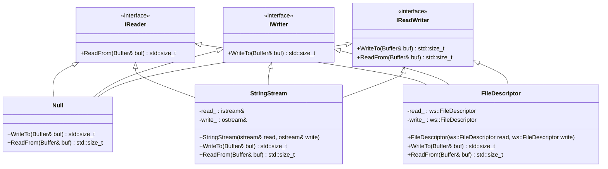
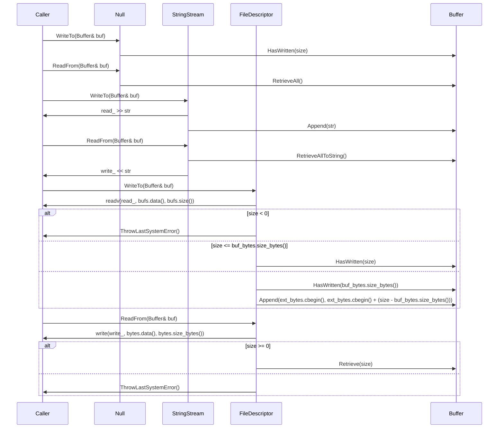
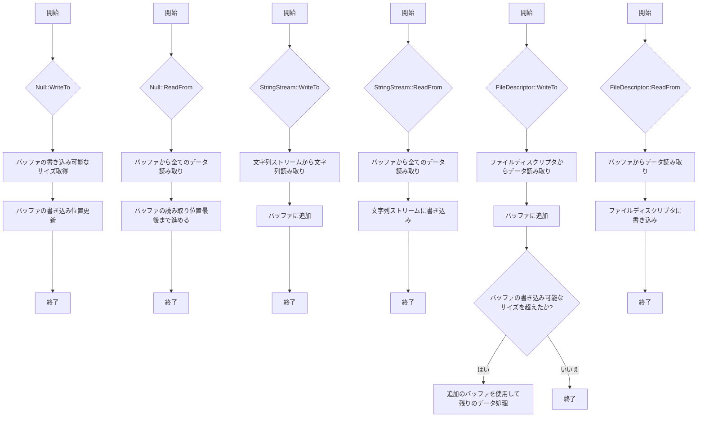

# デザイン文書

## 責務
`include/io.h`と`src/io/io.cpp`は、バッファを介してデータの読み書きを行うためのI/Oオブジェクトを提供します。具体的には、`Null`, `StringStream`, `FileDescriptor`クラスが定義されており、それぞれ異なるソース（無効な出力、文字列ストリーム、ファイルディスクリプタ）からのデータの読み書きを行います。

## 公開インターフェース
- **IReader**
  - `virtual std::size_t ReadFrom(Buffer& buf) = 0;`
- **IWriter**
  - `virtual std::size_t WriteTo(Buffer& buf) = 0;`
- **IReadWriter** (多重継承)
  - `std::size_t WriteTo(Buffer& buf)`
  - `std::size_t ReadFrom(Buffer& buf)`
- **Null**
  - `std::size_t WriteTo(Buffer& buf) noexcept override;`
  - `std::size_t ReadFrom(Buffer& buf) noexcept override;`
- **StringStream**
  - `explicit StringStream(std::istream& read, std::ostream& write) noexcept;`
  - `std::size_t WriteTo(Buffer& buf) noexcept override;`
  - `std::size_t ReadFrom(Buffer& buf) noexcept override;`
- **FileDescriptor**
  - `explicit FileDescriptor(ws::FileDescriptor read, ws::FileDescriptor write) noexcept;`
  - `std::size_t WriteTo(Buffer& buf) override;`
  - `std::size_t ReadFrom(Buffer& buf) override;`

## 入力
- **Null**: バッファの読み書き可能なサイズ。
- **StringStream**: 文字列ストリームからのデータ、バッファへのデータ。
- **FileDescriptor**: ファイルディスクリプタからのデータ、バッファへのデータ。

## 出力
- **Null**: 書き込んだサイズ（常にバッファの書き込み可能なサイズ）、読み取ったサイズ（常にバッファの読み取り可能なサイズ）。
- **StringStream**: 文字列ストリームに書き込んだ文字数、バッファから読み取った文字数。
- **FileDescriptor**: ファイルディスクリプタに書き込んだバイト数、ファイルディスクリプタから読み取ったバイト数。

## 状態
- **Null**: なし（状態を持たない）。
- **StringStream**: 参照する文字列ストリームの状態。
- **FileDescriptor**: ファイルディスクリプタの状態。

## 処理手順
- **Null**:
  - `WriteTo`: バッファの書き込み可能なサイズを取得し、そのサイズだけバッファの書き込み位置を進める。
  - `ReadFrom`: バッファから全てのデータを読み取り、バッファの読み取り位置を最後まで進める。
- **StringStream**:
  - `WriteTo`: 文字列ストリームから文字列を読み取り、それをバッファに追加する。
  - `ReadFrom`: バッファから全てのデータを読み取り、それを文字列ストリームに書き込む。
- **FileDescriptor**:
  - `WriteTo`: ファイルディスクリプタからデータを読み取り、バッファに追加する。バッファの書き込み可能なサイズを超えた場合は追加のバッファを使用して残りのデータを処理する。
  - `ReadFrom`: バッファからデータを読み取り、それをファイルディスクリプタに書き込む。

## 例外・失敗条件
- **Null**: なし（例外を投げない）。
- **StringStream**: 文字列ストリームの操作でエラーが発生した場合、そのエラーは呼び出し元に伝播する。
- **FileDescriptor**:
  - `readv`や`write`システムコールが失敗した場合、`ThrowLastSystemError()`を呼び出して例外を投げる。

## 依存関係
- **Null**: `Buffer`
- **StringStream**: `Buffer`, `std::istream`, `std::ostream`
- **FileDescriptor**: `Buffer`, `ws::FileDescriptor`, `sys/uio.h`, `unistd.h`

## 重要な不変条件
- **Null**: バッファの読み書き可能なサイズは常に非負である。
- **StringStream**: 参照する文字列ストリームが有効である。
- **FileDescriptor**: ファイルディスクリプタが有効である。

## 追加詳細設計情報

### クラス図

### クラス・メソッド・インターフェース詳細

| クラス名       | メソッド名         | 完全な名前                           | 引数名と型                         | 戻り値型   | 可視性 | const | static | `const` | `noexcept` | 型別名 | 列挙型 | 定数 | 直接依存 |
|----------------|--------------------|--------------------------------------|------------------------------------|------------|--------|-------|--------|---------|------------|--------|--------|------|----------|
| IReader        | ReadFrom           | ws::io::IReader::ReadFrom            | buf: Buffer&                     | std::size_t| public |       |        |         |            |        |        |      |          |
| IWriter        | WriteTo            | ws::io::IWriter::WriteTo             | buf: Buffer&                     | std::size_t| public |       |        |         |            |        |        |      |          |
| IReadWriter    | WriteTo            | ws::io::IReadWriter::WriteTo         | buf: Buffer&                     | std::size_t| public |       |        |         |            |        |        |      |          |
| IReadWriter    | ReadFrom           | ws::io::IReadWriter::ReadFrom        | buf: Buffer&                     | std::size_t| public |       |        |         |            |        |        |      |          |
| Null           | WriteTo            | ws::io::Null::WriteTo                | buf: Buffer&                     | std::size_t| public |       |        |         | ✅         |        |        |      |          |
| Null           | ReadFrom           | ws::io::Null::ReadFrom               | buf: Buffer&                     | std::size_t| public |       |        |         | ✅         |        |        |      |          |
| StringStream   | StringStream       | ws::io::StringStream::StringStream   | read: istream&, write: ostream&  |            | public |       |        |         | ✅         |        |        |      |          |
| StringStream   | WriteTo            | ws::io::StringStream::WriteTo        | buf: Buffer&                     | std::size_t| public |       |        |         | ✅         |        |        |      |          |
| StringStream   | ReadFrom           | ws::io::StringStream::ReadFrom       | buf: Buffer&                     | std::size_t| public |       |        |         | ✅         |        |        |      |          |
| FileDescriptor | FileDescriptor     | ws::io::FileDescriptor::FileDescriptor | read: ws::FileDescriptor, write: ws::FileDescriptor |            | public |       |        |         | ✅         |        |        |      |          |
| FileDescriptor | WriteTo            | ws::io::FileDescriptor::WriteTo      | buf: Buffer&                     | std::size_t| public |       |        |         |            |        |        |      |          |
| FileDescriptor | ReadFrom           | ws::io::FileDescriptor::ReadFrom     | buf: Buffer&                     | std::size_t| public |       |        |         |            |        |        |      |          |

### シーケンス図

### メソッド仕様書

#### Null::WriteTo
- **目的**: バッファの書き込み可能なサイズを取得し、そのサイズだけバッファの書き込み位置を進める。
- **引数**:
  - `buf`: 書き込む対象となるバッファ。
- **戻り値**: 書き込んだサイズ（常にバッファの書き込み可能なサイズ）。
- **動作**: バッファの書き込み可能なサイズを取得し、そのサイズだけバッファの書き込み位置を進める。
- **副作用**: バッファの書き込み位置が更新される。
- **エラー処理**: なし（例外を投げない）。

#### Null::ReadFrom
- **目的**: バッファから全てのデータを読み取り、バッファの読み取り位置を最後まで進める。
- **引数**:
  - `buf`: 読み取る対象となるバッファ。
- **戻り値**: 読み取ったサイズ（常にバッファの読み取り可能なサイズ）。
- **動作**: バッファから全てのデータを読み取り、バッファの読み取り位置を最後まで進める。
- **副作用**: バッファの読み取り位置が更新される。
- **エラー処理**: なし（例外を投げない）。

#### StringStream::StringStream
- **目的**: 文字列ストリームからのデータ、バッファへのデータの読み書きを行うためのオブジェクトを作成する。
- **引数**:
  - `read`: 読み取り用文字列ストリーム。
  - `write`: 書き込み用文字列ストリーム。
- **戻り値**: なし。
- **動作**: 文字列ストリームへの参照を保持する。
- **副作用**: なし。
- **エラー処理**: なし（例外を投げない）。

#### StringStream::WriteTo
- **目的**: 文字列ストリームから文字列を読み取り、それをバッファに追加する。
- **引数**:
  - `buf`: 書き込む対象となるバッファ。
- **戻り値**: 書き込んだ文字数。
- **動作**: 文字列ストリームから文字列を読み取り、それをバッファに追加する。
- **副作用**: バッファの内容が更新される。
- **エラー処理**: 文字列ストリームからの読み取りでエラーが発生した場合、そのエラーは呼び出し元に伝播する。

#### StringStream::ReadFrom
- **目的**: バッファから全てのデータを読み取り、それを文字列ストリームに書き込む。
- **引数**:
  - `buf`: 読み取る対象となるバッファ。
- **戻り値**: 読み取った文字数。
- **動作**: バッファから全てのデータを読み取り、それを文字列ストリームに書き込む。
- **副作用**: 文字列ストリームの内容が更新される。
- **エラー処理**: なし（例外を投げない）。

#### FileDescriptor::FileDescriptor
- **目的**: ファイルディスクリプタからのデータ、バッファへのデータの読み書きを行うためのオブジェクトを作成する。
- **引数**:
  - `read`: 読み取り用ファイルディスクリプタ。
  - `write`: 書き込み用ファイルディスクリプタ。
- **戻り値**: なし。
- **動作**: ファイルディスクリプタへの参照を保持する。
- **副作用**: なし。
- **エラー処理**: なし（例外を投げない）。

#### FileDescriptor::WriteTo
- **目的**: ファイルディスクリプタからデータを読み取り、バッファに追加する。バッファの書き込み可能なサイズを超えた場合は追加のバッファを使用して残りのデータを処理する。
- **引数**:
  - `buf`: 書き込む対象となるバッファ。
- **戻り値**: 読み取ったバイト数。
- **動作**: ファイルディスクリプタからデータを読み取り、バッファに追加する。バッファの書き込み可能なサイズを超えた場合は追加のバッファを使用して残りのデータを処理する。
- **副作用**: バッファの内容が更新される。
- **エラー処理**: `readv`システムコールが失敗した場合、`ThrowLastSystemError()`を呼び出して例外を投げる。

#### FileDescriptor::ReadFrom
- **目的**: バッファからデータを読み取り、それをファイルディスクリプタに書き込む。
- **引数**:
  - `buf`: 読み取る対象となるバッファ。
- **戻り値**: 書き込んだバイト数。
- **動作**: バッファからデータを読み取り、それをファイルディスクリプタに書き込む。
- **副作用**: ファイルディスクリプタの内容が更新される。
- **エラー処理**: `write`システムコールが失敗した場合、`ThrowLastSystemError()`を呼び出して例外を投げる。

### 処理フロー図

### 状態遷移・副作用
| 更新前状態 | 遷移条件                         | 変更対象         | 更新後状態       | 更新順序 | 外部資源への副作用 |
|------------|----------------------------------|--------------------|------------------|----------|----------------------|
| 任意       | Null::WriteTo呼び出し            | バッファの書き込み位置 | 更新された位置   | 1        | なし                 |
| 任意       | Null::ReadFrom呼び出し           | バッファの読み取り位置 | 最終位置         | 1        | なし                 |
| 任意       | StringStream::WriteTo呼び出し    | バッファの内容     | 更新された内容   | 1        | 文字列ストリームへの書き込み |
| 任意       | StringStream::ReadFrom呼び出し   | 文字列ストリームの内容 | 更新された内容 | 1        | バッファからの読み取り |
| 任意       | FileDescriptor::WriteTo呼び出し  | バッファの内容     | 更新された内容   | 1        | ファイルディスクリプタからの読み取り |
| 任意       | FileDescriptor::ReadFrom呼び出し | ファイルディスクリプタの内容 | 更新された内容 | 1        | バッファへの書き込み |

### データ変換・制約
| 入力データ     | 出力データ   | 変換規則                                                                 | 値域          | 境界値       | 単位 | 精度 | encoding | 検証条件 | 特殊値/欠損値の扱い |
|----------------|--------------|--------------------------------------------------------------------------|---------------|----------------|------|------|----------|------------|---------------------|
| バッファの書き込み可能なサイズ | 書き込んだサイズ | バッファの書き込み可能なサイズをそのまま返す。                                      | 非負整数      | 0, MAX_SIZE    | byte | -    | -        | 無し         | 無し                |
| 文字列ストリームから読み取った文字列 | バッファに追加されたデータ | 文字列ストリームから読み取った文字列をバッファに追加する。                      | 文字列        | 空文字列, MAX_LENGTH | -    | -    | UTF-8    | 無し         | 無し                |
| バッファから読み取ったデータ | 文字列ストリームに書き込まれたデータ | バッファから読み取ったデータを文字列ストリームに書き込む。                      | 文字列        | 空文字列, MAX_LENGTH | -    | -    | UTF-8    | 無し         | 無し                |
| ファイルディスクリプタから読み取ったデータ | バッファに追加されたデータ | ファイルディスクリプタから読み取ったデータをバッファに追加する。                  | バイト列      | 空バイト列, MAX_SIZE | byte | -    | -        | 無し         | 無し                |
| バッファから読み取ったデータ | ファイルディスクリプタに書き込まれたデータ | バッファから読み取ったデータをファイルディスクリプタに書き込む。                  | バイト列      | 空バイト列, MAX_SIZE | byte | -    | -        | 無し         | 無し                |

この設計文書は、`include/io.h`と`src/io/io.cpp`の再実装に必要な詳細な情報を提供します。各クラスやメソッドの役割、処理フロー、例外処理などを明確に記述しています。