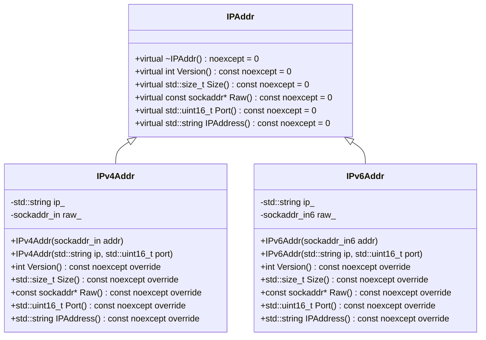
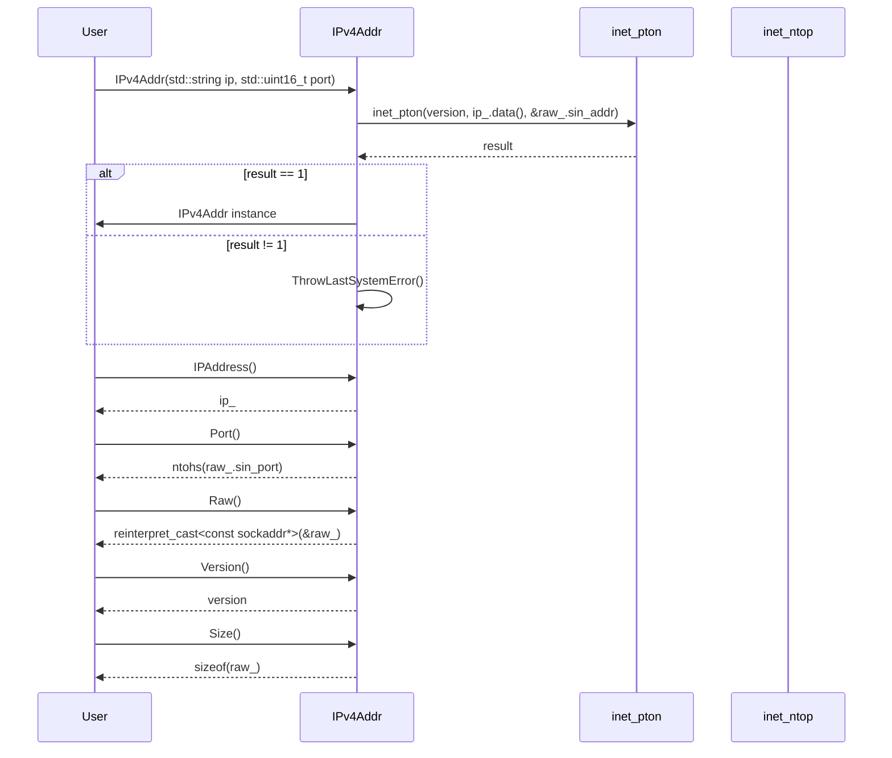

# 設計文書

## ファイル構造と責務

### include/ip.h
- **ファイルの役割**: IPアドレスを扱うためのインターフェースと具体的なIPv4、IPv6アドレスクラスを定義する。
- **公開インターフェース**:
  - `IPAddr` クラス: IPアドレスの抽象基底クラス
  - `IPv4Addr` クラス: IPv4アドレスを扱う具象クラス
  - `IPv6Addr` クラス: IPv6アドレスを扱う具象クラス

### src/ip/ip.cpp
- **ファイルの役割**: `include/ip.h`で定義されたクラスの実装を行う。
- **公開インターフェース**:
  - `IPv4Addr` クラスのコンストラクタとメンバ関数の実装
  - `IPv6Addr` クラスのコンストラクタとメンバ関数の実装

## 基本設計項目

### 責務
- **include/ip.h**:
  - IPアドレスを抽象化したインターフェース (`IPAddr`) を提供する。
  - IPv4アドレスとIPv6アドレスを扱う具象クラス (`IPv4Addr`, `IPv6Addr`) を提供する。

- **src/ip/ip.cpp**:
  - `IPv4Addr` クラスのコンストラクタとメンバ関数の実装を行う。
  - `IPv6Addr` クラスのコンストラクタとメンバ関数の実装を行う。

### 公開インターフェース
- **IPAddr**:
  - `virtual ~IPAddr() noexcept = default;`
  - `virtual int Version() const noexcept = 0;`
  - `virtual std::size_t Size() const noexcept = 0;`
  - `virtual const sockaddr* Raw() const noexcept = 0;`
  - `virtual std::uint16_t Port() const noexcept = 0;`
  - `virtual std::string IPAddress() const noexcept = 0;`

- **IPv4Addr**:
  - `explicit IPv4Addr(sockaddr_in addr);`
  - `explicit IPv4Addr(std::string ip, std::uint16_t port);`
  - `int Version() const noexcept override;`
  - `std::size_t Size() const noexcept override;`
  - `const sockaddr* Raw() const noexcept override;`
  - `std::uint16_t Port() const noexcept override;`
  - `std::string IPAddress() const noexcept override;`

- **IPv6Addr**:
  - `explicit IPv6Addr(sockaddr_in6 addr);`
  - `explicit IPv6Addr(std::string ip, std::uint16_t port);`
  - `int Version() const noexcept override;`
  - `std::size_t Size() const noexcept override;`
  - `const sockaddr* Raw() const noexcept override;`
  - `std::uint16_t Port() const noexcept override;`
  - `std::string IPAddress() const noexcept override;`

### 入力
- **IPv4Addr**:
  - `sockaddr_in addr`: IPv4アドレスを含む構造体。
  - `std::string ip, std::uint16_t port`: IPアドレスとポート番号。

- **IPv6Addr**:
  - `sockaddr_in6 addr`: IPv6アドレスを含む構造体。
  - `std::string ip, std::uint16_t port`: IPアドレスとポート番号。

### 出力
- **Version()**: IPバージョン (AF_INET or AF_INET6) を返す。
- **Size()**: ソケットアドレスのサイズを返す。
- **Raw()**: ソケットアドレスへのポインタを返す。
- **Port()**: ポート番号を返す。
- **IPAddress()**: IPアドレス文字列を返す。

### 状態
- **IPv4Addr**:
  - `std::string ip_`: IPアドレスの文字列表現。
  - `sockaddr_in raw_`: IPv4アドレスを含む構造体。

- **IPv6Addr**:
  - `std::string ip_`: IPアドレスの文字列表現。
  - `sockaddr_in6 raw_`: IPv6アドレスを含む構造体。

### 処理手順
- **IPv4Addr**:
  - コンストラクタ: `sockaddr_in`からIPアドレスとポート番号を抽出し、メンバ変数に格納する。
  - メンバ関数: 各情報を取得して返す。

- **IPv6Addr**:
  - コンストラクタ: `sockaddr_in6`からIPアドレスとポート番号を抽出し、メンバ変数に格納する。
  - メンバ関数: 各情報を取得して返す。

### 例外・失敗条件
- **IPv4Addr**:
  - `inet_ntop()`が失敗した場合: `ThrowLastSystemError()`を呼び出す。
  - `inet_pton()`が1以外の値を返した場合: `ThrowLastSystemError()`を呼び出す。

- **IPv6Addr**:
  - `inet_ntop()`が失敗した場合: `ThrowLastSystemError()`を呼び出す。
  - `inet_pton()`が1以外の値を返した場合: `ThrowLastSystemError()`を呼び出す。

### 依存関係
- **include/ip.h**:
  - `<concepts>`
  - `<cstdint>`
  - `<string>`
  - `<string_view>`
  - `<netinet/in.h>`

- **src/ip/ip.cpp**:
  - `"ip.h"`
  - `"util.h"`
  - `<arpa/inet.h>`
  - `<array>`

### 重要な不変条件
- `IPv4Addr`と`IPv6Addr`のインスタンスは、有効なIPアドレスとポート番号を持つこと。

## 追加詳細設計情報

### クラス図


### クラス・メソッド・インターフェース詳細

| クラス名 | メンバ名 | 型 | 可視性 | const | noexcept | static |
|----------|----------|----|--------|-------|----------|--------|
| IPAddr   | ~IPAddr  | void | public |       | true     | false  |
| IPAddr   | Version  | int  | public | true  | true     | false  |
| IPAddr   | Size     | std::size_t | public | true  | true     | false  |
| IPAddr   | Raw      | const sockaddr* | public | true  | true     | false  |
| IPAddr   | Port     | std::uint16_t | public | true  | true     | false  |
| IPAddr   | IPAddress| std::string | public | true  | true     | false  |

| クラス名 | メンバ名 | 型 | 可視性 | const | noexcept | static |
|----------|----------|----|--------|-------|----------|--------|
| IPv4Addr | IPv4Addr |    | public |       |          | false  |
| IPv4Addr | Version  | int  | public | true  | true     | false  |
| IPv4Addr | Size     | std::size_t | public | true  | true     | false  |
| IPv4Addr | Raw      | const sockaddr* | public | true  | true     | false  |
| IPv4Addr | Port     | std::uint16_t | public | true  | true     | false  |
| IPv4Addr | IPAddress| std::string | public | true  | true     | false  |

| クラス名 | メンバ名 | 型 | 可視性 | const | noexcept | static |
|----------|----------|----|--------|-------|----------|--------|
| IPv6Addr | IPv6Addr |    | public |       |          | false  |
| IPv6Addr | Version  | int  | public | true  | true     | false  |
| IPv6Addr | Size     | std::size_t | public | true  | true     | false  |
| IPv6Addr | Raw      | const sockaddr* | public | true  | true     | false  |
| IPv6Addr | Port     | std::uint16_t | public | true  | true     | false  |
| IPv6Addr | IPAddress| std::string | public | true  | true     | false  |

### シーケンス図


### メソッド仕様書
#### IPv4Addr::IPv4Addr(std::string ip, std::uint16_t port)
- **目的**: IPアドレスとポート番号からIPv4Addrオブジェクトを作成する。
- **引数**:
  - `ip`: IPアドレスの文字列表現 (std::string)
  - `port`: ポート番号 (std::uint16_t)
- **戻り値**: IPv4Addrオブジェクト
- **動作**:
  - `raw_.sin_family`に`version`を設定する。
  - `raw_.sin_port`に`htons(port)`の結果を設定する。
  - `inet_pton()`を使用してIPアドレス文字列からバイナリ形式に変換し、`raw_.sin_addr`に格納する。
- **例外処理**:
  - `inet_pton()`が1以外の値を返した場合: `ThrowLastSystemError()`を呼び出す。

#### IPv4Addr::IPAddress()
- **目的**: IPアドレスの文字列表現を取得する。
- **引数**: 無し
- **戻り値**: IPアドレスの文字列表現 (std::string)
- **動作**:
  - `ip_`を返す。

#### IPv4Addr::Port()
- **目的**: ポート番号を取得する。
- **引数**: 無し
- **戻り値**: ポート番号 (std::uint16_t)
- **動作**:
  - `ntohs(raw_.sin_port)`の結果を返す。

#### IPv4Addr::Raw()
- **目的**: ソケットアドレスへのポインタを取得する。
- **引数**: 無し
- **戻り値**: ソケットアドレスへのポインタ (const sockaddr*)
- **動作**:
  - `reinterpret_cast<const sockaddr*>(&raw_)`の結果を返す。

#### IPv4Addr::Version()
- **目的**: IPバージョンを取得する。
- **引数**: 無し
- **戻り値**: IPバージョン (int)
- **動作**:
  - `version`を返す。

#### IPv4Addr::Size()
- **目的**: ソケットアドレスのサイズを取得する。
- **引数**: 無し
- **戻り値**: ソケットアドレスのサイズ (std::size_t)
- **動作**:
  - `sizeof(raw_)`の結果を返す。

### 処理フロー図
```mermaid
graph TD
    A[IPv4Addr(std::string ip, std::uint16_t port)] --> B{inet_pton()}
    B -- result == 1 --> C[Return IPv4Addr instance]
    B -- result != 1 --> D[ThrowLastSystemError()]
    E[IPAddress()] --> F[Return ip_]
    G[Port()] --> H[Return ntohs(raw_.sin_port)]
    I[Raw()] --> J[Return reinterpret_cast<const sockaddr*>(&raw_)]
    K[Version()] --> L[Return version]
    M[Size()] --> N[Return sizeof(raw_)]
```

### 状態遷移・副作用
| 更新前状態 | 遷移条件 | 変更対象 | 更新後状態 | 更新順序 | 副作用 |
|------------|----------|----------|------------|----------|--------|
| 未初期化   | コンストラクタ呼び出し | `raw_`, `ip_` | 初期化済み | 1. `raw_.sin_family`に`version`設定, 2. `raw_.sin_port`に`htons(port)`設定, 3. `inet_pton()`で変換 | エラー発生時: `ThrowLastSystemError()` |
| 初期化済み | IPAddress()呼び出し | 無し         | 無し       | 無し     | 無し   |
| 初期化済み | Port()呼び出し      | 無し         | 無し       | 無し     | 無し   |
| 初期化済み | Raw()呼び出し       | 無し         | 無し       | 無し     | 無し   |
| 初期化済み | Version()呼び出し   | 無し         | 無し       | 無し     | 無し   |
| 初期化済み | Size()呼び出し      | 無し         | 無し       | 無し     | 無し   |

### データ変換・制約
| 入力データ | 変換規則 | 出力データ |
|------------|----------|------------|
| IPアドレス文字列 | `inet_pton()`を使用してバイナリ形式に変換 | `sockaddr_in.sin_addr` |
| ポート番号   | `htons(port)`でネットワークバイトオーダーに変換 | `sockaddr_in.sin_port` |

| 値域          | 境界値       | 単位  | 精度 | encoding | 検証条件 |
|---------------|--------------|-------|------|----------|----------|
| IPアドレス文字列 | IPv4形式の有効な文字列 | 文字列 | -    | ASCII    | `inet_pton()`が1を返す |
| ポート番号     | 0から65535までの整数 | 整数  | -    | -        | 無し       |

## まとめ
この設計文書は、`include/ip.h`と`src/ip/ip.cpp`の内容を基に再実装に必要な情報を詳細に記述しています。各クラスの役割、公開インターフェース、処理フロー、例外処理などを明確に示し、再実装時の誤りを防ぎます。

# Machine-extracted Source-local Implementation Contract

This appendix is deterministic evidence extracted from the target source.
It is not an LLM summary and it does not contain complete function bodies.

During regeneration:
- preserve the exact local declaration types, containers, initializers, and literals listed below;
- preserve the exact call targets and argument expressions listed below;
- do not substitute a different representation or accessor merely because it looks similar;
- treat these items as exact constraints, not as pseudocode suggestions.

## Exact local declarations

- `std::array<char, max_length + 1> ip;`

## Exact top-level call expressions

- `std::move(addr)`
- `inet_ntop(version, &raw_.sin_addr, ip.data(), ip.size())`
- `ThrowLastSystemError()`
- `std::move(ip)`
- `htons(port)`
- `inet_pton(version, ip_.data(), &raw_.sin_addr)`
- `ntohs(raw_.sin_port)`
- `reinterpret_cast<const sockaddr*>(&raw_)`
- `inet_ntop(version, &raw_.sin6_addr, ip.data(), ip.size())`
- `inet_pton(version, ip_.data(), &raw_.sin6_addr)`
- `ntohs(raw_.sin6_port)`

# Machine-extracted Dependency API Contract

This appendix is deterministic evidence derived from the selected repository context and target-source usages.
It is not an LLM summary.

During regeneration:
- preserve the exact dependency declarations and call patterns listed below;
- do not invent replacement APIs, member functions, overloads, or adapters;
- preserve return types, parameter types, defaults, qualifiers, and argument expressions as written;
- do not consume a void return value as a value.

## `ThrowLastSystemError`

### Exact declarations

- `[[noreturn]] void ThrowLastSystemError();`

### Exact target-source usages

- `ThrowLastSystemError()`
