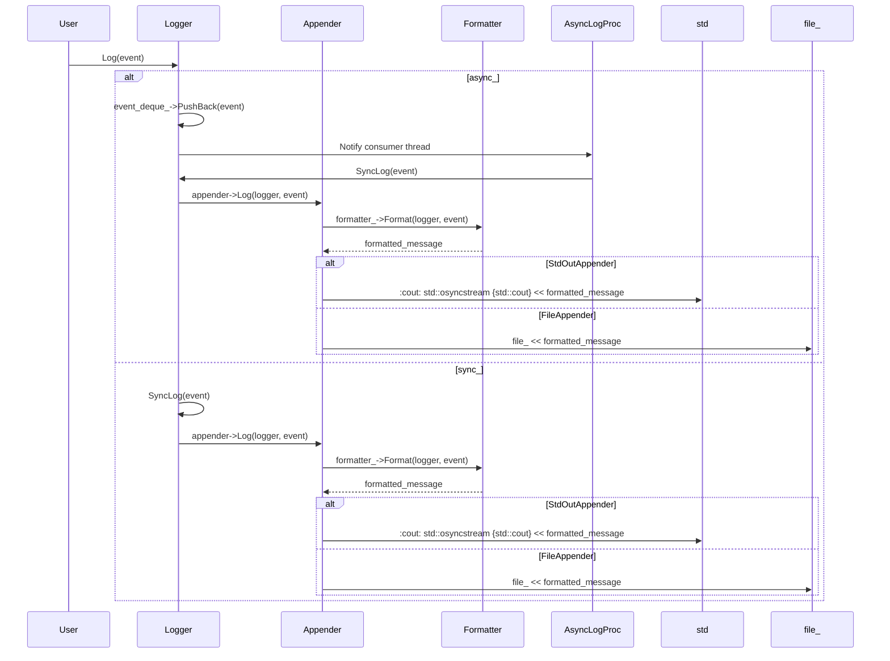

# デザイン文書

## 責務
ログイベントの生成、フォーマット、および出力（標準出力やファイル）を管理する。また、複数のロガーとアペンダーを管理し、設定に基づいて初期化を行う。

## 公開インターフェース
- `Logger::Ptr RootLogger() noexcept`
- `Logger::Ptr FindLogger(std::string_view name) noexcept`
- `void Log(Logger::Ptr logger, Event::Ptr event) noexcept`
- `Logger::Ptr operator<<(Logger::Ptr logger, Event::Ptr event) noexcept`
- `Event::Ptr Event::Create(log::Level level, std::experimental::source_location location = std::experimental::source_location::current(), std::uint32_t thread_id = CurrentThreadId(), Clock::time_point time = Clock::now()) noexcept`
- `std::string_view LevelToString(Level level) noexcept`
- `Level StringToLevel(std::string str)`
- `std::string_view AppenderTypeToString(AppenderType type) noexcept`
- `AppenderType StringToAppenderType(std::string str)`

## 入力
- ログレベル（`log::Level`）
- イベント情報（`Event`）
- フォーマットパターン（`std::string_view`）
- アペンダー設定（`AppenderConfig`）
- ロガー設定（`LoggerConfig`）

## 出力
- フォーマットされたログメッセージ（`std::string`）
- YAML形式のロガー設定文字列（`std::string`）

## 状態
- ログレベル
- イベントキューの容量と状態
- アペンダーの一覧
- フォーマッタ

## 処理手順
1. `Logger`インスタンスを作成し、必要な設定（ログレベル、イベントキューの容量）を初期化する。
2. イベントが生成されると、そのイベントは適切なフォーマットに変換される。
3. フォーマットされたメッセージは指定されたアペンダーによって出力される。
4. 設定ファイルからロガーとアペンダーの設定を読み込み、初期化を行う。

## 例外・失敗条件
- 不正なログレベルやアペンダータイプが指定された場合、`std::invalid_argument`がスローされる。
- ファイルへの書き込みに失敗した場合、`std::system_error`がスローされる。
- YAMLのパースに失敗した場合、`std::invalid_argument`がスローされる。

## 依存関係
- `config.h`: 設定管理用クラスとユーティリティ関数
- `containers/block_deque.h`: イベントキューとして使用するブロッキングデック
- `util.h`: 文字列操作やユーティリティ関数

## 重要な不変条件
- ロガーのログレベルは設定された値を保持し、イベントのフィルタリングに使用される。
- イベントキューが非同期モードの場合、容量を超えるとイベントの追加はブロックされる。
- アペンダーは設定されたフォーマッタを使用してメッセージを出力する。

## 追加詳細設計情報

### クラス図
```mermaid
classDiagram
    class Logger {
        +std::string_view Name() const noexcept
        +void Log(Event::Ptr event) noexcept
        +void AddAppender(Appender::Ptr appender) noexcept
        +void RemoveAppender(Appender::Ptr appender) noexcept
        +void ClearAppenders() noexcept
        +log::Level GetLevel() const noexcept
        +void SetLevel(log::Level level) noexcept
        +Formatter::Ptr GetDefaultFormatter() const noexcept
        +void SetDefaultFormatter(Formatter::Ptr formatter) noexcept
        +std::string ToYamlString() const noexcept
    }
    
    class Event {
        +log::Level Level() const noexcept
        +std::string_view FileName() const noexcept
        +std::size_t LineNum() const noexcept
        +std::uint32_t ThreadId() const noexcept
        +Event::Clock::time_point Time() const noexcept
        +std::string Message() const noexcept
        +std::ostringstream& MessageStream() noexcept
    }
    
    class Formatter {
        +std::string Format(const Logger& logger, const Event& event) const noexcept
        +std::string_view Pattern() const noexcept
    }
    
    class Appender {
        +void Log(const Logger& logger, const Event& event) noexcept
        +std::string ToYamlString() const noexcept
    }
    
    class StdOutAppender~: Appender~
        +void Log(const Logger& logger, const Event& event) noexcept override
        +std::string ToYamlString() const noexcept override
    
    class FileAppender~: Appender~
        +FileAppender(std::string_view file_name, Formatter::Ptr formatter = Formatter::Default())
        +void Log(const Logger& logger, const Event& event) noexcept override
        +std::string ToYamlString() const noexcept override
    
    class Manager {
        +Logger::Ptr FindLogger(std::string_view name, log::Level level = Level::Info, std::optional<std::size_t> capacity = std::nullopt) noexcept
        +void RemoveLogger(std::string_view name) noexcept
        +std::string ToYamlString() const noexcept
    }
    
    Logger "1" -- "0..*" Appender : contains
    Logger "1" -- "1" Formatter : uses
    Manager "1" -- "0..*" Logger : manages
```

### クラス・メソッド・インターフェース詳細

| クラス名 | メソッド名 | 完全な名前 | 引数名と型 | 戻り値型 | 可視性 | const | noexcept |
|----------|------------|--------------|-------------|-----------|--------|-------|----------|
| Logger   | Log        | ws::log::Logger::Log | Event::Ptr event | void    | public | false | true     |
| Logger   | AddAppender| ws::log::Logger::AddAppender | Appender::Ptr appender | void    | public | false | true     |
| Logger   | RemoveAppender | ws::log::Logger::RemoveAppender | Appender::Ptr appender | void    | public | false | true     |
| Logger   | ClearAppenders | ws::log::Logger::ClearAppenders |  | void    | public | false | true     |
| Logger   | GetLevel     | ws::log::Logger::GetLevel |  | log::Level | public | true  | true     |
| Logger   | SetLevel     | ws::log::Logger::SetLevel | log::Level level | void    | public | false | true     |
| Logger   | GetDefaultFormatter | ws::log::Logger::GetDefaultFormatter |  | Formatter::Ptr | public | true  | true     |
| Logger   | SetDefaultFormatter | ws::log::Logger::SetDefaultFormatter | Formatter::Ptr formatter | void    | public | false | true     |
| Event    | Create     | ws::log::Event::Create | log::Level level, std::experimental::source_location location, std::uint32_t thread_id, Clock::time_point time | Event::Ptr | static | false | true     |
| Formatter| Format     | ws::log::Formatter::Format | const Logger& logger, const Event& event | std::string | public | true  | true     |
| Appender | Log        | ws::log::Appender::Log | const Logger& logger, const Event& event | void    | virtual | false | true     |
| StdOutAppender | Log | ws::log::StdOutAppender::Log | const Logger& logger, const Event& event | void    | override | false | true     |
| FileAppender   | Log        | ws::log::FileAppender::Log | const Logger& logger, const Event& event | void    | override | false | true     |

### シーケンス図


### メソッド仕様書

#### `Logger::Log`
- **目的**: イベントをログに記録する。
- **引数**:
  - `event`: ログイベント（`Event::Ptr`）
- **戻り値**: 無し
- **動作**: イベントのレベルがロガーの設定レベル以上であれば、イベントを適切なフォーマットに変換してアペンダーに出力する。
- **副作用**: イベントキューへの追加や同期ログ処理による出力。
- **エラー処理**: なし

#### `Event::Create`
- **目的**: 新しいイベントを作成する。
- **引数**:
  - `level`: ログレベル（`log::Level`）
  - `location`: イベントのソースロケーション（`std::experimental::source_location`）
  - `thread_id`: スレッドID（`std::uint32_t`）
  - `time`: イベント発生日時（`Event::Clock::time_point`）
- **戻り値**: 新しいイベントオブジェクトへのスマートポインタ（`Event::Ptr`）
- **動作**: 引数から新しいイベントを作成し、そのスマートポインタを返す。
- **副作用**: なし
- **エラー処理**: なし

### 処理フロー図
```mermaid
graph TD
    A[Logger::Log] --> B{async_?}
    B -- true --> C[event_deque_->PushBack(event)]
    B -- false --> D[SyncLog(event)]
    C --> E[Notify consumer thread]
    E --> F[AsyncLogProc]
    F --> G[SyncLog(event)]
    G --> H[appender->Log(logger, event)]
    H --> I[formatter_->Format(logger, event)]
    I --> J[formatted_message]
    J --> K{StdOutAppender?}
    K -- true --> L[std::osyncstream {std::cout} << formatted_message]
    K -- false --> M[file_ << formatted_message]
    D --> H
```

### 状態遷移・副作用

| 状態 | 遷移条件 | 変更対象 | 更新後状態 | 更新順序 | 副作用 |
|------|----------|-----------|------------|----------|--------|
| 同期モード | イベント追加 | appenders_ | フォーマットされたメッセージが出力される | 1. SyncLog呼び出し<br>2. appender->Log呼び出し | メッセージ出力 |
| 非同期モード | イベント追加 | event_deque_ | イベントキューにイベントが追加され、消費者スレッドに通知される | 1. PushBack呼び出し<br>2. Notify呼び出し | イベントキューへの追加と消費者スレッドの通知 |
| 消費者スレッド | イベントポップ | event_deque_ | フォーマットされたメッセージが出力される | 1. Pop呼び出し<br>2. SyncLog呼び出し | メッセージ出力 |

### データ変換・制約

| 入力データ | 変換規則 | 出力データ |
|------------|----------|------------|
| log::Level | LevelToString | std::string_view |
| AppenderType | AppenderTypeToString | std::string_view |
| YAML文字列 | LoadYamlString | YAML::Node |
| LoggerConfig | VarConverter<std::string, LoggerConfig> | LoggerConfig |
| AppenderConfig | VarConverter<std::string, AppenderConfig> | AppenderConfig |

これらの設計情報は、再実装に必要な詳細な情報を提供します。各クラスの役割と相互作用を理解し、適切な処理フローとエラーハンドリングを実装することが可能です。

# Machine-extracted Source-local Implementation Contract

This appendix is deterministic evidence extracted from the target source.
It is not an LLM summary and it does not contain complete function bodies.

During regeneration:
- preserve the exact local declaration types, containers, initializers, and literals listed below;
- preserve the exact call targets and argument expressions listed below;
- do not substitute a different representation or accessor merely because it looks similar;
- treat these items as exact constraints, not as pseudocode suggestions.

## Exact local declarations

- `static const std::unordered_map<Level, std::string_view> levels { {Level::Debug, "Debug"}, {Level::Info, "Info"}, {Level::Warn, "Warn"}, {Level::Error, "Error"}, {Level::Fatal, "Fatal"}};`
- `static const std::unordered_map<std::string_view, Level> levels { {"DEBUG", Level::Debug}, {"INFO", Level::Info}, {"WARN", Level::Warn}, {"ERROR", Level::Error}, {"FATAL", Level::Fatal}};`
- `const auto level {levels.find(str)};`
- `static constexpr std::string_view pattern { "%d{%Y-%m-%d %H:%M:%S}%T%t%T[%p]%T[%c]%T<%f:%l>%T%m%n"};`
- `static const auto ins {std::make_shared<Formatter>(pattern)};`
- `std::ostringstream str;`
- `const auto event {event_deque_->Pop()};`
- `const std::lock_guard locker {mtx_};`
- `YAML::Node node;`
- `std::ostringstream ss;`
- `const auto logger {loggers_.find(name.data())};`
- `const auto new_logger {std::make_shared<Logger>(name, level, capacity)};`
- `static std::once_flag init_flag;`
- `static const auto ins {std::make_shared<Manager>("root")};`
- `static const std::unordered_map<AppenderType, std::string_view> types { {AppenderType::StdOut, "StdOut"}, {AppenderType::File, "File"}};`
- `static const std::unordered_map<std::string_view, AppenderType> types { {"STDOUT", AppenderType::StdOut}, {"FILE", AppenderType::File}};`
- `const auto type {types.find(str)};`
- `const auto time {Event::Clock::to_time_t(event.Time())};`
- `char time_str[0x60] {0};`
- `std::string raw_str;`
- `std::list<RawField> raw_fields;`
- `auto i {0};`
- `auto j {i + 1}, fmt_begin {0};`
- `std::string type, fmt;`
- `auto processing {false};`
- `static const std::unordered_map<std::string_view, Creator> supported_fields { {Message::tag, [](const std::string_view format) noexcept { return std::make_shared<Message>(format); }}, {Level::tag, [](const std::string_view format) noexcept { return std::make_shared<Level>(format); }}, {ThreadId::tag, [](const std::string_view format) noexcept { return std::make_shared<ThreadId>(format); }}, {NewLine::tag, [](const std::string_view format) noexcept { return std::make_shared<NewLine>(format); }}, {LoggerName::tag, [](const std::string_view format) noexcept { return std::make_shared<LoggerName>(format); }}, {DateTime::tag, [](const std::string_view format) noexcept { return std::make_shared<DateTime>(format); }}, {FileName::tag, [](const std::string_view format) noexcept { return std::make_shared<FileName>(format); }}, {LineNum::tag, [](const std::string_view format) noexcept { return std::make_shared<LineNum>(format); }}, {Tab::tag, [](const std::string_view format) noexcept { return std::make_shared<Tab>(format); }}};`
- `std::list<Formatter::Field::Ptr> fields;`
- `const auto field {supported_fields.find(raw_field.content)};`
- `const YAML::Node node {LoadYamlString(str, {"type"})};`
- `log::AppenderConfig appender {};`
- `const YAML::Node node { LoadYamlString(str, {"name", "level", "appenders"})};`
- `log::LoggerConfig logger {};`
- `const auto cfg {old_cfgs.find(logger_cfg)};`
- `const auto logger {manager->FindLogger( logger_cfg.name, logger_cfg.level, logger_cfg.capacity)};`
- `Appender::Ptr appender;`

## Exact top-level call expressions

- `std::experimental::source_location::current()`
- `CurrentThreadId()`
- `Clock::now()`
- `Formatter::Default()`
- `levels.at(level)`
- `LevelToString(level).data()`
- `StringToUpper(str)`
- `levels.find(str)`
- `levels.cend()`
- `fmt::format("Invalid log level: '{}'", str)`
- `std::move(location)`
- `std::move(time)`
- `std::make_shared<MakeSharedEvent>(level, std::move(location), thread_id, std::move(time))`
- `location.file_name()`
- `location.line()`
- `msg_.str()`
- `event->MessageStream()`
- `logger_.Log(event_)`
- `event_->MessageStream()`
- `std::make_shared<Formatter>(pattern)`
- `field::RawFieldsToFormatFields(field::ParsePattern(pattern))`
- `std::ranges::for_each(fields_, [&str, &logger, &event](auto& it) noexcept { it->Format(str, logger, event); })`
- `str.str()`
- `capacity.value_or(0)`
- `std::make_unique<BlockDeque<Event::Ptr>>(capacity_)`
- `std::make_unique<std::thread>(&Logger::AsyncLogProc, this)`
- `assert(event_deque_)`
- `event_deque_->Close()`
- `assert(writer_thread_ && writer_thread_->joinable())`
- `writer_thread_->join()`
- `event_deque_->Pop()`
- `SyncLog(**event)`
- `std::ranges::for_each(appenders_, [&event, this](auto& it) noexcept { it->Log(*this, event); })`
- `event->Level()`
- `event_deque_->PushBack(std::move(event))`
- `SyncLog(*event)`
- `appender->GetFormatter()`
- `appender->SetFormatter(formatter_)`
- `appenders_.push_back(appender)`
- `std::remove_if( appenders_.begin(), appenders_.end(), [&appender](const auto& it) noexcept { return it == appender; })`
- `appenders_.clear()`
- `std::ranges::for_each(appenders_, [&formatter](const auto& it) noexcept { it->SetFormatter(formatter); })`
- `SetDefaultFormatter(std::make_shared<Formatter>(pattern))`
- `LevelToString(level_).data()`
- `formatter_->Pattern().data()`
- `node["appenders"].push_back(YAML::Load(appender->ToYamlString()))`
- `ss.str()`
- `logger->Log(std::move(event))`
- `Log(logger, std::move(event))`
- `loggers_.find(name.data())`
- `loggers_.cend()`
- `std::make_shared<Logger>(name, level, capacity)`
- `loggers_.emplace(name, new_logger)`
- `loggers_.erase(name.data())`
- `node.push_back(YAML::Load(logger.second->ToYamlString()))`
- `std::call_once(init_flag, []() noexcept { SetListener( cfg::RootConfig()->Lookup( "loggers", std::unordered_set<LoggerConfig> {}, "Loggers"), RootManager()); })`
- `std::make_shared<Manager>("root")`
- `std::call_once(init_flag, []() noexcept { ins->FindLogger(root_logger_name) ->AddAppender(std::make_shared<StdOutAppender>()); })`
- `RootManager()->FindLogger(root_logger_name)`
- `RootManager()->FindLogger(name)`
- `AppenderTypeToString(type)`
- `types.at(type)`
- `AppenderTypeToString(type).data()`
- `types.find(str)`
- `types.cend()`
- `fmt::format("Invalid log appender type: '{}'", str)`
- `SetFormatter(pattern)`
- `SetFormatter(std::make_shared<log::Formatter>(pattern))`
- `formatter_->Format(logger, event)`
- `AppenderTypeToString(AppenderType::StdOut).data()`
- `file_.open(file_name_, std::ofstream::app)`
- `file_.good()`
- `ThrowLastSystemError()`
- `event.Message()`
- `LevelToString(event.Level())`
- `event.ThreadId()`
- `format_.empty()`
- `Event::Clock::to_time_t(event.Time())`
- `std::strftime(time_str, sizeof(time_str), format_.c_str(), std::localtime(&time))`
- `event.FileName()`
- `event.LineNum()`
- `logger.Name()`
- `pattern.size()`
- `raw_str.append(1, pattern[i])`
- `raw_str.empty()`
- `raw_fields.push_back({true, raw_str, ""})`
- `raw_str.clear()`
- `std::isalpha(pattern[j])`
- `pattern.substr(i + 1, j - i - 1)`
- `pattern.substr(fmt_begin + 1, j - fmt_begin - 1)`
- `type.empty()`
- `pattern.substr(i + 1)`
- `raw_fields.push_back({false, type, fmt})`
- `fmt::format( "Invalid log format pattern: '{}'", pattern.substr(i))`
- `std::make_shared<Message>(format)`
- `std::make_shared<Level>(format)`
- `std::make_shared<ThreadId>(format)`
- `std::make_shared<NewLine>(format)`
- `std::make_shared<LoggerName>(format)`
- `std::make_shared<DateTime>(format)`
- `std::make_shared<FileName>(format)`
- `std::make_shared<LineNum>(format)`
- `std::make_shared<Tab>(format)`
- `fields.push_back( std::make_shared<field::RawString>(raw_field.content))`
- `supported_fields.find(raw_field.content)`
- `supported_fields.cend()`
- `fields.push_back(field->second(raw_field.format))`
- `fmt::format( "Invalid log format field: '{}'", raw_field.content)`
- `std::hash<std::string> {}(logger.name)`
- `LoadYamlString(str, {"type"})`
- `ThrowIfYamlFieldIsNotScalar(node, "type")`
- `log::StringToAppenderType(node["type"].as<std::string>())`
- `ThrowIfYamlFieldIsNotScalar(node, "file")`
- `node["file"].as<std::string>()`
- `ThrowIfYamlFieldIsNotScalar(node, "formatters")`
- `node["formatters"].as<std::string>()`
- `log::AppenderTypeToString(appender.type).data()`
- `appender.file.empty()`
- `appender.formatter.empty()`
- `LoadYamlString(str, {"name", "level", "appenders"})`
- `ThrowIfYamlFieldIsNotScalar(node, "name")`
- `node["name"].as<std::string>()`
- `ThrowIfYamlFieldIsNotScalar(node, "level")`
- `log::StringToLevel(node["level"].as<std::string>())`
- `ThrowIfYamlFieldIsNotScalar(node, "capacity")`
- `node["capacity"].as<std::size_t>()`
- `ThrowIfYamlFieldIsNotScalar(node, "formatter")`
- `node["formatter"].as<std::string>()`
- `VarConverter<std::string, std::list<log::AppenderConfig>> {}( ss.str())`
- `log::LevelToString(logger.level).data()`
- `VarConverter<std::list<log::AppenderConfig>, std::string> {}( logger.appenders)`
- `loggers->AddListener( [manager](const std::unordered_set<LoggerConfig>& old_cfgs, const std::unordered_set<LoggerConfig>& new_cfgs) noexcept { for (const auto& logger_cfg : new_cfgs) { if (const auto cfg {old_cfgs.find(logger_cfg)}; cfg != old_cfgs.cend() && *cfg == logger_cfg) { continue; } // Remove the old logger. manager->RemoveLogger(logger_cfg.name); // Create a new logger. const auto logger {manager->FindLogger( logger_cfg.name, logger_cfg.level, logger_cfg.capacity)}; if (!logger_cfg.formatter.empty()) { logger->SetDefaultFormatter(logger_cfg.formatter); } // Add appenders. logger->ClearAppenders(); for (const auto& appender_cfg : logger_cfg.appenders) { Appender::Ptr appender; switch (appender_cfg.type) { case AppenderType::StdOut: { appender = std::make_shared<StdOutAppender>( logger->GetDefaultFormatter()); break; } case AppenderType::File: { appender = std::make_shared<FileAppender>( appender_cfg.file, logger->GetDefaultFormatter()); break; } default: { assert(false); } } logger->AddAppender(appender); } } })`

# Machine-extracted Dependency API Contract

This appendix is deterministic evidence derived from the selected repository context and target-source usages.
It is not an LLM summary.

During regeneration:
- preserve the exact dependency declarations and call patterns listed below;
- do not invent replacement APIs, member functions, overloads, or adapters;
- preserve return types, parameter types, defaults, qualifiers, and argument expressions as written;
- do not consume a void return value as a value.

## `AddListener`

### Exact declarations

- `std::uint64_t AddListener(OnChange listener) noexcept;`

### Exact target-source usages

- `loggers->AddListener( [manager](const std::unordered_set<LoggerConfig>& old_cfgs, const std::unordered_set<LoggerConfig>& new_cfgs) noexcept { for (const auto& logger_cfg : new_cfgs) { if (const auto cfg {old_cfgs.find(logger_cfg)}; cfg != old_cfgs.cend() && *cfg == logger_cfg) { continue; } // Remove the old logger. manager->RemoveLogger(logger_cfg.name); // Create a new logger. const auto logger {manager->FindLogger( logger_cfg.name, logger_cfg.level, logger_cfg.capacity)}; if (!logger_cfg.formatter.empty()) { logger->SetDefaultFormatter(logger_cfg.formatter); } // Add appenders. logger->ClearAppenders(); for (const auto& appender_cfg : logger_cfg.appenders) { Appender::Ptr appender; switch (appender_cfg.type) { case AppenderType::StdOut: { appender = std::make_shared<StdOutAppender>( logger->GetDefaultFormatter()); break; } case AppenderType::File: { appender = std::make_shared<FileAppender>( appender_cfg.file, logger->GetDefaultFormatter()); break; } default: { assert(false); } } logger->AddAppender(appender); } } })`

## `Close`

### Exact declarations

- `void Close() noexcept;`
- `template <typename T> void BlockDeque<T>::Close() noexcept { const std::lock_guard locker {mtx_}; ClearNoLock(); closed_ = true; producer_cond_.notify_all(); consumer_cond_.notify_all(); }`
- `void BlockDeque<T>::Close() noexcept;`

### Exact target-source usages

- `event_deque_->Close()`

## `CurrentThreadId`

### Exact declarations

- `std::uint32_t CurrentThreadId() noexcept;`

### Exact target-source usages

- `CurrentThreadId()`

## `LoadYamlString`

### Exact declarations

- `YAML::Node LoadYamlString( std::string_view str, std::initializer_list<std::string_view> required_fields = {});`

### Exact target-source usages

- `LoadYamlString(str, {"type"})`
- `LoadYamlString(str, {"name", "level", "appenders"})`

## `Lookup`

### Exact declarations

- `template <typename T> typename Var<T>::Ptr Lookup(const std::string_view name, const T& default_val, const std::string_view description = "") { if (const auto var {Lookup<T>(name)}; !var) { const auto new_var { std::make_shared<Var<T>>(name, default_val, description)}; const std::unique_lock locker {mtx_}; vars_.emplace(name, new_var); return new_var; } else { return var; } }`
- `typename Var<T>::Ptr Lookup(const std::string_view name, const T& default_val, const std::string_view description = "");`

### Exact target-source usages

- `cfg::RootConfig()->Lookup( "loggers", std::unordered_set<LoggerConfig> {}, "Loggers")`

## `Name`

### Exact declarations

- `std::string_view Name() const noexcept;`

### Exact target-source usages

- `logger.Name()`

## `Pop`

### Exact declarations

- `std::optional<T> Pop( std::optional<Clock::duration> time_out = std::nullopt) noexcept;`

### Exact target-source usages

- `event_deque_->Pop()`

## `PushBack`

### Exact declarations

- `void PushBack(T item) noexcept;`
- `template <typename T> void BlockDeque<T>::PushBack(T item) noexcept { std::unique_lock locker {mtx_}; WaitForSpace(locker); deq_.push_back(std::move(item)); Flush(); }`
- `void BlockDeque<T>::PushBack(T item) noexcept;`

### Exact target-source usages

- `event_deque_->PushBack(std::move(event))`

## `RootConfig`

### Exact declarations

- `Config::Ptr RootConfig() noexcept;`

### Exact target-source usages

- `cfg::RootConfig()`

## `StringToUpper`

### Exact declarations

- `std::string StringToUpper(std::string str) noexcept;`

### Exact target-source usages

- `StringToUpper(str)`

## `ThrowIfYamlFieldIsNotScalar`

### Exact declarations

- `void ThrowIfYamlFieldIsNotScalar(const YAML::Node& node, std::string_view field);`

### Exact target-source usages

- `ThrowIfYamlFieldIsNotScalar(node, "type")`
- `ThrowIfYamlFieldIsNotScalar(node, "file")`
- `ThrowIfYamlFieldIsNotScalar(node, "formatters")`
- `ThrowIfYamlFieldIsNotScalar(node, "name")`
- `ThrowIfYamlFieldIsNotScalar(node, "level")`
- `ThrowIfYamlFieldIsNotScalar(node, "capacity")`
- `ThrowIfYamlFieldIsNotScalar(node, "formatter")`

## `ThrowLastSystemError`

### Exact declarations

- `[[noreturn]] void ThrowLastSystemError();`

### Exact target-source usages

- `ThrowLastSystemError()`
