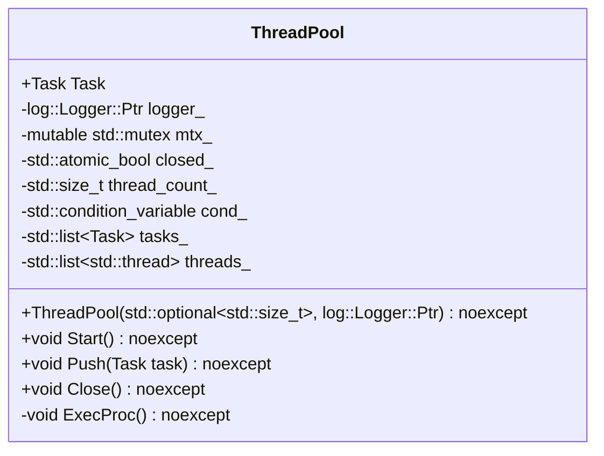
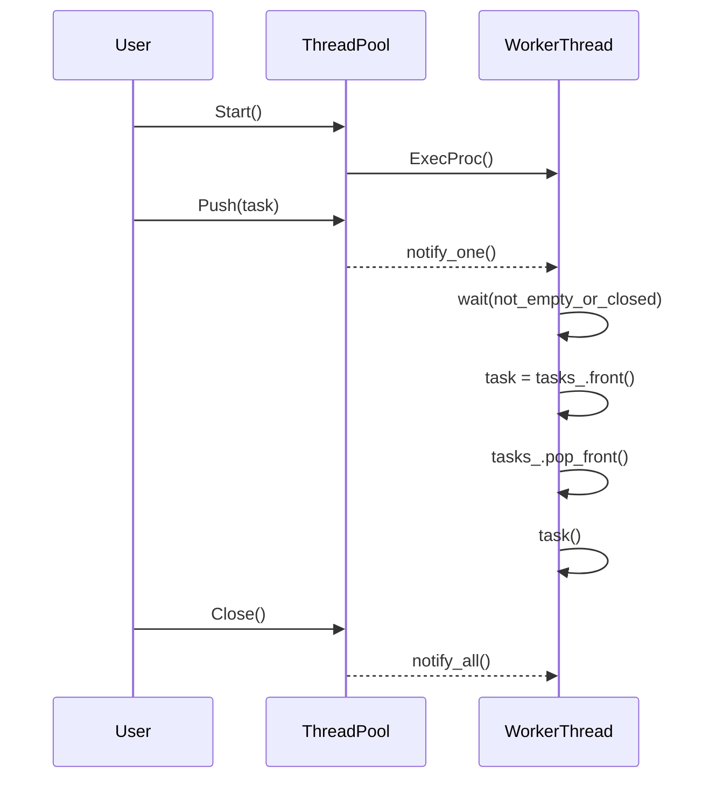

# スレッドプールの設計文書

## 責務
スレッドプールは、与えられたタスクを並列に実行するためのリソース管理を行います。タスクのキューイング、スレッドの生成と管理、タスクの分配、例外処理などを担当します。

## 公開インターフェース
- `ThreadPool(std::optional<std::size_t> thread_count = std::nullopt, log::Logger::Ptr logger = log::RootLogger()) noexcept`
- `void Start() noexcept`
- `void Push(Task task) noexcept`
- `void Close() noexcept`

## 入力
- スレッド数 (`std::optional<std::size_t>`)
- ロガー (`log::Logger::Ptr`)

## 出力
- なし

## 状態
- `logger_`: タスク実行時のログを記録するロガー。
- `mtx_`: スレッドセーフなタスクキューへのアクセスと状態変数の更新に使用されるミューテックス。
- `closed_`: スレッドプールが閉じているかどうかを示すフラグ。
- `thread_count_`: スレッドプール内のスレッド数。
- `cond_`: タスクキューへの新しいタスクの追加やスレッドプールのクローズ通知に使用される条件変数。
- `tasks_`: 実行待ちのタスクを保持するリスト。
- `threads_`: スレッドプール内のワーカースレッドを保持するリスト。

## 処理手順
1. **コンストラクタ**: 
   - ロガーが指定されていない場合は、グローバルルートロガーを使用します。
   - スレッド数が指定されていないかゼロの場合は、ハードウェアがサポートする並列スレッド数を使用します。

2. **デストラクタ**:
   - スレッドプールを閉じます。
   - すべてのワーカースレッドが終了するまで待ちます。

3. **Start()**:
   - スレッドプールが既に開始されていることを確認します。
   - 指定された数のワーカースレッドを作成し、それぞれを `ExecProc` メソッドで実行させます。

4. **Push(Task task)**:
   - スレッドプールが閉じていないことを確認します。
   - タスクキューにタスクを追加し、条件変数を使用して待機中のワーカースレッドを通知します。

5. **ExecProc()**:
   - タスクキューが空でないか、スレッドプールが閉じているかをチェックするラムダ関数 `not_empty_or_closed` を定義します。
   - 無限ループ内でタスクキューからタスクを取り出し、実行します。タスクの実行中に例外が発生した場合はロガーに記録します。

6. **Close()**:
   - スレッドプールを閉じるフラグ `closed_` を設定し、すべてのワーカースレッドに通知します。

## 例外・失敗条件
- タスク実行中に例外が発生した場合、そのメッセージはロガーに記録されます。
- スレッドプールが既に開始されている状態で `Start()` を呼び出した場合、アサートが発生します。
- スレッドプールが閉じている状態で `Push(Task task)` を呼び出した場合、アサートが発生します。

## 依存関係
- `log::Logger`: タスク実行時のログを記録するために使用されます。
- `std::condition_variable`, `std::mutex`, `std::thread`: スレッドセーフなタスクキューへのアクセスとスレッドの管理に使用されます。

## 重要な不変条件
- `closed_` が `true` の場合、新しいタスクは追加されず、ワーカースレッドは終了します。
- タスクキューへのアクセスは常にミューテックスで保護されています。
- スレッドプールの開始と終了は適切な状態遷移を経て行われます。

## 追加詳細設計情報

### クラス図


### クラス・メソッド・インターフェース詳細
| 名前 | 完全な名前 | 属性 | 引数名と型 | 戻り値型 | 可視性 | const | リファレンス/ポインタ | static | virtual | noexcept | 型別名 | 列挙型 | 定数 | 直接依存 |
|------|------------|------|------------|-----------|--------|-------|---------------------|--------|---------|----------|--------|--------|------|----------|
| コンストラクタ | ThreadPool::ThreadPool | - | thread_count: std::optional~std::size_t~, logger: log::Logger::Ptr | - | public | - | - | - | - | noexcept | Task / typedef / std::function<void()> | - | - | log::Logger, std::condition_variable, std::mutex, std::thread |
| デストラクタ | ThreadPool::~ThreadPool | - | - | - | public | - | - | - | - | noexcept | - | - | - | - |
| Start | ThreadPool::Start | - | - | void | public | - | - | - | - | noexcept | - | - | - | - |
| Push | ThreadPool::Push | - | task: Task | void | public | - | - | - | - | noexcept | Task / typedef / std::function<void()> | - | - | - |
| Close | ThreadPool::Close | - | - | void | public | - | - | - | - | noexcept | - | - | - | - |
| ExecProc | ThreadPool::ExecProc | - | - | void | private | - | - | - | - | noexcept | Task / typedef / std::function<void()> | - | - | log::Logger, std::condition_variable, std::mutex |

### シーケンス図


### メソッド仕様書
#### Start()
- **目的**: スレッドプールを開始し、ワーカースレッドを作成します。
- **引数**: なし
- **戻り値**: void
- **動作**: 指定された数のワーカースレッドを作成し、それぞれを `ExecProc` メソッドで実行させます。
- **副作用**: スレッドプールが開始され、ワーカースレッドが生成されます。
- **エラー処理**: なし
- **前提条件**: スレッドプールはまだ開始されていないこと。

#### Push(Task task)
- **目的**: タスクをスレッドプールに追加します。
- **引数**: task: Task (実行するタスク)
- **戻り値**: void
- **動作**: タスクキューにタスクを追加し、条件変数を使用して待機中のワーカースレッドを通知します。
- **副作用**: タスクキューが更新され、ワーカースレッドが通知されます。
- **エラー処理**: なし
- **前提条件**: スレッドプールはまだ閉じていないこと。

#### Close()
- **目的**: スレッドプールを閉じます。
- **引数**: なし
- **戻り値**: void
- **動作**: タスクキューへの新しいタスクの追加が停止され、すべてのワーカースレッドに終了通知が送られます。
- **副作用**: スレッドプールが閉じられ、ワーカースレッドが終了します。
- **エラー処理**: なし
- **前提条件**: なし

### 処理フロー図
```mermaid
graph TD
    A[Start()] --> B{closed_?}
    B -- true --> C[assert(false)]
    B -- false --> D[thread_count_個のワーカースレッド生成]
    E[Push(task)] --> F{closed_?}
    F -- true --> G[assert(false)]
    F -- false --> H[tasks_.push_back(task)]
    H --> I[cond_.notify_one()]
    J[ExecProc()] --> K[not_empty_or_closed()のチェック]
    K --> L{!tasks_.empty() || closed_?}
    L -- true --> M[tasks_.front()をtaskに代入]
    M --> N[tasks_.pop_front()]
    N --> O[task()]
    O --> P{例外発生?}
    P -- true --> Q[logger_->Log(例外メッセージ)]
    P -- false --> R[while(true)に戻る]
    L -- false --> S[return]
    T[Close()] --> U[closed_ = true]
    U --> V[cond_.notify_all()]
```

### 状態遷移・副作用
| 更新前状態 | 遷移条件 | 変更対象 | 更新後状態 | 更新順序 | 外部資源への副作用 |
|------------|----------|----------|------------|----------|----------------------|
| closed_ = false | Push(task) | tasks_ | タスク追加 | 1. ロック取得, 2. タスク追加, 3. ロック解放, 4. notify_one() | 待機中のワーカースレッドが通知される |
| closed_ = false | Close() | closed_ | true | 1. ロック取得, 2. closed_ = true, 3. ロック解放, 4. notify_all() | すべてのワーカースレッドに終了通知が送られる |

### データ変換・制約
| 入力 | 出力 | 変換規則 | 値域 | 境界値 | 単位 | 精度 | encoding | 検証条件 | 特殊値・欠損値の扱い |
|------|------|----------|------|--------|------|------|----------|------------|---------------------|
| thread_count: std::optional~std::size_t~ | - | ハードウェアがサポートする並列スレッド数に設定 | 1以上の整数 | 0, 無限大 | 個 | 整数 | - | - | スレッド数がゼロの場合はハードウェアの並列スレッド数を使用 |
| task: Task | - | タスクキューに追加 | - | - | - | - | - | - | - |

# Machine-extracted Source-local Implementation Contract

This appendix is deterministic evidence extracted from the target source.
It is not an LLM summary and it does not contain complete function bodies.

During regeneration:
- preserve the exact local declaration types, containers, initializers, and literals listed below;
- preserve the exact call targets and argument expressions listed below;
- do not substitute a different representation or accessor merely because it looks similar;
- treat these items as exact constraints, not as pseudocode suggestions.

## Exact local declarations

- `auto i {0};`
- `const std::lock_guard locker {mtx_};`
- `const auto not_empty_or_closed {[this]() noexcept { // Working threads may not have started to wait when closing the thread pool. // If a close notification has been sent before they wait, // the condition variable will permanently block the thread. // So we should check if the thread pool has been closed when waiting. return !tasks_.empty() || closed_; }};`
- `Task task;`
- `std::unique_lock locker {mtx_};`

## Exact top-level call expressions

- `log::RootLogger()`
- `std::move(logger)`
- `thread_count.value_or(0)`
- `std::thread::hardware_concurrency()`
- `Close()`
- `assert(thread.joinable())`
- `thread.join()`
- `assert(closed_)`
- `threads_.emplace_back(&ThreadPool::ExecProc, this)`
- `assert(!closed_)`
- `tasks_.push_back(std::move(task))`
- `cond_.notify_one()`
- `tasks_.empty()`
- `cond_.wait(locker, not_empty_or_closed)`
- `std::move(tasks_.front())`
- `tasks_.pop_front()`
- `assert(task)`
- `task()`
- `logger_->Log( log::Event::Create(log::Level::Error) << fmt::format( "Exception raised in thread pool's task: {}", err.what()))`
- `cond_.notify_all()`

# Machine-extracted Dependency API Contract

This appendix is deterministic evidence derived from the selected repository context and target-source usages.
It is not an LLM summary.

During regeneration:
- preserve the exact dependency declarations and call patterns listed below;
- do not invent replacement APIs, member functions, overloads, or adapters;
- preserve return types, parameter types, defaults, qualifiers, and argument expressions as written;
- do not consume a void return value as a value.

## `Create`

### Exact declarations

- `static Ptr Create(log::Level level, std::experimental::source_location location = std::experimental::source_location::current(), std::uint32_t thread_id = CurrentThreadId(), Clock::time_point time = Clock::now()) noexcept;`

### Exact target-source usages

- `log::Event::Create(log::Level::Error)`

## `Log`

### Exact declarations

- `void Log(Event::Ptr event) noexcept;`

### Exact target-source usages

- `logger_->Log( log::Event::Create(log::Level::Error) << fmt::format( "Exception raised in thread pool's task: {}", err.what()))`

## `RootLogger`

### Exact declarations

- `Logger::Ptr RootLogger() noexcept;`

### Exact target-source usages

- `log::RootLogger()`
