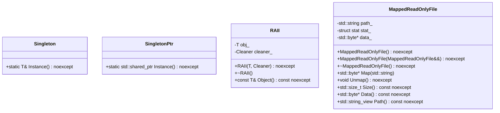
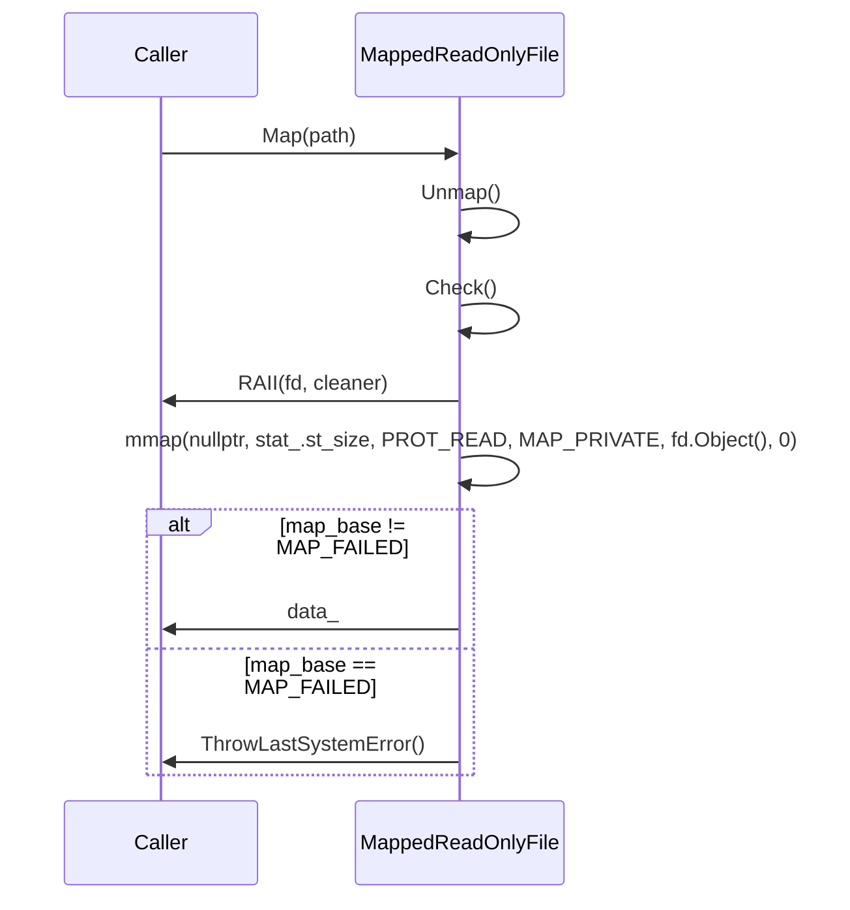

# デザイン文書

## 責務
`util.h`と`util.cpp`は、文字列操作、ファイルディスクリプタの管理、シングルトンパターンの実装、RAII（Resource Acquisition Is Initialization）の実装、およびメモリマップファイルの読み取りなどのユーティリティ関数やクラスを提供します。

## 公開インターフェース
- `StringToLower`, `StringToUpper`: 文字列の大文字小文字変換。
- `ReplaceAllSubstring`: 文字列内の部分文字列の置き換え。
- `SplitString`, `SplitStringToLines`: 文字列の分割。
- `LoadYamlString`, `ThrowIfYamlFieldIsNotScalar`: YAMLデータの読み込みと検証。
- `IsValidFileDescriptor`: ファイルディスクリプタの有効性チェック。
- `SetFileDescriptorAsNonblocking`: ファイルディスクリプタをノンブロッキングモードに設定。
- `ThrowLastSystemError`: 最後のシステムエラーを例外として投げる。
- `CurrentThreadId`: 現在のスレッドIDを取得。
- `Backtrace`: 呼び出し元のバックトレース情報を取得。
- `Singleton`, `SingletonPtr`: シングルトンパターンの実装。
- `RAII`: リソース管理用クラス。
- `MappedReadOnlyFile`: 読み取り専用ファイルをメモリにマッピングするクラス。

## 入力
- 文字列操作関数: 変換や分割対象の文字列、置き換え元・先の部分文字列、正規表現パターン。
- YAML読み込み関数: YAML形式の文字列と必須フィールドリスト。
- ファイルディスクリプタ管理関数: ファイルディスクリプタの値。
- バックトレース取得関数: スタックサイズ、スキップするフレーム数。

## 出力
- 文字列操作関数: 変換や分割後の文字列リスト。
- YAML読み込み関数: 解析されたYAMLノード。
- ファイルディスクリプタ管理関数: なし（副作用あり）。
- バックトレース取得関数: スタックフレームのリストまたはフォーマット済み文字列。

## 状態
- `MappedReadOnlyFile`: ファイルパス、ファイル情報(`stat`)、マッピングされたデータへのポインタ。

## 処理手順
1. **文字列操作**: 文字列を指定の方法で変換または分割する。
2. **YAML読み込み**: YAML形式の文字列を解析し、必須フィールドが存在することを確認する。
3. **ファイルディスクリプタ管理**: ファイルディスクリプタの有効性チェックとノンブロッキングモードへの設定。
4. **バックトレース取得**: 呼び出し元のスタックフレーム情報を収集し、必要に応じてフォーマットする。
5. **シングルトンパターン**: インスタンスが存在しない場合は新規作成し、既存のインスタンスを返す。
6. **RAII**: リソースの取得と解放を自動化する。
7. **メモリマップファイル読み取り**: 指定されたファイルをメモリにマッピングし、データへのアクセスを提供する。

## 例外・失敗条件
- 文字列操作関数: 無効な入力（例：空文字列）。
- YAML読み込み関数: 必須フィールドが存在しない場合やYAML形式が不正な場合。
- ファイルディスクリプタ管理関数: ファイルディスクリプタの値が無効な場合、ノンブロッキングモードへの設定に失敗した場合。
- バックトレース取得関数: スタック情報の収集に失敗した場合。

## 依存関係
- `fmt/format.h`: 文字列フォーマット用。
- `yaml-cpp/yaml.h`: YAMLデータの解析用。
- `<sys/stat.h>`, `<fcntl.h>`, `<sys/mman.h>`, `<unistd.h>`: ファイル操作とメモリマッピング用。
- `<concepts>`, `<functional>`, `<initializer_list>`, `<memory>`, `<regex>`, `<string>`, `<string_view>`, `<utility>`, `<vector>`: 標準ライブラリ機能の利用。

## 重要な不変条件
- `MappedReadOnlyFile`: ファイルがマッピングされている場合、`data_`は有効なポインタでなければならず、`stat_`と`path_`も適切に初期化されている。
- シングルトンクラス: 一度インスタンスが作成されると、それ以降同じインスタンスが返される。

## 追加詳細設計情報

### クラス図


### クラス・メソッド・インターフェース詳細

| クラス/関数名 | 完全な名前 | 属性 | 引数名と型 | 戻り値型 | 可視性 | `const` | 参照 | ポインタ | `static` | `virtual` | `noexcept` | 型別名 | 列挙型 | 定数 | 直接依存 |
|---------------|------------|------|------------|----------|--------|---------|------|--------|----------|-----------|----------|--------|--------|------|----------|
| Singleton     | ws::Singleton<T, Args...> | クラス | -        | -        | public | -       | -      | -        | ✓        | ✗         | ✗        | -      | -      | -      | -          |
| Instance      | ws::Singleton<T, Args...>::Instance<Args...>() | メソッド | args   | T&     | public | ✓       | -      | -        | ✓        | ✗         | ✓        | -      | -      | -      | -          |
| SingletonPtr  | ws::SingletonPtr<T, Args...> | クラス | -        | -        | public | -       | -      | -        | ✓        | ✗         | ✗        | -      | -      | -      | -          |
| Instance      | ws::SingletonPtr<T, Args...>::Instance<Args...>() | メソッド | args   | std::shared_ptr<T> | public | ✓       | -      | -        | ✓        | ✗         | ✓        | -      | -      | -      | -          |
| RAII          | ws::RAII<T, Cleaner> | クラス | obj, cleaner | -        | public | -       | -      | -        | ✗        | ✗         | ✓        | -      | -      | -      | -          |
| RAII          | ws::RAII<T, Cleaner>::RAII(T, Cleaner) | コンストラクタ | obj, cleaner | -        | public | -       | -      | -        | ✗        | ✗         | ✓        | -      | -      | -      | -          |
| ~RAII         | ws::RAII<T, Cleaner>::~RAII() | デストラクタ | -        | -        | public | -       | -      | -        | ✗        | ✗         | ✓        | -      | -      | -      | -          |
| Object        | ws::RAII<T, Cleaner>::Object() const | メソッド | -        | const T& | public | ✓       | -      | -        | ✗        | ✗         | ✓        | -      | -      | -      | -          |
| MappedReadOnlyFile | ws::MappedReadOnlyFile | クラス | -        | -        | public | -       | -      | -        | ✗        | ✗         | ✗        | -      | -      | -      | -          |
| MappedReadOnlyFile | ws::MappedReadOnlyFile::MappedReadOnlyFile() | コンストラクタ | -        | -        | public | -       | -      | -        | ✗        | ✗         | ✓        | -      | -      | -      | -          |
| MappedReadOnlyFile | ws::MappedReadOnlyFile::MappedReadOnlyFile(MappedReadOnlyFile&&) | ムーブコンストラクタ | o        | -        | public | -       | -      | ✗        | ✗        | ✗         | ✓        | -      | -      | -      | -          |
| ~MappedReadOnlyFile | ws::MappedReadOnlyFile::~MappedReadOnlyFile() | デストラクタ | -        | -        | public | -       | -      | -        | ✗        | ✗         | ✓        | -      | -      | -      | -          |
| Map             | ws::MappedReadOnlyFile::Map(std::string) | メソッド | path     | std::byte* | public | -       | -      | -        | ✗        | ✗         | ✗        | -      | -      | -      | -          |
| Unmap           | ws::MappedReadOnlyFile::Unmap() | メソッド | -        | void     | public | -       | -      | -        | ✗        | ✗         | ✓        | -      | -      | -      | -          |
| Size            | ws::MappedReadOnlyFile::Size() const | メソッド | -        | std::size_t | public | ✓       | -      | -        | ✗        | ✗         | ✓        | -      | -      | -      | -          |
| Data            | ws::MappedReadOnlyFile::Data() const | メソッド | -        | std::byte* | public | ✓       | -      | -        | ✗        | ✗         | ✓        | -      | -      | -      | -          |
| Path            | ws::MappedReadOnlyFile::Path() const | メソッド | -        | std::string_view | public | ✓       | -      | -        | ✗        | ✗         | ✓        | -      | -      | -      | -          |

### シーケンス図


### メソッド仕様書

#### StringToLower
- **目的**: 文字列を全て小文字に変換する。
- **引数**: `str` (std::string) - 変換対象の文字列。
- **戻り値**: std::string - 小文字に変換された文字列。
- **動作**: 入力文字列の各文字を小文字に変換し、新しい文字列として返す。
- **副作用**: なし
- **エラー処理**: 無効な入力（例：空文字列）は処理されないが、例外は発生しない。

#### LoadYamlString
- **目的**: YAML形式の文字列を解析し、必須フィールドが存在することを確認する。
- **引数**: `str` (std::string_view) - YAML形式の文字列, `required_fields` (std::initializer_list<std::string_view>) - 必須フィールドリスト。
- **戻り値**: YAML::Node - 解析されたYAMLノード。
- **動作**: 入力文字列を解析し、必須フィールドが存在することを確認する。存在しない場合は例外を投げる。
- **副作用**: なし
- **エラー処理**: 必須フィールドが存在しない場合やYAML形式が不正な場合はstd::invalid_argumentを投げる。

#### SetFileDescriptorAsNonblocking
- **目的**: ファイルディスクリプタをノンブロッキングモードに設定する。
- **引数**: `fd` (FileDescriptor) - ファイルディスクリプタの値。
- **戻り値**: void
- **動作**: 入力ファイルディスクリプタをノンブロッキングモードに設定する。設定に失敗した場合は例外を投げる。
- **副作用**: ファイルディスクリプタの状態が変更される。
- **エラー処理**: ファイルディスクリプタの値が無効な場合やノンブロッキングモードへの設定に失敗した場合はstd::system_errorを投げる。

#### Backtrace
- **目的**: 呼び出し元のスタックフレーム情報を取得する。
- **引数**: `size` (std::size_t) - スタックサイズ, `skip` (std::size_t) - スキップするフレーム数, `prefix` (std::string_view) - 各スタックフレームに付加するプレフィックス。
- **戻り値**: std::string - フォーマット済みのバックトレース文字列。
- **動作**: 呼び出し元のスタックフレーム情報を収集し、必要に応じてフォーマットして返す。
- **副作用**: なし
- **エラー処理**: スタック情報の収集に失敗した場合は例外は発生しないが、空文字列を返す可能性がある。

### 処理フロー図
```mermaid
graph TD
    A[開始] --> B{Map(path)}
    B --> C[Unmap()]
    C --> D[Check()]
    D --> E[RAII(fd, cleaner)]
    E --> F[mmap(nullptr, stat_.st_size, PROT_READ, MAP_PRIVATE, fd.Object(), 0)]
    F -->|map_base != MAP_FAILED| G[data_]
    F -->|map_base == MAP_FAILED| H[ThrowLastSystemError()]
    G --> I[戻り値: data_]
    H --> J[例外: std::system_error]
    I --> K[終了]
    J --> K
```

### 状態遷移・副作用

| 更新前状態 | 遷移条件 | 変更対象 | 更新後状態 | 更新順序 | 外部資源への副作用 |
|------------|----------|----------|------------|----------|----------------------|
| ファイル未マッピング | Map(path) 呼び出し | path_, stat_, data_ | ファイルマッピング済み | 1. Unmap() <br> 2. Check() <br> 3. mmap() | メモリにファイルがマッピングされる |
| ファイルマッピング済み | Unmap() 呼び出し | data_, stat_, path_ | ファイル未マッピング | munmap(data_) <br> data_=nullptr <br> stat_={} <br> path_.clear() | メモリからファイルがアンマップされる |

### データ変換・制約

| 入力データ | 変換規則 | 出力データ | 値域 | 境界値 | 単位 | 精度 | encoding |
|------------|----------|------------|------|--------|------|------|----------|
| str (StringToLower, StringToUpper) | 文字列の大文字小文字変換 | 変換後の文字列 | 任意の文字列 | - | - | - | UTF-8 |
| str, from, to (ReplaceAllSubstring) | 部分文字列の置き換え | 置き換え後の文字列 | 任意の文字列 | - | - | - | UTF-8 |
| str, pattern (SplitString) | 正規表現による分割 | 分割された文字列リスト | 文字列リスト | - | - | - | UTF-8 |
| str (SplitStringToLines) | 改行コードによる分割 | 分割された文字列リスト | 文字列リスト | - | - | - | UTF-8 |
| str, required_fields (LoadYamlString) | YAML形式の解析と必須フィールドの確認 | 解析されたYAMLノード | YAML::Node | - | - | - | UTF-8 |
| fd (SetFileDescriptorAsNonblocking) | ファイルディスクリプタをノンブロッキングモードに設定 | なし | FileDescriptor | >=0 | - | - | - |
| size, skip, prefix (Backtrace) | スタックフレーム情報の収集とフォーマット | フォーマット済みのバックトレース文字列 | 文字列 | - | - | - | UTF-8 |

この設計文書は、`util.h`と`util.cpp`の再実装に必要な詳細な情報を提供します。各関数やクラスの役割、入出力、状態管理、例外処理などを明確に記述しています。

# Machine-extracted Source-local Implementation Contract

This appendix is deterministic evidence extracted from the target source.
It is not an LLM summary and it does not contain complete function bodies.

During regeneration:
- preserve the exact local declaration types, containers, initializers, and literals listed below;
- preserve the exact call targets and argument expressions listed below;
- do not substitute a different representation or accessor merely because it looks similar;
- treat these items as exact constraints, not as pseudocode suggestions.

## Exact local declarations

- `static T ins {std::move(args)...};`
- `static const std::shared_ptr<T> ins { std::make_shared<T>(std::move(args)...)};`
- `std::ostringstream ss;`
- `const auto begin {str.find(from)};`
- `std::vector<std::string> strs;`
- `const std::sregex_token_iterator begin {str.cbegin(), str.cend(), pattern, -1};`
- `static const std::regex pattern {"\r*\n"};`
- `const YAML::Node node {YAML::Load(str.data())};`
- `std::unique_ptr<VoidPtr[]> buffer {new VoidPtr[size] {}};`
- `const auto ret_size {backtrace(buffer.get(), static_cast<int>(size))};`
- `char** const stack_strs {backtrace_symbols(buffer.get(), ret_size)};`
- `auto i {skip};`
- `std::vector<std::string> stack;`
- `std::ostringstream backtrace;`
- `const RAII fd {open(path_.c_str(), O_RDONLY), [](const auto fd) noexcept { if (IsValidFileDescriptor(fd)) { close(fd); } }};`
- `const auto map_base {mmap(nullptr, stat_.st_size, PROT_READ, MAP_PRIVATE, fd.Object(), 0)};`

## Exact top-level call expressions

- `std::move(args)`
- `std::make_shared<T>(std::move(args)...)`
- `std::move(obj)`
- `std::move(cleaner)`
- `cleaner_(obj_)`
- `std::ranges::transform( str.begin(), str.end(), str.begin(), [](const unsigned char c) noexcept { return std::tolower(c); })`
- `std::ranges::transform( str.begin(), str.end(), str.begin(), [](const unsigned char c) noexcept { return std::toupper(c); })`
- `str.empty()`
- `str.find(from)`
- `str.substr(0, begin)`
- `str.substr(begin + from.length())`
- `ss.str()`
- `str.cbegin()`
- `str.cend()`
- `std::copy(begin, std::sregex_token_iterator {}, std::back_inserter(strs))`
- `SplitString(str, pattern)`
- `YAML::Load(str.data())`
- `std::ranges::for_each( required_fields, [&node, &str](const std::string_view field) { if (!node[field.data()]) { throw std::invalid_argument { fmt::format("Invalid YAML value: '{}'", str)}; } })`
- `node[field.data()].IsScalar()`
- `fmt::format("Invalid YAML field: '{}'", field)`
- `std::system_category()`
- `assert(IsValidFileDescriptor(fd))`
- `fcntl(fd, F_SETFL, fcntl(fd, F_GETFD) | O_NONBLOCK)`
- `ThrowLastSystemError()`
- `static_cast<std::uint32_t>(syscall(SYS_gettid))`
- `backtrace(buffer.get(), static_cast<int>(size))`
- `backtrace_symbols(buffer.get(), ret_size)`
- `stack.push_back(stack_strs[i])`
- `free(stack_strs)`
- `Backtrace(stack, size, skip)`
- `std::ranges::for_each(stack, [&backtrace, &prefix](const auto& call) noexcept { backtrace << prefix << call << "\n"; })`
- `backtrace.str()`
- `std::move(o.stat_)`
- `std::move(o.path_)`
- `Unmap()`
- `assert(!path_.empty())`
- `stat(path_.data(), &stat_)`
- `S_ISDIR(stat_.st_mode)`
- `fmt::format("'{}' is a directory", path_)`
- `fmt::format("No permission to access '{}'", path_)`
- `std::move(path)`
- `Check()`
- `open(path_.c_str(), O_RDONLY)`
- `close(fd)`
- `mmap(nullptr, stat_.st_size, PROT_READ, MAP_PRIVATE, fd.Object(), 0)`
- `static_cast<std::byte*>(map_base)`
- `munmap(data_, stat_.st_size)`
- `path_.clear()`

# Machine-extracted Dependency API Contract

This appendix is deterministic evidence derived from the selected repository context and target-source usages.
It is not an LLM summary.

During regeneration:
- preserve the exact dependency declarations and call patterns listed below;
- do not invent replacement APIs, member functions, overloads, or adapters;
- preserve return types, parameter types, defaults, qualifiers, and argument expressions as written;
- do not consume a void return value as a value.
