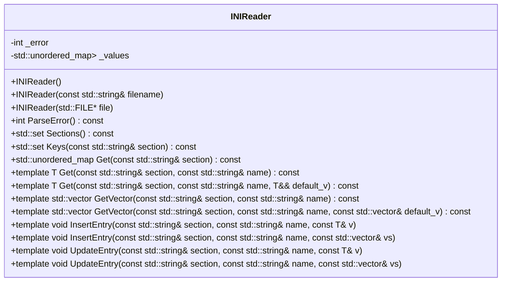

# 設計文書: INIReader クラス

## 責務
INIファイルを読み込み、セクションとキーの値を提供する。また、新しいエントリを挿入し、既存のエントリを更新できる。

## 公開インターフェース
- `INIReader()`: 空のコンストラクタ。
- `INIReader(const std::string& filename)`: ファイル名からINIファイルを読み込む。
- `INIReader(std::FILE* file)`: ファイルポインタからINIファイルを読み込む。
- `int ParseError() const`: 解析エラーの結果を返す。
- `std::set<std::string> Sections() const`: INIファイル内のセクションリストを返す。
- `std::set<std::string> Keys(const std::string& section) const`: 指定したセクション内のキーリストを返す。
- `std::unordered_map<std::string, std::string> Get(const std::string& section) const`: 指定したセクションの値マップを返す。
- `template <typename T = std::string> T Get(const std::string& section, const std::string& name) const`: 指定したセクションとキーの値を取得する。
- `template <typename T> T Get(const std::string& section, const std::string& name, T&& default_v) const`: 指定したセクションとキーの値を取得し、存在しない場合はデフォルト値を返す。
- `template <typename T = std::string> std::vector<T> GetVector(const std::string& section, const std::string& name) const`: 指定したセクションとキーの値配列を取得する。
- `template <typename T> std::vector<T> GetVector(const std::string& section, const std::string& name, const std::vector<T>& default_v) const`: 指定したセクションとキーの値配列を取得し、存在しない場合はデフォルト値を返す。
- `template <typename T = std::string> void InsertEntry(const std::string& section, const std::string& name, const T& v)`: 指定したセクションとキーにエントリを挿入する。
- `template <typename T = std::string> void InsertEntry(const std::string& section, const std::string& name, const std::vector<T>& vs)`: 指定したセクションとキーに値配列のエントリを挿入する。
- `template <typename T = std::string> void UpdateEntry(const std::string& section, const std::string& name, const T& v)`: 指定したセクションとキーのエントリを更新する。
- `template <typename T = std::string> void UpdateEntry(const std::string& section, const std::string& name, const std::vector<T>& vs)`: 指定したセクションとキーの値配列のエントリを更新する。

## 入力
- INIファイル名 (`std::string`)
- ファイルポインタ (`std::FILE*`)
- セクション名 (`std::string`)
- キー名 (`std::string`)
- 値 (`T`)

## 出力
- 解析エラーの結果 (`int`)
- セクションリスト (`std::set<std::string>`)
- キーリスト (`std::set<std::string>`)
- 値マップ (`std::unordered_map<std::string, std::string>`)
- 値 (`T`)
- 値配列 (`std::vector<T>`)

## 状態
- `_error`: 解析エラーの結果を保持する。
- `_values`: セクションとキーの値を保持する。

## 処理手順
1. コンストラクタでINIファイルを読み込み、`Parse`メソッドを使用して内容を解析する。
2. `ParseError`メソッドで解析エラーの結果を返す。
3. `Sections`, `Keys`, `Get`, `GetVector`メソッドでセクションとキーの値にアクセスする。
4. `InsertEntry`, `UpdateEntry`メソッドで新しいエントリを挿入または既存のエントリを更新する。

## 例外・失敗条件
- ファイルが開けない場合、`std::runtime_error`をスローする。
- 解析中にエラーが発生した場合、`_error`にエラーライン番号を設定し、`ParseError`メソッドで`std::runtime_error`をスローする。
- セクションやキーが存在しない場合、`std::runtime_error`をスローする。
- 既存のキーに重複したエントリを挿入しようとした場合、`std::runtime_error`をスローする。

## 依存関係
- `<cstddef>`
- `<cstdio>`
- `<fstream>`
- `<set>`
- `<sstream>`
- `<stdexcept>`
- `<string>`
- `<string_view>`
- `<type_traits>`
- `<unordered_map>`
- `<utility>`
- `<vector>`

## 重要な不変条件
- `_error`は解析エラーの結果を正確に保持する。
- `_values`はセクションとキーの値を正確に保持する。

## 追加詳細設計情報

### クラス図

### クラス・メソッド・インターフェース詳細

| メンバ名 | 型 | 可視性 | const | 引数 | 戻り値型 |
| --- | --- | --- | --- | --- | --- |
| INIReader() | コンストラクタ | public | - | - | void |
| INIReader(const std::string& filename) | コンストラクタ | public | - | const std::string& filename | void |
| INIReader(std::FILE* file) | コンストラクタ | public | - | std::FILE* file | void |
| ParseError() | メソッド | public | const | - | int |
| Sections() | メソッド | public | const | - | std::set<std::string> |
| Keys(const std::string& section) | メソッド | public | const | const std::string& section | std::set<std::string> |
| Get(const std::string& section) | メソッド | public | const | const std::string& section | std::unordered_map<std::string, std::string> |
| Get(const std::string& section, const std::string& name) | テンプレートメソッド | public | const | const std::string& section, const std::string& name | T |
| Get(const std::string& section, const std::string& name, T&& default_v) | テンプレートメソッド | public | const | const std::string& section, const std::string& name, T&& default_v | T |
| GetVector(const std::string& section, const std::string& name) | テンプレートメソッド | public | const | const std::string& section, const std::string& name | std::vector<T> |
| GetVector(const std::string& section, const std::string& name, const std::vector<T>& default_v) | テンプレートメソッド | public | const | const std::string& section, const std::string& name, const std::vector<T>& default_v | std::vector<T> |
| InsertEntry(const std::string& section, const std::string& name, const T& v) | テンプレートメソッド | public | - | const std::string& section, const std::string& name, const T& v | void |
| InsertEntry(const std::string& section, const std::string& name, const std::vector<T>& vs) | テンプレートメソッド | public | - | const std::string& section, const std::string& name, const std::vector<T>& vs | void |
| UpdateEntry(const std::string& section, const std::string& name, const T& v) | テンプレートメソッド | public | - | const std::string& section, const std::string& name, const T& v | void |
| UpdateEntry(const std::string& section, const std::string& name, const std::vector<T>& vs) | テンプレートメソッド | public | - | const std::string& section, const std::string& name, const std::vector<T>& vs | void |

### シーケンス図
該当なし

### メソッド仕様書

#### `INIReader(const std::string& filename)`
- 目的: 指定したファイル名からINIファイルを読み込む。
- 引数: const std::string& filename - INIファイルのパス。
- 戻り値型: void
- 動作: ファイルを開き、内容を読み込み`Parse`メソッドで解析する。エラーが発生した場合は`_error`にエラーコードを設定し、`ParseError`メソッドで例外をスローする。
- エラー処理: ファイルを開けない場合、`std::runtime_error`をスローする。

#### `INIReader(std::FILE* file)`
- 目的: 指定したファイルポインタからINIファイルを読み込む。
- 引数: std::FILE* file - INIファイルのファイルポインタ。
- 戻り値型: void
- 動作: ファイルポインタから内容を読み込み`Parse`メソッドで解析する。エラーが発生した場合は`_error`にエラーコードを設定し、`ParseError`メソッドで例外をスローする。
- エラー処理: ファイルを開けない場合、`std::runtime_error`をスローする。

#### `int ParseError() const`
- 目的: 解析エラーの結果を返す。
- 引数: なし
- 戻り値型: int - エラーコード (0: 成功, -1: ファイル開けない, -2: メモリ確保エラー, その他の正の整数: エラーライン番号)。
- 動作: `_error`の値をチェックし、適切な例外をスローする。

#### `std::set<std::string> Sections() const`
- 目的: INIファイル内のセクションリストを返す。
- 引数: なし
- 戻り値型: std::set<std::string>
- 動作: `_values`のキーからセクション名を抽出し、セットとして返す。

#### `std::set<std::string> Keys(const std::string& section) const`
- 目的: 指定したセクション内のキーリストを返す。
- 引数: const std::string& section - セクション名。
- 戻り値型: std::set<std::string>
- 動作: `_values`から指定したセクションのキーを抽出し、セットとして返す。

#### `std::unordered_map<std::string, std::string> Get(const std::string& section) const`
- 目的: 指定したセクションの値マップを返す。
- 引数: const std::string& section - セクション名。
- 戻り値型: std::unordered_map<std::string, std::string>
- 動作: `_values`から指定したセクションの値マップを返す。

#### `template <typename T = std::string> T Get(const std::string& section, const std::string& name) const`
- 目的: 指定したセクションとキーの値を取得する。
- 引数: const std::string& section - セクション名, const std::string& name - キー名。
- 戻り値型: T
- 動作: `_values`から指定したセクションとキーの値を取得し、適切な型に変換して返す。

#### `template <typename T> T Get(const std::string& section, const std::string& name, T&& default_v) const`
- 目的: 指定したセクションとキーの値を取得し、存在しない場合はデフォルト値を返す。
- 引数: const std::string& section - セクション名, const std::string& name - キー名, T&& default_v - デフォルト値。
- 戻り値型: T
- 動作: `_values`から指定したセクションとキーの値を取得し、存在しない場合はデフォルト値を返す。

#### `template <typename T = std::string> std::vector<T> GetVector(const std::string& section, const std::string& name) const`
- 目的: 指定したセクションとキーの値配列を取得する。
- 引数: const std::string& section - セクション名, const std::string& name - キー名。
- 戻り値型: std::vector<T>
- 動作: `_values`から指定したセクションとキーの値を取得し、スペース区切りで分割してベクトルとして返す。

#### `template <typename T> std::vector<T> GetVector(const std::string& section, const std::string& name, const std::vector<T>& default_v) const`
- 目的: 指定したセクションとキーの値配列を取得し、存在しない場合はデフォルト値を返す。
- 引数: const std::string& section - セクション名, const std::string& name - キー名, const std::vector<T>& default_v - デフォルト値。
- 戻り値型: std::vector<T>
- 動作: `_values`から指定したセクションとキーの値を取得し、存在しない場合はデフォルト値を返す。

#### `template <typename T = std::string> void InsertEntry(const std::string& section, const std::string& name, const T& v)`
- 目的: 指定したセクションとキーにエントリを挿入する。
- 引数: const std::string& section - セクション名, const std::string& name - キー名, const T& v - 値。
- 戻り値型: void
- 動作: `_values`に指定したセクションとキーのエントリを挿入する。既存のキーが存在する場合は例外をスローする。

#### `template <typename T = std::string> void InsertEntry(const std::string& section, const std::string& name, const std::vector<T>& vs)`
- 目的: 指定したセクションとキーに値配列のエントリを挿入する。
- 引数: const std::string& section - セクション名, const std::string& name - キー名, const std::vector<T>& vs - 値配列。
- 戻り値型: void
- 動作: `_values`に指定したセクションとキーのエントリを挿入する。既存のキーが存在する場合は例外をスローする。

#### `template <typename T = std::string> void UpdateEntry(const std::string& section, const std::string& name, const T& v)`
- 目的: 指定したセクションとキーのエントリを更新する。
- 引数: const std::string& section - セクション名, const std::string& name - キー名, const T& v - 値。
- 戻り値型: void
- 動作: `_values`に指定したセクションとキーのエントリを更新する。存在しないキーの場合、例外をスローする。

#### `template <typename T = std::string> void UpdateEntry(const std::string& section, const std::string& name, const std::vector<T>& vs)`
- 目的: 指定したセクションとキーの値配列のエントリを更新する。
- 引数: const std::string& section - セクション名, const std::string& name - キー名, const std::vector<T>& vs - 値配列。
- 戻り値型: void
- 動作: `_values`に指定したセクションとキーのエントリを更新する。存在しないキーの場合、例外をスローする。

### 処理フロー図
該当なし

### 状態遷移・副作用

| 更新前状態 | 遷移条件 | 変更対象 | 更新後状態 | 更新順序 | 副作用 |
| --- | --- | --- | --- | --- | --- |
| `_error = 0` | ファイル開けない | `_error` | `-1` | - | `std::runtime_error`スロー |
| `_error = 0` | メモリ確保エラー | `_error` | `-2` | - | `std::runtime_error`スロー |
| `_error = 0` | 解析中にエラー発生 | `_error` | エラーライン番号 | - | `std::runtime_error`スロー |
| `_values[section]` | キーが存在しない | `_values[section][name]` | 値 | - | なし |
| `_values[section]` | キーが既に存在する | `_error` | `-1` | - | `std::runtime_error`スロー |

### データ変換・制約

| 入力データ | 変換規則 | 出力データ |
| --- | --- | --- |
| INIファイル内容 | セクションとキーの値に分割 | `_values[section][name] = value` |
| 値 (`std::string`) | `Converter<T>`を使用して型変換 | T |
| 値配列 (`std::vector<std::string>`) | スペース区切りで分割し、各要素を`Converter<T>`を使用して型変換 | std::vector<T> |

## その他の情報
- `detail`名前空間にはINIファイルの解析に必要なユーティリティ関数が含まれている。
- `INIWriter`クラスはINIReaderオブジェクトの内容をINIファイルに出力するためのクラスである。

# Machine-extracted Source-local Implementation Contract

This appendix is deterministic evidence extracted from the target source.
It is not an LLM summary and it does not contain complete function bodies.

During regeneration:
- preserve the exact local declaration types, containers, initializers, and literals listed below;
- preserve the exact call targets and argument expressions listed below;
- do not substitute a different representation or accessor merely because it looks similar;
- treat these items as exact constraints, not as pseudocode suggestions.

## Exact local declarations

- `std::ifstream in{filename, std::ios::in | std::ios::binary};`
- `std::string content;`
- `const auto size = in.tellg();`
- `char buf[1 << 15];`
- `std::size_t n = 0;`
- `std::set<std::string> retval;`
- `const auto& sec = GetSection(section);`
- `const auto value = sec.find(name);`
- `const std::string value = Get(section, name);`
- `std::vector<T> vs;`
- `std::size_t i = 0;`
- `std::size_t j = i;`
- `T v{};`
- `static const std::unordered_map<std::string, bool> s2b{ {"1", true}, {"true", true}, {"yes", true}, {"on", true}, {"0", false}, {"false", false}, {"no", false}, {"off", false}, };`
- `const auto value = s2b.find(s);`
- `std::ostringstream ss;`
- `std::ostringstream oss;`
- `const auto sec = _values.find(section);`
- `const auto value = sec->second.find(name);`
- `constexpr std::string_view bom{"\xEF\xBB\xBF", 3};`
- `std::string section;`
- `std::unordered_map<std::string, std::string>* values = nullptr;`
- `int lineno = 0;`
- `const auto eol = content.find('\n');`
- `const auto line = detail::trim(content.substr(0, eol));`
- `const auto end = detail::find_char_or_comment(line.substr(1), "]");`
- `const auto sep = detail::find_char_or_comment(line, "=:");`
- `const auto name = detail::rtrim(line.substr(0, sep));`
- `auto value = line.substr(sep + 1);`
- `const auto comment = detail::find_char_or_comment(value, {});`

## Exact top-level call expressions

- `ParseError()`
- `in.seekg(0, std::ios::end)`
- `in.tellg()`
- `content.resize(static_cast<std::size_t>(size))`
- `in.seekg(0, std::ios::beg)`
- `in.read(&content[0], size)`
- `Parse(content)`
- `std::fread(buf, 1, sizeof(buf), file)`
- `content.append(buf, n)`
- `std::runtime_error("ini file not found.")`
- `std::runtime_error("memory alloc error")`
- `std::runtime_error("parse error on line no: " + std::to_string(_error))`
- `retval.insert(element.first)`
- `GetSection(section)`
- `sec.find(name)`
- `sec.end()`
- `std::runtime_error( "key '" + name + "' not found in section '" + section + "'.")`
- `BoolConverter(value->second)`
- `Converter<T>(value->second)`
- `Get<T>(section, name)`
- `std::forward<T>(default_v)`
- `Get(section, name)`
- `value.size()`
- `detail::is_space(value[i])`
- `detail::is_space(value[j])`
- `vs.emplace_back(Converter<T>(value.substr(i, j - i)))`
- `std::runtime_error("cannot parse value " + value + " to vector<T>.")`
- `GetVector<T>(section, name)`
- `_values[section].emplace(name, V2String(v))`
- `std::runtime_error("duplicate key '" + name + "' in section '" + section + "'.")`
- `_values[section].emplace(name, Vec2String(vs))`
- `FindEntry(section, name)`
- `detail::parse_value(s, v)`
- `std::runtime_error("cannot parse value '" + s + "' to type<T>.")`
- `s2b.find(s)`
- `s2b.end()`
- `std::runtime_error("'" + s + "' is not a valid boolean value.")`
- `ss.str()`
- `v.size()`
- `oss.str()`
- `_values.find(section)`
- `_values.end()`
- `std::runtime_error("section '" + section + "' not found.")`
- `sec->second.find(name)`
- `sec->second.end()`
- `std::runtime_error("key '" + name + "' not exist in section '" + section + "'.")`
- `content.substr(0, bom.size())`
- `content.remove_prefix(bom.size())`
- `content.empty()`
- `content.find('\n')`
- `detail::trim(content.substr(0, eol))`
- `content.remove_prefix(eol == std::string_view::npos ? content.size() : eol + 1)`
- `line.empty()`
- `line.front()`
- `detail::find_char_or_comment(line.substr(1), "]")`
- `section.assign(line.data() + 1, end)`
- `detail::find_char_or_comment(line, "=:")`
- `detail::rtrim(line.substr(0, sep))`
- `line.substr(sep + 1)`
- `detail::find_char_or_comment(value, {})`
- `value.substr(0, comment)`
- `detail::trim(value)`
- `values->emplace(std::string(name), std::string(value))`
- `std::runtime_error("duplicate key '" + std::string(name) + "' in section '" + section + "'.")`

# Machine-extracted Dependency API Contract

This appendix is deterministic evidence derived from the selected repository context and target-source usages.
It is not an LLM summary.

During regeneration:
- preserve the exact dependency declarations and call patterns listed below;
- do not invent replacement APIs, member functions, overloads, or adapters;
- preserve return types, parameter types, defaults, qualifiers, and argument expressions as written;
- do not consume a void return value as a value.
