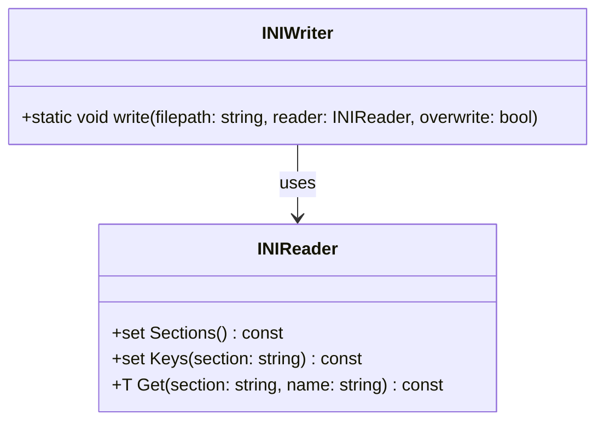

# 設計文書: `INIWriter::write` 関数

## 基本設計項目

### 責務
- `INIReader` オブジェクトの内容を指定されたファイルパスにINI形式で書き出す。
- 既存ファイルの上書きオプションを提供する。

### 公開インターフェース
- `static void write(const std::string& filepath, const INIReader& reader, const bool overwrite = false)`

### 入力
- `filepath`: 出力ファイルのパス (std::string)
- `reader`: 書き出すINIデータを保持する `INIReader` オブジェクト (const INIReader&)
- `overwrite`: 既存ファイルを上書きするかどうか (bool, デフォルトはfalse)

### 出力
- 成功時には何も返さない（void）
- 失敗時には例外を投げる

### 状態
- `_values` (`INIReader` 内部の `std::unordered_map<std::string, std::unordered_map<std::string, std::string>>`)
- 出力ファイルの存在状態と開閉状態

### 処理手順
1. `overwrite` がfalseで、指定されたファイルパスに既存ファイルがある場合、例外を投げる。
2. 指定されたファイルパスに新しいファイルを開く。開けない場合は例外を投げる。
3. `INIReader` のセクションリストを取得し、各セクションに対して以下の処理を行う：
   - セクション名を出力ファイルに書き出す。
   - 各セクション内のキーと値のペアを取得し、キー=値の形式で出力ファイルに書き出す。

### 例外・失敗条件
- 指定されたファイルパスに既存ファイルがあり `overwrite` がfalseの場合、`std::runtime_error` を投げる。
- 出力ファイルを開けない場合、`std::runtime_error` を投げる。

### 依存関係
- `INIReader` クラスの `Sections()` メソッド
- `INIReader` クラスの `Keys(const std::string& section)` メソッド
- `INIReader` クラスの `Get(const std::string& section, const std::string& name)` メソッド

### 重要な不変条件
- 出力ファイルは指定された形式で書き出される。
- 入力の `INIReader` オブジェクトの内容が変更されない。

## RAGによる追加詳細設計

### クラス図


### クラス・メソッド・インターフェース詳細

| クラス名 | メソッド名 | 完全な名前 | 引数名と型 | 戻り値型 | 可視性 | const | static |
|----------|------------|------------|------------|----------|--------|-------|--------|
| INIWriter | write      | inih::INIWriter::write | filepath: std::string, reader: const INIReader&, overwrite: bool | void     | public |       | ✅     |

### シーケンス図
```mermaid
sequenceDiagram
    participant Caller
    participant INIWriter
    participant INIReader
    participant File

    Caller->>INIWriter: write(filepath, reader, overwrite)
    alt overwrite is false and file exists
        INIWriter-->>Caller: throw std::runtime_error("file already exists.")
    else file does not exist or overwrite is true
        INIWriter->>File: open(filepath)
        alt file cannot be opened
            File-->>INIWriter: fail to open
            INIWriter-->>Caller: throw std::runtime_error("cannot open output file")
        else file can be opened
            INIWriter->>INIReader: Sections()
            loop for each section in sections
                INIWriter->>File: write("[section]\\n")
                INIWriter->>INIReader: Keys(section)
                loop for each key in keys
                    INIWriter->>INIReader: Get(section, key)
                    INIWriter->>File: write("key=value\\n")
            end
        end
    end
```

### メソッド仕様書

#### 目的
`INIReader` オブジェクトの内容を指定されたファイルパスにINI形式で書き出す。

#### 引数
- `filepath`: 出力ファイルのパス (std::string)
- `reader`: 書き出すINIデータを保持する `INIReader` オブジェクト (const INIReader&)
- `overwrite`: 既存ファイルを上書きするかどうか (bool, デフォルトはfalse)

#### 戻り値
なし（void）

#### 動作
1. `overwrite` がfalseで、指定されたファイルパスに既存ファイルがある場合、例外を投げる。
2. 指定されたファイルパスに新しいファイルを開く。開けない場合は例外を投げる。
3. `INIReader` のセクションリストを取得し、各セクションに対して以下の処理を行う：
   - セクション名を出力ファイルに書き出す。
   - 各セクション内のキーと値のペアを取得し、キー=値の形式で出力ファイルに書き出す。

#### 副作用
- 指定されたファイルパスにINIデータが書き込まれる。

#### エラー処理
- 指定されたファイルパスに既存ファイルがあり `overwrite` がfalseの場合、`std::runtime_error` を投げる。
- 出力ファイルを開けない場合、`std::runtime_error` を投げる。

### 処理フロー図
```mermaid
graph TD
    A[開始] --> B{overwrite is false and file exists?}
    B -- はい --> C[throw std::runtime_error("file already exists.")]
    B -- いいえ --> D[open(filepath)]
    D --> E{file can be opened?}
    E -- いいえ --> F[throw std::runtime_error("cannot open output file")]
    E -- はい --> G[sections = reader.Sections()]
    G --> H[for each section in sections]
    H --> I[write("[section]\\n")]
    I --> J[keys = reader.Keys(section)]
    J --> K[for each key in keys]
    K --> L[value = reader.Get(section, key)]
    L --> M[write("key=value\\n")]
    M --> N[end for each key]
    N --> O[end for each section]
    O --> P[終了]
```

### 状態遷移・副作用

| 更新前状態 | 遷移条件 | 変更対象 | 更新後状態 | 更新順序 | 副作用 |
|------------|----------|----------|------------|----------|--------|
| ファイルが存在しない or overwrite=true | - | 出力ファイル | 新規作成 | 1 | ファイルの作成 |
| ファイルが存在し、overwrite=false | - | - | - | - | std::runtime_error("file already exists.") |
| ファイルを開けない | - | - | - | - | std::runtime_error("cannot open output file") |

### データ変換・制約

| 入力データ | 変換規則 | 出力データ | 値域 | 境界値 |
|------------|----------|------------|------|--------|
| filepath   | 文字列としてそのまま使用 | 出力ファイルパス | 有効なファイルパス | ファイルシステムの制限 |
| reader     | INIReaderオブジェクトからセクションとキーを取得し、値を文字列に変換 | セクション名=キー=値 | - | - |

この設計文書は `INIWriter::write` 関数の再実装に必要な詳細な情報を提供します。