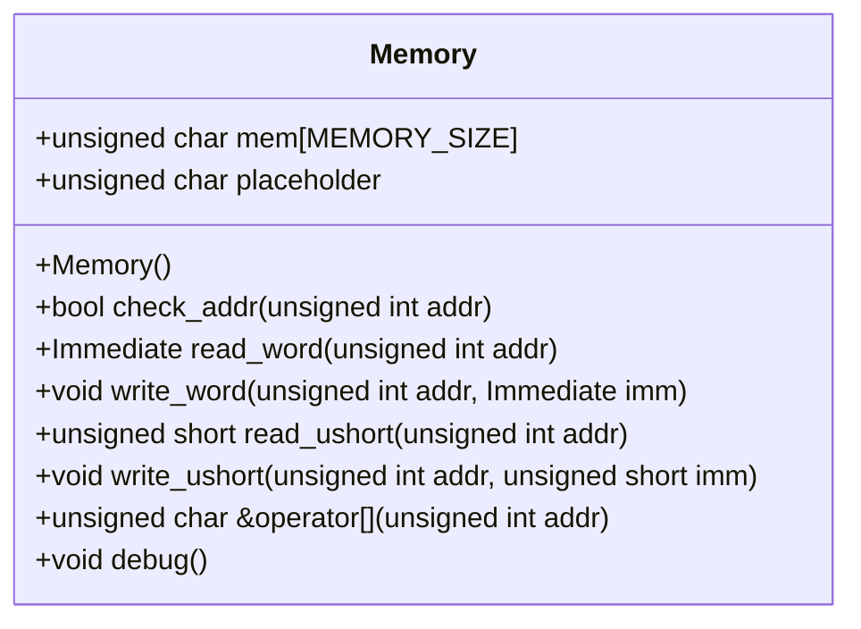
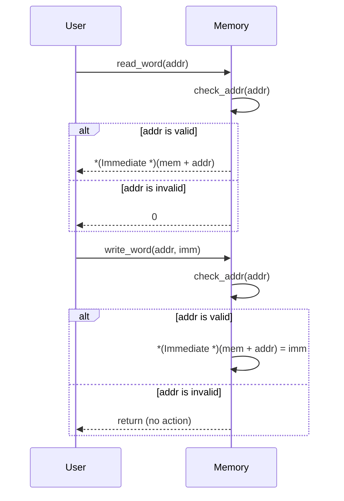

# 設計文書: Memoryクラス

## 責務
- メモリの読み書き操作を提供する。
- アドレス範囲チェックを行い、範囲外アクセスを防ぐ。

## 公開インターフェース
- `Memory()`: コンストラクタ。メモリを初期化する。
- `bool check_addr(unsigned int addr)`: 指定されたアドレスが有効かどうかを確認する。
- `Immediate read_word(unsigned int addr)`: 指定されたアドレスから32ビットのデータを読み込む。
- `void write_word(unsigned int addr, Immediate imm)`: 指定されたアドレスに32ビットのデータを書き込む。
- `unsigned short read_ushort(unsigned int addr)`: 指定されたアドレスから16ビットのデータを読み込む。
- `void write_ushort(unsigned int addr, unsigned short imm)`: 指定されたアドレスに16ビットのデータを書き込む。
- `unsigned char &operator[](unsigned int addr)`: 指定されたアドレスのバイトへの参照を返す。
- `void debug()`: メモリの一部をデバッグ出力する。

## 入力
- `addr`: アドレス値（`unsigned int`型）。
- `imm`: 書き込むデータ（`Immediate`型または`unsigned short`型）。

## 出力
- `bool`: アドレスが有効かどうかを示す真偽値。
- `Immediate`: 32ビットの読み込みデータ。
- `unsigned short`: 16ビットの読み込みデータ。
- `unsigned char &`: バイトへの参照。

## 状態
- `mem[MEMORY_SIZE]`: メモリ配列（`unsigned char`型）。
- `placeholder`: アドレス範囲外アクセス時のダミーデータ（`unsigned char`型）。

## 処理手順
1. コンストラクタでメモリを初期化する。
2. `check_addr`メソッドでアドレスが有効かどうかを確認する。
3. `read_word`メソッドで指定されたアドレスから32ビットのデータを読み込む。
4. `write_word`メソッドで指定されたアドレスに32ビットのデータを書き込む。
5. `read_ushort`メソッドで指定されたアドレスから16ビットのデータを読み込む。
6. `write_ushort`メソッドで指定されたアドレスに16ビットのデータを書き込む。
7. オペレータ[]で指定されたアドレスのバイトへの参照を返す。
8. `debug`メソッドでメモリの一部をデバッグ出力する。

## 例外・失敗条件
- アドレスが範囲外の場合、読み書き操作は無視され、適切な値（0やダミーデータ）が返される。
- `check_addr`メソッドでアドレスチェックに失敗した場合、falseが返される。

## 依存関係
- `Common.h`: `Immediate`型の定義を含む。
- `<cstring>`: `memset`関数を使用する。
- `<iostream>`: デバッグ出力用の`std::cout`を使用する。
- `<cassert>`: アサーション用の`assert`マクロを使用する。

## 重要な不変条件
- メモリサイズは常に`MEMORY_SIZE`（0x400000）である。
- `placeholder`はアドレス範囲外アクセス時のダミーデータとして使用される。

# 追加詳細設計情報

## クラス図


## クラス・メソッド・インターフェース詳細
| 名前 | 型 | 可視性 | const | 引数名と型 | 戻り値型 | 直接依存 |
|------|----|--------|-------|------------|----------|----------|
| Memory | コンストラクタ | public | - | - | void | memset, Common.h |
| check_addr | メソッド | public | - | addr: unsigned int | bool | - |
| read_word | メソッド | public | - | addr: unsigned int | Immediate | check_addr, Common.h |
| write_word | メソッド | public | - | addr: unsigned int, imm: Immediate | void | check_addr, Common.h |
| read_ushort | メソッド | public | - | addr: unsigned int | unsigned short | check_addr |
| write_ushort | メソッド | public | - | addr: unsigned int, imm: unsigned short | void | check_addr |
| operator[] | オペレータ | public | - | addr: unsigned int | unsigned char & | check_addr |
| debug | メソッド | public | - | - | void | std::cout |

## シーケンス図


## メソッド仕様書

### read_word
- **目的**: 指定されたアドレスから32ビットのデータを読み込む。
- **引数**: `addr`: 読み込み先のアドレス（`unsigned int`型）。
- **戻り値**: 32ビットのデータ（`Immediate`型）。アドレスが範囲外の場合、0を返す。
- **動作**: 
    - アドレスチェックを行う。
    - アドレスが有効な場合、指定されたアドレスから32ビットのデータを読み込む。
    - アドレスが無効な場合、0を返す。
- **副作用**: 無し
- **エラー処理**: アドレス範囲外アクセスの場合、0を返す。

### write_word
- **目的**: 指定されたアドレスに32ビットのデータを書き込む。
- **引数**: `addr`: 書き込み先のアドレス（`unsigned int`型）、`imm`: 書き込むデータ（`Immediate`型）。
- **戻り値**: 無し
- **動作**: 
    - アドレスチェックを行う。
    - アドレスが有効な場合、指定されたアドレスに32ビットのデータを書き込む。
    - アドレスが無効な場合、何もしない。
- **副作用**: メモリの更新
- **エラー処理**: アドレス範囲外アクセスの場合、何もしない。

### operator[]
- **目的**: 指定されたアドレスのバイトへの参照を返す。
- **引数**: `addr`: 参照先のアドレス（`unsigned int`型）。
- **戻り値**: バイトへの参照（`unsigned char &`）。アドレスが範囲外の場合、ダミーデータへの参照を返す。
- **動作**: 
    - アドレスチェックを行う。
    - アドレスが有効な場合、指定されたアドレスのバイトへの参照を返す。
    - アドレスが無効な場合、ダミーデータへの参照を返す。
- **副作用**: 無し
- **エラー処理**: アドレス範囲外アクセスの場合、ダミーデータへの参照を返す。

## 処理フロー図
```mermaid
graph TD
    A[開始] --> B{check_addr(addr)}
    B -- true --> C[*(Immediate *)(mem + addr)]
    B -- false --> D[0]
    C --> E[戻り値: Immediate]
    D --> F[戻り値: 0]
    E --> G[終了]
    F --> G
```

## 状態遷移・副作用
| 更新前状態 | 遷移条件 | 変更対象 | 更新後状態 | 更新順序 | 副作用 |
|------------|----------|----------|------------|----------|--------|
| メモリ初期化済み | アドレス有効 | mem[addr] | 書き込みデータ | 1. check_addr, 2. 書き込み | メモリの更新 |
| メモリ初期化済み | アドレス無効 | - | - | 1. check_addr | 無し |

## データ変換・制約
| 入力データ | 変換規則 | 出力データ | 値域 | 境界値 |
|------------|----------|------------|------|--------|
| addr | アドレス範囲チェック | bool | 0 <= addr < MEMORY_SIZE | 0, MEMORY_SIZE - 1 |
| imm (read_word) | メモリからの読み込み | Immediate | 無制約 | 確認不能 |
| imm (write_word) | メモリへの書き込み | - | 無制約 | 確認不能 |
| imm (read_ushort) | メモリからの読み込み | unsigned short | 無制約 | 確認不能 |
| imm (write_ushort) | メモリへの書き込み | - | 無制約 | 確認不能 |