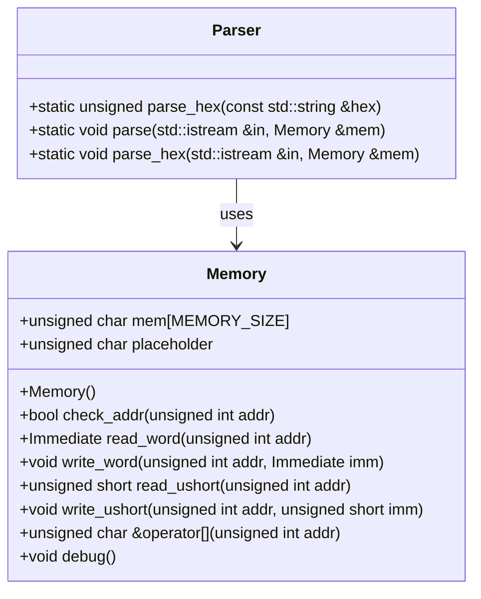
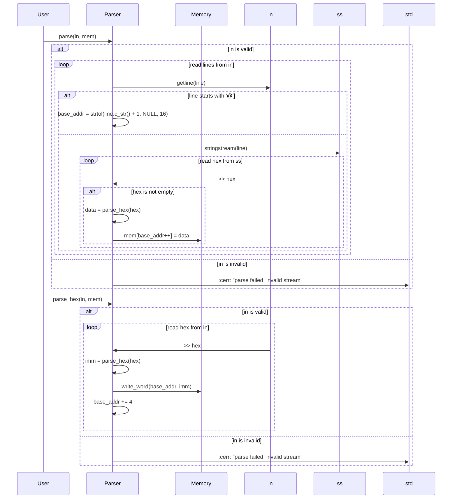

# デザイン文書: Parser クラス

## 責務
`Parser`クラスは、入力ストリームからデータを読み取り、それを指定されたメモリオブジェクトに書き込む責任を持っています。具体的には、16進数形式のデータをパースし、メモリの適切なアドレスに格納します。

## 公開インターフェース
- `static unsigned parse_hex(const std::string &hex)`
- `static void parse(std::istream &in, Memory &mem)`
- `static void parse_hex(std::istream &in, Memory &mem)`

## 入力
- `parse_hex`: 16進数形式の文字列 (`const std::string &hex`)
- `parse`: 入力ストリームとメモリオブジェクト (`std::istream &in`, `Memory &mem`)
- `parse_hex`: 入力ストリームとメモリオブジェクト (`std::istream &in`, `Memory &mem`)

## 出力
- `parse_hex`: 16進数文字列をパースした結果の符号なし整数 (`unsigned`)
- `parse`: メモリオブジェクトへの書き込み (副作用)
- `parse_hex`: メモリオブジェクトへの書き込み (副作用)

## 状態
- `Parser`クラスは静的メソッドのみを使用しており、内部状態を保持しません。

## 処理手順
1. **parse_hex**:
   - 与えられた16進数文字列をパースし、符号なし整数に変換します。
2. **parse**:
   - 入力ストリームから一行ずつ読み取ります。
   - 行の先頭が`@`の場合、その行はベースアドレスとして解釈され、その後のデータ書き込みの開始位置となります。
   - それ以外の行では、16進数文字列をパースし、メモリの現在のベースアドレスに1バイトずつ書き込みます。各データ書き込み後、ベースアドレスはインクリメントされます。
3. **parse_hex**:
   - 入力ストリームから16進数文字列を読み取ります。
   - 各16進数文字列をパースし、メモリの現在のベースアドレスに4バイトずつ書き込みます。各データ書き込み後、ベースアドレスは4インクリメントされます。

## 例外・失敗条件
- 入力ストリームが無効な場合 (`!in`), エラーメッセージを出力します。
- パース対象の16進数文字列が空の場合、処理はスキップされます。

## 依存関係
- `Memory`クラス: データ書き込み先として使用されます。
- `<iostream>`: 入力ストリームとエラーメッセージ出力に使用されます。
- `<iomanip>`: ストリーム操作のため使用される可能性がありますが、元コードでは明示的に使用されていません。
- `<sstream>`: 文字列をストリームとして扱うために使用されます。
- `<string>`: 文字列操作に使用されます。

## 重要な不変条件
- パース対象の16進数文字列は有効な形式であることが期待されます。
- 入力ストリームが無効な場合でも、メモリオブジェクトへの書き込みは行われません。

# 追加詳細設計情報

## クラス図


## クラス・メソッド・インターフェース詳細

| クラス名 | メソッド名       | 完全な名前                           | 属性   | 引数名と型                    | 戻り値型  | 可視性 | const | 参照/ポインタ | static | noexcept |
|----------|------------------|--------------------------------------|--------|-------------------------------|-----------|--------|-------|---------------|--------|----------|
| Parser   | parse_hex        | Parser::parse_hex                    | 静的   | hex: const std::string &      | unsigned  | 公開   | あり  | 参照          | あり   | なし     |
| Parser   | parse            | Parser::parse                        | 静的   | in: std::istream &, mem: Memory & | void      | 公開   | なし  | リファレンス    | あり   | なし     |
| Parser   | parse_hex        | Parser::parse_hex                    | 静的   | in: std::istream &, mem: Memory & | void      | 公開   | なし  | リファレンス    | あり   | なし     |

## シーケンス図


## メソッド仕様書

### parse_hex
- **目的**: 16進数形式の文字列をパースし、符号なし整数に変換します。
- **引数**:
  - `hex`: 16進数形式の文字列 (`const std::string &`)
- **戻り値**: パース結果の符号なし整数 (`unsigned`)
- **動作**: `strtol`関数を使用して16進数文字列をパースし、その結果を返します。
- **副作用**: なし
- **エラー処理**: 無効な16進数文字列の場合の動作は確認不能

### parse
- **目的**: 入力ストリームからデータを読み取り、それを指定されたメモリオブジェクトに書き込みます。
- **引数**:
  - `in`: 入力ストリーム (`std::istream &`)
  - `mem`: メモリオブジェクト (`Memory &`)
- **戻り値**: なし
- **動作**:
  - 入力ストリームから一行ずつ読み取ります。
  - 行の先頭が`@`の場合、その行はベースアドレスとして解釈され、その後のデータ書き込みの開始位置となります。
  - それ以外の行では、16進数文字列をパースし、メモリの現在のベースアドレスに1バイトずつ書き込みます。各データ書き込み後、ベースアドレスはインクリメントされます。
- **副作用**: メモリオブジェクトへの書き込み
- **エラー処理**: 入力ストリームが無効な場合、エラーメッセージを出力します。

### parse_hex
- **目的**: 入力ストリームから16進数形式のデータを読み取り、それを指定されたメモリオブジェクトに書き込みます。
- **引数**:
  - `in`: 入力ストリーム (`std::istream &`)
  - `mem`: メモリオブジェクト (`Memory &`)
- **戻り値**: なし
- **動作**:
  - 入力ストリームから16進数文字列を読み取ります。
  - 各16進数文字列をパースし、メモリの現在のベースアドレスに4バイトずつ書き込みます。各データ書き込み後、ベースアドレスは4インクリメントされます。
- **副作用**: メモリオブジェクトへの書き込み
- **エラー処理**: 入力ストリームが無効な場合、エラーメッセージを出力します。

## 処理フロー図
```mermaid
graph TD
    A[開始] --> B{in is valid?}
    B -- はい --> C[base_addr = 0]
    B -- いいえ --> D["cerr << \"parse failed, invalid stream\""]
    C --> E[getline(in, line)]
    E --> F{line[0] == '@'?}
    F -- はい --> G[base_addr = strtol(line.c_str() + 1, NULL, 16)]
    F -- いいえ --> H[ss = stringstream(line)]
    G --> I[getline(in, line)]
    H --> J[ss >> hex]
    J --> K{hex.length() == 0?}
    K -- はい --> I
    K -- いいえ --> L[data = parse_hex(hex)]
    L --> M[mem[base_addr++] = data]
    M --> N[getline(in, line)]
    D --> O[終了]
    H --> P{in.eof()?}
    P -- いいえ --> J
    P -- はい --> Q[終了]
```

## 状態遷移・副作用

| 更新前状態 | 遷移条件         | 変更対象     | 更新後状態 | 更新順序 | 外部資源への副作用 |
|------------|------------------|--------------|------------|----------|--------------------|
| なし       | in is valid      | base_addr    | 0          | 1        | なし               |
| なし       | line[0] == '@'   | base_addr    | strtol(...) | 2        | なし               |
| なし       | hex.length() != 0| mem[base_addr]| data       | 3        | メモリ書き込み     |
| なし       | in is invalid    | なし         | なし       | 1        | エラーメッセージ出力 |

## データ変換・制約

| 入力データ   | 変換規則                     | 出力データ | 値域          |
|--------------|------------------------------|------------|---------------|
| hex          | strtol(hex.c_str(), NULL, 16) | unsigned   | 0 ~ UINT_MAX  |
| line         | getline(in, line)            | string     | 文字列        |
| base_addr    | base_addr++                  | unsigned   | 0 ~ MEMORY_SIZE |
| data         | parse_hex(hex)               | char       | -128 ~ 127    |

この設計文書は、`Parser`クラスの再実装に必要な詳細な情報を提供します。各メソッドの動作や依存関係、状態遷移などを正確に記述しています。

# Machine-extracted Source-local Implementation Contract

This appendix is deterministic evidence extracted from the target source.
It is not an LLM summary and it does not contain complete function bodies.

During regeneration:
- preserve the exact local declaration types, containers, initializers, and literals listed below;
- preserve the exact call targets and argument expressions listed below;
- do not substitute a different representation or accessor merely because it looks similar;
- treat these items as exact constraints, not as pseudocode suggestions.

## Exact local declarations

- `unsigned base_addr = 0;`
- `std::string line;`
- `std::stringstream ss(line);`
- `std::string hex;`
- `char data = parse_hex(hex);`

## Exact top-level call expressions

- `strtol(hex.c_str(), NULL, 16)`
- `std::getline(in, line)`
- `strtol(line.c_str() + 1, NULL, 16)`
- `hex.length()`
- `parse_hex(hex)`
- `mem.write_word(base_addr, parse_hex(hex))`

# Machine-extracted Dependency API Contract

This appendix is deterministic evidence derived from the selected repository context and target-source usages.
It is not an LLM summary.

During regeneration:
- preserve the exact dependency declarations and call patterns listed below;
- do not invent replacement APIs, member functions, overloads, or adapters;
- preserve return types, parameter types, defaults, qualifiers, and argument expressions as written;
- do not consume a void return value as a value.

## `write_word`

### Exact declarations

- `void write_word(unsigned int addr, Immediate imm);`

### Exact target-source usages

- `mem.write_word(base_addr, parse_hex(hex))`
