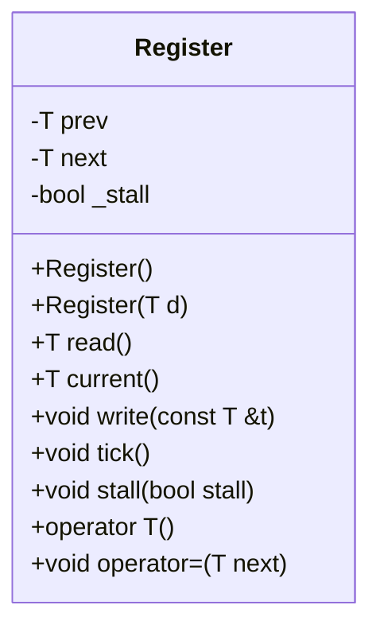
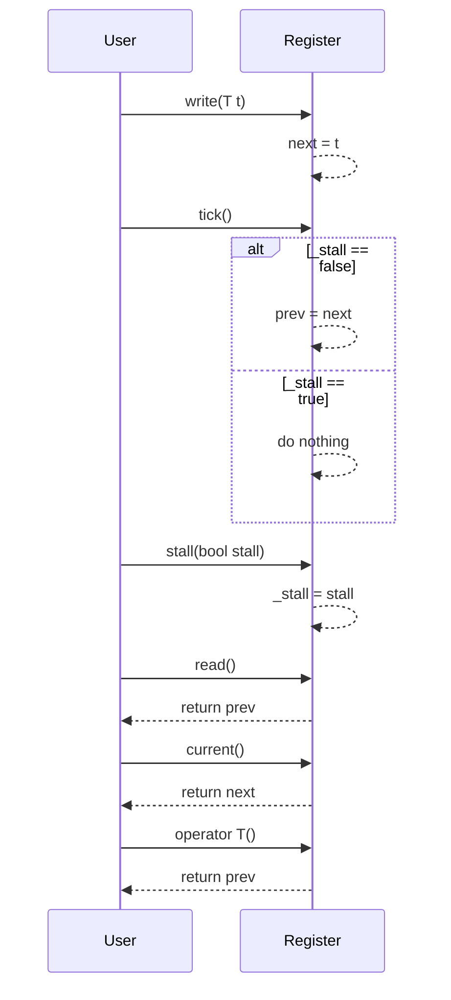

# Register クラスの設計文書

## 責務
`Register`クラスは、ジェネリックな型 `T` の値を保持し、現在の状態と次の状態を管理します。また、ステージングされた値をコミットする機能（tick）や、一時的に更新を停止させる機能（stall）も提供します。

## 公開インターフェース
- `T read()`: 前回の値（prev）を返す。
- `T current()`: 次の値（next）を返す。
- `void write(const T &t)`: 次の値（next）に`t`を設定する。
- `void tick()`: `_stall`がfalseの場合、次の値（next）を前の値（prev）にコミットする。
- `void stall(bool stall)`: 更新の一時停止フラグ（_stall）を設定する。
- `operator T()`: 前回の値（prev）を返すように型変換演算子を定義する。
- `void operator=(T next)`: 次の値（next）に`t`を設定するように代入演算子をオーバーロードする。

## 入力
- `write(const T &t)`メソッド: 型 `T` の値 `t`
- `stall(bool stall)`: 更新の一時停止フラグ `_stall` を制御するためのブール値

## 出力
- `read()`, `current()`, `operator T()`: 型 `T` の値を返す。

## 状態
- `prev`: 前回の値（型 `T`）
- `next`: 次の値（型 `T`）
- `_stall`: 更新の一時停止フラグ（bool）

## 処理手順
1. コンストラクタで初期化: `prev`と`next`をゼロに設定し、`_stall`をfalseに設定する。
2. `write(const T &t)`メソッドが呼ばれた場合: `next`に`t`の値を設定する。
3. `tick()`メソッドが呼ばれた場合:
   - `_stall`がfalseの場合のみ、`prev`に`next`の値を設定する。
4. `stall(bool stall)`メソッドが呼ばれた場合: `_stall`フラグを更新する。

## 例外・失敗条件
- 確認不能

## 依存関係
- 型 `T`: テンプレートパラメータとして使用される型。具体的な型は外部から指定される。
- 標準ライブラリ: 基本的なC++機能を使用しているが、特定の標準ライブラリの依存性は確認不能。

## 重要な不変条件
- `_stall`がtrueの場合、`tick()`メソッドによって`prev`は更新されない。
- `write(const T &t)`メソッドによって設定された値`t`は、次回の`tick()`呼び出し時に`prev`に反映される。

# 追加詳細設計情報

## クラス図


## クラス・メソッド・インターフェース詳細
| メンバ名 | 型 | 可視性 | const | 引数 | 戻り値型 | 说明 |
| --- | --- | --- | --- | --- | --- | --- |
| prev | T | private | - | - | - | 前回の値を保持するメンバ変数 |
| next | T | private | - | - | - | 次の値を保持するメンバ変数 |
| _stall | bool | private | - | - | - | 更新の一時停止フラグ |
| Register() | - | public | - | - | - | デフォルトコンストラクタ。`prev`と`next`をゼロに設定し、`_stall`をfalseに設定する |
| Register(T d) | - | public | - | T d | - | 初期値 `d` を指定して初期化するコンストラクタ |
| read() | T | public | const | - | T | 前回の値（prev）を返す |
| current() | T | public | const | - | T | 次の値（next）を返す |
| write(const T &t) | void | public | - | const T &t | - | `next`に`t`の値を設定する |
| tick() | void | public | - | - | - | `_stall`がfalseの場合のみ、`prev`に`next`の値を設定する |
| stall(bool stall) | void | public | - | bool stall | - | `_stall`フラグを更新する |
| operator T() | T | public | const | - | T | 前回の値（prev）を返すように型変換演算子を定義する |
| operator=(T next) | void | public | - | T next | - | 次の値（next）に`t`を設定するように代入演算子をオーバーロードする |

## シーケンス図


## メソッド仕様書

### `read()`
- **目的**: 前回の値（prev）を返す。
- **引数**: 無し
- **戻り値型**: T
- **動作**: `prev`メンバ変数の値を返す。
- **副作用**: 無し

### `current()`
- **目的**: 次の値（next）を返す。
- **引数**: 無し
- **戻り値型**: T
- **動作**: `next`メンバ変数の値を返す。
- **副作用**: 無し

### `write(const T &t)`
- **目的**: 次の値（next）に`t`の値を設定する。
- **引数**: const T &t
- **戻り値型**: void
- **動作**: `next`メンバ変数に`t`の値を設定する。
- **副作用**: 無し

### `tick()`
- **目的**: `_stall`がfalseの場合のみ、次の値（next）を前の値（prev）にコミットする。
- **引数**: 無し
- **戻り値型**: void
- **動作**:
  - `_stall`がfalseの場合: `prev`メンバ変数に`next`の値を設定する。
  - `_stall`がtrueの場合: 処理を行わない。
- **副作用**: 無し

### `stall(bool stall)`
- **目的**: 更新の一時停止フラグ（_stall）を設定する。
- **引数**: bool stall
- **戻り値型**: void
- **動作**: `_stall`メンバ変数に指定された値を設定する。
- **副作用**: 無し

### `operator T()`
- **目的**: 前回の値（prev）を返すように型変換演算子を定義する。
- **引数**: 無し
- **戻り値型**: T
- **動作**: `read()`メソッドと同様に`prev`メンバ変数の値を返す。
- **副作用**: 無し

### `operator=(T next)`
- **目的**: 次の値（next）に`t`を設定するように代入演算子をオーバーロードする。
- **引数**: T next
- **戻り値型**: void
- **動作**: `write(next)`メソッドと同様に`next`メンバ変数に`t`の値を設定する。
- **副作用**: 無し

## 処理フロー図
```mermaid
graph TD
    A[開始] --> B{コンストラクタ呼び出し?}
    B -- はい --> C[prev = 0, next = 0, _stall = false]
    B -- いいえ --> D{write(const T &t) 呼び出し?}
    D -- いいえ --> E{tick() 呼び出し?}
    E -- いいえ --> F{stall(bool stall) 呼び出し?}
    F -- いいえ --> G{read() 呼び出し?}
    G -- いいえ --> H{current() 呼び出し?}
    H -- いいえ --> I[終了]
    D -- はい --> J[next = t]
    E -- はい --> K{_stall == false?}
    K -- いいえ --> L[do nothing]
    K -- はい --> M[prev = next]
    F -- はい --> N[_stall = stall]
    G -- はい --> O[return prev]
    H -- はい --> P[return next]
```

## 状態遷移・副作用
| 更新前状態 | 遷移条件 | 変更対象 | 更新後状態 | 更新順序 | 副作用 |
| --- | --- | --- | --- | --- | --- |
| 任意 | write(const T &t) | next | 指定された`t`の値 | - | 無し |
| 任意 | tick() && _stall == false | prev | nextの値 | - | 無し |
| 任意 | stall(bool stall) | _stall | 指定された`stall`の値 | - | 無し |

## データ変換・制約
- `write(const T &t)`メソッド: 型 `T` の値`t`を`next`に設定する。
- `tick()`メソッド: `_stall`がfalseの場合のみ、`prev`に`next`の値を設定する。
- `read()`, `current()`, `operator T()`: `prev`メンバ変数の値を返す。