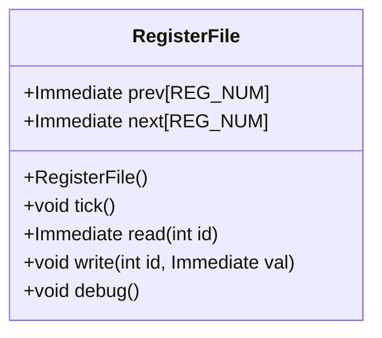
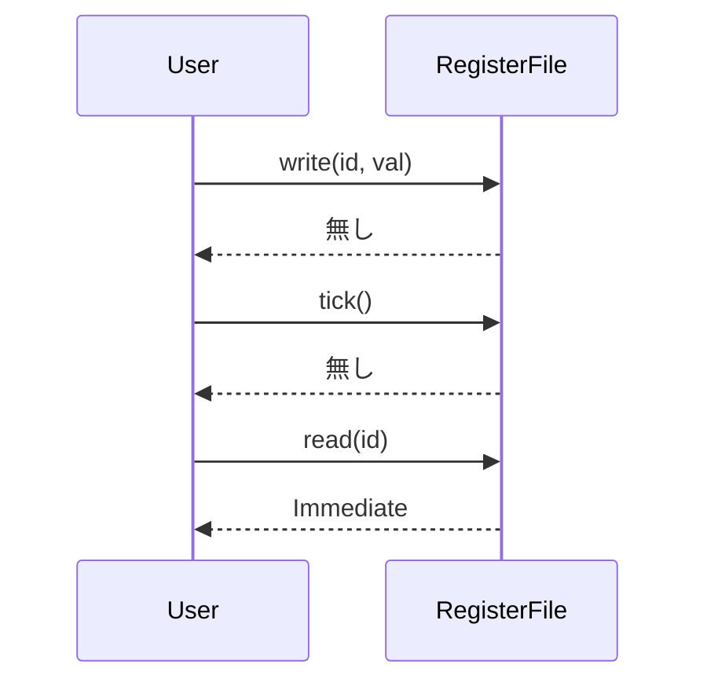

# RegisterFile 設計文書

## 責務
RegisterFileクラスは、32個のレジスタを管理し、各レジスタへの読み書き操作を提供します。また、シミュレーションの各サイクルでのレジスタ値の更新（tick）とデバッグ出力機能も提供します。

## 公開インターフェース
- `RegisterFile()`: コンストラクタで全てのレジスタを初期化します。
- `void tick()`: シミュレーションサイクルごとに呼び出し、現在の値を前の値に更新します。
- `Immediate read(int id)`: 指定されたIDのレジスタの前の値を読み出します。ただし、IDが0の場合は常に0を返します。
- `void write(int id, Immediate val)`: 指定されたIDのレジスタに新しい値を書き込みます。
- `void debug()`: レジスタファイルの内容をデバッグ用に出力します。

## 入力
- `int id`: 読み書き対象のレジスタのID（0から31まで）。
- `Immediate val`: 書き込む値。

## 出力
- `Immediate read(int id)`: 指定されたIDのレジスタの前の値を返します。

## 状態
- `Immediate prev[REG_NUM]`: 各レジスタの前の値を保持する配列。
- `Immediate next[REG_NUM]`: 各レジスタの現在の値を保持する配列。

## 処理手順
1. コンストラクタで全てのレジスタを初期化します。
2. `tick()`メソッドが呼び出されると、`next`配列の値を`prev`配列にコピーします。
3. `read(int id)`メソッドは指定されたIDのレジスタの前の値を返します。ただし、IDが0の場合は常に0を返します。
4. `write(int id, Immediate val)`メソッドは指定されたIDのレジスタに新しい値を書き込みます。
5. `debug()`メソッドはレジスタファイルの内容をデバッグ用に出力します。

## 例外・失敗条件
- `read(int id)`, `write(int id, Immediate val)`メソッドで`id`が範囲外（0から31以外）の場合、未定義動作となるため、呼び出し元で適切な範囲チェックが必要です。

## 依存関係
- `Common.h`: `Immediate`型の定義を含む。
- `Register.hpp`: レジスタクラスの定義を含むが、直接使用していない。
- `utils.h`: `debug_immediate()`関数を使用してレジスタ値をデバッグ出力する。

## 重要な不変条件
- `prev`と`next`配列は常に32要素を持つ。
- `read(0)`は常に0を返す。

# 追加詳細設計情報

## クラス図


## クラス・メソッド・インターフェース詳細
| 名前 | 型 | 可視性 | const | 引数名と型 | 戻り値型 | 依存関係 |
|------|----|--------|-------|------------|----------|----------|
| RegisterFile | コンストラクタ | public | - | - | void | Common.h, utils.h |
| tick | メソッド | public | - | - | void | - |
| read | メソッド | public | - | int id | Immediate | - |
| write | メソッド | public | - | int id, Immediate val | void | - |
| debug | メソッド | public | - | - | void | utils.h |

## シーケンス図


## メソッド仕様書
### write(int id, Immediate val)
- 目的: 指定されたIDのレジスタに新しい値を書き込む。
- 引数:
  - `int id`: 書き込み対象のレジスタID（0から31まで）。
  - `Immediate val`: 書き込む値。
- 戻り値: 無し
- 動作: 指定されたIDの`next`配列に値を書き込みます。
- エラー処理: `id`が範囲外の場合、未定義動作となるため呼び出し元で適切な範囲チェックが必要です。

### read(int id)
- 目的: 指定されたIDのレジスタの前の値を読み出す。
- 引数:
  - `int id`: 読み出し対象のレジスタID（0から31まで）。
- 戻り値: `Immediate`型の値
- 動作: 指定されたIDの`prev`配列の値を返します。ただし、IDが0の場合は常に0を返します。
- エラー処理: `id`が範囲外の場合、未定義動作となるため呼び出し元で適切な範囲チェックが必要です。

### tick()
- 目的: シミュレーションサイクルごとに前の値を現在の値に更新する。
- 引数: 無し
- 戻り値: 無し
- 動作: `next`配列の値を`prev`配列にコピーします。

### debug()
- 目的: レジスタファイルの内容をデバッグ用に出力する。
- 引数: 無し
- 戻り値: 無し
- 動作: `next`配列の値をデバッグ出力します。レジスタ名と値が表示されます。

## 処理フロー図
```mermaid
graph TD
    A[コンストラクタ] --> B[tick()]
    B --> C[read(id)]
    B --> D[write(id, val)]
    B --> E[debug()]
```

## 状態遷移・副作用
| 更新前状態 | 遷移条件 | 変更対象 | 更新後状態 | 更新順序 | 副作用 |
|------------|----------|----------|------------|----------|--------|
| prev, next | tick()   | prev     | nextの値に更新 | -        | 無し   |

## データ変換・制約
| 入力データ | 出力データ | 変換規則 | 値域 | 境界値 |
|------------|------------|----------|------|--------|
| id, val    | -          | next[id] = val | 0から31までの整数 | 0, 31 |
| id         | Immediate  | prev[id]の値を返す | 0から31までの整数 | 0, 31 |